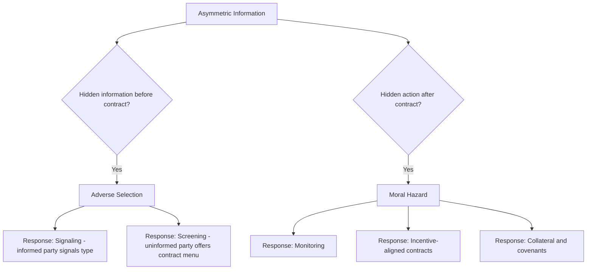

## Adverse Selection and Moral Hazard

### Overview

Adverse selection and moral hazard are the two canonical problems arising from **asymmetric information** — situations where one party to a transaction has information the other lacks. In financial economics, these frictions explain why financial markets can fail to clear efficiently, why financial contracts take specific forms (collateral requirements, covenants, monitoring), and why institutions such as credit rationing, deposit insurance, and securities regulation exist. Adverse selection concerns **hidden information** that exists *before* a contract is signed; moral hazard concerns **hidden action** that occurs *after* a contract is signed.

### Adverse Selection: The Core Problem

Adverse selection arises when one party possesses private information about a characteristic (quality, risk type) relevant to the transaction, and this information asymmetry distorts the pool of participants willing to transact at a given price.

**Key Points**

- The canonical reference is Akerlof's (1970) "market for lemons": in a used car market where sellers know car quality but buyers do not, buyers rationally offer a price reflecting the *average* quality in the market; this price is too low to induce owners of high-quality cars to sell, so the average quality of cars actually offered falls, prices fall further, and in the extreme the market can unravel entirely
- The distinguishing feature of adverse selection is that the private information exists **before** the transaction and pertains to a **type** or **fixed characteristic**, not a subsequent choice

### Adverse Selection in Financial Markets: Credit Markets

**Example**

In a loan market, borrowers know their own default risk more precisely than lenders. If a bank sets a single interest rate for all observationally similar borrowers, safer borrowers (who correctly perceive their low default risk) may find the rate unattractive relative to their true risk and exit the market, while riskier borrowers find the same rate attractive and remain. Raising the interest rate to compensate for the (now riskier) applicant pool can further discourage safer borrowers, worsening the average quality of the remaining pool — a feedback loop analogous to Akerlof's original argument. This is the standard economic rationale offered for **credit rationing**: a lender may prefer to deny credit to some observationally identical applicants at the prevailing rate rather than raise the rate to clear the market, because raising the rate would shift the risk composition of the applicant pool unfavorably (Stiglitz-Weiss, 1981) [Inference: this describes the well-known theoretical result and its standard interpretation, not a claim about the prevalence of credit rationing in any specific real-world market].

### Signaling as a Response to Adverse Selection

When the informed party can take a costly, observable action to credibly convey private information, a **separating equilibrium** can emerge in which different types choose different signals, allowing the uninformed party to infer type.

**Key Points**

- **Spence (1973) job market signaling**: education serves as a signal of underlying (unobservable) worker productivity, provided the cost of acquiring education is sufficiently lower for high-productivity types, even if education itself does not raise productivity
- **Myers and Majluf (1984)**: applies signaling logic to corporate financing choices. Managers with private information about firm value prefer to issue equity when they believe the firm is overvalued and avoid it when they believe it is undervalued; rational investors anticipate this, so an equity issuance announcement is interpreted as (weak) evidence the firm may be overvalued, causing the stock price to fall on announcement — a widely cited explanation for the observed negative average stock price reaction to seasoned equity offerings, and for the **pecking order theory** of capital structure (firms prefer internal funds, then debt, then equity, in that order, partly to minimize adverse selection costs)

### Screening as a Response to Adverse Selection

Alternatively, the **uninformed** party can design a menu of contracts such that different types self-select into different options, revealing their type through their choice — a **separating equilibrium via screening** rather than signaling.

**Example**

An insurer facing customers with unobservable risk types can offer a menu of contracts: a low-premium policy with a high deductible, and a high-premium policy with a low deductible. Low-risk individuals, who expect to file claims rarely, prefer the high-deductible/low-premium option (accepting more out-of-pocket risk in exchange for a lower average cost), while high-risk individuals prefer the low-deductible/high-premium option. The menu is designed (via an incentive-compatibility constraint) so each type prefers the contract intended for their own type, allowing the insurer to profitably screen without directly observing risk type. This same logic underlies loan contract design (e.g., offering combinations of interest rate and collateral requirement) and analogous menu-based mechanisms in corporate finance and insurance-linked securities design.

### Moral Hazard: The Core Problem

Moral hazard arises when one party can take a **hidden action** after a contract is in place, and that action affects the outcome but cannot be perfectly observed or verified by the other party, creating an incentive to behave differently than if the action were fully observable.

**Key Points**

- The classic example is insurance: once insured, an individual may take less care to avoid the insured loss (reduced precaution) because they no longer bear the full cost of a bad outcome — the insurer bears part or all of it
- In finance, moral hazard is pervasive wherever an agent's effort, risk-taking, or reporting cannot be fully monitored or verified by the party bearing the consequences: borrower behavior after loan disbursement, manager effort after equity is raised, and risk-taking by financial institutions that expect to be bailed out

### Moral Hazard in Corporate Finance: The Principal-Agent Problem

The **principal-agent problem** formalizes moral hazard as a contracting problem: a principal (e.g., shareholders) hires an agent (e.g., a manager) whose effort or actions affect the principal's payoff but cannot be perfectly observed, only imperfectly inferred from a noisy outcome (e.g., realized profit).

**Example**

Suppose profit $\pi = e + \varepsilon$, where $e$ is the manager's unobservable effort and $\varepsilon$ is noise. If the manager is paid a fixed wage regardless of $\pi$, they bear the full cost of effort but capture none of the marginal benefit, so they exert minimal effort (moral hazard). To induce effort, the principal offers a compensation contract tying pay to observed outcomes, e.g., $w(\pi) = \alpha + \beta \pi$, giving the agent a share $\beta$ of the marginal outcome. This creates a fundamental **risk-incentive tradeoff**: higher $\beta$ improves incentives (more effort) but forces the risk-averse agent to bear more of the outcome's random variation $\varepsilon$, which is costly since the principal (often assumed risk-neutral or better-diversified) can typically bear that risk more cheaply — the central tension formalized in agency theory's "informativeness principle," which states that any signal informative about the agent's effort should optimally be incorporated into the compensation contract, and any signal uninformative about effort should not be, since including it only adds uncompensated risk.

**Key Points**

- This framework directly motivates observed executive compensation design: stock options and equity-linked pay tie manager compensation to firm performance to mitigate moral hazard, though this same link can itself induce excessive risk-taking, a widely discussed tension in the executive compensation literature [Inference: reflects a standard point of debate in the corporate governance literature, not a settled empirical conclusion about any specific compensation scheme]
- **Debt overhang** (Myers 1977) is a related moral hazard problem: shareholders of a levered firm may reject positive-NPV projects if too much of the project's value would accrue to existing debtholders rather than shareholders, illustrating how existing capital structure can distort a firm's *ex-post* investment incentives relative to the *ex-ante* optimal decision

### Moral Hazard in Banking: Deposit Insurance and Risk-Taking

**Example**

Deposit insurance protects depositors from bank failure, which is broadly viewed as reducing depositors' incentive to monitor bank risk-taking (since their deposits are protected regardless of the bank's portfolio choices) and can, in turn, weaken market discipline on bank risk-taking. This is frequently cited as a rationale for pairing deposit insurance with regulatory substitutes for market discipline, such as capital requirements, asset restrictions, and supervisory examination, precisely because deposit insurance addresses the bank-run coordination problem (see Game Theory: Diamond-Dybvig) at the cost of potentially introducing this distinct moral hazard problem. [Inference: this is a standard, widely taught argument in banking economics rather than a settled empirical magnitude, and the actual extent of any resulting risk-taking response is a matter of ongoing empirical research]

Similarly, the doctrine of institutions being **"too big to fail"** is analyzed as a moral hazard problem: an implicit government guarantee of bailout in the event of failure can reduce a large institution's incentive to avoid excessive risk-taking, since some downside consequences are expected to be borne by taxpayers rather than the institution's own stakeholders.

### Mechanism Design Responses to Moral Hazard

- **Monitoring**: direct verification of agent behavior (e.g., bank covenants requiring financial reporting, collateral audits), though monitoring itself is costly and imperfect
- **Collateral and covenants**: requiring collateral gives the borrower "skin in the game," aligning their incentives with the lender's by making the borrower bear more of the downside from poor decisions; covenants restrict specific actions (e.g., additional borrowing, asset sales) that could increase risk to the lender post-contracting
- **Performance-based compensation**: as discussed above, tying pay to verifiable outcomes correlated with effort
- **Reputation and repeated interaction**: in a repeated relationship (see Game Theory), the threat of losing future business can substitute for direct monitoring in disciplining behavior

### Adverse Selection vs. Moral Hazard: A Comparison

| Aspect | Adverse Selection | Moral Hazard |
| --- | --- | --- |
| Timing of private information/action | Before contract (hidden type) | After contract (hidden action) |
| Core problem | Uninformed party cannot distinguish quality/risk types | Principal cannot observe or verify agent's effort/action |
| Classic example | Akerlof's used car market | Post-insurance reduced precaution |
| Financial market example | Credit rationing, equity issuance signaling | Executive compensation design, debt overhang |
| Standard remedies | Signaling, screening, contract menus | Monitoring, incentive contracts, collateral, covenants |

**Key Points**

- The two problems are conceptually distinct but frequently coexist in the same financial relationship — e.g., a lender faces adverse selection at the point of loan origination (not knowing the true risk of the applicant pool) and moral hazard afterward (not being able to observe how the borrower actually uses and manages the funds)

### Conclusion

Adverse selection and moral hazard, both consequences of asymmetric information, provide the core theoretical explanations for why financial contracts and institutions take the specific forms they do — collateral, covenants, credit rationing, signaling through financing choices, screening menus in insurance and lending, and performance-linked compensation are each best understood as responses to one or both of these frictions. Because these problems mean financial markets can fail to achieve the efficient outcomes predicted under complete information (connecting directly to the market failure discussion in Welfare Economics), they also provide the standard theoretical foundation for financial market regulation, disclosure requirements, and prudential supervision of financial intermediaries.

**Related Topics**

- Signaling models: Spence job-market signaling and Myers-Majluf capital structure signaling
- Screening and contract menu design under asymmetric information
- Principal-agent theory and optimal executive compensation design
- Credit rationing and the Stiglitz-Weiss model of imperfect credit markets
- Deposit insurance, bank runs, and the Diamond-Dybvig model
- Debt overhang and underinvestment (Myers 1977)
- Mechanism design and optimal contracting theory
- Securities regulation and mandatory disclosure as remedies for information asymmetry