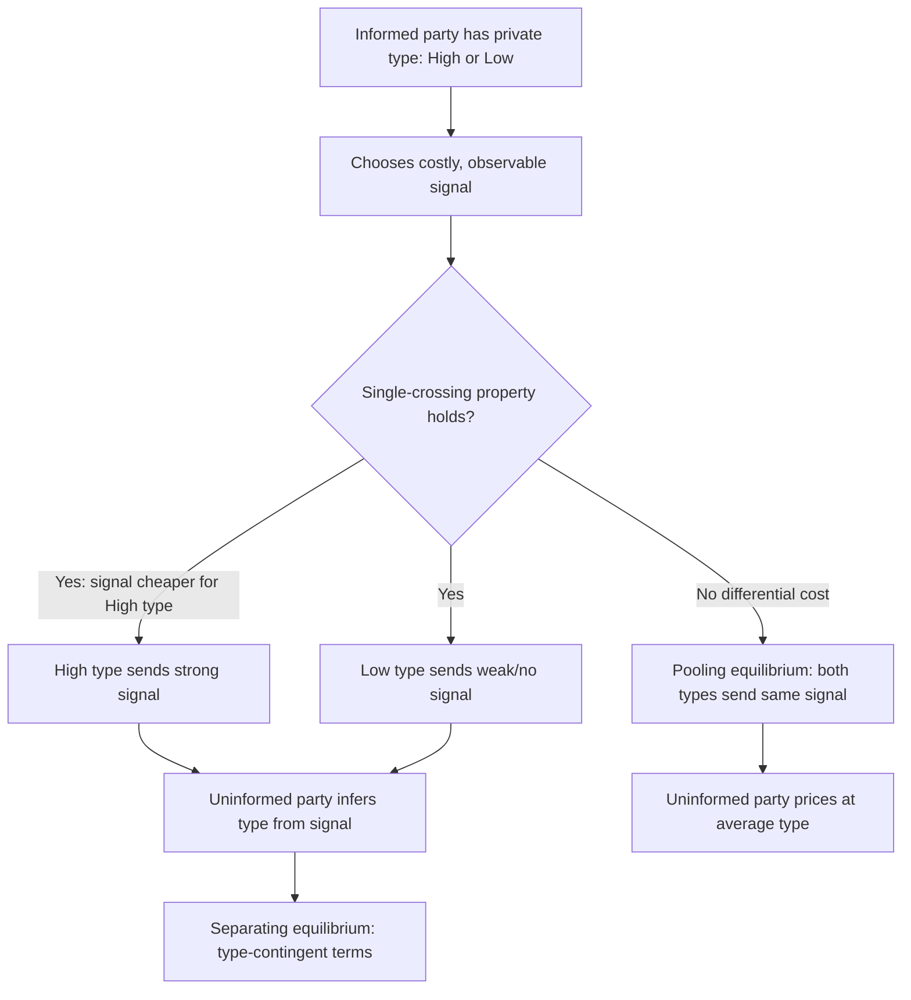
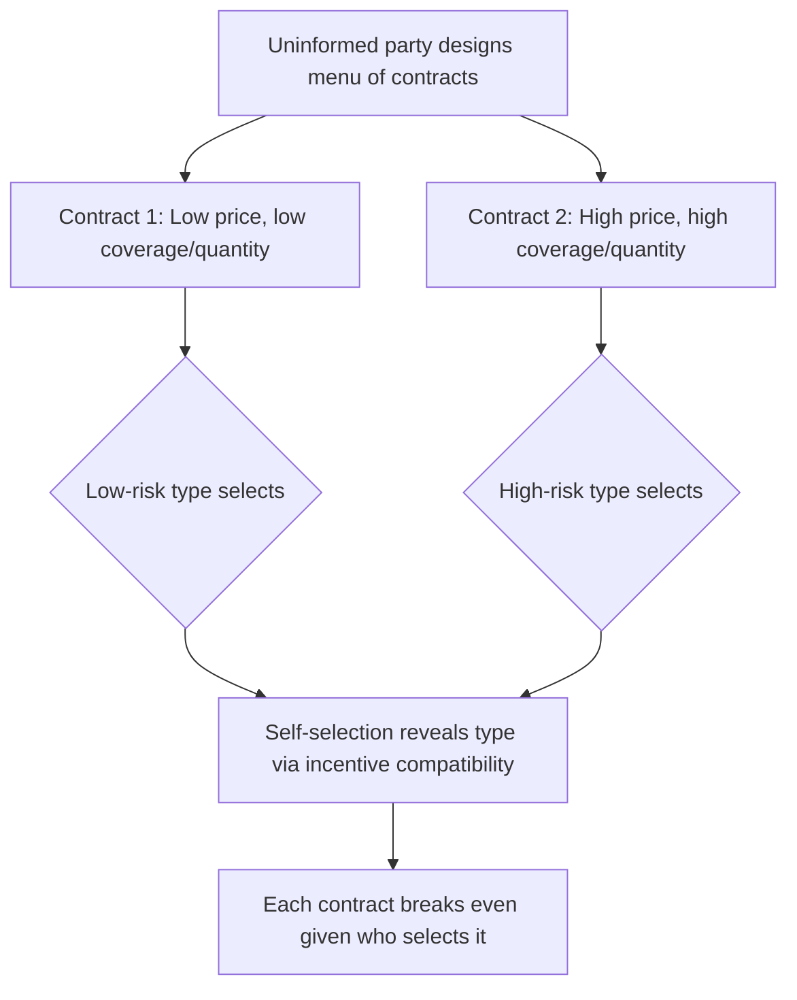

## Signaling and Screening Models

### Overview

Signaling and screening models analyze markets where information is asymmetrically distributed between parties, and where one side takes costly, observable actions to communicate (or elicit) hidden information. These models form a core part of information economics and underpin major results in corporate finance — capital structure, dividend policy, IPO underpricing, credit rationing — as well as insurance and labor market theory, which supplied the original canonical examples.

The key distinction: in **signaling**, the *informed* party moves first, choosing a costly action to credibly reveal private information. In **screening**, the *uninformed* party moves first, designing a menu of contracts that induces informed parties to self-select and reveal their type.

### Setup: Adverse Selection

Both signaling and screening models address **adverse selection** — a pre-contractual information asymmetry where one party knows something relevant (their "type") that the other does not, and this hidden information affects the value or riskiness of the transaction before any contract is signed. This is distinct from **moral hazard**, where the hidden element is an *action* taken after the contract is signed.

**Key Points**

- Adverse selection can cause **market unraveling**: if buyers cannot distinguish quality, they offer a price reflecting only the average quality, driving high-quality sellers out of the market, lowering the average further, in a downward spiral — the logic of Akerlof's "Market for Lemons" (1970)
- Signaling and screening are the two principal market-based mechanisms proposed to mitigate (though rarely fully eliminate) adverse selection without requiring a benevolent regulator to intervene directly

### The Spence Signaling Model

Michael Spence's (1973) labor market model is the canonical signaling framework, later widely adapted into finance.

**Setup**: Workers have privately known productivity type $\theta \in \{\theta_L, \theta_H\}$, $\theta_H > \theta_L$. Workers can acquire education $e$ at a cost $c(e, \theta)$ that is *lower for high-productivity types* — the crucial **single-crossing property**:

$$\frac{\partial}{\partial \theta}\left(\frac{\partial c}{\partial e}\right) < 0$$

Education itself may not raise productivity at all (a pure signaling story) — its value lies entirely in its differential cost across types.

**Separating equilibrium**: high types choose $e_H > 0$, low types choose $e_L = 0$ (or some lower level), and employers correctly infer type from the observed education level and pay wages accordingly: $w(e_H) = \theta_H$, $w(e_L) = \theta_L$.

For separation to be an equilibrium, the signal must satisfy incentive compatibility for both types:

$$\theta_H - c(e_H, \theta_H) \geq \theta_L - c(0, \theta_H) \quad \text{(high type prefers signaling)}$$

$$\theta_L - c(0, \theta_L) \geq \theta_H - c(e_H, \theta_L) \quad \text{(low type prefers not mimicking)}$$

**Key Points**

- Multiple separating equilibria can exist, differing in the education level chosen; the **Riley outcome** (least-cost separating equilibrium) is the Pareto-dominant one among separating equilibria, since it involves the minimum signaling cost needed to sustain separation
- A **pooling equilibrium** can also exist, where both types choose the same signal level and employers cannot distinguish them, paying a common wage equal to average productivity
- Signaling is *socially wasteful* in the pure Spence model if education has no productive value: the cost $c(e_H, \theta_H)$ is a deadweight loss purely incurred to sort types, making the separating equilibrium *not* Pareto efficient relative to a world with symmetric information, even though it is an improvement over pooling for high types

### Equilibrium Refinements: The Problem of Multiplicity

Signaling games (a form of dynamic game with incomplete information) are typically solved using **Perfect Bayesian Equilibrium (PBE)**, but PBE alone permits many equilibria, including implausible pooling equilibria sustained by unreasonable off-equilibrium beliefs.

**Key Points**

- The **Intuitive Criterion** (Cho and Kreps, 1987) is the standard refinement used to eliminate equilibria supported by beliefs that no rational type would actually want to trigger — it asks whether a deviation could only be profitable for one type, and if so, requires the receiver to believe the deviation came from that type
- Applying the Intuitive Criterion to the Spence model typically eliminates pooling equilibria and selects the Riley (least-cost separating) outcome as the unique refined equilibrium
- [Inference] The prevalence of the Intuitive Criterion as the standard refinement tool in applied signaling models (including finance applications) reflects a broad, though not universal, consensus in the theoretical literature that it produces the most economically sensible predictions, though alternative refinements (e.g., D1, Universal Divinity) are used in more complex settings with more than two types

### Signaling in Corporate Finance

**Dividend Signaling (Bhattacharya, 1979; Miller and Rock, 1985)**

Managers possess private information about firm quality/future cash flows. Paying dividends is costly (due to taxes, or the need to raise costly external finance to fund the payout if internal cash is insufficient), so only firms confident in sustaining future cash flows choose to pay/increase dividends, making dividend changes a credible signal of firm quality.

**Key Points**

- Predicts a positive stock price reaction to dividend increases and a negative reaction to dividend cuts — a well-documented empirical regularity, generally cited as consistent with the signaling hypothesis, though alternative explanations (free cash flow / agency theory, clientele effects) also predict similar reactions, making clean empirical discrimination between theories difficult
- The cost that sustains separation is the tax disadvantage of dividends relative to capital gains, or the transaction costs of external financing needed to fund the payout — without a real cost differential across firm types, pooling would be more attractive

**Capital Structure Signaling (Ross, 1977; Leland and Pyle, 1977)**

Ross (1977): managers of high-quality firms take on more debt because they are confident they can service it without incurring bankruptcy costs; low-quality firms cannot credibly mimic high leverage because default costs make it too expensive. Debt level signals firm quality, with higher leverage associated with higher perceived firm value.

Leland and Pyle (1977): entrepreneurs retain a large equity stake in their own firm as a signal of confidence in its quality; retaining equity is costly for the entrepreneur (foregoing diversification benefits), and only entrepreneurs confident in high firm value are willing to bear that cost.

**IPO Underpricing (Rock, 1986; Welch, 1989)**

Rock's Winner's Curse model: uninformed investors face adverse selection in IPO allocation (informed investors crowd out allocation in good IPOs, leaving uninformed investors disproportionately allocated shares in bad IPOs), so issuers must underprice on average to keep uninformed investors participating.

Welch's signaling model: high-quality issuers deliberately underprice their IPO to signal quality, planning to recoup the cost through more favorable terms in a future seasoned equity offering; low-quality issuers cannot profitably mimic this because they are less likely to return to the market with the same credibility.

**Pecking Order Theory (Myers and Majluf, 1984)**

Firms prefer internal financing, then debt, then equity as a last resort, because issuing equity to outside investors under asymmetric information signals that managers believe the stock is overvalued (since managers, who possess superior information, would prefer to issue equity only when they think the price is favorable to existing shareholders). This creates an adverse selection discount on new equity issuance, observed empirically as negative average announcement returns to seasoned equity offerings.

### Signaling Diagram

### The Rothschild-Stiglitz Screening Model

Rothschild and Stiglitz (1976) analyze competitive insurance markets where insurers (uninformed) cannot observe individual risk type but can design a **menu of contracts** (premium-coverage pairs) that induces self-selection.

**Setup**: Consumers are high-risk or low-risk types, privately known to themselves. Insurers offer a menu of contracts; consumers choose the contract that maximizes their expected utility given their true risk type.

**Key result**: In a competitive equilibrium (each contract must break even given who selects it, due to free entry), the only possible equilibrium is a **separating equilibrium** with:

- High-risk types receive **full insurance** at an actuarially fair premium for their risk
- Low-risk types receive **only partial insurance** — deliberately limited coverage — because offering them full coverage at a low-risk-fair price would be unprofitable once high-risk types also select it

**Key Points**

- The screening mechanism works through a **menu of contracts with an incentive compatibility constraint**: partial coverage for low-risk types is *costly to them* (they are underinsured relative to the first-best) but this cost is what prevents high-risk types from mimicking them
- A pure-strategy Rothschild-Stiglitz equilibrium may **not exist** at all if the proportion of high-risk types in the population is small enough — a pooling contract can then be profitably "cream-skimmed" by a competing insurer offering a contract attractive only to low-risk types, but no candidate separating equilibrium survives this undercutting either, a well-known nonexistence problem in the model
- [Inference] The nonexistence problem is generally regarded as a significant theoretical limitation of the original Rothschild-Stiglitz framework, motivating subsequent work (e.g., Wilson's anticipatory equilibrium, Riley's reactive equilibrium) that modifies the equilibrium concept or the timing of insurer responses to guarantee existence

### Screening in Financial Contracting

**Key Points**

- **Credit rationing** (Stiglitz and Weiss, 1981): banks facing adverse selection over borrower risk type may rationally ration credit (deny loans to some observationally identical applicants) rather than raise interest rates to clear the market, because higher rates disproportionately drive out safer borrowers and attract riskier ones (adverse selection effect) or induce riskier project choices (a moral hazard effect layered on top), lowering the bank's expected return at higher rates beyond some threshold
- **Menu-based loan contracts**: lenders can screen borrower risk type by offering a menu of contracts with different combinations of interest rate and collateral requirement; safer borrowers self-select into lower-rate, higher-collateral contracts (since they are more confident of repaying and reclaiming collateral), while riskier borrowers self-select into higher-rate, lower-collateral contracts
- **Venture capital staged financing and covenants** are often interpreted through a screening lens: contract terms are structured so that only entrepreneurs confident in their project's quality will accept the terms offered

### Screening Diagram

### Comparing Signaling and Screening

| Dimension | Signaling | Screening |
| --- | --- | --- |
| Who moves first | Informed party | Uninformed party |
| Mechanism | Costly observable action chosen by informed party | Menu of contracts designed to induce self-selection |
| Canonical example | Spence education model | Rothschild-Stiglitz insurance model |
| Finance example | Dividend policy, capital structure, IPO underpricing | Loan contract menus, credit rationing, VC staged financing |
| Key requirement | Single-crossing / differential signaling cost across types | Incentive compatibility across contract menu |
| Existence issues | Multiplicity of equilibria (requires refinement) | Possible nonexistence of pure-strategy equilibrium |

### Common Pitfalls

**Key Points**

- Confusing signaling (informed party acts first) with screening (uninformed party designs the mechanism) — the direction of the initiating move is the defining distinction
- Assuming any observable correlate of quality is automatically a valid "signal" — a valid signaling equilibrium requires the single-crossing property (the signal must be differentially costly across types), not merely correlation
- Treating separating equilibria as first-best efficient — signaling costs and partial-insurance distortions in screening are real welfare losses relative to a hypothetical symmetric-information benchmark, even though they may be the best feasible outcome under asymmetric information
- Overlooking equilibrium multiplicity in signaling games — without applying a refinement (e.g., the Intuitive Criterion), a model may admit both a plausible separating equilibrium and implausible pooling equilibria supported by unreasonable off-path beliefs
- Applying Rothschild-Stiglitz-style separating predictions to markets where the nonexistence problem is likely to bind, without acknowledging that no pure-strategy equilibrium may exist under those parameter conditions

### Related Topics

- Moral hazard and principal-agent theory
- Akerlof's Market for Lemons and adverse selection
- Perfect Bayesian Equilibrium and the Intuitive Criterion
- Capital structure theory (trade-off theory, pecking order theory)
- IPO underpricing and the winner's curse
- Credit rationing and bank lending under asymmetric information
- Mechanism design and revelation principle