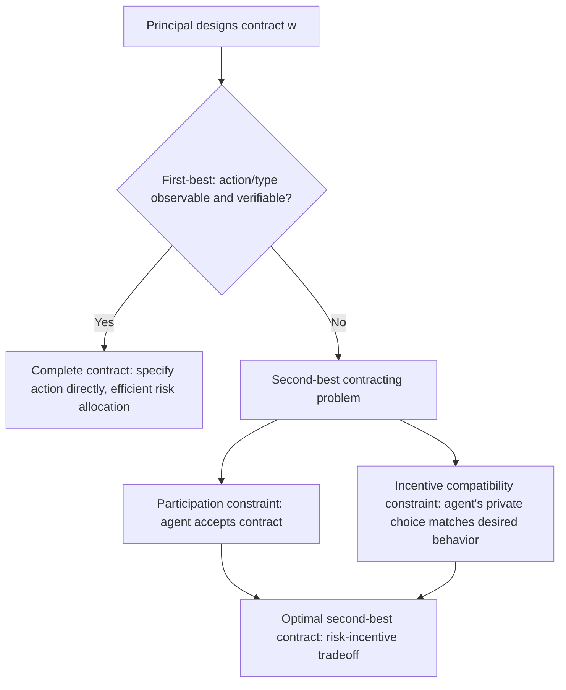

## Contract Theory Fundamentals

### Overview

Contract theory studies how parties design agreements to allocate tasks, risk, and payoffs under conditions where information is asymmetric, actions are not fully observable, or outcomes are not perfectly verifiable by outside parties (such as courts). It provides the formal apparatus underlying much of the adverse selection and moral hazard analysis in financial economics, generalizing those specific problems into a unified framework for optimal contract design. In finance, contract theory explains the structure of debt and equity, executive compensation, venture capital term sheets, and insurance and lending agreements.

### The Contracting Environment

A contracting problem is generally defined by:

- A **principal**, who designs and offers the contract
- One or more **agents**, who accept or reject the contract and then act within it
- A **state of nature** or **outcome**, which may be observable to both parties, observable to only one, or **verifiable** (i.e., provable to a third party such as a court) or not
- **Information structure**: whether the agent has private information *before* contracting (adverse selection) or takes a hidden *action* after contracting (moral hazard)

**Key Points**

- The distinction between **observable** and **verifiable** is central: a party might personally observe an outcome (e.g., a manager's effort level as perceived by a close colleague) but be unable to prove it to a court, meaning contracts cannot be conditioned on it — only on verifiable variables can enforceable contract terms be written
- Contract theory typically assumes both parties are rational and have common knowledge of the structure of the game (payoffs, information structure, timing), even when they do not have common knowledge of realized private information or actions themselves

### The Complete Contracting Benchmark (First-Best)

If all relevant actions and states were observable *and* verifiable, the principal could write a **complete contract** specifying exactly what the agent must do (or what outcome must occur) in every contingency, and pay accordingly. This is the **first-best** outcome: full efficiency, with no distortion from private information or hidden action.

**Key Points**

- The first-best benchmark is a theoretical reference point rather than a description of most real contracts — its main use is as a comparison against which the welfare cost of second-best (incomplete-information) contracting is measured
- Under first-best contracting with a risk-neutral principal and risk-averse agent, the efficient risk-allocation result applies directly: the principal (better able to bear risk, e.g., through diversification) should bear all the risk, and the agent should receive a fixed wage — a stark contrast with the risk-sharing/incentive tradeoff that emerges once moral hazard is introduced

### Incomplete Contracts and the Principal-Agent Problem (Second-Best)

When effort or type is unobservable or unverifiable, the principal must design a **second-best** contract that induces desired behavior indirectly, through incentives built on whatever variables *are* verifiable (typically a noisy outcome correlated with the hidden effort or type).

The general moral hazard contracting problem is:

$$\max_{w(\pi)} \; E[\pi - w(\pi)] \quad \text{subject to:}$$

$$\text{(IR)} \quad E[u(w(\pi)) - c(e)] \geq \bar{u} \qquad \text{(Individual Rationality / Participation Constraint)}$$

$$\text{(IC)} \quad e \in \arg\max_{e'} \, E[u(w(\pi)) \mid e'] - c(e') \qquad \text{(Incentive Compatibility Constraint)}$$

where $\pi$ is a verifiable outcome (e.g., profit), $w(\pi)$ is the wage contract as a function of that outcome, $c(e)$ is the agent's cost of effort $e$, and $\bar{u}$ is the agent's reservation utility (outside option).

**Key Points**

- The **participation constraint (IR)** ensures the agent is willing to accept the contract at all, rather than taking an outside option
- The **incentive compatibility constraint (IC)** ensures the agent's privately chosen effort, given the contract, is actually the effort level the principal wants — since effort itself cannot be directly specified and enforced if unobservable
- This is the exact same underlying structure as the adverse selection screening problem, but with a **participation and incentive compatibility constraint applied to a hidden action** rather than a hidden type

### The Revelation Principle

For adverse-selection (hidden type) settings, the **Revelation Principle** is a foundational simplifying result: any outcome achievable by some arbitrary contracting mechanism can also be achieved by a **direct mechanism** in which the agent is simply asked to report their type, and the mechanism is designed so that truthful reporting is incentive compatible (a **direct revelation mechanism**).

**Key Points**

- This result dramatically simplifies the search for optimal contracts: rather than considering an unbounded space of possible indirect mechanisms, the principal need only consider direct mechanisms and impose truth-telling incentive compatibility constraints
- The Revelation Principle underlies the standard approach to designing screening contracts (see the insurance and loan-menu examples in the Adverse Selection discussion), where each contract in the menu is designed so that an agent of a given type truthfully "reveals" their type by choosing the contract intended for them

### Optimal Contracts Under Moral Hazard: Key Results

**Result 1 — Risk-neutral agent**: if the agent is risk-neutral (and has sufficient wealth to bear risk, i.e., no limited liability constraint binds), the principal can achieve the first-best outcome even under moral hazard by "selling the firm" to the agent — making the agent the full residual claimant (e.g., $w(\pi) = \pi - F$ for a fixed franchise fee $F$), since a risk-neutral agent who bears full marginal consequences of their own effort has no incentive to shirk, and risk-bearing costs nothing to a risk-neutral party.

**Result 2 — Risk-averse agent**: when the agent is risk-averse, the first-best is generally unattainable; the optimal contract must balance:

- **Insurance**: the agent, being risk-averse, prefers a flatter (less risky) wage schedule
- **Incentives**: inducing effort requires the agent's pay to vary with outcomes correlated with effort

This tradeoff is why observed compensation contracts (e.g., executive stock options, sales commissions) are typically neither fully fixed wages nor full residual claims, but an intermediate structure.

**Result 3 — Limited liability**: if the agent cannot be penalized below some floor (e.g., cannot be paid a negative wage, or has limited personal wealth to draw on for penalties), the optimal contract often takes the form of a **bonus scheme**: a base payment plus a bonus for good outcomes, since punishing bad outcomes below the liability floor is infeasible, so incentives must instead be provided by rewarding good outcomes.

**Key Points**

- The limited liability result is widely cited as part of the theoretical explanation for the prevalence of bonus-based compensation structures and for why observed contracts frequently exhibit "carrots" (upside rewards) more than "sticks" (downside penalties) in settings where the agent has limited assets to absorb penalties [Inference: standard theoretical implication drawn from limited liability contracting models, not a claim about the empirical prevalence of any specific compensation structure in practice]

### Application: Debt as an Optimal Contract

**Example**

A widely cited application of contract theory to financial instruments is the **costly state verification (CSV)** model (Townsend, 1979; Gale and Hellwig, 1985): an entrepreneur privately observes project returns, and the outside financier (lender) can verify the actual return only by paying a monitoring cost. The optimal contract in this setting takes the form of **standard debt**: the borrower pays a fixed amount if it can be paid (no verification needed, since if the promised payment is honored the lender need not investigate further), and the lender only pays the verification cost and seizes the (verified) full realized return in the event of default (when the promised fixed payment cannot be met). This result is often cited as a formal contract-theoretic microfoundation for why debt — rather than a more complex state-contingent contract — is a natural, cost-minimizing financing instrument under costly verification, distinct from, but complementary to, the Myers-Majluf signaling explanation for the pecking order of financing choices covered in the adverse selection discussion.

### Application: Venture Capital Contracting

**Example**

Venture capital contracts commonly combine several contract-theoretic mechanisms simultaneously: **convertible preferred stock** (giving the VC downside protection akin to debt while preserving upside participation akin to equity, addressing both risk allocation and incentive alignment), **staged financing** (releasing capital in tranches contingent on milestones, mitigating moral hazard by limiting the entrepreneur's ability to misuse funds and preserving the VC's option to abandon the project if early signals are poor), and **board control and veto rights** (addressing moral hazard through direct governance rather than purely financial incentives). This combination of instruments is a standard example, discussed extensively in the corporate finance and contract theory literature (e.g., Kaplan and Strömberg's empirical work on VC contracts), of how real-world financial contracts layer multiple theoretical mechanisms to address adverse selection, moral hazard, and hold-up problems simultaneously. [Inference: general characterization of a well-documented pattern in the VC contracting literature, not a claim that every VC contract includes all these features]

### Incomplete Contracts and the Hold-Up Problem

A distinct branch of contract theory (Grossman-Hart-Moore) considers settings where contracts cannot specify every future contingency (due to unforeseen states, contracting costs, or non-verifiability of relevant variables even ex-post), termed **incomplete contracts**. When relationship-specific investments are made under an incomplete contract, the party without control rights (e.g., ownership of an asset) may face a **hold-up problem**: after the investment is sunk, the controlling party can renegotiate the division of surplus in their own favor, anticipation of which can lead to underinvestment relative to the efficient level.

**Key Points**

- This branch of theory provides the foundation for the **theory of the firm** and questions of optimal ownership and vertical integration (why should activities be organized within a single firm versus across separate contracting parties), extending beyond pure financial contracting into corporate boundary-setting decisions, though its application to financial contract design specifically (as opposed to firm boundaries) is a more specialized area of the literature

### Conclusion

Contract theory generalizes the adverse selection and moral hazard problems into a systematic framework for designing agreements under incomplete information and unobservable or unverifiable actions. Its core results — the risk-incentive tradeoff under moral hazard, the Revelation Principle for mechanism design under adverse selection, and the effects of limited liability and incomplete contracting on optimal contract form — provide the theoretical microfoundations for a wide range of observed financial contract structures, from standard debt (costly state verification) to executive compensation (risk-incentive tradeoff, limited liability bonus schemes) to layered venture capital financing arrangements (combining multiple mechanisms to address several frictions at once).

**Related Topics**

- Adverse selection and moral hazard in financial markets
- Signaling and screening models (Spence, Myers-Majluf)
- The theory of the firm and incomplete contracts (Grossman-Hart-Moore)
- Costly state verification and the optimality of debt contracts
- Executive compensation design and the risk-incentive tradeoff
- Mechanism design and the Revelation Principle
- Venture capital contracting and staged financing
- Corporate governance and control rights allocation