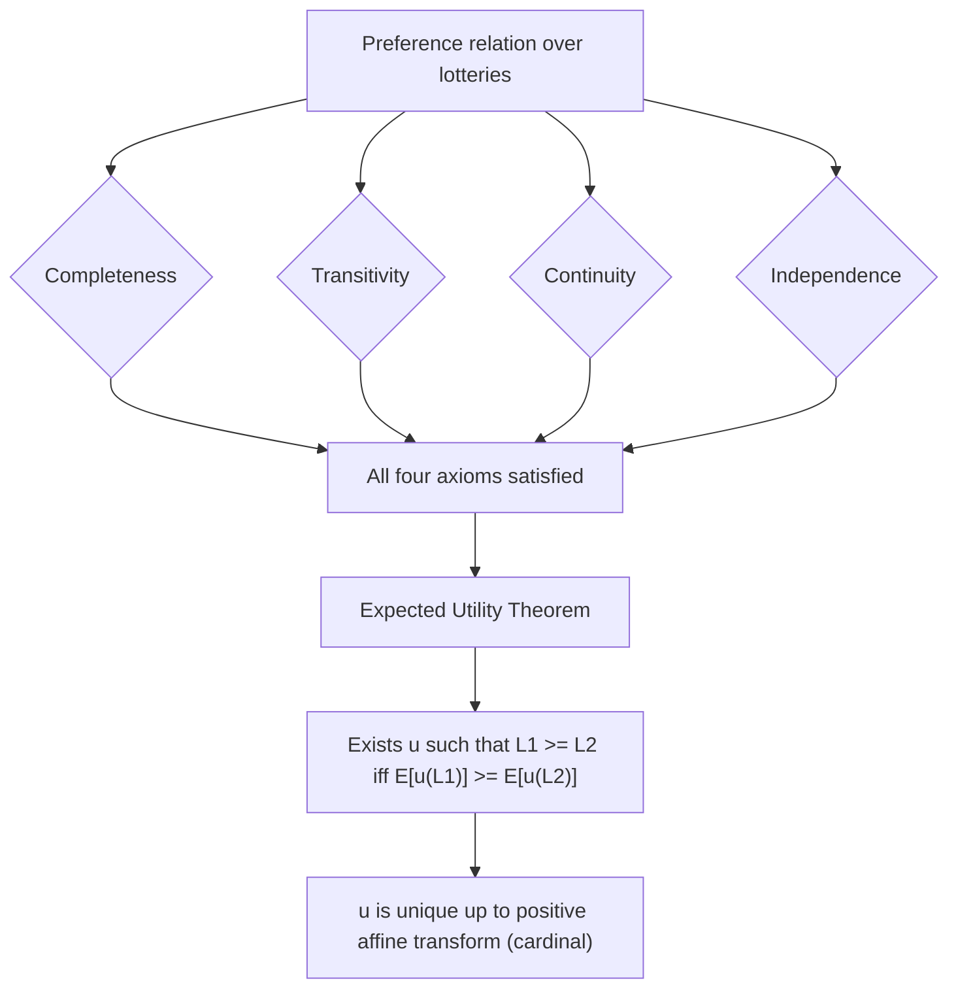

## Von Neumann-Morgenstern Axioms

### Overview

The Von Neumann-Morgenstern (VNM) axioms are a set of conditions on preferences over risky prospects (lotteries) that, when satisfied, guarantee the existence of a utility function $u(\cdot)$ such that choices can be represented by maximizing **expected utility**. Formulated by John von Neumann and Oskar Morgenstern in *Theory of Games and Economic Behavior* (1944), this framework underlies the Expected Utility Theory (EUT) that dominates classical decision theory under risk.

### The Decision Environment

**Lotteries**

A lottery $L$ is a probability distribution over a finite set of outcomes $\{x_1, x_2, \ldots, x_n\}$:

$$L = (p_1 \circ x_1, p_2 \circ x_2, \ldots, p_n \circ x_n), \quad \sum_{i=1}^n p_i = 1, \quad p_i \geq 0$$

Outcomes themselves may be **degenerate lotteries** (certain outcomes) or **compound lotteries** (lotteries over lotteries), which can be reduced to simple lotteries via the laws of probability.

**Preference Relation**

The agent has a preference relation $\succsim$ over the set of lotteries $\mathcal{L}$, with $\succ$ (strict preference) and $\sim$ (indifference) derived in the usual way.

### The Four Axioms

**1. Completeness**

For any two lotteries $L_1, L_2 \in \mathcal{L}$, exactly one of the following holds:

$$L_1 \succsim L_2, \quad L_2 \succsim L_1, \quad \text{or both (i.e., } L_1 \sim L_2\text{)}$$

The agent can always rank any pair of lotteries — indecision is not permitted.

**2. Transitivity**

For any $L_1, L_2, L_3 \in \mathcal{L}$:

$$\text{If } L_1 \succsim L_2 \text{ and } L_2 \succsim L_3, \text{ then } L_1 \succsim L_3$$

Combined with completeness, this ensures preferences form a **weak order**, ruling out preference cycles.

**3. Continuity (Archimedean Axiom)**

For any three lotteries $L_1 \succsim L_2 \succsim L_3$, there exists a probability $\alpha \in [0,1]$ such that:

$$L_2 \sim \alpha L_1 + (1-\alpha) L_3$$

No outcome is infinitely better or worse than another — extreme outcomes can always be "diluted" by mixing with sufficiently small probability to match an intermediate lottery. This rules out lexicographic preferences.

**4. Independence (Substitution Axiom)**

For any $L_1, L_2, L_3 \in \mathcal{L}$ and any $\alpha \in (0,1]$:

$$L_1 \succsim L_2 \iff \alpha L_1 + (1-\alpha)L_3 \succsim \alpha L_2 + (1-\alpha)L_3$$

If $L_1$ is preferred to $L_2$, mixing both with a common third lottery $L_3$ in identical proportions preserves the ranking. This is the most behaviorally restrictive and most frequently violated axiom (see Allais Paradox below).

### The Expected Utility Theorem

**Statement**

If a preference relation $\succsim$ over $\mathcal{L}$ satisfies Completeness, Transitivity, Continuity, and Independence, then there exists a function $u: X \to \mathbb{R}$ (defined over outcomes) such that for any two lotteries:

$$L_1 \succsim L_2 \iff \sum_{i} p_i^{(1)} u(x_i) \geq \sum_{i} p_i^{(2)} u(x_i)$$

i.e., $L_1 \succsim L_2 \iff \mathbb{E}[u(L_1)] \geq \mathbb{E}[u(L_2)]$

**Uniqueness (Cardinality up to Positive Affine Transformation)**

The utility function $u(\cdot)$ representing these preferences is unique up to a **positive affine transformation**:

$$v(x) = a \cdot u(x) + b, \quad a > 0$$

This means $u(\cdot)$ is **cardinal**, not merely ordinal — differences in utility carry meaningful information about strength of preference (unlike ordinal utility in standard consumer theory), though the specific numerical scale is not unique. This cardinality is what permits meaningful risk-aversion measures (see Related Topics).

### Proof Sketch

**Step 1 — Construct a utility scale using best/worst outcomes.** Let $x^*$ be the best and $x_*$ the worst outcome among those under consideration. By Continuity, any outcome $x_i$ is indifferent to some lottery mixing $x^*$ and $x_*$:

$$x_i \sim u(x_i) \cdot x^* + (1 - u(x_i)) \cdot x_*$$

Define $u(x_i)$ as this indifference probability, normalizing $u(x^*) = 1$, $u(x_*) = 0$.

**Step 2 — Show this representation extends to compound lotteries.** By Independence, substituting each $x_i$ in a lottery $L$ with its equivalent $u(x_i)$-mixture of $x^*$ and $x_*$ does not change the ranking. Reducing the resulting compound lottery yields a lottery over $\{x^*, x_*\}$ alone, with probability of $x^*$ equal to $\sum_i p_i u(x_i) = \mathbb{E}[u(L)]$.

**Step 3 — Show the ranking of these reduced lotteries corresponds to their $\mathbb{E}[u(\cdot)]$.** Since all lotteries reduce to comparisons of $x^*$-probability, and higher $x^*$-probability is (by construction) weakly preferred, $L_1 \succsim L_2 \iff \mathbb{E}[u(L_1)] \geq \mathbb{E}[u(L_2)]$. $\blacksquare$

*(This is a sketch; full rigor requires handling countably infinite outcome sets and formal treatment of compound-lottery reduction — see Kreps, *Notes on the Theory of Choice*, or Mas-Colell, Whinston & Green Ch. 6 for the complete construction.)*

### Worked Example

Suppose an agent's preferences over three outcomes satisfy the VNM axioms, with $x^* = \$1000$, $x_* = \$0$, and an intermediate outcome $x_1 = \$400$. Suppose the agent is indifferent between receiving $x_1$ for certain and a lottery giving $1000 with probability 0.5 and $0 with probability 0.5:

$$\$400 \sim (0.5 \circ \$1000, \ 0.5 \circ \$0)$$

Then $u(\$400) = 0.5$ under the normalization $u(\$1000)=1$, $u(\$0)=0$.

Now compare two lotteries:

- $L_A$: $400 for certain → $\mathbb{E}[u(L_A)] = u(400) = 0.5$
- $L_B$: $1000 with probability 0.4, $0 with probability 0.6 → $\mathbb{E}[u(L_B)] = 0.4(1) + 0.6(0) = 0.4$

Since $0.5 > 0.4$, the VNM representation predicts $L_A \succ L_B$ — the certain $400 is preferred to the riskier lottery with lower expected utility, even though $L_B$'s expected *monetary* value is $400 as well. This illustrates that expected utility ranks by $\mathbb{E}[u(x)]$, not $\mathbb{E}[x]$ — the wedge between the two is the basis of risk aversion.

### Diagram: Axioms → EU Representation

### Violations and Paradoxes

**Allais Paradox (Independence Violation)**

Consider two choice pairs:

*Pair 1:*

- $A$: $1M with certainty
- $B$: $5M (p=0.10), $1M (p=0.89), $0 (p=0.01)

*Pair 2:*

- $C$: $1M (p=0.11), $0 (p=0.89)
- $D$: $5M (p=0.10), $0 (p=0.90)

Empirically, most people choose $A \succ B$ (certainty preference) but $D \succ C$. This reversal violates Independence: both pairs are constructed by mixing a common lottery with $A/B$ vs $C/D$, and consistency under Independence requires the same ranking direction in both pairs. This is a **[Speculation]**-free, well-documented empirical regularity, though explanations for *why* it occurs (e.g., certainty effect, regret theory) remain contested among behavioral economists.

**Common Ratio Effect and Common Consequence Effect**

Generalized versions of the Allais pattern; both are systematic Independence violations that motivated alternative models such as **Rank-Dependent Expected Utility (RDEU)** and **Prospect Theory**.

### Relationship to Risk Aversion

Under VNM, the **curvature** of $u(\cdot)$ over monetary outcomes encodes risk attitudes:

- $u'' < 0$ (concave) → risk-averse
- $u'' = 0$ (linear) → risk-neutral
- $u'' > 0$ (convex) → risk-seeking

This is formalized via the **Arrow-Pratt coefficients** of absolute and relative risk aversion, which are only meaningful because VNM utility is cardinal (differences and curvature carry information, unlike ordinal utility).

### Common Misconceptions

- **VNM utility is not the same as "happiness" or psychological utility.** It is a mathematical representation device implied by consistent choice under the axioms; interpreting $u(\cdot)$ as a hedonic measure is a substantive (and contestable) additional claim.
- **Independence does not require identical outcomes across compared lotteries** — it requires that mixing with a *common* third lottery in equal proportion not reverse the ranking.
- **VNM does not by itself imply risk aversion** — the theorem is silent on the shape of $u(\cdot)$; risk attitudes are a separate empirical/behavioral assumption layered on top.

### Limitations

- Assumes a fixed, finite (or well-behaved) outcome/state space known with objective probabilities (contrast with **Savage's Subjective Expected Utility**, which derives subjective probabilities alongside utility from preferences over acts).
- Assumes preferences are given and stable — no account of preference formation or learning.
- Independence is the empirically weakest link and is systematically violated in controlled experiments (Allais, Ellsberg-type ambiguity effects, though Ellsberg specifically challenges the probabilistic-belief side rather than VNM per se).

**Related Topics**

- Expected Utility Theory and its applications in portfolio choice
- Arrow-Pratt measures of risk aversion (absolute and relative)
- Allais Paradox and the Certainty Effect
- Ellsberg Paradox and ambiguity aversion
- Savage's Subjective Expected Utility framework
- Rank-Dependent Expected Utility (RDEU)
- Prospect Theory (Kahneman & Tversky) and reference-dependent preferences
- Stochastic dominance (first-order and second-order)
- Certainty equivalents and risk premia
- Mean-variance analysis and its relation to expected utility under quadratic utility or normality assumptions