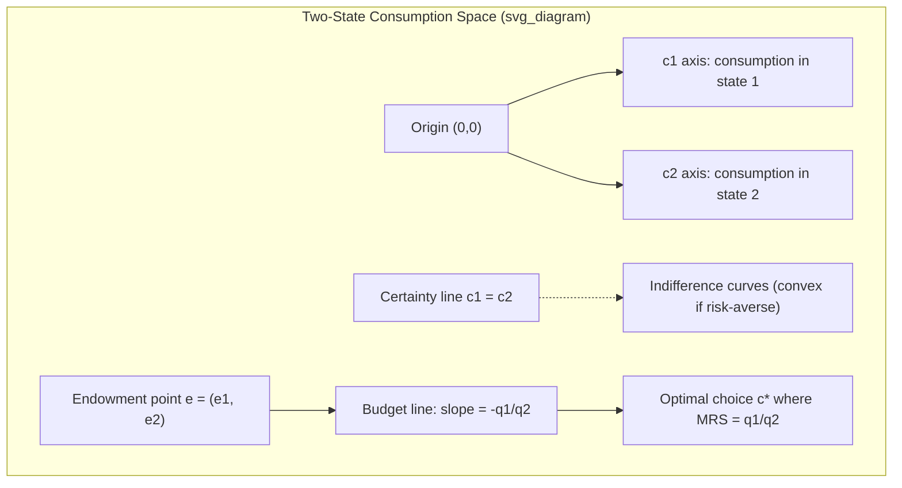

## State-Preference Theory

### Overview

State-preference theory (also called the Arrow-Debreu contingent claims framework) models choice under uncertainty by treating each **state of the world** as defining a distinct commodity. Rather than working directly with probability distributions over outcomes (as in Expected Utility Theory), it embeds uncertainty into a standard general-equilibrium consumption framework: a claim to $1 in state $s$ is a different good from a claim to $1 in state $s'$. This approach, developed by Kenneth Arrow (1953) and Gerard Debreu (1959), allows the full machinery of ordinal consumer theory, indifference curves, and general equilibrium to be applied directly to problems of risk and insurance.

### Core Setup

**States of the World**

Let $S = \{1, 2, \ldots, n\}$ be a finite, mutually exclusive and exhaustive set of possible states of nature, exactly one of which will be realized. States capture all uncertainty relevant to the agent's payoffs (e.g., "rain" vs. "no rain," "recession" vs. "boom").

**Contingent Claims (State Claims)**

A contingent claim (or Arrow security) for state $s$ is an asset paying $1 if state $s$ occurs and $0 otherwise. A **consumption plan** is a vector:

$$c = (c_1, c_2, \ldots, c_n)$$

specifying wealth/consumption received in each state.

**State Prices**

Each contingent claim has a price $q_s$ — the amount paid today to receive $1 in state $s$. The vector $q = (q_1, \ldots, q_n)$ constitutes the **state-price vector**, and $\sum_s q_s$ relates to the price of a riskless claim paying $1 in every state (the risk-free bond).

### Budget Constraint

An agent with initial wealth $W_0$ (or an initial endowment across states $e = (e_1, \ldots, e_n)$) chooses a consumption plan $c$ subject to:

$$\sum_{s=1}^{n} q_s c_s \leq \sum_{s=1}^n q_s e_s$$

This is formally identical to a standard Walrasian budget constraint over $n$ distinct goods — the "goods" happen to be state-contingent dollars.

### Preferences Over State-Contingent Claims

**Ordinal Representation**

Preferences $\succsim$ over consumption plans $c \in \mathbb{R}^n_+$ are represented by a utility function $U(c_1, \ldots, c_n)$, with indifference curves defined over the state-space exactly as in standard consumer theory.

**Expected-Utility Special Case**

If preferences additionally satisfy the VNM axioms, $U(\cdot)$ takes the additively separable, probability-weighted form:

$$U(c_1, \ldots, c_n) = \sum_{s=1}^n \pi_s \, u(c_s)$$

where $\pi_s$ is the (subjective or objective) probability of state $s$ and $u(\cdot)$ is a state-independent Bernoulli utility function. State-preference theory is thus more general than expected utility: it does not require additive separability across states, and it accommodates state-dependent utility (e.g., utility of wealth differing across health states).

### The Certainty Line and Risk Aversion Geometrically

In a two-state diagram ($c_1$ on one axis, $c_2$ on the other), the **certainty line** is the 45° line where $c_1 = c_2$ — consumption is the same regardless of which state occurs (full insurance / no risk).

- **Risk-averse** agents have convex indifference curves and, absent a compensating risk premium, choose points on or near the certainty line.
- The **marginal rate of substitution** between state-contingent claims at a point on the certainty line, for an EU-maximizer, equals the ratio of state probabilities: $MRS_{12} = \pi_1/\pi_2$ (since $c_1 = c_2 \Rightarrow u'(c_1) = u'(c_2)$).

### Diagram: Two-State Contingent Claims Space

### No-Arbitrage and State Prices

**Fundamental Relationship to Asset Pricing**

State prices $q_s$ must satisfy no-arbitrage conditions. If a risk-free asset paying $1 in every state exists with gross return $R_f$, then:

$$\sum_{s=1}^n q_s = \frac{1}{R_f}$$

Any asset with payoff vector $(x_1, \ldots, x_n)$ across states must be priced as:

$$P = \sum_{s=1}^n q_s x_s$$

This is the discrete-state analogue of the **stochastic discount factor** / pricing kernel used in modern asset pricing, where $q_s$ (normalized by probability) is interpreted as $\pi_s m_s$, with $m_s$ the pricing kernel realization in state $s$.

**Risk-Neutral Probabilities**

Defining $q_s^* = q_s R_f$ yields a set of **risk-neutral probabilities** $q_s^*$ that sum to 1. Asset prices can then be computed as expected payoffs discounted at the risk-free rate under this transformed probability measure:

$$P = \frac{1}{R_f}\sum_{s} q_s^* x_s = \frac{1}{R_f}\mathbb{E}^{Q}[x]$$

This is the discrete-time seed of the risk-neutral valuation framework used throughout derivatives pricing (e.g., binomial option pricing, and ultimately Black-Scholes-Merton in continuous time).

### Worked Example

Two states: "Boom" (probability $\pi_1 = 0.6$) and "Recession" ($\pi_2 = 0.4$). Suppose state prices are $q_1 = \$0.50$, $q_2 = \$0.45$ (both per $1 of state-contingent payoff).

**Risk-free rate:**

$$\sum q_s = 0.50 + 0.45 = 0.95 = \frac{1}{R_f} \implies R_f = 1.0526 \ (\text{i.e., } 5.26\%)$$

**Risk-neutral probabilities:**

$$q_1^* = q_1 R_f = 0.50 \times 1.0526 = 0.526, \quad q_2^* = 0.45 \times 1.0526 = 0.474$$

(Check: $0.526 + 0.474 = 1.0$ ✓)

**Pricing a risky asset** paying $x_1 = \$120$ in Boom and $x_2 = \$80$ in Recession:

$$P = q_1 x_1 + q_2 x_2 = 0.50(120) + 0.45(80) = 60 + 36 = \$96$$

Note that $q_1^* = 0.526 > \pi_1 = 0.6$ is false here — in this example $q_1^*< \pi_1$, meaning the risk-neutral probability of the Boom state is *lower* than its true probability, consistent with state 2 (Recession) carrying a positive risk premium (agents pay more per unit of probability for Recession-state payoffs because that's when marginal utility of wealth is high).

### Complete vs. Incomplete Markets

**Market Completeness**

Markets are **complete** if there exist enough linearly independent traded securities to span all $n$ states — equivalently, if a full set of Arrow securities can be synthesized from traded assets. With $n$ states, at least $n$ linearly independent securities are required.

**Implications of Completeness**

- Complete markets allow any state-contingent consumption plan to be achieved via trade, and the resulting competitive equilibrium is **Pareto optimal** (First Welfare Theorem applies).
- Under complete markets, state prices $q_s$ are **uniquely determined** by no-arbitrage.
- Under **incomplete markets**, the no-arbitrage condition only pins down a *set* of admissible state-price vectors (or pricing kernels) consistent with observed asset prices, not a unique one — a foundational issue in incomplete-markets asset pricing theory.

### Relation to Expected Utility Theory

| Dimension | State-Preference Theory | Expected Utility Theory |
| --- | --- | --- |
| Primitive | Preferences over state-contingent bundles | Preferences over probability distributions (lotteries) |
| Functional form | General $U(c_1, \ldots, c_n)$ | Additively separable $\sum_s \pi_s u(c_s)$ |
| Probabilities | Not required as primitives | Central primitive (objective or subjective) |
| State-dependence | Naturally accommodates state-dependent utility | Typically assumes state-independent $u(\cdot)$ |
| Natural domain | General equilibrium, asset pricing, insurance | Individual decision analysis, risk attitudes |

**[Inference]** Because state-preference theory does not require additive separability or state-independence, it is often regarded as a strictly more general framework, with EU theory recoverable as a special case under further axioms (VNM axioms) plus an assumption of state-independent utility — this framing is standard in graduate treatments (e.g., Kreps, Huang & Litzenberger) but the precise axiomatic relationship depends on which primitives are taken as given.

### Applications

- **Insurance markets**: an insurance contract is a trade of consumption across states (paying a premium in the "no loss" state to receive a payout in the "loss" state), directly analyzed via the budget-line/indifference-curve apparatus above.
- **Arrow-Debreu general equilibrium**: extending the framework to a full multi-agent, multi-good economy with contingent commodities, proving existence and optimality of competitive equilibrium under uncertainty.
- **Asset pricing and the pricing kernel**: state prices generalize to the stochastic discount factor in continuous-state, continuous-time asset pricing models.
- **Real options and contingent claims analysis**: valuing corporate investment decisions as portfolios of state-contingent claims.

### Limitations

- Requires a well-defined, finite (or otherwise tractable) partition of states — real-world uncertainty may not decompose cleanly into mutually exclusive, exhaustive states known to all agents.
- Assumes state prices/claims are directly or indirectly tradable (or spannable); with severely incomplete markets the framework's sharp pricing predictions weaken.
- Does not by itself resolve *where* probabilities $\pi_s$ come from when the EU special case is invoked — this is the domain of Savage's subjective probability framework.

**Related Topics**

- Arrow-Debreu general equilibrium model
- Arrow securities and complete markets
- Stochastic discount factor / pricing kernel
- Risk-neutral valuation and the Fundamental Theorem of Asset Pricing
- Von Neumann-Morgenstern axioms and Expected Utility Theory
- Savage's Subjective Expected Utility
- Pareto optimality and the First Welfare Theorem under uncertainty
- Insurance economics and optimal risk-sharing
- Incomplete markets and market spanning