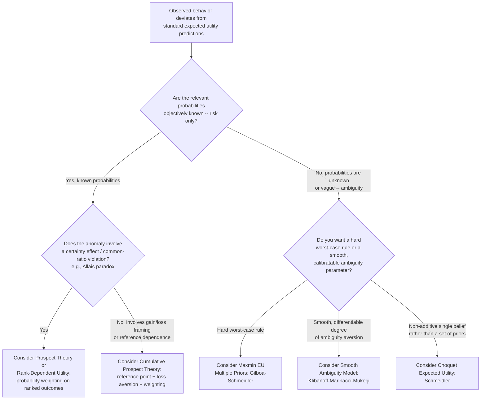

## Ambiguity Aversion and Non-Expected Utility Models


### Definition and Motivation

Expected utility theory (EUT) assumes that agents face **risk** — situations where outcomes are uncertain but the probability distribution governing those outcomes is known and objectively (or at least uniquely subjectively) specified. **Ambiguity** (or "Knightian uncertainty," after Frank Knight's 1921 distinction) refers instead to situations where the probabilities themselves are unknown, vague, or not uniquely specifiable — the decision-maker cannot confidently assign a single probability distribution to the relevant states of the world. **Ambiguity aversion** is the tendency of decision-makers to prefer known (risky) probabilities over unknown (ambiguous) ones, even when the ambiguous option's expected payoff, computed under any reasonable prior, is identical.

This distinction motivates a family of **non-expected utility models** that relax one or more of the von Neumann-Morgenstern (vNM) axioms — completeness, transitivity, continuity, and especially the **independence axiom** — in order to accommodate behavioral patterns (most famously the Allais and Ellsberg paradoxes) that standard EUT cannot explain.

### The Ellsberg Paradox

**Setup.** An urn contains 90 balls: 30 are known to be red, and the remaining 60 are an unknown mix of black and yellow (in some unspecified proportion). Consider two pairs of bets:

- **Choice 1:** Bet A pays $100 if a red ball is drawn; Bet B pays $100 if a black ball is drawn.
- **Choice 2:** Bet C pays $100 if a red or yellow ball is drawn; Bet D pays $100 if a black or yellow ball is drawn.

**Typical observed behavior:** most subjects choose **A over B** (Choice 1) and **D over C** (Choice 2).

**The paradox.** Under expected utility with any subjective probability $p$ assigned to "black," preferring A over B implies $30 > 60p_{\text{black}|black+yellow \text{ resolved}}$... more precisely, preferring A (red, known probability 1/3) over B (black, unknown) implies the decision-maker's subjective probability of black is less than 1/3. But preferring D (black-or-yellow) over C (red-or-yellow) implies the subjective probability of black is *greater* than 1/3 (since both C and D include yellow symmetrically, the comparison isolates a preference for the "black" component of D being more likely than the "red" component of C). These two inferred beliefs are logically inconsistent under **any single, well-defined subjective probability distribution**, so no expected-utility representation with a single prior can rationalize the joint choice pattern. The consistent explanation is that agents strictly prefer bets with **known** probabilities (A and D, both involving the fully-specified "red" or "not-red-or-yellow" complement) over bets involving the **ambiguous** black/yellow split — this is ambiguity aversion, and it violates Savage's Sure-Thing Principle, which is EUT's subjective-probability analogue of the independence axiom.

**[Verified via extensive experimental replication]** The qualitative pattern of the Ellsberg paradox (a systematic preference for known over unknown probabilities holding expected monetary value considerations aside) has been replicated across many experimental studies, though the specific magnitude and robustness of the effect can vary by population, stakes, and framing. **[Unverified]** The precise real-world economic magnitude of ambiguity aversion outside the laboratory (e.g., its quantitative contribution to observed asset pricing anomalies) remains an active empirical research question rather than a settled figure.

### The Allais Paradox (Contrast with Ambiguity: A Risk-Based Violation)

Distinct from ambiguity, the **Allais paradox** shows that EUT's independence axiom can be violated even under known, objective probabilities (pure risk, not ambiguity). Consider:

- **Choice 1:** Option A: $1 million with certainty. Option B: $5 million with probability 0.10, $1 million with probability 0.89, $0 with probability 0.01.
- **Choice 2:** Option C: $1 million with probability 0.11, $0 with probability 0.89. Option D: $5 million with probability 0.10, $0 with probability 0.90.

**Typical observed behavior:** most subjects choose **A over B** (preferring certainty) but **D over C** (preferring the higher payoff when both options are already risky).

**The paradox.** The independence axiom requires that if a common outcome-probability component (the 0.89 chance of $1 million in A/B, replaced by 0.89 chance of $0 in C/D) is altered identically across both options in a pair, preferences should not reverse. Choosing A≻B and D≻C reverses the implied ranking, violating independence. This reveals a **"certainty effect"**: people disproportionately overweight outcomes that are certain relative to those that are merely probable, a pattern the independence axiom cannot accommodate but which non-expected utility models are explicitly designed to capture.

### Non-Expected Utility Models Under Risk (Known Probabilities)

**Prospect Theory (Kahneman & Tversky, 1979) / Cumulative Prospect Theory (1992).** Prospect theory departs from EUT in three central ways:

1. **Reference dependence.** Outcomes are evaluated as gains or losses relative to a reference point (often the status quo), not as absolute wealth levels.
2. **Loss aversion and value function curvature.** The value function $v(\cdot)$ is concave over gains (risk-averse for gains) and convex over losses (risk-*seeking* for losses), and is steeper for losses than for gains of equal magnitude — a stylized value function is:

$$v(x) = \begin{cases} x^{\alpha} & x \geq 0 \\ -\lambda(-x)^{\beta} & x < 0 \end{cases}$$

with $\lambda > 1$ (the loss-aversion coefficient, commonly estimated around 2 to 2.5 in various studies, though this figure varies by study design) capturing that losses "loom larger" than equivalent gains.

3. **Probability weighting.** Objective probabilities $p$ are transformed via a nonlinear weighting function $w(p)$, typically overweighting small probabilities and underweighting moderate-to-large ones, with a characteristic inverse-S shape. A common parametric form (Tversky-Kahneman 1992) is:

$$w(p) = \frac{p^{\gamma}}{\left(p^{\gamma} + (1-p)^{\gamma}\right)^{1/\gamma}}$$

Cumulative prospect theory (the 1992 refinement) applies this weighting to the **cumulative** distribution of ranked outcomes (rather than to individual outcome probabilities directly) to avoid violations of first-order stochastic dominance that afflicted the original 1979 formulation.

**[Unverified as a universal parameter]** Specific numerical estimates for $\alpha$, $\beta$, $\gamma$, and $\lambda$ vary considerably across studies, subject pools, elicitation methods, and stake sizes; the widely cited illustrative values (e.g., $\alpha=\beta\approx0.88$, $\gamma\approx0.61$–$0.69$, $\lambda\approx2.25$ from the original Tversky-Kahneman estimation) should be treated as one influential empirical calibration, not universal constants.

**Rank-Dependent Utility (RDU) (Quiggin, 1982).** A precursor/generalization that applies a probability weighting function to the cumulative probability ranks of outcomes while retaining a standard (non-reference-dependent) utility function over final wealth, avoiding some of prospect theory's specifically loss-related assumptions while still capturing non-linear probability weighting.

### Non-Expected Utility Models Under Ambiguity

**Maxmin Expected Utility / Multiple Priors (Gilboa & Schmeidler, 1989).** The decision-maker is assumed to hold not a single subjective probability distribution but a **set** of plausible priors $\mathcal{P}$, and evaluates an act $f$ (a mapping from states to outcomes) by its **worst-case** expected utility across that set:

$$V(f) = \min_{\pi \in \mathcal{P}} \int u(f(s))\, d\pi(s)$$

This "maxmin" (pessimistic, worst-case) evaluation directly rationalizes the Ellsberg paradox: an ambiguous bet's value is determined by the least favorable probability in the belief set, making ambiguous bets systematically less attractive than risky bets with an equivalent midpoint probability, without requiring any single prior.

**Choquet Expected Utility (Schmeidler, 1989).** Generalizes expected utility by replacing the additive probability measure with a **non-additive** (Choquet) capacity $v(\cdot)$, where $v(A) + v(A^c)$ need not equal 1 for an event $A$ and its complement. Utility is computed via a Choquet integral rather than a standard (additive) expectation, allowing the model to represent ambiguity-averse behavior with a single non-additive "capacity" instead of a full set of priors.

**Smooth Ambiguity Model (Klibanoff, Marinacci & Mukerji, 2005).** Introduces a **second-order** probability distribution over the set of possible first-order priors, and applies a concave transformation $\phi(\cdot)$ to the expected utility computed under each first-order prior before averaging over the second-order distribution:

$$V(f) = \int \phi\left(\int u(f(s))\, d\pi(s)\right)\, d\mu(\pi)$$

The concavity of $\phi$ (analogous to risk aversion, but applied to the *distribution over possible priors* rather than to outcomes directly) captures the *degree* of ambiguity aversion in a smooth, differentiable way — addressing a criticism that maxmin's reliance on the single worst-case prior can be overly extreme and generates kinks in behavior (e.g., complete insensitivity to information that does not change the identity of the worst-case prior).

**Variational Preferences (Maccheroni, Marinacci & Rustichini, 2006).** A further generalization nesting both maxmin expected utility and the "multiplier preferences" of robust control theory (Hansen-Sargent), representing ambiguity aversion via a general cost/penalty function over priors rather than a hard constraint set or worst-case rule.

### Summary Comparison of Models

| Model | Relaxes | Key mechanism | Captures |
| --- | --- | --- | --- |
| Expected Utility (benchmark) | — | Linear in probabilities, single prior | Risk aversion via concave $u(\cdot)$ |
| Rank-Dependent Utility | Independence axiom | Probability weighting on cumulative ranks | Non-linear probability perception |
| (Cumulative) Prospect Theory | Independence axiom + reference independence | Reference-dependent value function, loss aversion, probability weighting | Allais paradox, loss aversion, framing effects |
| Maxmin EU (Multiple Priors) | Single-prior assumption | Worst-case evaluation over a set of priors | Ellsberg paradox (sharp ambiguity aversion) |
| Choquet Expected Utility | Additivity of probability | Non-additive capacity + Choquet integral | Ellsberg paradox via a single non-additive belief |
| Smooth Ambiguity Model | Single-prior assumption | Second-order distribution + concave $\phi$ transform | Ellsberg paradox with smooth, calibratable ambiguity aversion |

### Worked Illustration: Maxmin Evaluation of the Ellsberg Bets

Return to the Ellsberg urn (30 red; 60 black-or-yellow in unknown proportion). Suppose the decision-maker's belief set $\mathcal{P}$ allows the probability of black, $\pi_{black}$, to range anywhere in $[0, 2/3]$ (i.e., anywhere from "all yellow" to "all black" among the 60 unknown balls), consistent with knowing only that black + yellow = 60/90 = 2/3.

For **Bet A** (pays $100 if red): the probability of red is known exactly at $1/3$ regardless of the black/yellow split, so $V(A) = \frac{1}{3}u(100) + \frac{2}{3}u(0)$ — no ambiguity, single value.

For **Bet B** (pays $100 if black): probability of black ranges over $[0, 2/3]$, so the worst case sets $\pi_{black} = 0$, giving $V(B) = \min_{\pi_{black}\in[0,2/3]} \left[\pi_{black}\, u(100) + (1-\pi_{black})u(0)\right] = u(0)$ (attained at $\pi_{black}=0$).

Since $V(A) = \frac{1}{3}u(100) + \frac{2}{3}u(0) > u(0) = V(B)$ for any increasing $u$, the maxmin model predicts **A is strictly preferred to B**, matching the empirically observed Ellsberg choice — without needing to specify any single subjective probability for black, exactly the feature that resolves the paradox.

### Visualizing Ambiguity Aversion

<svg xmlns="http://www.w3.org/2000/svg" viewBox="0 0 900 480" font-family="Helvetica, Arial, sans-serif">
<text x="450" y="28" text-anchor="middle" font-size="18" font-weight="bold" fill="#1a1a1a">Risk vs. Ambiguity and the Probability Weighting Function (svg_diagram)</text>

<g>
<text x="200" y="55" text-anchor="middle" font-size="14" font-weight="bold" fill="#333">Known (Risk) vs. Unknown (Ambiguous) Odds</text>
<rect x="50" y="90" width="140" height="140" fill="#dbeafe" stroke="#2563eb" stroke-width="2" />
<text x="120" y="165" text-anchor="middle" font-size="13" fill="#1e3a8a" font-weight="bold">RISK</text>
<text x="120" y="185" text-anchor="middle" font-size="11" fill="#1e3a8a">p known exactly</text>
<text x="120" y="200" text-anchor="middle" font-size="11" fill="#1e3a8a">e.g., 30/90 red</text>



```
<rect x="230" y="90" width="140" height="140" fill="#fee2e2" stroke="#dc2626" stroke-width="2" />
<text x="300" y="150" text-anchor="middle" font-size="13" fill="#7f1d1d" font-weight="bold">AMBIGUITY</text>
<text x="300" y="170" text-anchor="middle" font-size="11" fill="#7f1d1d">p unknown, in a range</text>
<text x="300" y="185" text-anchor="middle" font-size="11" fill="#7f1d1d">e.g., black in [0, 2/3]</text>
<text x="300" y="200" text-anchor="middle" font-size="11" fill="#7f1d1d">of the 60 balls</text>

<text x="200" y="270" text-anchor="middle" font-size="12" fill="#333">Ambiguity-averse agents strictly prefer</text>
<text x="200" y="288" text-anchor="middle" font-size="12" fill="#333">the RISK box over the AMBIGUITY box,</text>
<text x="200" y="306" text-anchor="middle" font-size="12" fill="#333">even at equal expected probability (1/3).</text>
```

</g>

<g transform="translate(460,0)">
<text x="200" y="55" text-anchor="middle" font-size="14" font-weight="bold" fill="#333">Probability Weighting Function w(p)</text>
<line x1="60" y1="380" x2="60" y2="70" stroke="#333" stroke-width="1.5" />
<line x1="60" y1="380" x2="380" y2="380" stroke="#333" stroke-width="1.5" />
<text x="220" y="405" text-anchor="middle" font-size="12" fill="#333">Objective probability p</text>
<text x="30" y="220" text-anchor="middle" font-size="12" fill="#333" transform="rotate(-90 30 220)">Decision weight w(p)</text>



```

<line x1="60" y1="380" x2="380" y2="70" stroke="#9ca3af" stroke-dasharray="4,4" stroke-width="1.5" />
<text x="330" y="90" font-size="10" fill="#9ca3af">w(p) = p (EUT)</text>


<path d="M 60 380 Q 100 320 140 290 Q 190 255 220 225 Q 260 185 300 130 Q 330 95 380 70" fill="none" stroke="#2563eb" stroke-width="2.5" />
<text x="90" y="300" font-size="10" fill="#2563eb" font-weight="bold">overweights small p</text>
<text x="230" y="290" font-size="10" fill="#2563eb" font-weight="bold">underweights mid/large p</text>
```

</g>
</svg>

### Decision Flow: Choosing a Model for a Given Choice Anomaly



### Applications in Financial Economics

- **Home bias and portfolio under-diversification.** Ambiguity aversion is used to explain why investors disproportionately hold domestic or familiar assets relative to the diversification benefits predicted by standard mean-variance/EUT models — unfamiliar foreign assets are perceived as more "ambiguous."
- **Equity premium puzzle.** Some research uses ambiguity aversion (rather than, or alongside, extreme risk aversion) as a candidate explanation for why the observed equity premium is larger than standard EUT-CRRA models calibrated to plausible risk-aversion coefficients can generate, since ambiguity about the true return-generating process can raise required compensation beyond pure risk considerations. **[Unverified]** The relative empirical contribution of ambiguity aversion versus other candidate explanations (habit formation, long-run risk, rare disasters) to the equity premium puzzle remains actively debated in the literature rather than settled.
- **Robust portfolio choice and robust control.** The multiplier-preferences / variational-preferences framework connects ambiguity aversion to robust control theory (Hansen-Sargent), where investors optimize against a worst-case model misspecification, informing "robust" portfolio construction methods used in some asset management practice.
- **Behavioral asset pricing and option-implied risk-neutral distributions.** Probability weighting functions from (cumulative) prospect theory have been used to help explain patterns in index option prices (e.g., the volatility smile/skew) that are difficult to reconcile with pure rational expected-utility pricing.

### Common Pitfalls and Clarifications

- Conflating **ambiguity aversion** with ordinary **risk aversion**: risk aversion concerns dislike of variance/dispersion under *known* probabilities; ambiguity aversion concerns a distinct, additional dislike of *not knowing* the probabilities, and the two are conceptually and axiomatically separate (an agent can be risk-neutral yet ambiguity-averse, in principle).
- Treating the Allais paradox and the Ellsberg paradox as the same phenomenon: Allais is a violation of independence under **known** objective probabilities (pure risk), while Ellsberg specifically involves **unknown** probabilities (ambiguity) — they motivate different, though sometimes overlapping, classes of models.
- Assuming maxmin expected utility is "the" correct ambiguity model: it is one of several axiomatically distinct frameworks (Choquet EU, smooth ambiguity, variational preferences), each with different implications for comparative statics and calibration; the choice of model affects quantitative predictions.
- Misreading cumulative prospect theory's probability weighting as applying to raw individual-outcome probabilities in the 1979 original form; the 1992 cumulative version applies weighting to the **cumulative** ranked distribution specifically to preserve consistency with first-order stochastic dominance, a technical refinement often glossed over in informal summaries.

**Next Steps**

- Absolute and relative risk aversion (Arrow-Pratt measures) — the risk-only benchmark that ambiguity models extend
- Stochastic dominance and its interaction with probability-weighting models (violations and preserving conditions)
- The Allais paradox and generalized independence-axiom-relaxing models in more depth
- Robust control theory and multiplier preferences (Hansen-Sargent) in macro-finance
- Empirical measurement of ambiguity aversion (experimental elicitation methods, market-based estimates)
- Applications to the equity premium puzzle and home-bias literature
- Choquet integrals and non-additive probability measures (mathematical foundations)