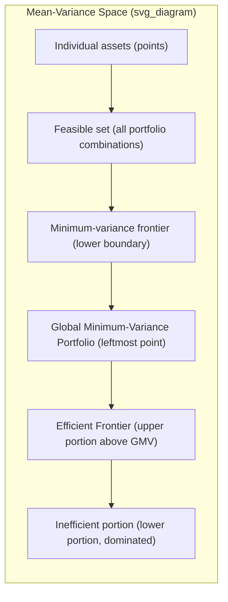

## Mean-Variance Analysis

### Overview

Mean-variance analysis, introduced by Harry Markowitz (1952, 1959), is the foundational framework of Modern Portfolio Theory (MPT). It models portfolio choice as an optimization problem over only two moments of the return distribution — expected return (mean) and variance (risk) — allowing investors to construct portfolios that maximize expected return for a given level of risk, or equivalently minimize risk for a given expected return.

### Foundational Assumptions

- Investors are **risk-averse** and evaluate portfolios solely on the basis of mean and variance of returns (sufficient under either (a) quadratic utility, or (b) normally/elliptically distributed asset returns — see Limitations).
- Investors are **rational expected-utility maximizers** who prefer higher expected return for the same variance, and lower variance for the same expected return (mean-variance dominance).
- Markets are frictionless: no transaction costs, no taxes, assets are infinitely divisible, and short-selling is unrestricted (in the base model; constrained variants relax this).
- A single investment period is considered (static, one-period framework).

### Portfolio Return and Risk

**Portfolio Expected Return**

For a portfolio of $n$ risky assets with weights $w_i$ (where $\sum_{i=1}^n w_i = 1$) and individual expected returns $\mu_i$:

$$\mu_p = \sum_{i=1}^n w_i \mu_i = \mathbf{w}^\top \boldsymbol{\mu}$$

**Portfolio Variance**

$$\sigma_p^2 = \sum_{i=1}^n \sum_{j=1}^n w_i w_j \sigma_{ij} = \mathbf{w}^\top \Sigma \mathbf{w}$$

where $\sigma_{ij} = \text{Cov}(r_i, r_j)$ is the covariance between assets $i$ and $j$ (with $\sigma_{ii} = \sigma_i^2$), and $\Sigma$ is the $n \times n$ variance-covariance matrix.

**Two-Asset Case (Explicit)**

$$\sigma_p^2 = w_1^2 \sigma_1^2 + w_2^2 \sigma_2^2 + 2w_1 w_2 \rho_{12}\sigma_1\sigma_2$$

where $\rho_{12}$ is the correlation coefficient between assets 1 and 2. This term makes explicit the **diversification effect**: when $\rho_{12} < 1$, portfolio variance is strictly less than the weighted average of individual variances.

### Diversification

**Key Insight**

Combining imperfectly correlated assets ($\rho < 1$) reduces portfolio variance below the weighted average of individual asset variances, without necessarily reducing expected return proportionally. The lower the correlation (approaching $\rho = -1$), the greater the risk-reduction benefit.

**Systematic vs. Idiosyncratic Risk**

As $n \to \infty$ in an equally-weighted portfolio, portfolio variance decomposes as:

$$\sigma_p^2 = \frac{1}{n}\bar{\sigma}^2_{\text{idio}} + \left(1 - \frac{1}{n}\right)\bar{\sigma}_{\text{cov}}$$

where $\bar{\sigma}^2_{\text{idio}}$ is average idiosyncratic (diversifiable) variance and $\bar{\sigma}_{\text{cov}}$ is average covariance. As $n$ grows large, the first term vanishes and only the **systematic (non-diversifiable) risk** — captured by average covariance — remains. This result underlies the risk decomposition later formalized in the CAPM.

### The Efficient Frontier

**Definition**

The set of portfolios that offer the maximum expected return for each level of variance (equivalently, minimum variance for each level of expected return) traces out the **efficient frontier** in mean-standard-deviation space.

**Minimum-Variance Portfolio Optimization**

For a target expected return $\mu_p = \mu^*$, the optimization problem is:

$$\min_{\mathbf{w}} \ \frac{1}{2}\mathbf{w}^\top \Sigma \mathbf{w} \quad \text{s.t.} \quad \mathbf{w}^\top \boldsymbol{\mu} = \mu^*, \quad \mathbf{w}^\top \mathbf{1} = 1$$

**Lagrangian and Closed-Form Solution**

$$\mathcal{L} = \frac{1}{2}\mathbf{w}^\top \Sigma \mathbf{w} - \lambda(\mathbf{w}^\top \boldsymbol{\mu} - \mu^*) - \gamma(\mathbf{w}^\top \mathbf{1} - 1)$$

Solving the first-order conditions yields the optimal weight vector as a linear combination of two "basis" portfolios (the **two-fund separation** result for the risky-asset-only frontier):

$$\mathbf{w}^* = \Sigma^{-1}\left(\lambda \boldsymbol{\mu} + \gamma \mathbf{1}\right)$$

with $\lambda, \gamma$ solved from the constraint equations. The resulting frontier is a parabola in mean-variance space (a hyperbola in mean-standard-deviation space).

**Global Minimum-Variance Portfolio**

The portfolio at the leftmost point of the frontier, minimizing variance without regard to return:

$$\mathbf{w}_{\text{GMV}} = \frac{\Sigma^{-1}\mathbf{1}}{\mathbf{1}^\top \Sigma^{-1}\mathbf{1}}$$

### Diagram: The Efficient Frontier

### Introducing a Risk-Free Asset

**Capital Allocation Line (CAL)**

When a risk-free asset with return $r_f$ is introduced, combinations of the risk-free asset and any risky portfolio $P$ trace a straight line in mean-standard-deviation space:

$$\mu_c = r_f + \frac{\mu_P - r_f}{\sigma_P}\sigma_c$$

The slope, $\frac{\mu_P - r_f}{\sigma_P}$, is the **Sharpe Ratio** of portfolio $P$.

**Tangency Portfolio and One-Fund Separation**

The optimal risky portfolio is the one maximizing the Sharpe ratio — the **tangency portfolio** $T$, found where a line from $(0, r_f)$ is tangent to the risky-asset efficient frontier:

$$\mathbf{w}_T = \frac{\Sigma^{-1}(\boldsymbol{\mu} - r_f\mathbf{1})}{\mathbf{1}^\top \Sigma^{-1}(\boldsymbol{\mu} - r_f\mathbf{1})}$$

With a risk-free asset available, **all investors hold the same tangency portfolio of risky assets**, differing only in how much they allocate between $T$ and the risk-free asset based on individual risk aversion (the **Two-Fund / One-Fund Separation Theorem**). This result is the direct bridge to the Capital Asset Pricing Model.

### Worked Example (Two-Asset Portfolio)

Asset A: $\mu_A = 10\%$, $\sigma_A = 20\%$. Asset B: $\mu_B = 15\%$, $\sigma_B = 30\%$. Correlation $\rho_{AB} = 0.2$.

For $w_A = 0.6, w_B = 0.4$:

**Expected return:**

$$\mu_p = 0.6(0.10) + 0.4(0.15) = 0.06 + 0.06 = 0.12 = 12\%$$

**Variance:**

$$\sigma_p^2 = (0.6)^2(0.20)^2 + (0.4)^2(0.30)^2 + 2(0.6)(0.4)(0.2)(0.20)(0.30)$$

$$= 0.36(0.04) + 0.16(0.09) + 0.48(0.2)(0.06)$$

$$= 0.0144 + 0.0144 + 0.00576 = 0.03456$$

**Standard deviation:**

$$\sigma_p = \sqrt{0.03456} \approx 18.59\%$$

Note that $\sigma_p = 18.59\%$ is less than the weighted-average standard deviation $0.6(20\%) + 0.4(30\%) = 24\%$ — the diversification benefit from $\rho_{AB} = 0.2 < 1$.

### Portfolio Optimization Workflow (Practical Implementation)

**Key Points**

- Estimate the input parameters: expected returns $\boldsymbol{\mu}$, variances, and the full covariance matrix $\Sigma$ (typically from historical data, factor models, or shrinkage estimators).
- Solve the constrained quadratic optimization (via Lagrangian methods, or numerically via quadratic programming for constrained variants, e.g., no-short-selling: $w_i \geq 0$).
- Trace the efficient frontier by solving the minimization for a grid of target returns $\mu^*$.
- Overlay investor-specific indifference curves (derived from a mean-variance utility function $U = \mu_p - \frac{1}{2}A\sigma_p^2$, where $A$ is the coefficient of risk aversion) to select the optimal portfolio.

**[Inference]** In practice, estimated covariance matrices are often ill-conditioned or noisy (especially with $n$ close to or exceeding the number of return observations), leading to unstable, extreme optimal weights — a well-documented practical limitation that has motivated shrinkage estimators (e.g., Ledoit-Wolf) and robust/Bayesian portfolio construction (e.g., Black-Litterman), though the specific severity depends on the dataset and estimation window used.

### Limitations

- **Two-moment sufficiency** is only exact under quadratic utility (which implies increasing absolute risk aversion, an unappealing property) or under the assumption that returns are normally (or more generally, elliptically) distributed — real asset returns often exhibit skewness and excess kurtosis (fat tails) that mean-variance analysis ignores.
- **Parameter estimation risk**: optimal weights are highly sensitive to estimation error in $\boldsymbol{\mu}$ (expected returns are notoriously difficult to estimate precisely) — small changes in inputs can produce large swings in optimal weights ("error maximization").
- **Single-period, static framework**: does not natively address multi-period rebalancing, transaction costs, or intertemporal hedging demands (addressed by Merton's intertemporal CAPM and dynamic portfolio choice models).
- Treats variance symmetrically, penalizing upside and downside deviations equally — addressed by downside-risk alternatives (e.g., semi-variance, Value-at-Risk-based optimization, Post-Modern Portfolio Theory).

**Related Topics**

- Capital Asset Pricing Model (CAPM) and the Security Market Line
- Capital Allocation Line and the Sharpe Ratio
- Two-Fund Separation Theorem
- Covariance matrix estimation and shrinkage (Ledoit-Wolf)
- Black-Litterman model
- Arrow-Pratt risk aversion and mean-variance utility functions
- Multi-factor models (Fama-French, APT)
- Post-Modern Portfolio Theory and downside risk measures
- Portfolio rebalancing and multi-period portfolio choice