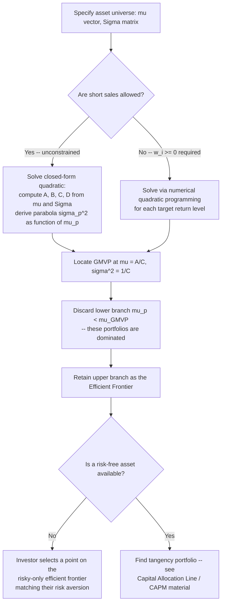

## The Efficient Frontier

### Definition and Motivation

The efficient frontier is the set of portfolios that deliver the **maximum expected return for every given level of risk**, or equivalently, the **minimum risk for every given level of expected return**, drawn from the full universe of feasible portfolios constructible from a set of available assets. It is the central geometric object produced by mean-variance analysis and represents the boundary of "rational" portfolio choices for a mean-variance investor: any portfolio not on this frontier is **dominated** — there exists another feasible portfolio with either higher return at the same risk, lower risk at the same return, or both.

Formally, given $N$ risky assets with expected return vector $\boldsymbol{\mu}$ and covariance matrix $\boldsymbol{\Sigma}$, the efficient frontier is derived from the broader **minimum-variance frontier**, restricted to its upper (non-dominated) segment.

### The Feasible Set

Before constructing the frontier itself, it is useful to characterize the **feasible set** (or "attainable set" / "opportunity set"): the collection of all $(\sigma_p, \mu_p)$ pairs achievable by *some* portfolio weight vector $\mathbf{w}$ satisfying $\mathbf{w}^\top\mathbf{1}=1$ (and possibly $w_i \geq 0$ if short sales are prohibited). With two risky assets and continuously varying weights, the feasible set collapses to a single curve; with three or more assets, the feasible set becomes a **two-dimensional region** in $(\sigma, \mu)$-space, bounded on the left by the minimum-variance frontier.

### Deriving the Minimum-Variance Frontier

**Optimization problem.** For each target expected return $\bar{\mu}$, solve:

$$\min_{\mathbf{w}} \; \sigma_p^2 = \mathbf{w}^\top \boldsymbol{\Sigma} \mathbf{w} \quad \text{s.t.} \quad \mathbf{w}^\top \boldsymbol{\mu} = \bar{\mu}, \quad \mathbf{w}^\top \mathbf{1} = 1$$

**Lagrangian and first-order conditions.** Form:

$$\mathcal{L} = \mathbf{w}^\top \boldsymbol{\Sigma} \mathbf{w} - \lambda\left(\mathbf{w}^\top\boldsymbol{\mu} - \bar{\mu}\right) - \gamma\left(\mathbf{w}^\top\mathbf{1} - 1\right)$$

Differentiating with respect to $\mathbf{w}$ and setting to zero gives $2\boldsymbol{\Sigma}\mathbf{w} = \lambda\boldsymbol{\mu} + \gamma\mathbf{1}$, so:

$$\mathbf{w}^* = \boldsymbol{\Sigma}^{-1}\left(\frac{\lambda}{2}\boldsymbol{\mu} + \frac{\gamma}{2}\mathbf{1}\right)$$

Substituting the two constraints and solving for the Lagrange multipliers $\lambda, \gamma$ in terms of $\bar{\mu}$ produces the optimal weight vector as an **affine function of $\bar{\mu}$**:

$$\mathbf{w}^*(\bar\mu) = \mathbf{g} + \mathbf{h}\,\bar\mu$$

for constant vectors $\mathbf{g}$ and $\mathbf{h}$ that depend only on $\boldsymbol{\mu}$ and $\boldsymbol{\Sigma}$ (not on $\bar\mu$ itself). This affine structure is what underlies the **two-fund separation** property: since $\mathbf{w}^*(\bar\mu)$ is linear in $\bar\mu$, any two distinct frontier portfolios can be combined linearly to reproduce any other frontier portfolio.

**Closed-form frontier equation.** Defining the scalar quantities:

$$A = \boldsymbol{\mu}^\top\boldsymbol{\Sigma}^{-1}\mathbf{1}, \qquad B = \boldsymbol{\mu}^\top\boldsymbol{\Sigma}^{-1}\boldsymbol{\mu}, \qquad C = \mathbf{1}^\top\boldsymbol{\Sigma}^{-1}\mathbf{1}, \qquad D = BC - A^2$$

the minimum-variance frontier satisfies:

$$\sigma_p^2(\bar\mu) = \frac{C\bar\mu^2 - 2A\bar\mu + B}{D}$$

This is a **parabola** when plotted in $(\mu_p, \sigma_p^2)$ (mean-variance) space, and consequently a **hyperbola** when plotted in the more commonly used $(\sigma_p, \mu_p)$ (mean-standard-deviation) space — the shape universally seen in textbook efficient-frontier diagrams.

### The Global Minimum-Variance Portfolio (GMVP)

The **vertex** of the parabola — the single point of minimum variance across all feasible target returns — is the Global Minimum-Variance Portfolio. Setting $\frac{d\sigma_p^2}{d\bar\mu} = 0$ in the frontier equation gives the GMVP's expected return $\mu_{GMVP} = A/C$, with corresponding minimum variance $\sigma^2_{GMVP} = 1/C$, and portfolio weights:

$$\mathbf{w}_{GMVP} = \frac{\boldsymbol{\Sigma}^{-1}\mathbf{1}}{C} = \frac{\boldsymbol{\Sigma}^{-1}\mathbf{1}}{\mathbf{1}^\top\boldsymbol{\Sigma}^{-1}\mathbf{1}}$$

Notably, $\mathbf{w}_{GMVP}$ depends **only on the covariance matrix $\boldsymbol{\Sigma}$**, not on the expected-return vector $\boldsymbol{\mu}$ at all — a useful practical property, since $\boldsymbol{\mu}$ is typically far harder to estimate reliably than $\boldsymbol{\Sigma}$, making the GMVP a comparatively robust portfolio choice in practice.

### Upper vs. Lower Branch: Defining "Efficient"

The full minimum-variance frontier (the entire hyperbola) includes portfolios both **above and below** the GMVP in $(\sigma_p,\mu_p)$-space. Only the **upper branch** — portfolios with $\bar\mu \geq \mu_{GMVP}$ — is termed the **efficient frontier**, because for any portfolio on the lower branch, there exists a corresponding portfolio on the upper branch with the *same* variance but *strictly higher* expected return (they are symmetric around the GMVP in $\sigma_p^2$, but not in $\mu_p$). A rational, non-satiated investor (who prefers more expected return to less, holding risk fixed) would never voluntarily select a lower-branch portfolio, so the lower branch is discarded from the "efficient" set even though it remains part of the mathematically feasible set.

### Effect of the Number of Assets and Correlation Structure

**Diversification and the shape of the frontier.** As the number of available assets $N$ increases (holding average pairwise correlation constant and below 1), the attainable feasible set widens and the efficient frontier shifts **left and up** — offering lower risk for a given return, or higher return for a given risk — because a larger asset universe provides more opportunities to exploit imperfect correlations. The theoretical limit of adding infinitely many uncorrelated assets, in the simplest illustrative case, drives the diversifiable (idiosyncratic) component of portfolio variance toward zero, leaving only systematic (undiversifiable) risk — a preview of the systematic/idiosyncratic risk decomposition central to the CAPM and factor models.

**Effect of correlation.** Lower average correlation among constituent assets bows the frontier further to the left (more curvature, greater diversification benefit) for a fixed set of individual asset means and variances; if all pairwise correlations were exactly $+1$, the "frontier" would degenerate into a straight line (no diversification benefit at all), since portfolio risk would simply be the weighted average of individual risks with no offsetting effect.

### Constrained Frontiers (No Short-Selling)

The closed-form hyperbola above assumes unrestricted short sales ($w_i$ can be negative). When short-selling is prohibited ($w_i \geq 0 \;\forall i$), the problem becomes a **quadratic program with inequality constraints**, generally requiring numerical solution methods (e.g., quadratic programming solvers) rather than a closed-form expression. The no-short-sale-constrained efficient frontier lies **on or inside** (i.e., weakly to the right and/or below, offering no better risk-return combinations than) the unconstrained frontier, since the constraint set is a strict subset of the unconstrained feasible set — imposing any additional constraint can never improve, and generically worsens, the achievable risk-return trade-off relative to the unconstrained case.

### Worked Numerical Example: Three-Asset Frontier

Consider three assets with the following inputs:

| Asset | $\mu_i$ | $\sigma_i$ |
| --- | --- | --- |
| 1 | 6% | 10% |
| 2 | 10% | 18% |
| 3 | 14% | 28% |

with a correlation matrix $\rho_{12}=0.2$, $\rho_{13}=0.1$, $\rho_{23}=0.6$. While the full closed-form solution for $\mathbf{w}_{GMVP}$ and the frontier parabola requires inverting the $3\times3$ covariance matrix $\boldsymbol{\Sigma}$ (constructed via $\sigma_{ij} = \rho_{ij}\sigma_i\sigma_j$), the qualitative result illustrates the general principle: because Asset 3 has the highest return but also the highest correlation with Asset 2 (0.6) and the lowest correlation with Asset 1 (0.1), the GMVP will tend to overweight Assets 1 and 2 relative to naive equal weighting, and the resulting three-asset efficient frontier will lie strictly to the left of the two-asset frontier constructible from any *pair* of these three assets alone — a direct numerical illustration of how adding assets (here, moving from two to three) expands and improves the efficient set. **[Inference]** The specific numerical GMVP weights would need to be computed via explicit matrix inversion; the qualitative leftward shift from expanding the asset universe under imperfect correlation is a general mathematical property of the mean-variance framework, not merely a property of this particular numerical example.

### Visualizing the Efficient Frontier

<svg xmlns="http://www.w3.org/2000/svg" viewBox="0 0 900 500" font-family="Helvetica, Arial, sans-serif">
<text x="450" y="28" text-anchor="middle" font-size="18" font-weight="bold" fill="#1a1a1a">The Efficient Frontier: Feasible Set and Branches (svg_diagram)</text>
<line x1="90" y1="440" x2="90" y2="70" stroke="#333" stroke-width="1.5" />
<line x1="90" y1="440" x2="620" y2="440" stroke="#333" stroke-width="1.5" />
<text x="355" y="470" text-anchor="middle" font-size="13" fill="#333">Standard Deviation, σ_p</text>
<text x="45" y="255" text-anchor="middle" font-size="13" fill="#333" transform="rotate(-90 45 255)">Expected Return, μ_p</text>

<path d="M 180 420 Q 140 300 175 200 Q 210 130 290 95 Q 380 75 480 90 Q 420 150 380 220 Q 330 300 260 380 Q 220 410 180 420 Z" fill="#eff6ff" stroke="none" />

<path d="M 175 200 Q 210 130 290 95 Q 380 75 480 90" fill="none" stroke="#2563eb" stroke-width="3" />
<text x="470" y="80" font-size="11" fill="#2563eb" font-weight="bold">Efficient frontier (upper branch)</text>

<path d="M 175 200 Q 210 280 260 340 Q 300 380 340 405" fill="none" stroke="#dc2626" stroke-width="2.5" stroke-dasharray="6,3" />
<text x="280" y="420" font-size="11" fill="#dc2626" font-weight="bold">Inefficient branch (dominated)</text>

<circle cx="175" cy="200" r="5" fill="#059669" />
<text x="120" y="195" font-size="11" fill="#059669" font-weight="bold">GMVP</text>

<circle cx="300" cy="240" r="4" fill="#6b7280" />
<text x="310" y="245" font-size="10" fill="#6b7280">Feasible but dominated</text>
<text x="310" y="258" font-size="10" fill="#6b7280">(interior of feasible set)</text>

<line x1="300" y1="235" x2="330" y2="180" stroke="#f59e0b" stroke-width="1.5" marker-end="url(#arrow)" />
<text x="335" y="175" font-size="10" fill="#f59e0b">dominated by frontier</text>
<text x="335" y="188" font-size="10" fill="#f59e0b">portfolio at same σ</text>

<text x="355" y="60" text-anchor="middle" font-size="11" fill="`#2563eb`">shaded region = feasible set (N ≥ 3 assets)</text>

</svg>

### Decision Flow: Constructing and Using the Efficient Frontier

### Applications in Financial Economics

- **Strategic asset allocation.** Institutional investors and financial advisors use efficient-frontier construction (often with additional real-world constraints) as a starting point for setting target asset-class weights in a portfolio.
- **Benchmark for active management evaluation.** A fund's realized risk-return position relative to the theoretical efficient frontier constructed from its available investment universe provides one basis (among several) for assessing whether active management has added value beyond what passive diversification alone would achieve.
- **Input to the CAPM.** The efficient frontier, combined with a risk-free asset and market-clearing/equilibrium assumptions (homogeneous expectations across all investors), leads directly to the identification of the tangency portfolio as the value-weighted market portfolio — the foundational derivation of the CAPM.
- **Robo-advisory and algorithmic portfolio construction.** Modern automated investment platforms frequently implement constrained mean-variance optimization (often blended with Black-Litterman-style return estimates or risk-parity adjustments) as the computational engine for generating client-specific efficient portfolios.

### Common Pitfalls and Clarifications

- Referring to the "efficient frontier" when actually describing the full minimum-variance frontier (both branches): strictly, only the upper (non-dominated) branch is "efficient" — the term should not be applied loosely to the entire hyperbola/parabola.
- Assuming the GMVP is a "safe" or low-risk-free portfolio in absolute terms: the GMVP is only the **minimum-variance point among risky-asset combinations**; it still carries the full risk characteristic of the risky-asset universe (it is not risk-free) and can have substantial variance depending on the underlying assets.
- Believing that the efficient frontier depends equally sensitively on $\boldsymbol{\mu}$ and $\boldsymbol{\Sigma}$: in practice, the frontier's location and shape are typically far more sensitive to (harder-to-estimate) expected-return inputs than to the covariance matrix, and the GMVP specifically depends only on $\boldsymbol{\Sigma}$, not $\boldsymbol{\mu}$ at all — a distinction with direct practical implications for portfolio construction robustness.
- Treating the closed-form (unconstrained short-sale) frontier formula as applicable when real-world portfolios are subject to no-short-selling or other constraints: the actual constrained frontier must generally be computed numerically and will lie inside (worse than) the unconstrained analytical frontier.

**Next Steps**

- Mean-variance analysis (parent framework: utility justification, Capital Allocation Line, optimal risky-safe split)
- The Capital Asset Pricing Model (CAPM) and the tangency portfolio as the market portfolio
- Two-fund separation and its role in simplifying portfolio construction
- The Black-Litterman model for improving expected-return inputs
- Constrained portfolio optimization (no-short-sale, position limits, transaction costs) via quadratic programming
- Robustness of the Global Minimum-Variance Portfolio versus mean-return-sensitive frontier portfolios
- Factor models (Fama-French, APT) as alternatives/extensions to the pure mean-variance framework