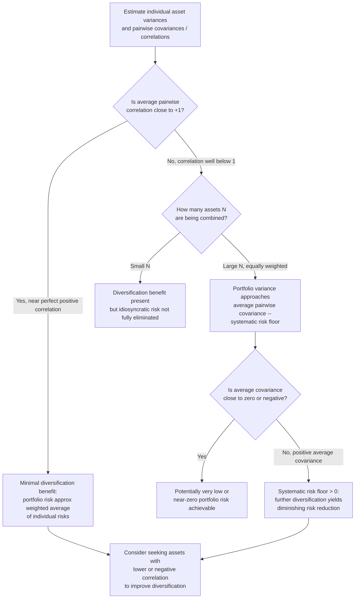

## Diversification and the Covariance Structure of Returns

### Definition and Motivation

Diversification is the risk-reduction principle that combining multiple imperfectly correlated assets into a portfolio can lower total portfolio risk below what any weighted average of the individual assets' risks would suggest — without necessarily sacrificing expected return. The mechanism underlying diversification is entirely a function of the **covariance structure** of asset returns: how returns on different assets move together (or fail to move together). Understanding diversification therefore requires understanding how portfolio variance decomposes into contributions from individual asset variances and pairwise covariances, and how this decomposition behaves as the number of assets in a portfolio grows.

### Portfolio Variance Decomposition

For a portfolio of $N$ assets with weights $w_i$, the portfolio variance is:

$$\sigma_p^2 = \sum_{i=1}^{N} w_i^2 \sigma_i^2 + \sum_{i=1}^{N}\sum_{\substack{j=1 \\ j \neq i}}^{N} w_i w_j \sigma_{ij}$$

This separates into two conceptually distinct components:

1. **Variance terms** ($\sum_i w_i^2 \sigma_i^2$): the contribution of each asset's own variance, weighted by the square of its portfolio weight.
2. **Covariance terms** ($\sum_{i\neq j} w_iw_j\sigma_{ij}$): the contribution of all pairwise co-movements between assets, weighted by the product of their weights.

As $N$ grows, the number of variance terms grows linearly ($N$ terms), while the number of covariance terms grows quadratically ($N(N-1)$ terms, or $N(N-1)/2$ distinct pairs counted once). This asymmetry is the mathematical root of the **diversification effect**: in a sufficiently large, equally weighted portfolio, the *average covariance* between assets — not the *average variance* of individual assets — comes to dominate total portfolio risk.

### The Equal-Weighted Portfolio Limit

Consider $N$ assets, each given weight $w_i = 1/N$, with average variance $\bar{\sigma}^2 = \frac{1}{N}\sum_i \sigma_i^2$ and average covariance $\bar{\sigma}_{cov} = \frac{1}{N(N-1)}\sum_{i\neq j}\sigma_{ij}$ (the mean of all off-diagonal covariance entries). Substituting into the portfolio variance formula:

$$\sigma_p^2 = \frac{1}{N}\bar{\sigma}^2 + \frac{N-1}{N}\bar{\sigma}_{cov}$$

**As $N \to \infty$:**

$$\lim_{N\to\infty} \sigma_p^2 = \bar{\sigma}_{cov}$$

The first term ($\frac{1}{N}\bar{\sigma}^2$) vanishes as $N$ grows, while the second term converges to the average covariance itself, since $\frac{N-1}{N} \to 1$. This is the single most important quantitative result in diversification theory: **as the number of holdings grows large, portfolio variance converges to the average pairwise covariance among the assets, regardless of how large or small individual asset variances are.** Individual-asset (idiosyncratic) variance is "diversified away"; only the shared co-movement (systematic component) remains.

**Special case: uncorrelated assets.** If all pairwise covariances are exactly zero ($\bar\sigma_{cov}=0$, e.g., idealized independent assets with identical variance $\sigma^2$), then $\sigma_p^2 = \sigma^2/N \to 0$ as $N\to\infty$ — total portfolio risk can, in this idealized limiting case, be driven arbitrarily close to zero purely through diversification, with no need for any negative correlation at all.

**General case: positive average covariance.** In practice, most asset classes (particularly within the same broad category, e.g., domestic equities) exhibit positive average covariance/correlation, so $\bar\sigma_{cov} > 0$, and portfolio variance approaches a strictly positive floor $\bar\sigma_{cov}$ no matter how many assets are added — this floor is the **systematic (undiversifiable) risk** of the asset class, in contrast to the **idiosyncratic (diversifiable) risk** that shrinks toward zero as $N$ grows.

### Systematic vs. Idiosyncratic Risk

This decomposition anticipates the risk-splitting framework central to the CAPM and factor models:

$$\text{Total risk} = \underbrace{\text{Systematic risk}}_{\text{cannot be diversified away}} + \underbrace{\text{Idiosyncratic risk}}_{\text{diversified away as } N \to \infty}$$

- **Idiosyncratic (unsystematic, firm-specific, diversifiable) risk** arises from factors specific to an individual asset (e.g., a company's product recall, a management change, an idiosyncratic earnings surprise) that are uncorrelated across assets and therefore average out in a large, well-diversified portfolio.
- **Systematic (market, non-diversifiable) risk** arises from factors that affect many or all assets simultaneously (e.g., macroeconomic shocks, interest-rate changes, broad market sentiment shifts) and is reflected precisely in the non-zero average covariance $\bar\sigma_{cov}$ that survives the diversification limit.

This is the theoretical basis for the CAPM's central claim that only systematic risk (measured by beta) should be priced in equilibrium, since idiosyncratic risk can be costlessly eliminated through diversification and therefore should not command a risk premium in a well-functioning market.

### The Role of Correlation

Since $\sigma_{ij} = \rho_{ij}\sigma_i\sigma_j$, the covariance structure can equivalently be analyzed through the **correlation matrix**. For a two-asset portfolio, the diversification benefit as a function of correlation is:

$$\sigma_p^2 = w_1^2\sigma_1^2 + w_2^2\sigma_2^2 + 2w_1w_2\rho_{12}\sigma_1\sigma_2$$

- **$\rho_{12} = +1$ (perfect positive correlation):** $\sigma_p^2 = (w_1\sigma_1 + w_2\sigma_2)^2$, so $\sigma_p = w_1\sigma_1 + w_2\sigma_2$ — portfolio standard deviation is simply the weighted average of individual standard deviations; **no diversification benefit exists**.
- **$-1 < \rho_{12} < +1$:** portfolio standard deviation is strictly less than the weighted average of individual standard deviations — diversification reduces risk, with the benefit increasing as $\rho_{12}$ decreases.
- **$\rho_{12} = -1$ (perfect negative correlation):** $\sigma_p^2 = (w_1\sigma_1 - w_2\sigma_2)^2$; a specific weight combination ($w_1 = \frac{\sigma_2}{\sigma_1+\sigma_2}$) drives $\sigma_p$ to exactly zero — a perfect hedge, eliminating portfolio risk entirely (though this is a theoretical limiting case rarely observed exactly in real asset pairs).

**[Unverified]** Whether observed correlations between specific real-world asset pairs remain stable over time is an empirical question with substantial evidence that correlations are **not** constant — they are well-documented in the literature to rise during periods of market stress (a phenomenon sometimes called "correlation breakdown" or "diversification failing when it's needed most"), which is a significant practical limitation of static, historically estimated covariance matrices used in portfolio construction.

### Naive vs. Optimal Diversification

**Naive (1/N) diversification** simply allocates equal weights across all available assets, ignoring any information about individual variances, covariances, or expected returns beyond simply "spread it around." While simple and robust to estimation error (since it requires no estimation of $\boldsymbol{\mu}$ or $\boldsymbol{\Sigma}$ at all), naive diversification does not generally coincide with the mean-variance-optimal portfolio for a given risk-aversion level.

**Optimal (mean-variance) diversification** explicitly uses the estimated covariance matrix $\boldsymbol{\Sigma}$ (and typically $\boldsymbol{\mu}$) to select weights that minimize variance for a given return target, as in the efficient-frontier construction. This exploits the full covariance structure, not just the fact of imperfect correlation, potentially achieving superior risk-adjusted outcomes — but at the cost of higher sensitivity to estimation error in the inputs, particularly $\boldsymbol{\mu}$.

**[Inference]** The relative practical performance of naive versus optimal diversification depends heavily on estimation quality, the number of assets, and the length of the available data history; the well-documented instability of mean-variance-optimal weights under estimation error is precisely why naive (1/N) diversification remains a commonly used and researched benchmark despite its theoretical suboptimality under known parameters.

### Worked Numerical Example: Diversification Limit

Suppose all $N$ assets in an equity portfolio have identical individual variance $\sigma_i^2 = 0.09$ (i.e., $\sigma_i = 30\%$) and average pairwise correlation $\bar\rho = 0.25$, so $\bar\sigma_{cov} = \bar\rho \cdot \sigma^2 = 0.25 \times 0.09 = 0.0225$.

Using $\sigma_p^2 = \frac{1}{N}(0.09) + \frac{N-1}{N}(0.0225)$:

| $N$ | $\sigma_p^2$ | $\sigma_p$ |
| --- | --- | --- |
| 1 | 0.0900 | 30.0% |
| 5 | 0.0360 | 19.0% |
| 20 | 0.0259 | 16.1% |
| 50 | 0.0238 | 15.4% |
| $\to \infty$ | 0.0225 | **15.0%** |

The bulk of the diversification benefit is captured with a relatively modest number of holdings (risk falls from 30% to about 16% by $N=20$), while further additions beyond that point yield rapidly diminishing returns, asymptotically approaching the systematic-risk floor of 15.0% ($\sqrt{0.0225}$) — illustrating the general empirical/theoretical pattern that most of the diversification benefit from adding assets is realized well before reaching very large portfolio sizes.

### Visualizing the Diversification Effect

<svg xmlns="http://www.w3.org/2000/svg" viewBox="0 0 900 480" font-family="Helvetica, Arial, sans-serif">
<text x="450" y="28" text-anchor="middle" font-size="18" font-weight="bold" fill="#1a1a1a">Diversification: Risk Reduction as Number of Assets Grows (svg_diagram)</text>
<line x1="90" y1="420" x2="90" y2="70" stroke="#333" stroke-width="1.5" />
<line x1="90" y1="420" x2="620" y2="420" stroke="#333" stroke-width="1.5" />
<text x="355" y="450" text-anchor="middle" font-size="13" fill="#333">Number of Assets, N</text>
<text x="45" y="245" text-anchor="middle" font-size="13" fill="#333" transform="rotate(-90 45 245)">Portfolio Standard Deviation, σ_p</text>

<path d="M 110 90 Q 150 220 200 290 Q 260 340 320 360 Q 400 375 500 380 Q 560 382 610 383" fill="none" stroke="#2563eb" stroke-width="2.5" />

<line x1="90" y1="383" x2="610" y2="383" stroke="#dc2626" stroke-width="2" stroke-dasharray="6,3" />
<text x="450" y="400" font-size="11" fill="#dc2626" font-weight="bold">Systematic risk floor = sqrt(average covariance)</text>

<path d="M 110 90 Q 150 220 200 290 Q 260 340 320 360 Q 400 375 500 380 Q 560 382 610 383 L 610 383 L 110 383 Z" fill="#dbeafe" opacity="0.5" />
<text x="200" y="200" font-size="12" fill="#1e3a8a" font-weight="bold">Idiosyncratic risk</text>
<text x="200" y="216" font-size="12" fill="#1e3a8a" font-weight="bold">(diversified away)</text>

<text x="450" y="330" font-size="12" fill="`#7f1d1d`" font-weight="bold">Systematic risk</text>

<text x="450" y="346" font-size="12" fill="`#7f1d1d`" font-weight="bold">(remains, undiversifiable)</text>

<circle cx="110" cy="90" r="4" fill="#059669" />
<text x="105" y="80" font-size="10" fill="#059669">N=1: σ=30%</text>
<circle cx="200" cy="290" r="4" fill="#059669" />
<text x="185" y="280" font-size="10" fill="#059669">N=5: σ=19%</text>
<circle cx="320" cy="360" r="4" fill="#059669" />
<text x="300" y="365" font-size="10" fill="#059669">N=20: σ=16.1%</text>
</svg>

### Decision Flow: Assessing Diversification Benefit for a Portfolio

### Applications in Financial Economics

- **Foundational justification for the CAPM.** The convergence of portfolio variance to average covariance as $N\to\infty$ directly motivates the CAPM's assertion that only an asset's covariance with the market (its systematic risk, captured by beta) should be compensated with a risk premium, since idiosyncratic risk is costlessly diversifiable and rational investors would hold well-diversified portfolios.
- **International diversification.** Combining assets across countries or regions with historically lower cross-country correlation than within-country correlation has been a classical argument for international portfolio diversification, though the empirical stability of these correlations — especially during global market stress — is a documented and actively studied limitation.
- **Alternative asset allocation.** The inclusion of asset classes with historically low or negative correlation to traditional equities and bonds (e.g., certain commodities, some hedge fund strategies) in institutional portfolios is directly motivated by the covariance-structure logic developed here.
- **Risk parity and covariance-based portfolio construction.** Risk parity strategies allocate capital based explicitly on each asset's (or asset class's) contribution to total portfolio covariance/variance, rather than on capital or market-value weights, directly operationalizing the covariance-decomposition principles above.

### Common Pitfalls and Clarifications

- Believing that diversification requires **negative** correlation to provide benefit: any correlation strictly less than $+1$ provides *some* diversification benefit; negative correlation simply provides a *larger* benefit (up to the theoretical limit of full risk elimination at $\rho=-1$ for two assets).
- Assuming that adding more assets always meaningfully reduces risk: as shown numerically above, the marginal risk-reduction benefit of adding assets diminishes rapidly, and portfolio risk asymptotes to the average-covariance floor — beyond a moderate number of holdings, additional diversification benefit becomes small.
- Treating historically estimated correlations as fixed, reliable inputs for risk management: the well-documented tendency of correlations to rise during systemic market stress ("correlations go to one in a crisis," a frequently cited but informally stated empirical pattern) means diversification benefits estimated from calm-period historical data can overstate the protection actually available during the periods when risk reduction is most needed.
- Conflating "low variance" individual assets with "good diversifiers": an asset's contribution to portfolio risk reduction depends on its *covariance with the rest of the portfolio*, not on its standalone variance — a high-variance asset with low or negative correlation to the rest of the portfolio can be a more effective diversifier than a low-variance asset that is highly correlated with existing holdings.

**Next Steps**

- Mean-variance analysis and the efficient frontier (how the covariance structure feeds into portfolio optimization)
- The Capital Asset Pricing Model (CAPM) and the pricing of systematic risk (beta)
- Multi-factor models (Fama-French, Arbitrage Pricing Theory) as extensions of the systematic/idiosyncratic decomposition
- Time-varying correlation models (e.g., DCC-GARCH) and correlation breakdown during market stress
- Risk parity and alternative covariance-based portfolio construction methods
- International diversification and cross-country correlation dynamics
- Shrinkage estimation of covariance matrices to address estimation error in large-N portfolios