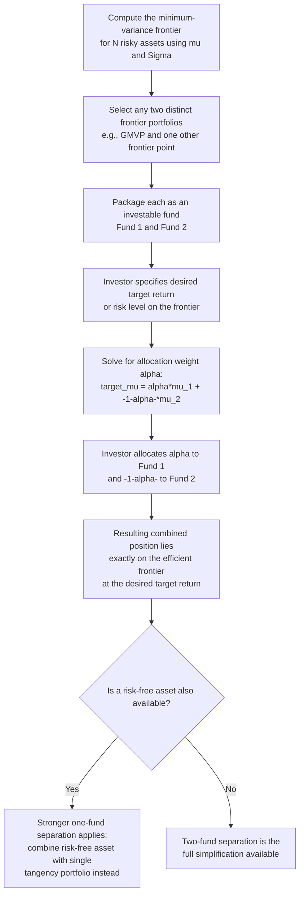

## Two-Fund Separation Theorem

### Definition and Statement

The two-fund separation theorem is a mathematical property of the mean-variance efficient frontier stating that **any portfolio on the minimum-variance frontier can be constructed as a linear combination (portfolio) of any two other distinct portfolios that are themselves on the minimum-variance frontier.** Equivalently: the entire minimum-variance frontier, despite potentially involving $N$ individual risky assets, can be **spanned by just two "mutual funds"** (reference portfolios) — investors need not hold all $N$ underlying assets directly, only appropriate combinations of these two funds, to achieve any frontier-efficient outcome.

This result is purely a consequence of the linear-algebraic structure of the mean-variance optimization problem and requires no assumptions about investor preferences beyond the mean-variance framework itself — it is a property of the **frontier's geometry**, not of any specific investor's risk aversion.

### Mathematical Derivation

Recall from the efficient-frontier optimization (minimizing $\mathbf{w}^\top\boldsymbol{\Sigma}\mathbf{w}$ subject to $\mathbf{w}^\top\boldsymbol{\mu}=\bar\mu$ and $\mathbf{w}^\top\mathbf{1}=1$) that the optimal weight vector as a function of the target return $\bar\mu$ takes the affine form:

$$\mathbf{w}^*(\bar\mu) = \mathbf{g} + \mathbf{h}\,\bar\mu$$

where $\mathbf{g}$ and $\mathbf{h}$ are fixed $N$-dimensional vectors depending only on $\boldsymbol{\mu}$ and $\boldsymbol{\Sigma}$ (derived explicitly via the scalar constants $A = \boldsymbol{\mu}^\top\boldsymbol{\Sigma}^{-1}\mathbf{1}$, $B=\boldsymbol{\mu}^\top\boldsymbol{\Sigma}^{-1}\boldsymbol{\mu}$, $C=\mathbf{1}^\top\boldsymbol{\Sigma}^{-1}\mathbf{1}$, $D=BC-A^2$):

$$\mathbf{g} = \frac{B\boldsymbol{\Sigma}^{-1}\mathbf{1} - A\boldsymbol{\Sigma}^{-1}\boldsymbol{\mu}}{D}, \qquad \mathbf{h} = \frac{C\boldsymbol{\Sigma}^{-1}\boldsymbol{\mu} - A\boldsymbol{\Sigma}^{-1}\mathbf{1}}{D}$$

**Spanning proof.** Take any two distinct target returns $\bar\mu_1 \neq \bar\mu_2$, generating two frontier portfolios $\mathbf{w}_1 = \mathbf{g} + \mathbf{h}\bar\mu_1$ and $\mathbf{w}_2 = \mathbf{g} + \mathbf{h}\bar\mu_2$. For any third target return $\bar\mu_3$, there exists a scalar $\alpha$ such that $\bar\mu_3 = \alpha\bar\mu_1 + (1-\alpha)\bar\mu_2$ (simply solve $\alpha = \frac{\bar\mu_3 - \bar\mu_2}{\bar\mu_1 - \bar\mu_2}$). Then:

$$\alpha\mathbf{w}_1 + (1-\alpha)\mathbf{w}_2 = \alpha(\mathbf{g}+\mathbf{h}\bar\mu_1) + (1-\alpha)(\mathbf{g}+\mathbf{h}\bar\mu_2) = \mathbf{g} + \mathbf{h}\left[\alpha\bar\mu_1+(1-\alpha)\bar\mu_2\right] = \mathbf{g}+\mathbf{h}\bar\mu_3 = \mathbf{w}_3$$

This confirms that the portfolio $\mathbf{w}_3$ (targeting return $\bar\mu_3$) is exactly recovered by combining $\mathbf{w}_1$ and $\mathbf{w}_2$ with weights $\alpha$ and $1-\alpha$ respectively — **no direct trading in the underlying $N$ assets is needed** once $\mathbf{w}_1$ and $\mathbf{w}_2$ (or funds replicating them) are available.

### Interpretation and Implications

**Fund construction simplification.** Since the entire frontier is spanned by any two frontier portfolios, an asset manager or index provider need only construct and offer **two distinct mean-variance-efficient mutual funds** — for instance, the Global Minimum-Variance Portfolio (GMVP) and any other frontier portfolio with a higher target return — and every mean-variance investor, regardless of their individual risk tolerance, can achieve their personally optimal frontier position by allocating capital between just these two funds, without needing direct access to (or knowledge of) the full underlying $N$-asset universe.

**Reduction of dimensionality.** Two-fund separation reduces what is in principle an $N$-dimensional portfolio-choice problem (choosing weights across $N$ assets) to a much simpler **one-dimensional problem**: choosing the single allocation parameter $\alpha$ that determines the mix between the two reference funds. This is a substantial practical and computational simplification.

**Distinction from "one-fund separation."** Two-fund separation applies to the **risky-asset-only** efficient frontier (no risk-free asset). When a risk-free asset is introduced, a stronger and distinct result — **one-fund separation** (sometimes called the "mutual fund theorem" in its strongest CAPM-adjacent form) — applies: all investors optimally hold the risk-free asset combined with a *single* risky portfolio (the tangency portfolio $T$), differing only in the proportion allocated to $T$ versus the risk-free asset. One-fund separation is a *further* simplification beyond two-fund separation, made possible specifically by the presence of a risk-free asset, and underlies the CAPM's identification of a single "market portfolio" that all investors hold in the risky-asset component of their portfolios.

### Choice of the Two Reference Funds

Because *any* two distinct frontier portfolios suffice to span the entire frontier, there is substantial freedom in which two funds are used as the reference pair. Common and analytically convenient choices include:

- **GMVP and any other frontier portfolio.** Since $\mathbf{w}_{GMVP}$ depends only on $\boldsymbol{\Sigma}$ (not $\boldsymbol{\mu}$), using it as one of the two reference funds provides a comparatively robust "anchor" fund, isolating estimation-sensitivity concerns to the second, return-dependent fund.
- **Two portfolios corresponding to $\mathbf{g}$ and $\mathbf{g}+\mathbf{h}$ directly** (i.e., portfolios at $\bar\mu=0$ and $\bar\mu=1$ in the parameterization above) — a mathematically convenient but not necessarily practically meaningful pair, since a target return of exactly zero or one may not correspond to any economically natural benchmark.
- **Any two frontier portfolios an asset manager already offers**, such as a "conservative" fund near the GMVP and an "aggressive" fund further up the frontier — practically, fund families sometimes offer a spectrum of risk-graded funds, any two non-degenerate members of which technically span the full frontier under the two-fund theorem, though offering more than two in practice caters to investor convenience/preference for pre-packaged risk levels rather than being mathematically required.

### Worked Numerical Example

Suppose two frontier portfolios have been identified: Portfolio 1 ($\bar\mu_1 = 8\%$) with weights $\mathbf{w}_1 = (0.5, 0.3, 0.2)$ across three assets, and Portfolio 2 ($\bar\mu_2 = 14\%$) with weights $\mathbf{w}_2 = (0.1, 0.4, 0.5)$. An investor wants to construct the frontier portfolio targeting $\bar\mu_3 = 11\%$.

Solve for $\alpha$: $11\% = \alpha(8\%) + (1-\alpha)(14\%) \Rightarrow 11 = 8\alpha + 14 - 14\alpha \Rightarrow 11-14 = -6\alpha \Rightarrow \alpha = 0.5$.

The target frontier portfolio is then:

$$\mathbf{w}_3 = 0.5(0.5, 0.3, 0.2) + 0.5(0.1, 0.4, 0.5) = (0.25+0.05,\; 0.15+0.20,\; 0.10+0.25) = (0.30, 0.35, 0.35)$$

An investor wanting the 11%-target frontier portfolio can achieve it by simply putting **50% of their capital in Fund 1 and 50% in Fund 2** — without ever needing to compute, or even know, the underlying three-asset weight vector $(0.30, 0.35, 0.35)$ directly. This is the practical power of the theorem: fund-level allocation decisions substitute for asset-level portfolio construction.

### Visualizing Two-Fund Separation

<svg xmlns="http://www.w3.org/2000/svg" viewBox="0 0 900 480" font-family="Helvetica, Arial, sans-serif">
<text x="450" y="28" text-anchor="middle" font-size="18" font-weight="bold" fill="#1a1a1a">Two-Fund Separation on the Efficient Frontier (svg_diagram)</text>
<line x1="90" y1="420" x2="90" y2="70" stroke="#333" stroke-width="1.5" />
<line x1="90" y1="420" x2="600" y2="420" stroke="#333" stroke-width="1.5" />
<text x="345" y="450" text-anchor="middle" font-size="13" fill="#333">Standard Deviation, σ_p</text>
<text x="45" y="245" text-anchor="middle" font-size="13" fill="#333" transform="rotate(-90 45 245)">Expected Return, μ_p</text>

<path d="M 170 380 Q 200 260 260 190 Q 320 130 420 100 Q 480 88 540 90" fill="none" stroke="#2563eb" stroke-width="3" />

<circle cx="230" cy="260" r="6" fill="#059669" />
<text x="160" y="255" font-size="11" fill="#059669" font-weight="bold">Fund 1 (μ₁ = 8%)</text>

<circle cx="440" cy="97" r="6" fill="#dc2626" />
<text x="450" y="92" font-size="11" fill="#dc2626" font-weight="bold">Fund 2 (μ₂ = 14%)</text>

<circle cx="320" cy="150" r="5.5" fill="#f59e0b" />
<text x="330" y="145" font-size="11" fill="#f59e0b" font-weight="bold">50/50 mix -&gt; μ₃ = 11%</text>
<text x="330" y="160" font-size="10" fill="#f59e0b">exactly on the frontier</text>

<line x1="230" y1="260" x2="440" y2="97" stroke="#9ca3af" stroke-width="1" stroke-dasharray="3,3" />

<text x="345" y="400" text-anchor="middle" font-size="11" fill="#333">Any allocation between Fund 1 and Fund 2 lands exactly on the efficient frontier</text>

</svg>

### Decision Flow: Applying Two-Fund Separation in Practice

### Applications in Financial Economics

- **Mutual fund and target-date fund design.** Two-fund separation provides the theoretical justification for offering investors a small number of pre-constructed, risk-graded funds (rather than requiring direct access to every underlying security) as a means of achieving any point on the efficient frontier through simple fund-level allocation.
- **Simplifying investor decision-making.** By reducing an $N$-dimensional asset-allocation problem to a one-dimensional fund-mix decision, the theorem underlies practical financial-advice frameworks that ask clients for a single risk-tolerance parameter (mapped to $\alpha$) rather than requiring detailed views on each individual asset.
- **Precursor to the CAPM's mutual fund theorem.** Two-fund separation is the risky-asset-only analogue of the stronger one-fund (mutual fund) separation result that emerges once a risk-free asset and market-clearing equilibrium conditions are added, forming a direct conceptual stepping stone to the CAPM.
- **Index fund and target-risk product construction.** Financial product providers can theoretically construct a spectrum of target-risk index funds by taking different linear combinations of just two underlying "building block" frontier portfolios, rather than needing to independently optimize each new risk-level product from scratch.

### Common Pitfalls and Clarifications

- Confusing two-fund separation (risky assets only) with one-fund/mutual-fund separation (which requires a risk-free asset and typically additional CAPM-style equilibrium assumptions): the two results are related but distinct, and the stronger one-fund result does not hold merely from the mean-variance framework on risky assets alone.
- Assuming the two reference funds must be any *specific* pair (e.g., "the GMVP and the tangency portfolio"): the theorem holds for **any** two *distinct* frontier portfolios, not a uniquely prescribed pair — the choice of which two funds to use is a matter of practical convenience, not mathematical necessity.
- Believing the combination weight $\alpha$ must lie in $[0,1]$: since $\alpha$ solves a linear equation for the target return, it can lie outside $[0,1]$ (implying a "short position" in one of the two funds) if the desired target return lies outside the interval $[\bar\mu_1, \bar\mu_2]$ spanned by the two chosen reference funds — this remains mathematically valid as a means to reach any point on the (extended) frontier, subject to whether short-selling constraints are otherwise permitted in the specific application.
- Treating two-fund separation as a statement about investor *preferences* or *behavior*: it is a purely mathematical/geometric property of the frontier's linear-algebraic structure, holding regardless of how many or which investors actually exist or what their specific utility functions are.

**Next Steps**

- Mean-variance analysis and the derivation of the efficient frontier
- One-fund (mutual fund) separation and its role in deriving the CAPM
- The Capital Asset Pricing Model and the tangency/market portfolio
- Practical fund construction and target-date/target-risk fund design
- The Global Minimum-Variance Portfolio as a robust reference fund choice
- Estimation error and its impact on the practical implementation of frontier-spanning funds