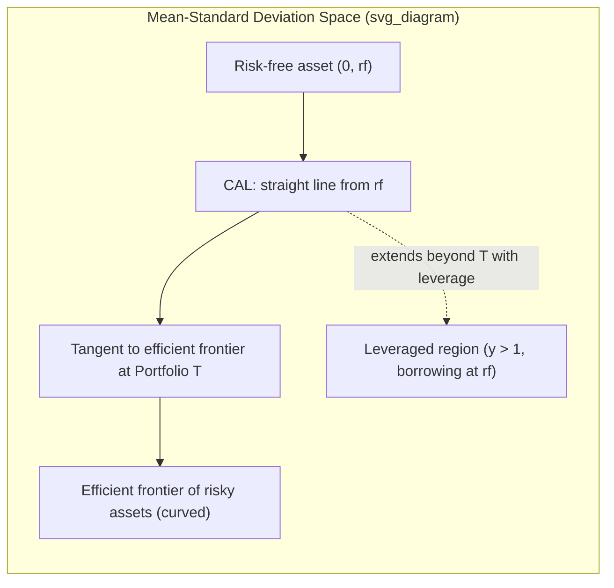

## Capital Allocation Line and Capital Market Line

### Overview

The Capital Allocation Line (CAL) and Capital Market Line (CML) describe the risk-return trade-offs available to an investor who can combine a risk-free asset with risky assets. The CAL is the general case for any individual investor combining the risk-free asset with an arbitrary risky portfolio; the CML is the special case that arises in equilibrium when all investors hold the same optimal risky portfolio — the market portfolio. Both are direct extensions of mean-variance analysis and form the conceptual bridge to the Capital Asset Pricing Model (CAPM).

### Capital Allocation Line (CAL)

**Definition**

The CAL is the set of risk-return combinations achievable by allocating wealth between a risk-free asset (return $r_f$, zero variance) and a single risky portfolio $P$ (expected return $\mu_P$, standard deviation $\sigma_P$).

**Derivation**

Let $y$ be the fraction of wealth invested in risky portfolio $P$, and $(1-y)$ the fraction in the risk-free asset. The complete portfolio $C$ has:

$$\mu_C = y\mu_P + (1-y)r_f = r_f + y(\mu_P - r_f)$$

$$\sigma_C = y\sigma_P \quad (\text{since the risk-free asset has zero variance and zero covariance with } P)$$

Solving the second equation for $y = \sigma_C / \sigma_P$ and substituting into the first:

$$\mu_C = r_f + \frac{\mu_P - r_f}{\sigma_P}\sigma_C$$

This is a straight line in $(\sigma, \mu)$ space with:

- **Intercept**: $r_f$ (the return at zero risk, $y=0$)
- **Slope**: $\dfrac{\mu_P - r_f}{\sigma_P}$ — the **Sharpe Ratio** of portfolio $P$, representing the price of risk (extra expected return per unit of extra standard deviation)

**Leverage ($y > 1$)**

If borrowing at the risk-free rate is permitted, $y > 1$ is feasible (borrowing to invest more than 100% of wealth in $P$), extending the CAL beyond point $P$ with the same slope. If the borrowing rate exceeds the lending rate, the CAL kinks at $P$ and becomes flatter beyond it (reflecting the higher effective $r_f$ for borrowed funds).

### Choosing the Optimal Risky Portfolio

**Maximizing the Sharpe Ratio**

Since every possible CAL has the same intercept $r_f$ but a different slope depending on which risky portfolio $P$ is chosen, a rational mean-variance investor will select the risky portfolio that **maximizes the Sharpe ratio** — this produces the steepest possible CAL, weakly dominating every other feasible CAL at every risk level.

**The Tangency Portfolio**

Graphically, this is the point where a line from $(0, r_f)$ is tangent to the efficient frontier of risky assets. Algebraically, the tangency portfolio weights are:

$$\mathbf{w}_T = \frac{\Sigma^{-1}(\boldsymbol{\mu} - r_f\mathbf{1})}{\mathbf{1}^\top \Sigma^{-1}(\boldsymbol{\mu} - r_f\mathbf{1})}$$

**One-Fund (Two-Fund) Separation Theorem**

Because the tangency portfolio is the unique risky portfolio maximizing the Sharpe ratio, **every mean-variance investor holds risky assets in the same relative proportions** (those of $T$), differing only in how much total wealth is allocated between $T$ and the risk-free asset, depending on individual risk aversion. Portfolio choice thus separates into (1) the risky-asset allocation decision (identical for all investors) and (2) the risk-free/risky split (investor-specific).

### Diagram: CAL, Efficient Frontier, and Tangency Portfolio

### Capital Market Line (CML)

**Equilibrium Special Case**

When markets are in equilibrium and all investors share homogeneous expectations about $\boldsymbol{\mu}$ and $\Sigma$ (a core CAPM assumption), every investor's tangency portfolio is identical, and — because all risky assets must be held by someone — this common tangency portfolio must equal the **market portfolio** $M$ (the value-weighted portfolio of all risky assets in the economy).

**CML Equation**

$$\mu_C = r_f + \frac{\mu_M - r_f}{\sigma_M}\sigma_C$$

The CML is thus the specific CAL that uses the market portfolio $M$ as the risky component, with slope equal to the market's Sharpe ratio, $\dfrac{\mu_M - r_f}{\sigma_M}$ (also called the **market price of risk**).

**Scope of the CML**

The CML applies only to **efficient portfolios** — combinations of the risk-free asset and the market portfolio. Individual inefficient assets or portfolios do not lie on the CML; their expected returns are instead described by the **Security Market Line (SML)** of the CAPM, which prices assets based on systematic risk (beta) rather than total risk (standard deviation).

### CAL vs. CML — Key Distinctions

| Feature | Capital Allocation Line (CAL) | Capital Market Line (CML) |
| --- | --- | --- |
| Risky component | Any risky portfolio $P$ chosen by the investor | Specifically the market portfolio $M$ |
| Applicability | Individual-investor specific | Market equilibrium construct (same for all investors) |
| Assumptions | None beyond mean-variance framework | Requires homogeneous expectations, market clearing |
| Slope | Sharpe ratio of the chosen portfolio $P$ | Sharpe ratio of the market portfolio (market price of risk) |
| Applies to | Any combination of $r_f$ and $P$ | Only efficient portfolios combining $r_f$ and $M$ |

### Worked Example

Risk-free rate $r_f = 3\%$. Market portfolio: $\mu_M = 11\%$, $\sigma_M = 18\%$.

**Market Sharpe ratio (slope of CML):**

$$\text{Slope} = \frac{\mu_M - r_f}{\sigma_M} = \frac{0.11 - 0.03}{0.18} = \frac{0.08}{0.18} \approx 0.444$$

**Investor wanting a portfolio with $\sigma_C = 12\%$** (lending, since $\sigma_C < \sigma_M$):

$$\mu_C = 0.03 + 0.444(0.12) = 0.03 + 0.0533 = 8.33\%$$

Required allocation to the market portfolio: $y = \sigma_C/\sigma_M = 0.12/0.18 = 0.667$, i.e., 66.7% in $M$ and 33.3% in the risk-free asset.

**Investor wanting a portfolio with $\sigma_C = 25\%$** (borrowing, since $\sigma_C > \sigma_M$):

$$y = 0.25/0.18 = 1.389 \implies \mu_C = 0.03 + 0.444(0.25) = 0.03 + 0.111 = 14.11\%$$

This requires $y = 1.389$, meaning the investor borrows an amount equal to 38.9% of their own wealth at $r_f$ to invest 138.9% of wealth in $M$.

### Sharpe Ratio as the Unifying Metric

**Key Points**

- The slope of any CAL is the Sharpe ratio of its risky component, providing a standardized measure of risk-adjusted return, comparable across different portfolios regardless of scale.
- The CML's slope — the market Sharpe ratio — serves as the equilibrium "price of risk" per unit of standard deviation, a reference figure against which individual portfolio or fund performance is often benchmarked.
- A portfolio lying above the CML would represent a risk-adjusted return superior to the market — under CAPM's equilibrium assumptions this should not persist, since capital would flow toward it until prices adjusted; observed persistent outperformance is typically attributed to factors outside the CAPM's single-factor framework (e.g., additional systematic risk factors, market frictions, or genuine skill) — the correct attribution is empirically contested. **[Unverified]**

### Relationship to CAPM

The CML is a stepping stone to the **Capital Asset Pricing Model**: while the CML describes the risk-return trade-off for *efficient* portfolios (priced by total risk, $\sigma$), the CAPM's Security Market Line generalizes this pricing logic to *all* assets and portfolios (efficient or not) by replacing total risk with **systematic risk** ($\beta$), since in equilibrium only non-diversifiable risk commands a return premium.

### Limitations

- Depends on the same restrictive assumptions as mean-variance analysis: frictionless markets, homogeneous expectations, and (for the CML specifically) the existence of a true, all-encompassing market portfolio — practically unobservable, since it should include all risky assets globally (equities, bonds, real estate, human capital, etc.), a point famously raised in **Roll's Critique** of CAPM testability.
- Assumes unlimited risk-free borrowing and lending at the same rate $r_f$; relaxing this (differential borrowing/lending rates) kinks the CAL/CML and motivates alternative models (e.g., Black's zero-beta CAPM).
- As with mean-variance analysis generally, relies on return distributions being adequately summarized by mean and variance alone.

**Related Topics**

- Mean-variance analysis and the efficient frontier
- Capital Asset Pricing Model (CAPM) and the Security Market Line
- Sharpe Ratio and other risk-adjusted performance measures
- Two-Fund Separation Theorem
- Roll's Critique of CAPM
- Black's Zero-Beta CAPM
- Market portfolio construction and proxies (e.g., index-based approximations)
- Leverage and margin borrowing in portfolio construction