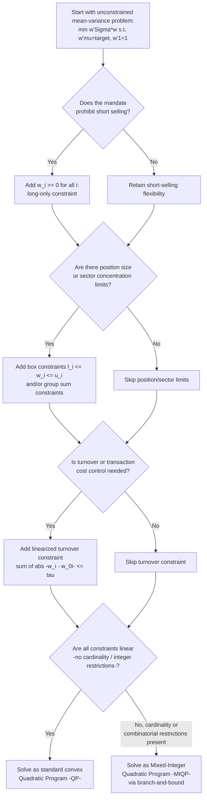

## Portfolio Optimization with Constraints

### Definition and Motivation

Portfolio optimization with constraints extends the classical mean-variance optimization problem by adding restrictions on the feasible set of portfolio weights beyond the basic full-investment (budget) constraint. Real-world portfolio managers rarely operate under the idealized assumptions of unrestricted short-selling, unlimited leverage, and frictionless trading that underlie the closed-form efficient-frontier solution. Constraints reflect regulatory requirements, mandate restrictions, risk-management policies, liquidity considerations, and practical implementation costs — and their inclusion transforms the optimization problem from one solvable in closed form to one generally requiring **numerical quadratic programming (QP)** methods.

### The General Constrained Optimization Problem

The unconstrained mean-variance problem is extended by adding a set of linear (and sometimes nonlinear) constraints:

$$\min_{\mathbf{w}} \; \mathbf{w}^\top\boldsymbol{\Sigma}\mathbf{w} \quad \text{subject to:}$$

$$\mathbf{w}^\top\boldsymbol{\mu} = \bar\mu \quad \text{(target return)}$$

$$\mathbf{w}^\top\mathbf{1} = 1 \quad \text{(full investment / budget constraint)}$$

$$\text{plus additional constraints, e.g.:} \quad \mathbf{A}\mathbf{w} \leq \mathbf{b}, \quad \mathbf{w}_{lb} \leq \mathbf{w} \leq \mathbf{w}_{ub}$$

Unlike the unconstrained case (solvable via Lagrangian first-order conditions yielding a closed-form linear system), the presence of **inequality constraints** generally requires **Karush-Kuhn-Tucker (KKT) conditions** and numerical solvers, since the set of "active" constraints (those binding at the optimum) is not known in advance and must be determined as part of the solution process.

### Common Constraint Types

**No-short-selling (long-only) constraint.** The most common and practically important constraint:

$$w_i \geq 0 \quad \text{for all } i = 1, \dots, N$$

This reflects that many investment mandates (mutual funds, pension funds, many retail-facing products) prohibit or heavily restrict short positions. The long-only constrained frontier lies **on or inside** the unconstrained frontier (weakly worse risk-return trade-off), since the feasible set under the constraint is a strict subset of the unconstrained feasible set.

**Box constraints (position limits).** Upper and/or lower bounds on individual asset weights:

$$l_i \leq w_i \leq u_i \quad \text{for each } i$$

Used to enforce diversification requirements (preventing excessive concentration in any single position), regulatory position limits, or liquidity-driven caps (e.g., a maximum weight reflecting the asset's average daily trading volume relative to fund size).

**Sector/group/factor exposure constraints.** Linear constraints restricting the aggregate weight allocated to a defined subset of assets (e.g., a sector, geographic region, credit rating band, or factor exposure):

$$\sum_{i \in G} w_i \leq c_G \quad \text{or} \quad l_G \leq \sum_{i \in G} w_i \leq u_G$$

for a group $G$ and bound(s) $c_G$ (or $l_G, u_G$). Used to enforce mandate-level diversification rules (e.g., "no more than 25% in any single sector") or to control unintended factor tilts.

**Turnover and transaction-cost constraints.** Restricting the total change in weights relative to the current portfolio $\mathbf{w}_0$:

$$\sum_i |w_i - w_{0,i}| \leq \tau$$

for a turnover budget $\tau$, used to control trading costs and tax implications of rebalancing. This constraint is **non-smooth** (involves absolute values) but can be reformulated as a linear constraint using auxiliary variables, keeping the problem within the QP/LP framework.

**Tracking-error constraints.** For portfolios benchmarked against an index with weights $\mathbf{w}_b$, a constraint limiting the standard deviation of the active return (portfolio return minus benchmark return):

$$(\mathbf{w}-\mathbf{w}_b)^\top\boldsymbol{\Sigma}(\mathbf{w}-\mathbf{w}_b) \leq TE^2$$

for a maximum tracking-error budget $TE$, common in institutional benchmark-relative mandates.

**Leverage / gross exposure constraints.** For long-short strategies, a constraint on total gross exposure:

$$\sum_i |w_i| \leq L$$

for a leverage limit $L$ (e.g., $L=2$ for "130/30"-style strategies allowing up to 130% long and 30% short exposure, summing to 160% gross but netting to 100%). Like the turnover constraint, this involves absolute values but can be linearized with auxiliary variables.

**Cardinality constraints.** Restricting the *number* of non-zero positions (e.g., "hold no more than 30 stocks"):

$$\sum_i \mathbb{1}(w_i \neq 0) \leq K$$

This is a genuinely **combinatorial** (mixed-integer) constraint, not a simple linear or convex one, and generally requires mixed-integer quadratic programming (MIQP) methods, which are computationally more demanding than standard QP.

### Solution Methods

**Quadratic programming (QP).** For problems with only linear equality/inequality constraints (no-short-sale, box, group, and linearized turnover/leverage constraints), the problem remains a **convex quadratic program**: minimizing a convex quadratic objective ($\mathbf{w}^\top\boldsymbol{\Sigma}\mathbf{w}$, convex since $\boldsymbol{\Sigma}$ is positive semi-definite) subject to linear constraints. Convex QPs have a unique global minimum (assuming $\boldsymbol{\Sigma}$ is positive definite) and can be solved reliably and efficiently using standard numerical QP solvers (e.g., interior-point or active-set methods).

**KKT conditions.** At the optimum of a constrained QP, the Karush-Kuhn-Tucker conditions generalize the simple Lagrangian first-order conditions of the unconstrained problem: for each inequality constraint, **either** the constraint is inactive (strictly satisfied, with associated multiplier equal to zero) **or** it is active (binding exactly, with a non-negative multiplier reflecting its "shadow price" — the marginal reduction in variance achievable by relaxing that constraint slightly).

**Mixed-integer programming (for cardinality/combinatorial constraints).** When constraints involve discrete choices (e.g., cardinality limits, minimum-position-size "either zero or at least $X\%$" rules), the problem becomes a mixed-integer quadratic program (MIQP), solved via branch-and-bound or similar combinatorial search methods — considerably more computationally expensive than pure QP, particularly as $N$ grows.

### Impact of Constraints on the Efficient Frontier

Adding any constraint that further restricts the feasible weight set can only **weakly worsen** the achievable risk-return trade-off relative to the unconstrained frontier — formally, the constrained-optimal variance for any given target return $\bar\mu$ is **greater than or equal to** the unconstrained-optimal variance at that same $\bar\mu$, since the constrained feasible set is a subset of the unconstrained feasible set. This produces a constrained efficient frontier that lies **on or to the right** of (i.e., weakly higher risk than) the unconstrained frontier at every return level, though the two can coincide at return levels where the unconstrained-optimal weights already happen to satisfy the additional constraints.

**Practical trade-off.** Despite this formal "worsening" of the theoretical optimum, constraints are frequently imposed deliberately because they can **improve realized (out-of-sample) performance** relative to the unconstrained solution, precisely because the unconstrained optimizer's extreme, often highly concentrated or heavily short-leveraged weights are especially sensitive to estimation error in $\boldsymbol{\mu}$ and $\boldsymbol{\Sigma}$. **[Inference]** Long-only and box constraints are frequently characterized in the portfolio-optimization literature as implicitly performing a form of robustification against estimation error, since they mechanically prevent the extreme weight values that noisy input estimates would otherwise generate — though the degree of practical improvement is empirical and depends on the specific estimation procedure, data history, and asset universe used.

### Worked Numerical Illustration: Long-Only vs. Unconstrained

Consider a three-asset universe where the unconstrained mean-variance-optimal solution for a target return of 10% happens to require $\mathbf{w}^* = (1.4, -0.3, -0.1)$ — a 140% long position in Asset 1 financed by short-selling 30% of Asset 2 and 10% of Asset 3. If the mandate imposes a long-only constraint ($w_i \geq 0$), this solution is infeasible, and the QP solver instead finds the closest feasible point satisfying $w_i \geq 0$ and $\sum w_i = 1$ — for illustration, a solution such as $\mathbf{w}_{constrained} = (0.75, 0.25, 0.00)$ (Asset 3 driven to exactly zero, an inactive/excluded holding at the constrained optimum), which will generally have **higher variance** for the same 10% target return than the unconstrained solution, but avoids the leveraged short positions the mandate prohibits. **[Inference]** The exact constrained solution depends on the specific $\boldsymbol{\mu}$ and $\boldsymbol{\Sigma}$ inputs and would need to be computed via a QP solver; this example illustrates the qualitative pattern (constrained solutions often "corner" at zero for some assets) rather than a specific numerically derived result.

### Visualizing Constrained vs. Unconstrained Frontiers

<svg xmlns="http://www.w3.org/2000/svg" viewBox="0 0 900 480" font-family="Helvetica, Arial, sans-serif">
<text x="450" y="28" text-anchor="middle" font-size="18" font-weight="bold" fill="#1a1a1a">Constrained vs. Unconstrained Efficient Frontiers (svg_diagram)</text>
<line x1="90" y1="440" x2="90" y2="70" stroke="#333" stroke-width="1.5" />
<line x1="90" y1="440" x2="620" y2="440" stroke="#333" stroke-width="1.5" />
<text x="355" y="470" text-anchor="middle" font-size="13" fill="#333">Standard Deviation, σ_p</text>
<text x="45" y="255" text-anchor="middle" font-size="13" fill="#333" transform="rotate(-90 45 255)">Expected Return, μ_p</text>

<path d="M 180 420 Q 150 300 175 210 Q 205 130 280 95 Q 350 75 450 90" fill="none" stroke="#2563eb" stroke-width="3" />
<text x="440" y="82" font-size="10" fill="#2563eb" font-weight="bold">Unconstrained frontier</text>

<path d="M 220 420 Q 210 320 240 240 Q 280 170 340 140 Q 400 118 470 120" fill="none" stroke="#dc2626" stroke-width="2.5" stroke-dasharray="6,3" />
<text x="460" y="112" font-size="10" fill="#dc2626" font-weight="bold">Long-only constrained frontier</text>

<path d="M 260 415 Q 260 340 290 280 Q 330 220 380 195 Q 430 178 480 180" fill="none" stroke="#f59e0b" stroke-width="2.5" stroke-dasharray="3,3" />
<text x="470" y="172" font-size="10" fill="#f59e0b" font-weight="bold">Box + sector constrained frontier</text>

<line x1="240" y1="290" x2="330" y2="290" stroke="#9ca3af" stroke-dasharray="2,2" />
<circle cx="200" cy="290" r="4" fill="#2563eb" />
<circle cx="255" cy="290" r="4" fill="#dc2626" />
<circle cx="310" cy="290" r="4" fill="#f59e0b" />
<text x="150" y="310" font-size="10" fill="#333">Same target return,</text>
<text x="150" y="325" font-size="10" fill="#333">increasing risk with</text>
<text x="150" y="340" font-size="10" fill="#333">more constraints</text>
</svg>

### Decision Flow: Selecting and Applying Portfolio Constraints

### Applications in Financial Economics

- **Regulated fund management.** Mutual funds, pension funds, and insurance-company portfolios are typically subject to statutory or mandate-driven constraints (long-only requirements, concentration limits, credit-quality restrictions) that must be directly incorporated into any portfolio optimization used for their management.
- **Robust portfolio construction.** Practitioners frequently impose box or long-only constraints specifically as a practical robustification technique against the well-documented instability of unconstrained mean-variance solutions to estimation error, even absent a formal regulatory requirement to do so.
- **Index and benchmark-relative management.** Tracking-error-constrained optimization is standard in benchmark-relative (as opposed to absolute-return) institutional asset management, ensuring the constructed portfolio does not deviate excessively from a specified index while still seeking modest outperformance.
- **Smart-beta and factor-tilted fund construction.** Sector, factor-exposure, and box constraints are commonly layered onto factor-based ("smart beta") strategy construction to control unintended concentration or exposure drift while still targeting desired factor tilts (value, momentum, quality, etc.).

### Common Pitfalls and Clarifications

- Assuming the constrained-optimal solution can be derived via the same closed-form Lagrangian approach as the unconstrained case: once inequality constraints are present, a numerical QP (or MIQP) solver is generally required, since which constraints will bind at the optimum is not known analytically in advance.
- Treating all constraints as equally "costly" in terms of the efficiency trade-off: some constraints (e.g., long-only) may bind only mildly if the unconstrained solution already happens to be close to feasible, while others (e.g., tight box constraints or aggressive cardinality limits) can substantially worsen the achievable risk-return trade-off — the practical cost of each constraint is empirical and data-dependent, not a fixed, universal penalty.
- Overlooking that turnover, leverage, and gross-exposure constraints involving absolute values are **not** directly in standard linear-constraint form, but require a standard linearization technique (introducing auxiliary non-negative variables representing the positive and negative parts of each weight change) to remain solvable via convex QP methods.
- Conflating "long-only" with "no leverage": long-only ($w_i \geq 0$ for all $i$) still permits the sum of weights to be exactly 1 (fully invested, no leverage) by construction of the budget constraint, but a *separate* leverage constraint would be needed to control gross exposure in a long-short (not long-only) context.

**Next Steps**

- Mean-variance analysis and the unconstrained efficient frontier (parent framework)
- Robust portfolio optimization and Bayesian shrinkage methods (Black-Litterman, covariance shrinkage) as alternative approaches to estimation-error mitigation
- Quadratic programming and Karush-Kuhn-Tucker (KKT) conditions in more mathematical depth
- Risk parity and alternative (non-mean-variance) portfolio construction objectives
- Factor-based portfolio construction and smart-beta strategy design
- Transaction-cost modeling and dynamic (multi-period) portfolio optimization with rebalancing