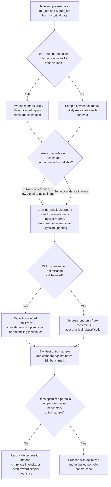

## Estimation Error in Mean-Variance Inputs

### Definition and Motivation

Mean-variance optimization requires two sets of inputs: the vector of expected returns $\boldsymbol{\mu}$ and the covariance matrix $\boldsymbol{\Sigma}$. In practice these are never known with certainty — they must be **estimated** from historical data, forecasting models, or subjective judgment, and every such estimate carries **sampling error** (the gap between the estimated value and the true, unobservable population parameter). Estimation error in mean-variance inputs refers to the consequences of feeding these imperfect, noisy estimates into the optimization machinery, and to the substantial body of research documenting that mean-variance optimizers are **highly sensitive** to this noise — a phenomenon sometimes summarized as "Markowitz optimization is an error maximizer."

This topic sits at the intersection of statistics and portfolio theory: the mean-variance framework itself is mathematically exact given true inputs, but its real-world usefulness depends heavily on how accurately those inputs can be estimated, and on techniques designed to mitigate the damage caused by estimation noise.

### Sources and Magnitude of Estimation Error

**Expected returns ($\boldsymbol{\mu}$).** The sample mean estimator $\hat\mu_i = \frac{1}{T}\sum_{t=1}^{T} r_{i,t}$ has a standard error of $\hat\sigma_i/\sqrt{T}$. For typical equity return volatilities (e.g., $\sigma_i \approx 20\%$ annually) and realistic sample sizes (e.g., $T=60$ months, or 5 years of monthly data), the standard error of the estimated mean remains large relative to the signal itself — the estimated mean is estimated with very low precision because the **signal-to-noise ratio in mean returns is inherently low**: standard deviations of returns are typically an order of magnitude larger than expected returns over standard estimation horizons, making $\boldsymbol{\mu}$ by far the **most difficult and least reliable** of the mean-variance inputs to estimate.

**Covariance matrix ($\boldsymbol{\Sigma}$).** The sample covariance matrix $\hat{\boldsymbol{\Sigma}}$ is generally estimated with **considerably greater relative precision** than $\boldsymbol{\mu}$, since covariance/variance estimators benefit from using squared and cross-product terms of returns (effectively using more information per observation) and because volatility tends to be more persistent and forecastable than mean returns. Nonetheless, $\hat{\boldsymbol{\Sigma}}$ still carries meaningful estimation error, particularly:

- **When $N$ (number of assets) is large relative to $T$ (number of time-series observations).** The sample covariance matrix requires estimating $N(N+1)/2$ distinct parameters; when $N$ approaches or exceeds $T$, $\hat{\boldsymbol{\Sigma}}$ becomes **ill-conditioned** (its smallest eigenvalues are estimated with especially high relative error, and if $N>T$, the matrix is not even invertible) — a well-known problem in the statistical literature on high-dimensional covariance estimation.
- **Time-variation in true volatilities and correlations.** Even with ample data, if the true underlying $\boldsymbol{\Sigma}$ changes over time (as extensively documented for both volatility, e.g., GARCH-type clustering, and correlation, e.g., rising correlations during market stress), a historical sample average is estimating a **moving target**, introducing an additional layer of model-based (rather than purely statistical-sampling) error.

### Why Mean-Variance Optimization Amplifies Estimation Error

The mean-variance optimizer's weight vector is, as derived in the closed-form efficient-frontier solution, $\mathbf{w}^*(\bar\mu) = \mathbf{g} + \mathbf{h}\bar\mu$, where $\mathbf{h}$ involves $\boldsymbol{\Sigma}^{-1}\boldsymbol{\mu}$. This means the optimizer **actively seeks out and overweights assets whose *estimated* expected return is highest relative to their estimated risk and covariance with other assets** — precisely the assets most likely to have benefited from **positive estimation noise** (i.e., an unusually favorable historical sample, not necessarily a genuinely higher true expected return). Symmetrically, it underweights or short-sells assets that appear unattractive due to unfavorable estimation noise. The optimizer cannot distinguish "genuinely high expected return" from "noisy estimate that happens to look high," and its objective function explicitly *rewards* extremizing weights toward the most favorable-looking estimates — hence the "error maximizer" characterization: the optimization process **actively amplifies** the impact of estimation error rather than merely passing it through proportionally.

**Sensitivity to small input changes.** A well-documented (and easily numerically demonstrated) property is that small perturbations to $\boldsymbol{\mu}$ — well within a plausible confidence interval given realistic sample sizes — can produce **large, discontinuous swings** in the resulting optimal weight vector $\mathbf{w}^*$, including flipping which assets are held long versus short, or swinging concentration from one asset to another with only marginally different estimated returns. This instability is especially pronounced for the unconstrained (short-sales-allowed) solution and is a central practical objection to naive implementation of textbook mean-variance optimization.

### Consequences for Out-of-Sample Performance

**In-sample vs. out-of-sample divergence.** A mean-variance-optimal portfolio computed using historical sample estimates $\hat{\boldsymbol{\mu}}, \hat{\boldsymbol{\Sigma}}$ will, by construction, appear optimal *for that historical sample* — but its performance when applied prospectively (out-of-sample, using future realized returns) is frequently **substantially worse** than the backward-looking optimization suggested, precisely because the optimizer overfit to the noise in the specific historical sample used. This in-sample/out-of-sample performance gap is one of the most robust and widely replicated findings in the empirical portfolio-optimization literature.

**Comparison to naive diversification.** A number of academic studies have found that naive (equal-weighted, 1/N) portfolios can perform comparably to, or in some studies better than, mean-variance-optimized portfolios out-of-sample, particularly over shorter estimation windows and larger asset universes — precisely because the 1/N rule requires **no estimation of $\boldsymbol{\mu}$ or $\boldsymbol{\Sigma}$ at all** and is therefore immune to the estimation-error-amplification problem, even though it is provably suboptimal under the *true* (unobservable) parameters. **[Unverified as a universal result]** The relative out-of-sample performance ranking between naive and optimized portfolios is not a universal law — it depends on the specific asset universe, estimation window length, estimation method used, and the true (unknown) degree of genuine cross-sectional variation in expected returns; results favoring 1/N in some well-known studies do not imply that mean-variance optimization is never beneficial out-of-sample, particularly when combined with the mitigation techniques discussed below.

### Mitigation Techniques

**Shrinkage estimation of the covariance matrix.** Rather than using the raw sample covariance matrix $\hat{\boldsymbol{\Sigma}}$, **shrinkage estimators** combine it with a more structured, lower-variance (but potentially biased) target matrix $\mathbf{F}$ (e.g., a single-factor or constant-correlation structure):

$$\hat{\boldsymbol{\Sigma}}_{shrink} = \delta\, \mathbf{F} + (1-\delta)\,\hat{\boldsymbol{\Sigma}}$$

for a shrinkage intensity $\delta \in [0,1]$, often chosen to minimize expected estimation error via methods such as Ledoit-Wolf shrinkage, which derives an optimal $\delta$ analytically under certain assumptions. This trades a small amount of bias for a substantial reduction in estimation variance, generally improving the covariance matrix's usefulness for downstream optimization, particularly when $N$ is large relative to $T$.

**Shrinkage of expected returns.** Analogous shrinkage can be applied to $\boldsymbol{\mu}$, pulling extreme individual sample-mean estimates toward a common central value (e.g., the grand mean across all assets, or a value implied by an asset-pricing model), reducing the tendency of the optimizer to chase noisy, extreme-looking historical means.

**The Black-Litterman model.** Rather than using sample means directly, the Black-Litterman approach starts from **market-equilibrium-implied expected returns** (reverse-engineered from observed market-capitalization weights under the assumption that the market portfolio is mean-variance efficient) as a well-behaved, low-noise prior, and then **Bayesian-updates** this prior with the investor's own specific views (each view expressed with an associated confidence level), producing a posterior expected-return vector that is generally far more stable and better-behaved for optimization purposes than raw historical sample means.

**Resampled efficiency (Michaud resampling).** A simulation-based technique that repeatedly resamples returns (e.g., via bootstrap) from the estimated distribution, re-runs the mean-variance optimization on each resampled dataset, and **averages** the resulting weight vectors across many resampled optimizations — intended to produce a more stable, diversified final portfolio less sensitive to any single sample's idiosyncratic noise. **[Unverified]** The statistical properties and practical benefits of resampled efficiency relative to shrinkage-based alternatives have been debated in the academic literature, with some critiques questioning its theoretical foundations; it should be treated as one proposed technique among several rather than a uniformly agreed-upon best practice.

**Imposing portfolio constraints.** As discussed under constrained optimization, simply imposing no-short-sale and/or box constraints — even without any explicit statistical shrinkage — has been shown in several studies to substantially improve out-of-sample performance relative to the unconstrained solution, because the constraints mechanically prevent the extreme, noise-driven weight values the unconstrained optimizer would otherwise select.

**Robust optimization.** Rather than optimizing against a single point estimate of $\boldsymbol{\mu}$ (and/or $\boldsymbol{\Sigma}$), robust optimization formulations explicitly optimize against the **worst case** within a specified uncertainty set around the point estimates, producing portfolios that are less sensitive to the specific realized estimation error — conceptually related to the maxmin/multiple-priors approach to ambiguity aversion discussed in the context of choice under uncertainty.

### Worked Illustration: Sensitivity to Small Input Changes

Consider two assets with $\sigma_1 = \sigma_2 = 20\%$, $\rho_{12} = 0.5$, and estimated expected returns $\hat\mu_1 = 8.0\%$, $\hat\mu_2 = 8.3\%$ — a difference well within the range that ordinary sampling noise could plausibly produce even if the *true* expected returns were identical. Because the mean-variance optimizer computes weights partly via $\boldsymbol{\Sigma}^{-1}\boldsymbol{\mu}$, this small 0.3 percentage-point difference in estimated means, given the specific covariance structure, can translate into an optimal weight allocation that is **heavily tilted toward Asset 2** — potentially a large majority allocation, or even a substantial short position in Asset 1 to lever up exposure to Asset 2's apparently (but likely spuriously) superior return — despite the two assets being nearly statistically indistinguishable given realistic sample sizes. **[Inference]** The precise magnitude of the weight swing depends on the full covariance matrix and the optimization's other constraints; the qualitative point — that mean-variance solutions can be extremely sensitive to differences in $\hat\mu$ far smaller than the estimation's own standard error — is the well-documented general phenomenon this example is illustrating, not a claim about this specific numerical pairing being a universally reproduced textbook figure.

### Visualizing the Estimation-Error Problem

<svg xmlns="http://www.w3.org/2000/svg" viewBox="0 0 900 480" font-family="Helvetica, Arial, sans-serif">
<text x="450" y="28" text-anchor="middle" font-size="18" font-weight="bold" fill="#1a1a1a">Estimation Error: In-Sample vs. Out-of-Sample Performance (svg_diagram)</text>

<g>
<text x="200" y="55" text-anchor="middle" font-size="13" font-weight="bold" fill="#333">Weight Sensitivity to Small Δμ</text>
<line x1="60" y1="380" x2="60" y2="70" stroke="#333" stroke-width="1.5" />
<line x1="60" y1="380" x2="380" y2="380" stroke="#333" stroke-width="1.5" />
<text x="220" y="405" text-anchor="middle" font-size="11" fill="#333">Estimated μ₂ - μ₁ (small perturbation)</text>
<text x="30" y="220" text-anchor="middle" font-size="11" fill="#333" transform="rotate(-90 30 220)">Optimal weight w₂</text>



```

<path d="M 90 340 Q 150 320 190 250 Q 220 190 250 130 Q 280 90 340 75" fill="none" stroke="#dc2626" stroke-width="2.5" />
<line x1="220" y1="380" x2="220" y2="70" stroke="#9ca3af" stroke-dasharray="3,3" />
<text x="225" y="65" font-size="10" fill="#333">Δμ = 0 (true means equal)</text>
<text x="90" y="360" font-size="10" fill="#dc2626">tiny noise in μ estimate</text>
<text x="230" y="120" font-size="10" fill="#dc2626">→ huge swing in w*</text>
```

</g>

<g transform="translate(460,0)">
<text x="200" y="55" text-anchor="middle" font-size="13" font-weight="bold" fill="#333">In-Sample vs. Out-of-Sample Sharpe Ratio</text>
<line x1="60" y1="380" x2="60" y2="70" stroke="#333" stroke-width="1.5" />
<line x1="60" y1="380" x2="380" y2="380" stroke="#333" stroke-width="1.5" />
<text x="220" y="405" text-anchor="middle" font-size="11" fill="#333">Portfolio construction method</text>
<text x="30" y="220" text-anchor="middle" font-size="11" fill="#333" transform="rotate(-90 30 220)">Realized Sharpe ratio</text>



```

<rect x="90" y="100" width="40" height="280" fill="#2563eb" />
<text x="110" y="395" text-anchor="middle" font-size="10" fill="#333">MV</text>
<text x="110" y="410" text-anchor="middle" font-size="9" fill="#333">in-sample</text>

<rect x="150" y="300" width="40" height="80" fill="#93c5fd" />
<text x="170" y="395" text-anchor="middle" font-size="10" fill="#333">MV</text>
<text x="170" y="410" text-anchor="middle" font-size="9" fill="#333">out-of-sample</text>

<rect x="230" y="250" width="40" height="130" fill="#059669" />
<text x="250" y="395" text-anchor="middle" font-size="10" fill="#333">1/N</text>
<text x="250" y="410" text-anchor="middle" font-size="9" fill="#333">naive</text>

<rect x="290" y="220" width="40" height="160" fill="#f59e0b" />
<text x="310" y="395" text-anchor="middle" font-size="10" fill="#333">MV +</text>
<text x="310" y="408" text-anchor="middle" font-size="9" fill="#333">shrinkage</text>

<text x="200" y="430" text-anchor="middle" font-size="10" fill="#333">Illustrative pattern -- not specific published figures</text>
```

</g>
</svg>

### Decision Flow: Addressing Estimation Error in Practice



### Applications in Financial Economics

- **Institutional asset allocation practice.** Large asset managers and pension funds routinely apply shrinkage, Black-Litterman, or constrained optimization specifically to counteract estimation error, rather than using raw historical sample moments directly in an unconstrained optimizer — a widely adopted industry response to the academic literature on this problem.
- **Quantitative research and backtesting methodology.** The distinction between in-sample and out-of-sample performance evaluation, motivated directly by the estimation-error problem, is a foundational methodological principle in quantitative finance research, underlying the standard practice of walk-forward or rolling-window backtesting rather than evaluating strategies solely on the data used to fit them.
- **Factor investing and dimension reduction.** Factor models (reducing the effective number of parameters to estimate by expressing $\boldsymbol{\Sigma}$ in terms of a smaller number of common factors plus idiosyncratic variances) are partly motivated by the estimation-error problem, since they substantially reduce the number of free parameters relative to the full $N(N+1)/2$-parameter sample covariance matrix.
- **Risk-based (non-return-forecasting) portfolio construction.** Strategies such as risk parity or minimum-variance portfolios that avoid using $\boldsymbol{\mu}$ estimates altogether (relying only on the comparatively more reliable $\boldsymbol{\Sigma}$) are directly motivated by the recognition that expected-return estimation error is the single largest practical obstacle to naive mean-variance implementation.

### Common Pitfalls and Clarifications

- Concluding that mean-variance optimization is "wrong" or "useless" because of estimation error: the mathematical framework itself is exact given true inputs; the practical difficulty is a **statistical estimation problem**, not a flaw in the optimization theory, and is addressed through better estimation and mitigation techniques rather than abandoning the mean-variance framework entirely.
- Assuming $\boldsymbol{\Sigma}$ and $\boldsymbol{\mu}$ suffer from estimation error of comparable severity: as emphasized above, $\boldsymbol{\mu}$ is substantially harder to estimate reliably than $\boldsymbol{\Sigma}$ given typical data availability, and mitigation efforts (e.g., minimum-variance portfolios that ignore $\boldsymbol{\mu}$ entirely) often specifically target this asymmetry.
- Treating any single mitigation technique (shrinkage, Black-Litterman, resampling, constraints) as a universally superior "solution": each technique involves its own assumptions, trade-offs, and implementation choices (e.g., choice of shrinkage target and intensity, choice of prior views and confidence in Black-Litterman), and their relative effectiveness is context- and data-dependent rather than settled once and for all.
- Interpreting an in-sample-optimized portfolio's backtested Sharpe ratio as a reliable predictor of future performance without separately validating out-of-sample: this is precisely the overfitting pattern that the estimation-error literature warns against, and is a common practical error in less rigorous portfolio-construction exercises.

**Next Steps**

- Mean-variance analysis and the efficient frontier (parent framework)
- The Black-Litterman model in full mathematical detail (equilibrium returns, view specification, Bayesian updating)
- Shrinkage estimation methods for covariance matrices (Ledoit-Wolf and related approaches)
- Portfolio optimization with constraints as a practical mitigation technique
- Factor models and dimension reduction in covariance estimation
- Risk parity and minimum-variance portfolio construction as return-forecast-free alternatives
- Backtesting methodology and out-of-sample validation techniques in quantitative finance