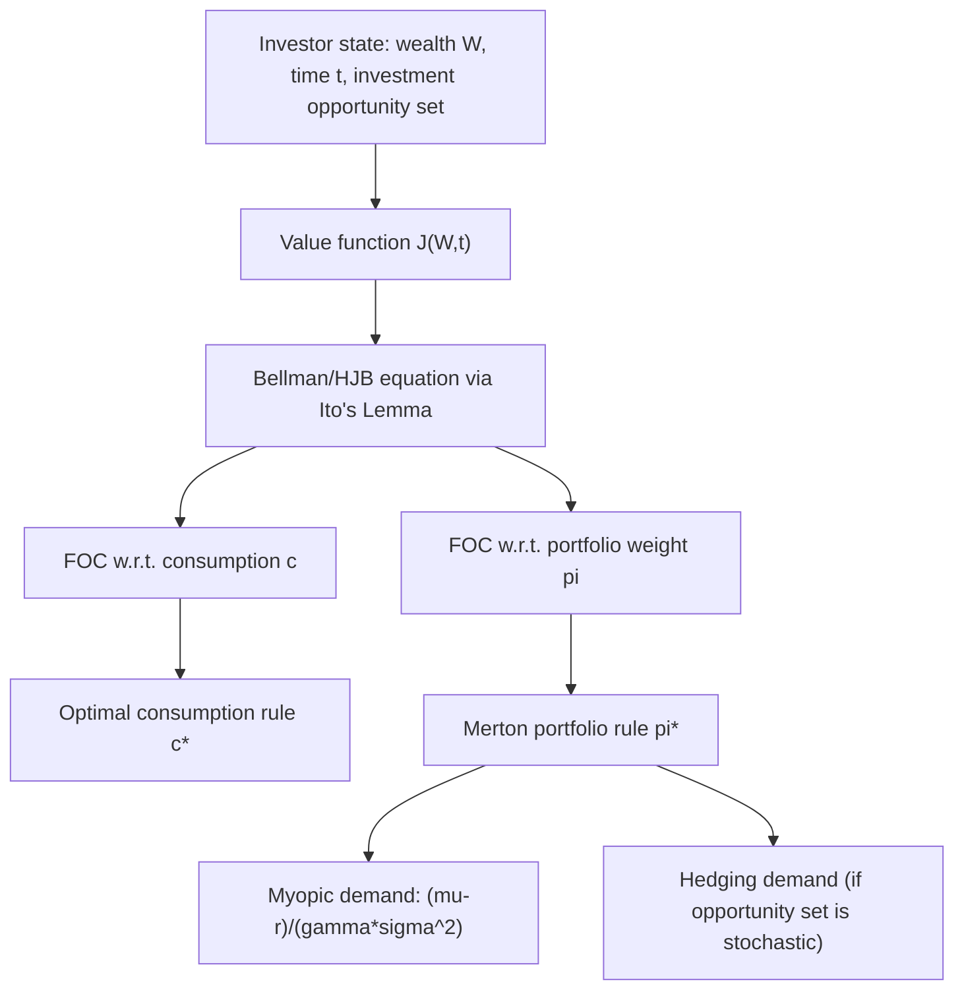

## Merton's Intertemporal Portfolio Problem

### Overview

Merton's intertemporal portfolio problem, developed by Robert C. Merton (1969, 1971, 1973), extends static mean-variance portfolio choice into continuous time under uncertainty. An investor chooses both consumption and portfolio allocation dynamically to maximize expected lifetime utility, using stochastic calculus (Itô processes) rather than one-shot optimization. This framework introduced **dynamic programming via the Hamilton-Jacobi-Bellman (HJB) equation** into finance and is the theoretical origin of the **Intertemporal CAPM (ICAPM)** and the concept of **hedging demand**.

### Problem Setup

**Asset Dynamics**

Consider an investor with wealth $W_t$ who allocates a fraction $\pi_t$ to a risky asset (price $S_t$) and $(1 - \pi_t)$ to a risk-free asset (rate $r$). The risky asset follows geometric Brownian motion:

$$\frac{dS_t}{S_t} = \mu \, dt + \sigma \, dz_t$$

where $\mu$ is the instantaneous expected return, $\sigma$ is volatility, and $dz_t$ is a standard Wiener process increment.

**Wealth Dynamics**

The investor also chooses a consumption rate $c_t$. Wealth evolves as:

$$dW_t = \left[\pi_t W_t (\mu - r) + W_t r - c_t\right]dt + \pi_t W_t \sigma \, dz_t$$

**Objective Function**

The investor maximizes expected discounted lifetime utility from consumption (and possibly terminal wealth):

$$\max_{\{c_t, \pi_t\}} \ \mathbb{E}_0\left[\int_0^T e^{-\rho t} u(c_t)\, dt + e^{-\rho T} B(W_T)\right]$$

where $\rho$ is the subjective discount rate, $u(\cdot)$ is the instantaneous utility (Bernoulli) function, and $B(\cdot)$ is a bequest function.

### The Hamilton-Jacobi-Bellman Approach

**Value Function**

Define the indirect utility (value) function $J(W, t)$ as the maximum attainable expected utility from time $t$ onward, given wealth $W_t = W$:

$$J(W,t) = \max_{\{c_s, \pi_s\}_{s \geq t}} \ \mathbb{E}_t\left[\int_t^T e^{-\rho s} u(c_s)\, ds + e^{-\rho T}B(W_T)\right]$$

**Bellman Equation (Continuous-Time / HJB)**

Applying dynamic programming (Bellman's principle of optimality) and Itô's Lemma to expand $dJ$, the HJB equation for this problem is:

$$0 = \max_{c,\pi} \left\{ e^{-\rho t}u(c) + J_t + J_W\left[\pi W(\mu - r) + Wr - c\right] + \frac{1}{2}J_{WW}\pi^2 W^2 \sigma^2 \right\}$$

where subscripts denote partial derivatives ($J_t = \partial J/\partial t$, $J_W = \partial J/\partial W$, $J_{WW} = \partial^2 J/\partial W^2$).

### First-Order Conditions

**Optimal Consumption**

Differentiating with respect to $c$:

$$e^{-\rho t} u'(c^*) = J_W \implies c^* = (u')^{-1}\left(e^{\rho t}J_W\right)$$

This is the continuous-time analogue of the classic **envelope condition** equating marginal utility of consumption to the shadow price of wealth.

**Optimal Portfolio Weight**

Differentiating with respect to $\pi$:

$$J_W(\mu - r) + J_{WW}\pi^* W \sigma^2 = 0$$

$$\boxed{\pi^* = -\frac{J_W}{J_{WW}W}\cdot\frac{\mu - r}{\sigma^2}}$$

This is the celebrated **Merton portfolio rule**, decomposing optimal risky-asset allocation into economically interpretable terms.

### The Merton Ratio (Constant Relative Risk Aversion Case)

**Simplification under CRRA Utility**

For the widely-used CRRA (power) utility function $u(c) = \dfrac{c^{1-\gamma}}{1-\gamma}$ (with $\gamma > 0$, $\gamma \neq 1$; $\gamma$ = coefficient of relative risk aversion), the value function takes the separable form $J(W,t) = e^{-\rho t}\dfrac{W^{1-\gamma}}{1-\gamma}h(t)$ for some function $h(t)$, and the optimal portfolio weight collapses to a **constant**, independent of wealth and time:

$$\pi^* = \frac{\mu - r}{\gamma \sigma^2}$$

This is the **Merton ratio** (or myopic demand) — remarkably, under CRRA utility and i.i.d. investment opportunities (constant $\mu, \sigma, r$), the optimal risky-asset weight is identical to the **static single-period mean-variance optimal weight**, and the investor's portfolio choice problem becomes "myopic": no explicit hedging against changes in future investment opportunities is needed because there are none.

### Diagram: Merton's Dynamic Programming Structure

### Stochastic Investment Opportunity Set and Hedging Demand

**Beyond the i.i.d. Case**

If investment opportunities vary stochastically over time — e.g., the risk-free rate, expected return, or volatility follow their own stochastic processes driven by a state variable $Y_t$ — the value function $J(W, Y, t)$ depends on $Y$ as well, and the optimal portfolio weight decomposes into two components:

$$\pi^* = \underbrace{-\frac{J_W}{J_{WW}W}\cdot\frac{\mu-r}{\sigma^2}}_{\text{myopic demand}} \ \underbrace{-\ \frac{J_{WY}}{J_{WW}W}\cdot\frac{\sigma_{SY}}{\sigma^2}}_{\text{hedging demand}}$$

**Interpretation of Hedging Demand**

The **hedging demand** term arises because a risk-averse investor wishes to hedge against unfavorable shifts in future investment opportunities (e.g., a decline in expected future returns, or an adverse change in the state variable $Y$ that correlates with future consumption possibilities). Its sign and magnitude depend on:

- $J_{WY}$: how the marginal value of wealth interacts with changes in the state variable
- $\sigma_{SY}$: the covariance between risky-asset returns and innovations in the state variable $Y$
- The investor's relative risk aversion $\gamma$ relative to $1$ (whether more or less risk-averse than log utility, $\gamma=1$, which has no hedging demand even with stochastic opportunities — a special property of log utility)

**[Inference]** Hedging demand is generally regarded as the primary theoretical justification for state-dependent, dynamic asset allocation strategies (e.g., target-date funds' glide paths, strategic tilts toward assets correlated with changing interest-rate or inflation regimes) — this connection is standard in the academic literature (Campbell & Viceira, *Strategic Asset Allocation*), though the empirical magnitude of hedging demand in practice remains an active area of debate depending on model specification.

### Worked Example (Merton Ratio, CRRA Utility)

An investor has relative risk aversion $\gamma = 3$. Risky asset: $\mu = 9\%$, $\sigma = 20\%$. Risk-free rate: $r = 2\%$.

$$\pi^* = \frac{\mu - r}{\gamma \sigma^2} = \frac{0.09 - 0.02}{3 \times (0.20)^2} = \frac{0.07}{3 \times 0.04} = \frac{0.07}{0.12} \approx 0.583$$

The investor optimally allocates **58.3%** of wealth to the risky asset and **41.7%** to the risk-free asset — and, under the i.i.d.-opportunity-set assumption, holds this fixed proportion at every point in time regardless of horizon (a constant-mix, not a "glide path," strategy).

For comparison, a more risk-tolerant investor with $\gamma = 1.5$:

$$\pi^* = \frac{0.07}{1.5 \times 0.04} = \frac{0.07}{0.06} \approx 1.167$$

This investor optimally leverages, borrowing to hold 116.7% of wealth in the risky asset.

### Special Case: Logarithmic Utility ($\gamma = 1$)

For log utility $u(c) = \ln(c)$, the optimal weight is:

$$\pi^* = \frac{\mu - r}{\sigma^2}$$

with **zero hedging demand regardless of the stochastic structure of the investment opportunity set** — a well-known myopia result specific to log utility, since $J_{WY}$ vanishes identically in this case due to the separability properties of log utility's value function.

### Relationship to Merton's Continuous-Time Consumption Model and ICAPM

**Extension to Multiple Risky Assets and State Variables**

Generalizing to $n$ risky assets and a vector of state variables leads directly to Merton's (1973) **Intertemporal CAPM**, in which the cross-section of expected returns is priced not just by covariance with the market (as in static CAPM) but also by covariance with innovations in the state variables that hedge future investment opportunities — additional "hedging betas" alongside the standard market beta.

**Connection to Modern Applications**

This framework underlies much of modern quantitative asset management theory, including:

- Life-cycle and target-date fund glide-path design
- Strategic asset allocation with time-varying expected returns (e.g., mean reversion in equity premia)
- Dynamic hedging in continuous-time derivative pricing (the HJB machinery is structurally related to the Black-Scholes-Merton PDE)

### Limitations

- Requires continuous trading, no transaction costs, and continuous-time asset dynamics (geometric Brownian motion or similar) — real markets have discrete trading, transaction costs, and return distributions with jumps/fat tails not captured by pure diffusion processes.
- The closed-form Merton ratio result relies specifically on CRRA utility and either i.i.d. or tractably-specified (e.g., affine) stochastic investment opportunities; general utility functions or opportunity-set dynamics typically require numerical solution of the HJB PDE.
- Assumes the investor has correct, fixed knowledge of the parameters governing asset return dynamics ($\mu, \sigma$, or their stochastic processes) — parameter uncertainty (as opposed to return risk itself) is a separate complication addressed in later "robust control" and Bayesian portfolio choice literature.

**Related Topics**

- Hamilton-Jacobi-Bellman equation and dynamic programming
- Intertemporal CAPM (ICAPM)
- CRRA and CARA utility functions
- Mean-variance analysis (static, single-period benchmark)
- Black-Scholes-Merton option pricing (shared HJB/PDE methodology)
- Life-cycle investing and target-date fund design
- Strategic vs. tactical asset allocation
- Epstein-Zin recursive preferences (relaxing time-separable CRRA utility)