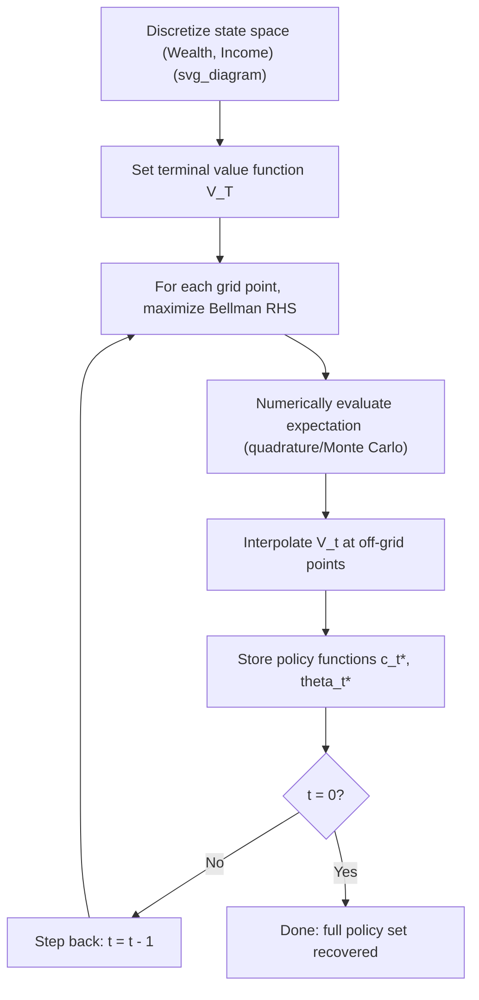

## Dynamic Programming in Portfolio Choice

### Overview

Dynamic programming (DP) is the primary analytical framework for solving multi-period portfolio choice problems under uncertainty. It decomposes a sequential decision problem — where an investor chooses consumption and portfolio weights across many periods — into a sequence of simpler, single-period problems linked through a **value function**. The method rests on Richard Bellman's **Principle of Optimality**: an optimal policy has the property that, regardless of the initial decisions taken, the remaining decisions must constitute an optimal policy given the state resulting from those initial decisions.

In portfolio theory, DP underlies Merton's continuous-time intertemporal asset pricing model, discrete-time life-cycle models, and numerical solutions to problems with realistic frictions (borrowing constraints, transaction costs, non-tradable labor income) that lack closed-form solutions.

### The Bellman Principle of Optimality

**Key Points**

- A dynamic decision problem is broken into a **state**, a **control**, and a **transition equation** governing how the state evolves.
- The problem is solved **backward** from the terminal period to the present, because the optimal current decision depends on the value of all future decisions it makes possible.
- This backward-recursive structure avoids the combinatorial explosion of evaluating every possible sequence of decisions directly.

For a finite-horizon problem with $T$ periods, define:

- $W_t$: wealth (the state variable) at time $t$
- $c_t$: consumption (a control variable) at time $t$
- $\theta_t$: portfolio weight vector on risky assets (a control variable) at time $t$
- $R_{t+1}$: the (random) portfolio return realized between $t$ and $t+1$

### The Value Function

The **value function** $V_t(W_t)$ represents the maximum attainable expected lifetime utility from period $t$ onward, given wealth $W_t$:

$$V_t(W_t) = \max_{c_t, \theta_t} \; \left\{ u(c_t) + \beta \, \mathbb{E}_t\left[ V_{t+1}(W_{t+1}) \right] \right\}$$

subject to the budget/transition constraint:

$$W_{t+1} = (W_t - c_t)\big(1 + R_{t+1}(\theta_t)\big)$$

where $u(\cdot)$ is the period utility function and $\beta \in (0,1)$ is the subjective discount factor. This recursive equation is the **Bellman equation**. It states that current-period utility plus the discounted expected value of the resulting continuation state must be maximized — the essence of separating "now" from "the future" while still accounting for the future's full consequences.

At the terminal date $T$, a boundary condition closes the recursion, typically:

$$V_T(W_T) = u(W_T) \quad \text{or} \quad V_T(W_T) = 0$$

depending on whether a bequest motive or terminal consumption is modeled.

### Backward Induction Algorithm

**Key Points**

1. Specify $V_T(W_T)$ from the terminal condition.
2. For $t = T-1, T-2, \dots, 0$: solve the maximization problem in the Bellman equation to obtain the optimal policy functions $c_t^*(W_t)$ and $\theta_t^*(W_t)$, and substitute back to obtain $V_t(W_t)$.
3. The resulting sequence of policy functions $\{c_t^*(\cdot), \theta_t^*(\cdot)\}_{t=0}^{T-1}$ constitutes the full optimal dynamic strategy — a decision rule for *any* wealth level at each date, not just the realized path.
4. Forward-simulate the policy functions using realized (or simulated) returns to trace out the actual wealth path.

### First-Order Conditions and the Envelope Condition

Differentiating the Bellman equation with respect to $c_t$ and $\theta_t$ yields the standard **Euler equation** linking marginal utility today to expected discounted marginal utility tomorrow, scaled by portfolio return:

$$u'(c_t) = \beta \, \mathbb{E}_t\left[ u'(c_{t+1}) \big(1 + R_{t+1}\big) \right]$$

The **envelope theorem** establishes that $V_t'(W_t) = u'(c_t)$ along the optimal path, meaning the marginal value of wealth equals marginal utility of consumption at the optimum — this substitution is what allows the DP recursion to be converted into the more familiar stochastic Euler equation used in consumption-based asset pricing.

For the portfolio weight $\theta_t$, the first-order condition (assuming a single risky asset with excess return $R_{t+1}^e$) is:

$$\mathbb{E}_t\left[ u'(c_{t+1})\, R_{t+1}^e \right] = 0$$

which is the discrete-time analog of the continuous-time optimality condition in Merton's model.

### Merton's Continuous-Time Solution (CRRA Utility)

**Example**

Under constant relative risk aversion (CRRA) utility $u(c) = \frac{c^{1-\gamma}}{1-\gamma}$, with a risky asset following geometric Brownian motion (drift $\mu$, volatility $\sigma$) and a constant risk-free rate $r$, Merton's DP-derived closed-form solution gives:

- **Optimal risky-asset weight (myopic demand only, no state variables):**

$$\theta^* = \frac{\mu - r}{\gamma \sigma^2}$$

- **Optimal consumption-to-wealth ratio** is also constant over time in this simplified i.i.d.-returns case.

This result — that the optimal weight is *constant* and does not depend on horizon when investment opportunities are constant (i.i.d. returns) — is a landmark implication of solving the problem via DP/HJB (Hamilton-Jacobi-Bellman, the continuous-time Bellman equation) rather than static mean-variance optimization. It shows that under these specific assumptions, "time diversification" arguments for age-based risk reduction do not follow from expected-utility maximization alone.

### Hedging Demand and Time-Varying Opportunities

**Key Points**

When investment opportunities are **not** constant — e.g., a state variable $x_t$ (such as the dividend yield or a stochastic volatility factor) predicts future returns — the optimal portfolio weight decomposes into two terms:

$$\theta_t^* = \underbrace{\frac{\mu_t - r}{\gamma \sigma^2}}_{\text{myopic demand}} + \underbrace{\left(1 - \frac{1}{\gamma}\right) \frac{\text{Cov}(dW, dx)}{\sigma^2} \frac{\partial V / \partial x}{\partial V / \partial W}}_{\text{intertemporal hedging demand}}$$

- The **myopic term** is what a one-period mean-variance investor would choose.
- The **hedging term** arises purely from the multi-period nature of the problem: investors hedge against unfavorable shifts in future investment opportunities (e.g., a decline in expected future returns), and this term is a direct product of solving the full DP/HJB recursion rather than a single-period optimization.
- [Inference] The sign and magnitude of the hedging demand depend on the correlation between wealth shocks and the state variable, and empirically estimated magnitudes vary substantially across studies and calibrations.

### Discrete-Time Numerical Dynamic Programming

Closed-form solutions like Merton's are the exception. Realistic life-cycle models — with borrowing constraints, non-negativity on consumption, non-tradable labor income, or transaction costs — generally require **numerical DP**, solved via backward induction on a discretized state space.

**Key Points**

- **State-space discretization**: wealth (and any other state variables, e.g., labor income) is discretized onto a grid.
- **Value function iteration**: at each grid point and each time step, the Bellman equation is maximized numerically (grid search, or continuous optimization with interpolation between grid points).
- **Interpolation**: because next period's wealth $W_{t+1}$ generally does not fall exactly on a grid point, the value function must be interpolated (linear, cubic spline, or Chebyshev polynomial methods).
- **Expectation evaluation**: the expectation $\mathbb{E}_t[V_{t+1}(W_{t+1})]$ is computed via numerical quadrature (e.g., Gauss-Hermite quadrature for normally distributed shocks) or Monte Carlo integration.
- Behavior of specific numerical schemes (convergence rate, grid sensitivity) may vary with implementation choices and the smoothness of the underlying value function. [Unverified] for any specific solver without empirical testing on the given problem.

### Worked Discrete Example: Two-Period Portfolio Choice

**Example**

Consider a two-period problem ($T=2$), CRRA utility with $\gamma = 3$, no intermediate consumption, terminal utility $u(W_2) = \frac{W_2^{1-\gamma}}{1-\gamma}$, one risky asset with two equally likely returns $R_u = 20\%$ and $R_d = -10\%$, and risk-free rate $r_f = 2\%$.

**Step 1 — Terminal value function:**

$$V_2(W_2) = \frac{W_2^{1-3}}{1-3} = -\frac{1}{2W_2^2}$$

**Step 2 — Bellman equation at $t=1$:** with initial wealth $W_1$ and weight $\theta$ in the risky asset,

$$W_2 = W_1\big[(1+r_f) + \theta(R - r_f)\big]$$

The investor chooses $\theta$ to maximize $\mathbb{E}_1[V_2(W_2)]$:

$$\max_\theta \; \tfrac{1}{2}\Big(-\tfrac{1}{2}\big[W_1(1.02 + 0.18\theta)\big]^{-2}\Big) + \tfrac{1}{2}\Big(-\tfrac{1}{2}\big[W_1(1.02 - 0.12\theta)\big]^{-2}\Big)$$

**Step 3 — Solve numerically** (first-order condition set to zero, solved via root-finding): this yields an optimal $\theta_1^*$ independent of $W_1$ under CRRA (a scale-invariance property of power utility) — consistent with the general Merton myopic-demand intuition in a discrete, single-risky-asset, i.i.d. setting.

**Step 4 — Substitute back** to obtain $V_1(W_1)$ in closed form, which then feeds into any $t=0$ decision (e.g., a savings/borrowing choice) in the same recursive fashion if the horizon is extended.

This mechanical backward pass — solve $t=1$ taking $V_2$ as given, then solve $t=0$ taking the resulting $V_1$ as given — is the discrete-time embodiment of the DP principle and generalizes directly to $T$ periods.

### State-Space Diagram: Wealth-Income Grid

<svg xmlns="http://www.w3.org/2000/svg" viewBox="0 0 640 380" font-family="Helvetica, Arial, sans-serif">
<text x="320" y="24" font-size="16" font-weight="bold" text-anchor="middle">Wealth-Income State Grid Across Periods (svg_diagram)</text>
<line x1="60" y1="330" x2="600" y2="330" stroke="black" stroke-width="1.5" />
<line x1="60" y1="330" x2="60" y2="50" stroke="black" stroke-width="1.5" />
<text x="330" y="360" font-size="13" text-anchor="middle">Time (t = 0, 1, ..., T)</text>
<text x="25" y="190" font-size="13" text-anchor="middle" transform="rotate(-90 25 190)">Wealth grid W</text>

<circle cx="120" cy="290" r="4" fill="#2b6cb0" />
<circle cx="120" cy="230" r="4" fill="#2b6cb0" />
<circle cx="120" cy="170" r="4" fill="#2b6cb0" />
<circle cx="120" cy="110" r="4" fill="#2b6cb0" />

<circle cx="270" cy="300" r="4" fill="#2b6cb0" />
<circle cx="270" cy="250" r="4" fill="#2b6cb0" />
<circle cx="270" cy="200" r="4" fill="#2b6cb0" />
<circle cx="270" cy="150" r="4" fill="#2b6cb0" />
<circle cx="270" cy="100" r="4" fill="#2b6cb0" />

<circle cx="420" cy="310" r="4" fill="#2b6cb0" />
<circle cx="420" cy="260" r="4" fill="#2b6cb0" />
<circle cx="420" cy="210" r="4" fill="#2b6cb0" />
<circle cx="420" cy="160" r="4" fill="#2b6cb0" />
<circle cx="420" cy="110" r="4" fill="#2b6cb0" />
<circle cx="420" cy="70" r="4" fill="#2b6cb0" />

<circle cx="560" cy="315" r="4" fill="#c53030" />
<circle cx="560" cy="265" r="4" fill="#c53030" />
<circle cx="560" cy="215" r="4" fill="#c53030" />
<circle cx="560" cy="165" r="4" fill="#c53030" />
<circle cx="560" cy="115" r="4" fill="#c53030" />
<circle cx="560" cy="65" r="4" fill="#c53030" />

<line x1="120" y1="230" x2="270" y2="250" stroke="#a0aec0" stroke-width="1" />
<line x1="120" y1="230" x2="270" y2="200" stroke="#a0aec0" stroke-width="1" />
<line x1="120" y1="230" x2="270" y2="150" stroke="#a0aec0" stroke-width="1" />
<line x1="270" y1="200" x2="420" y2="210" stroke="#a0aec0" stroke-width="1" />
<line x1="270" y1="200" x2="420" y2="160" stroke="#a0aec0" stroke-width="1" />
<line x1="270" y1="200" x2="420" y2="110" stroke="#a0aec0" stroke-width="1" />
<line x1="420" y1="160" x2="560" y2="165" stroke="#a0aec0" stroke-width="1" />
<line x1="420" y1="160" x2="560" y2="115" stroke="#a0aec0" stroke-width="1" />

<text x="120" y="20" font-size="12" text-anchor="middle">t=0</text>

<text x="270" y="20" font-size="12" text-anchor="middle">t=1</text>

<text x="420" y="20" font-size="12" text-anchor="middle">t=2</text>

<text x="560" y="20" font-size="12" text-anchor="middle">t=T (terminal, red)</text>

</svg>

### Curse of Dimensionality

**Key Points**

- Each additional state variable (labor income, a predictive factor, a second risky asset with time-varying correlation, health status) multiplies the size of the grid the solver must evaluate.
- With $d$ state variables each discretized into $n$ points, the grid has $n^d$ points — computational cost grows exponentially in $d$. This is the classical **curse of dimensionality** in DP.
- Mitigations include: sparse grids, Chebyshev polynomial approximation of the value function, perturbation/log-linearization methods around a steady state, machine-learning-based function approximation (e.g., neural-network value function approximation, deep reinforcement learning applied to portfolio choice), and simulation-based methods (e.g., the Carroll endogenous grid method, which avoids root-finding in the first-order condition by inverting the Euler equation directly).
- [Inference] The relative efficiency ranking among these mitigation methods is problem-dependent and not universal across all portfolio-choice model specifications.

### Relationship to Stochastic Dynamic Programming and Reinforcement Learning

**Key Points**

- DP as used in portfolio theory is a special case of general **stochastic control**, and the Bellman equation is mathematically identical in structure to the value iteration used in **reinforcement learning (RL)**.
- Where a closed-form transition model and reward function are known (as in the Merton problem), classical DP applies directly.
- Where the environment (return distribution, transaction cost structure) is unknown or too complex to specify analytically, model-free RL techniques (Q-learning, policy gradient methods) approximate the same Bellman recursion from simulated or historical data rather than solving it in closed form.
- [Speculation] The practical adoption of deep RL for live portfolio management remains an active research area, and comparative performance against classical DP-derived or heuristic strategies in out-of-sample, real-market conditions is not yet well established in a stable, consensus way across the literature.

### Key Assumptions and Limitations

**Key Points**

- **Time-consistency**: standard DP requires *time-consistent* preferences (e.g., exponential discounting). Non-exponential (hyperbolic) discounting breaks the simple backward-recursion approach and requires alternative solution concepts (e.g., sophisticated vs. naive agents).
- **Markov structure**: the state vector must summarize all payoff-relevant history; if returns exhibit long-memory or path-dependent features not captured by the chosen state variables, the DP formulation is misspecified.
- **Complete markets / no frictions** (in the classical closed-form cases): transaction costs, taxes, and borrowing constraints require the numerical DP approach rather than the closed-form Merton solution.
- Behavior of any specific solved model under these assumptions may vary once real-world frictions or estimation error in the parameters ($\mu$, $\sigma$, $\gamma$) are introduced.

### Conclusion

Dynamic programming provides the rigorous backbone for solving multi-period portfolio choice problems by converting an intractable joint optimization over an entire horizon into a sequence of one-period problems linked by the value function and the Bellman equation. It yields both elegant closed-form results (Merton's myopic and hedging demand decomposition) and a numerical toolkit (value function iteration, endogenous grid methods) for realistic life-cycle models with frictions. Understanding DP is a prerequisite for essentially all modern intertemporal asset-pricing and life-cycle portfolio literature.

**Related Topics**

- Merton's continuous-time portfolio problem and the Hamilton-Jacobi-Bellman (HJB) equation
- Stochastic Euler equations and the consumption-based capital asset pricing model (C-CAPM)
- Intertemporal hedging demand and long-horizon asset allocation
- Life-cycle portfolio models with labor income and borrowing constraints
- The endogenous grid method (Carroll) for numerical policy-function solving
- Epstein-Zin recursive preferences and separating risk aversion from the elasticity of intertemporal substitution
- Martingale/duality methods as an alternative to DP for complete-market dynamic portfolio problems
- Reinforcement learning approaches to sequential portfolio optimization