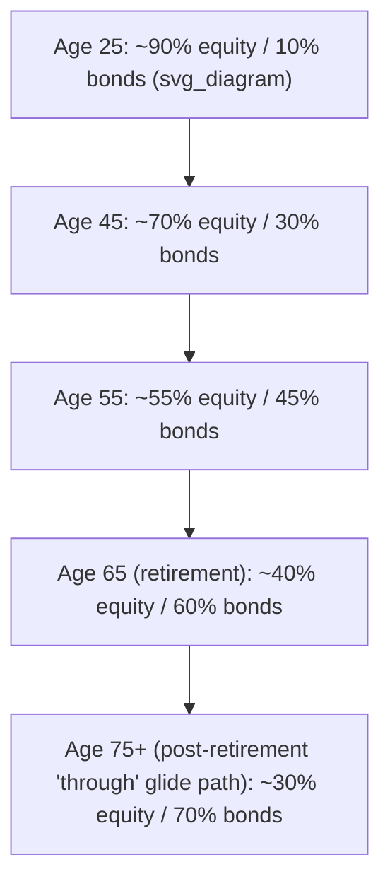

## Lifecycle Investing and Human Capital

### Overview

Lifecycle investing extends the multi-period portfolio choice framework by treating an investor's **human capital** — the present value of future labor income — as an implicit asset held alongside financial wealth. Because human capital typically cannot be traded, shorted, or fully diversified, its risk characteristics (size, volatility, and correlation with equity markets) systematically shape the *optimal* allocation of *financial* wealth across the life cycle. This framework, building directly on the dynamic-programming and Merton-style hedging-demand results, explains empirically observed and normatively recommended patterns such as high equity allocations when young and gradual de-risking (glide paths) approaching retirement.

### Human Capital as an Implicit Asset

**Key Points**

- **Definition**: human capital $H_t$ is the present discounted value of an investor's expected future labor income stream:

$$H_t = \mathbb{E}_t\left[ \sum_{s=t+1}^{T} \frac{Y_s}{(1+r_H)^{s-t}} \right]$$

where $Y_s$ is labor income at date $s$ and $r_H$ is a discount rate reflecting the riskiness of that income stream.

- **Total wealth** is the sum of financial wealth and human capital:

$$W_t^{total} = F_t + H_t$$

where $F_t$ is tradable financial wealth.

- Because $H_t$ cannot be sold, bought on margin, or held short, an investor cannot directly rebalance it — the only lever available is adjusting the composition of $F_t$ to offset the risk profile embedded in $H_t$.
- Human capital is typically **bond-like** for most workers (stable, contractually-set wage income with low correlation to equity markets) but can be **equity-like** for others (e.g., finance-sector or equity-compensated employees, whose income co-varies with the stock market).

### The Core Lifecycle Logic

**Key Points**

- Early in life, $H_t$ is large relative to $F_t$ (most of an individual's lifetime wealth remains in future, unrealized labor income).
- If $H_t$ behaves like a large, safe, bond-like asset, an optimal *total* portfolio allocation (financial + human) requires **financial wealth to be tilted heavily toward equities** early in life, since the safe human-capital "bond" already provides the fixed-income exposure in the total portfolio.
- As the investor ages, $H_t$ shrinks (fewer years of future income remain) and $F_t$ grows (from savings and returns), so the safe "bond" backing shrinks — the optimal *financial* portfolio must **shift toward genuine fixed income** to keep the *total* portfolio's risk profile appropriate. This produces the classic downward-sloping equity **glide path**.

$$\theta_t^{F,*} = \frac{1}{\gamma}\cdot\frac{\mu - r}{\sigma^2} \cdot \left(1 + \frac{H_t}{F_t}\right) \quad \text{[simplified illustrative form, bond-like human capital]}$$

[Inference] This expression is a stylized simplification used in many textbook expositions (e.g., building on Bodie, Merton, and Samuelson's framework); exact closed forms depend on the specific model's assumptions about income risk, labor supply flexibility, and utility specification, and will differ across papers.

### Human Capital Risk Heterogeneity

**Key Points**

The bond-like assumption is a simplification; human capital risk varies substantially by occupation and sector:

| Human capital type | Typical correlation with equities | Implication for optimal equity share in $F_t$ |
| --- | --- | --- |
| Tenured public-sector / union wage | Low / near-zero | Higher equity tilt supported |
| Standard private-sector salaried | Low-to-moderate | Moderate equity tilt |
| Equity-compensated tech/finance | Higher, procyclical | Lower equity tilt recommended, more diversification away from employer/sector stock |
| Commission-based / cyclical-industry income | Higher, procyclical | Lower equity tilt, hedge with sectors negatively correlated to own industry |

[Inference] These are qualitative, directionally-supported patterns from the labor economics and lifecycle finance literature rather than precise universal coefficients; magnitudes are calibration- and country-specific.

### Formal Model: Bodie, Merton, and Samuelson (1992) Framework

**Example**

The Bodie-Merton-Samuelson model extends the standard Merton portfolio problem by adding **endogenous labor supply** as a control variable alongside consumption and portfolio choice. The investor can respond to poor investment returns not only by reducing consumption but also by working more (or retiring later).

**Key Points**

- With flexible labor supply, human capital effectively becomes a partial *hedge* against poor portfolio outcomes: an investor can increase labor income when financial markets underperform.
- This flexibility **increases** the optimal equity allocation relative to a model with fixed, exogenous labor supply, because the "insurance" from adjustable work effort reduces the effective riskiness of relying more heavily on risky financial assets.
- The model formally shows that the value function depends on both financial wealth and the shadow value of leisure/labor flexibility, requiring an augmented state space in the dynamic-programming recursion (financial wealth, human capital proxy, and a labor-supply/leisure state).

### Glide Path Construction in Target-Date Funds

**Key Points**

Target-date funds (TDFs) operationalize lifecycle logic into an explicit, pre-committed equity/bond glide path as a function of years-to-retirement:

- **"To" glide paths** reach their most conservative allocation at the retirement date and hold it flat thereafter.
- **"Through" glide paths** continue de-risking gradually *after* retirement, reflecting the view that longevity risk (outliving assets) still requires some growth exposure into the decumulation phase.
- Standard commercial glide-path slopes are calibrated using stylized human-capital/financial-wealth ratios, but the specific slope, starting equity share, and landing point vary by fund family and are not derived from a single universally agreed optimization. [Unverified] whether any particular commercial glide path is provably optimal for a given individual's actual human capital risk profile, since fund providers use population-average assumptions rather than personalized income-risk estimates.

### Mortality Risk, Insurance, and Human Capital

**Key Points**

- **Life insurance** functions as a hedge against the *premature loss* of human capital: if a wage earner dies early, dependents lose the future income stream $H_t$ that life insurance proceeds are designed to replace.
- **Term life insurance demand** in lifecycle models is proportional to the gap between human capital (the income stream to be replaced) and existing financial wealth plus any other resources dependents would have.
- **Longevity risk** (living longer than expected, and thus needing $F_t$ to fund consumption over more years than planned) works in the opposite direction and motivates annuitization: converting a portion of financial wealth into a lifetime income stream (an annuity) that mimics the wage-like, mortality-linked payoff structure of labor income, effectively rebuilding "human-capital-like" security using financial assets after employment ends.

### Borrowing Constraints and the Illiquidity of Human Capital

**Key Points**

- Because human capital cannot be borrowed against directly (an individual cannot sell claims on their future wages the way they can sell equity), young investors with theoretically large, safe $H_t$ but little $F_t$ are often **constrained** from achieving the textbook-optimal high-leverage equity position implied by pure lifecycle logic.
- In practice, this constraint (rather than pure risk-aversion) is frequently cited as a key reason observed young-investor equity allocations are lower than simple lifecycle models predict — this remains a debated empirical point. [Inference] The relative importance of borrowing constraints versus other frictions (limited financial literacy, present bias, participation costs) in explaining the gap between model-predicted and observed equity allocations is not settled in the empirical literature.

### Incorporating Human Capital into the Dynamic Programming Recursion

The lifecycle problem is formally a direct extension of the general DP/Bellman framework: the state vector is augmented to include a labor-income (or human-capital) state variable $Y_t$ (or its shocks), and the Bellman equation becomes:

$$V_t(F_t, Y_t) = \max_{c_t, \theta_t} \Big\{ u(c_t) + \beta\, \mathbb{E}_t\big[V_{t+1}(F_{t+1}, Y_{t+1})\big] \Big\}$$

subject to:

$$F_{t+1} = (F_t + Y_t - c_t)\big(1 + R_{t+1}(\theta_t)\big)$$

The presence of $Y_t$ (and its correlation structure with $R_{t+1}$) is precisely what generates the intertemporal hedging demand term discussed under general dynamic programming — here specialized to labor-income risk rather than an abstract predictive state variable. Solving this recursion numerically (via the discretized value-function-iteration methods covered under dynamic programming) is the standard approach in quantitative lifecycle-model calibration, since closed-form solutions are generally unavailable once labor income risk, borrowing constraints, and realistic income profiles (hump-shaped over the career) are introduced.

### Conclusion

Lifecycle investing formalizes the intuition that an investor's optimal financial-asset allocation cannot be evaluated in isolation from the size and risk characteristics of their human capital. By treating human capital as an implicit, undiversifiable, typically bond-like asset that shrinks over the life cycle, the framework rationalizes age-based glide paths, motivates specific insurance and annuitization demand, and highlights why occupation-specific income risk — not just risk aversion — should shape individualized portfolio advice.

**Related Topics**

- Merton's continuous-time portfolio problem and intertemporal hedging demand
- Target-date fund glide-path design and "to" vs. "through" methodologies
- Annuitization and longevity-risk management in retirement
- Life insurance demand and human-capital replacement
- Borrowing constraints and portfolio choice under market incompleteness
- Endogenous labor supply models (Bodie-Merton-Samuelson framework)
- Occupation-specific income risk and portfolio customization
- Retirement decumulation strategies and sequence-of-returns risk