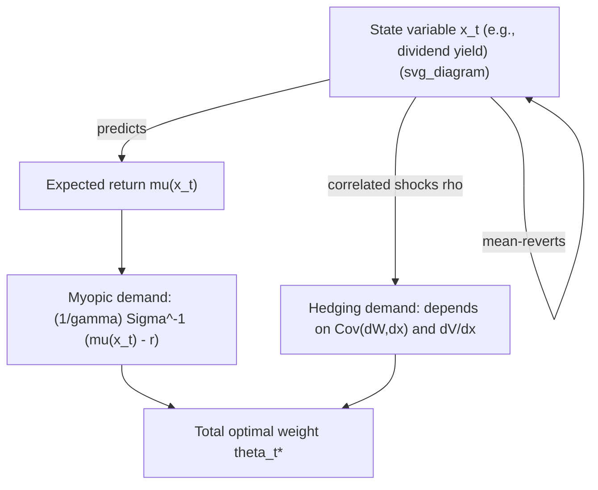

## Portfolio Choice with Time-Varying Investment Opportunities

### Overview

Standard single-period mean-variance analysis and even the simplest multi-period Merton model assume **constant investment opportunities**: a fixed risk-free rate, and risky-asset returns drawn i.i.d. from a distribution with constant mean and variance. In reality, expected returns, volatilities, and correlations shift over time — driven by business-cycle conditions, valuation levels, and volatility regimes. When investment opportunities are **time-varying and at least partially predictable**, the optimal dynamic portfolio problem produces a richer solution than the static mean-variance weight: an **intertemporal hedging demand** component emerges, and optimal portfolios become horizon-dependent even under otherwise standard CRRA preferences.

### Time-Varying Opportunity Sets: Core Idea

**Key Points**

- A **state variable** $x_t$ (e.g., the dividend-price ratio, a short-rate spread, realized variance) is assumed to follow its own stochastic process and to predict future expected returns, volatility, or both.
- The investor's problem is no longer just "maximize this period's mean-variance trade-off" — it becomes "maximize lifetime utility, accounting for how today's portfolio choice interacts with the evolution of $x_t$, which governs tomorrow's opportunity set."
- This reintroduces the full dynamic-programming machinery: the value function $V_t(W_t, x_t)$ now depends on *both* wealth and the state variable, and the resulting first-order condition splits into **myopic demand** and **hedging demand**, as previewed under dynamic programming and Merton's model.

$$\theta_t^* = \underbrace{\frac{1}{\gamma}\Sigma_t^{-1}(\mu_t - r_t \mathbf{1})}_{\text{myopic demand}} + \underbrace{\left(1-\frac{1}{\gamma}\right)\Sigma_t^{-1}\Sigma_{xR}\,\frac{\partial \ln V/\partial x}{\partial \ln V/\partial \ln W}}_{\text{intertemporal hedging demand}}$$

where $\Sigma_t$ is the return covariance matrix, $\mu_t$ the (state-dependent) expected excess returns, and $\Sigma_{xR}$ the covariance between shocks to $x_t$ and shocks to returns.

### Sources of Predictability Commonly Modeled

**Key Points**

- **Dividend yield / price ratios**: mean-reverting valuation ratios have long been used as state variables predicting future equity returns (higher yield → higher expected future return).
- **Term spread and short-rate level**: predict bond and, to a lesser degree, equity returns; central to models with time-varying bond risk premia.
- **Stochastic volatility**: realized or implied volatility (e.g., a VIX-like factor) evolves over time and predicts both future volatility and, in some models, a volatility risk premium.
- **Momentum/reversal signals**: shorter-horizon predictors used more in tactical asset allocation than in the classical academic hedging-demand literature, but conceptually fit the same state-variable framework.
- [Inference] The statistical robustness of long-horizon return predictability from valuation ratios (e.g., dividend yield) has been challenged in the empirical literature on grounds of small-sample bias and look-ahead issues; results are sensitive to sample period and estimation method.

### Formal Setup: Single State Variable, Continuous Time

A canonical formulation (in the spirit of Kim and Omberg, and Campbell and Viceira) specifies:

$$dS_t/S_t = \mu(x_t)\,dt + \sigma\, dZ_t^S$$

$$dx_t = \kappa(\bar{x} - x_t)\,dt + \sigma_x\, dZ_t^x$$

$$\text{Corr}(dZ_t^S, dZ_t^x) = \rho$$

where $x_t$ mean-reverts to a long-run mean $\bar{x}$ at speed $\kappa$, and $\rho$ governs the correlation between return shocks and state-variable shocks. The Bellman/HJB equation for CRRA utility over terminal wealth becomes:

$$0 = \max_{\theta} \left\{ V_t + V_W W\big[r + \theta(\mu(x)-r)\big] + V_x \kappa(\bar x - x) + \tfrac{1}{2}V_{WW}W^2\theta^2\sigma^2 + \tfrac{1}{2}V_{xx}\sigma_x^2 + V_{Wx} W\theta\sigma\sigma_x\rho \right\}$$

Solving this HJB equation (typically via a guess-and-verify approach positing $V(W,x,t) = \frac{W^{1-\gamma}}{1-\gamma}g(x,t)^{\gamma}$ for CRRA utility) yields closed- or near-closed-form solutions in specific cases (e.g., Kim-Omberg with an affine expected-return process), and the resulting optimal weight decomposes exactly into the myopic and hedging terms above.

### Sign and Interpretation of Hedging Demand

**Key Points**

- If $\rho < 0$ (bad return shocks tend to coincide with *increases* in expected future returns, e.g., a market downturn raises the dividend yield and thus future expected returns), a risk-averse investor with $\gamma > 1$ has an incentive to hold **more** of the risky asset than the myopic term alone suggests — the asset partially hedges against unfavorable shifts in the investment opportunity set.
- If $\rho > 0$, the sign of the hedging term typically flips, and the risky asset can become a *less* attractive holding relative to the myopic benchmark, because bad return shocks coincide with further deterioration in future opportunities (no hedging value).
- For **log utility** ($\gamma = 1$), the coefficient $\left(1-\frac{1}{\gamma}\right)$ on the hedging term is exactly zero — the classic result that **log-utility investors are always myopic** and never demand intertemporal hedging, regardless of how predictable returns are.
- [Inference] The empirically estimated magnitude of the hedging demand for typical calibrations (equity dividend-yield predictability, $\gamma$ in the range of 2–10) varies substantially across studies, with some finding economically modest hedging demands and others finding it can substantially alter optimal equity allocations; this remains sensitive to the assumed predictive-regression parameters.

### Discrete-Time Analog: Campbell-Viceira VAR Approach

**Example**

Campbell and Viceira's widely used discrete-time framework models the log return and the state variable jointly as a first-order **vector autoregression (VAR(1))**:

# $$ \begin{bmatrix} r_{t+1} \ x_{t+1} \end{bmatrix}

\begin{bmatrix} \Phi_0^r \ \Phi_0^x \end{bmatrix}

+

\begin{bmatrix} \Phi_1^r \ \Phi_1^x \end{bmatrix} x_t

+

\begin{bmatrix} u_{t+1}^r \ u_{t+1}^x \end{bmatrix}

$$

with a shock covariance matrix $\Sigma_u$ estimated from historical data (e.g., dividend yield predicting next-period equity returns). Using a log-linear approximation of the budget constraint and an Epstein-Zin recursive utility specification, the model produces an **approximate closed-form** optimal portfolio rule:

$$\alpha_t \approx \frac{1}{\gamma}\frac{\text{Var}(r_{t+1})^{-1}\mathbb{E}_t[r_{t+1}^e]}{} + \left(1-\frac{1}{\gamma}\right)\left(\text{terms involving } \Phi_1, \Sigma_u, \text{ and the EIS}\right)$$

This VAR-based approach is the standard applied-econometrics workhorse for estimating hedging demands empirically, because the VAR parameters can be estimated directly by OLS on historical return and predictor-variable data, then plugged into the (approximate) analytical policy function.

**Step-by-step estimation workflow:**

1. Choose predictive state variable(s) $x_t$ (e.g., log dividend-price ratio).
2. Estimate the VAR(1) system by OLS: regress $r_{t+1}$ and $x_{t+1}$ on $x_t$.
3. Recover $\Sigma_u$, the residual covariance matrix, from the VAR residuals.
4. Choose (or calibrate) risk aversion $\gamma$ and the elasticity of intertemporal substitution (EIS) under Epstein-Zin preferences.
5. Substitute into the Campbell-Viceira approximate closed-form policy rule to obtain the myopic and hedging components separately.
6. Conduct sensitivity analysis across $\gamma$ and EIS, since the hedging term's magnitude and sign can be highly sensitive to these parameters. [Unverified] Results from step 6 are model- and sample-specific and should not be treated as robust across time periods without re-estimation.

### Numerical DP Approach for General (Non-Affine) Cases

**Key Points**

- When the predictive relationship is nonlinear, when there are portfolio constraints (no short-selling, leverage limits), or when more than one or two state variables are used, closed-form and log-linear approximate solutions typically break down, and the problem must be solved via the numerical **value function iteration** techniques covered under general dynamic programming.
- The state space is augmented with the predictor variable(s) alongside wealth, and backward induction proceeds exactly as in the general DP case, but now the transition density for returns must be conditioned on the current value of $x_t$ at every grid point and time step.
- This significantly increases computational cost (an instance of the curse of dimensionality), since the return distribution itself is state-dependent rather than fixed, requiring the expectation step to be recomputed for each $(W, x)$ grid pair rather than just each $W$ grid point.

### Empirical Evidence and Debates

**Key Points**

- Predictability-based tactical/strategic tilts (e.g., increasing equity exposure when the dividend yield is high) have shown mixed **out-of-sample** performance relative to their strong **in-sample** statistical fit — a well-documented pattern in the return-predictability literature generally.
- Structural break concerns: the relationships between state variables (like dividend yield) and future returns may not be stable across different macroeconomic and monetary regimes, undermining the assumption of a fixed VAR or diffusion parameterization over long horizons. [Inference] This is a widely raised critique in the literature rather than a settled empirical fact with a single, unambiguous resolution.
- Transaction costs and estimation error (parameter uncertainty in $\mu_t$, $\Sigma_t$, and the VAR coefficients) can erode or even reverse the theoretical benefits of hedging-demand-based dynamic strategies relative to simpler static allocations — a central finding in the literature on "estimation risk" in portfolio choice.

### Relation to Strategic vs. Tactical Asset Allocation

**Key Points**

- **Strategic asset allocation (SAA)**: the long-run, hedging-demand-inclusive optimal weight derived from the full dynamic problem — reflects the investor's risk aversion, horizon, and the *structural* (long-run average) relationship between the state variable and returns.
- **Tactical asset allocation (TAA)**: shorter-horizon deviations from the strategic weight based on *current* readings of the state variable (e.g., overweighting equities specifically because the dividend yield is currently elevated relative to its long-run mean).
- The time-varying-opportunity-set framework formally unifies these two concepts: the myopic term captures the tactical, current-state-dependent tilt, while the hedging term captures a horizon- and preference-dependent structural adjustment that a purely tactical (single-period) investor would ignore.

### Conclusion

Time-varying investment opportunities transform the portfolio choice problem from a repeated single-period exercise into a genuinely dynamic one in which the *correlation structure between return shocks and shocks to the predictive state variable* becomes a first-order determinant of optimal asset allocation. The resulting intertemporal hedging demand — vanishing only for log-utility investors — explains why sophisticated long-horizon investors may rationally deviate from static mean-variance weights, while also highlighting the substantial estimation-risk and model-uncertainty challenges that limit the practical reliability of these strategies.

**Related Topics**

- Merton's continuous-time portfolio problem and intertemporal hedging demand
- Kim-Omberg model of stochastic expected returns
- Campbell-Viceira VAR-based strategic asset allocation
- Epstein-Zin recursive preferences and the separation of risk aversion from EIS
- Return predictability debates (dividend yield, in-sample vs. out-of-sample tests)
- Estimation risk and parameter uncertainty in portfolio choice
- Stochastic volatility models and volatility timing strategies
- Regime-switching models in dynamic asset allocation