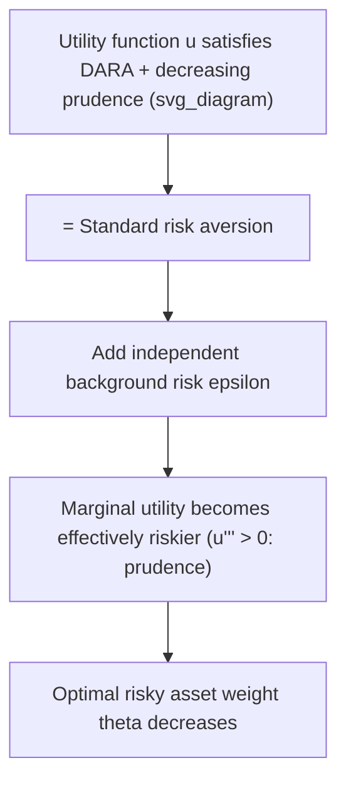

## Background Risk and Portfolio Decisions

### Overview

**Background risk** refers to sources of uncertainty an investor faces that are outside the financial portfolio itself and generally cannot be traded away or fully hedged — labor income risk, housing/real estate risk, business ownership risk, health-expenditure risk, and entrepreneurial income risk are the most commonly studied examples. Because background risk is exogenous, undiversifiable, and often correlated with returns on tradable assets, its presence systematically alters the optimal allocation of the *tradable* portfolio relative to the prediction of standard models that ignore it. This topic generalizes the human-capital discussion into a broader class of non-tradable risks and connects directly to the precautionary-saving and prudence literature in intertemporal choice theory.

### Defining Background Risk

**Key Points**

- **Independent background risk**: an additive risk to wealth or income that is statistically independent of financial asset returns (e.g., a health shock uncorrelated with the stock market).
- **Correlated (or "dependent") background risk**: a risk whose realizations co-vary with financial returns (e.g., an entrepreneur whose business income is procyclical and thus correlated with equity markets).
- **Multiplicative vs. additive background risk**: additive risk enters wealth as $W + \epsilon$; multiplicative risk scales wealth, e.g., $W(1+\epsilon)$. The distinction matters for the sign and magnitude of the resulting portfolio effect.
- Background risk is distinguished from the risk of the tradable asset menu specifically by its **non-diversifiable, non-hedgeable** nature within the model — the investor cannot buy or sell a claim on it directly (in contrast to, say, a second risky financial asset that could simply be added to the mean-variance optimization).

### The Central Result: Background Risk and Risk Aversion Toward Portfolio Risk

**Key Points**

- The foundational theoretical question is: how does the presence of an independent, unhedgeable background risk affect an investor's demand for a separate, hedgeable financial risk (the risky asset)?
- Under **expected utility theory**, the effect of background risk on risky-asset demand depends on properties of the utility function beyond simple risk aversion — specifically on **absolute prudence** and higher-order risk preferences, not on the sign of risk aversion alone.
- **Prudence** is formally defined via the third derivative of the utility function:

$$P(W) = -\frac{u'''(W)}{u''(W)}$$

Prudence governs the strength of the **precautionary motive** — the tendency to save or reduce risk exposure in the face of future income uncertainty, distinct from pure risk aversion (captured by $-u''/u'$).

### Kimball's Theorem and Standard Risk Aversion

**Key Points**

- Kimball (1993) formalized the conditions under which adding an independent background risk causes an investor to reduce their exposure to an independent, endogenously chosen risk (such as risky-asset holdings). This property is termed **"risk vulnerability"** in one formulation and is closely tied to the broader concept of **standard risk aversion**.
- A utility function exhibits **standard risk aversion** if both absolute risk aversion $A(W) = -u''(W)/u'(W)$ and absolute prudence $P(W) = -u'''(W)/u''(W)$ are **decreasing** in wealth (**DARA** and **decreasing absolute prudence**, respectively).
- Under standard risk aversion, adding an unhedgeable background risk makes the investor behave in a **more risk-averse** manner toward the remaining, tradable risk — optimal risky-asset holdings **decrease** relative to the no-background-risk benchmark.
- CRRA utility (constant relative risk aversion) satisfies DARA and decreasing absolute prudence for standard parameter ranges, and is therefore consistent with standard risk aversion — this is why CRRA-based models robustly predict that background risk reduces optimal equity holdings. [Inference] The exact magnitude of the reduction is highly sensitive to the size and variance of the background risk and the curvature parameter $\gamma$, and does not have a single universal closed-form value outside of specific parametric special cases.

### Formal Two-Period Illustration

**Example**

Consider an investor choosing risky-asset holdings $\theta$ to maximize expected utility of terminal wealth, first without and then with an independent additive background risk $\epsilon$ (mean zero):

**Without background risk:**

$$\max_\theta \; \mathbb{E}\big[u\big(W_0(1+r_f) + \theta(R - r_f)\big)\big]$$

**With independent background risk:**

$$\max_\theta \; \mathbb{E}\big[u\big(W_0(1+r_f) + \theta(R - r_f) + \epsilon\big)\big]$$

Under standard risk aversion (DARA + decreasing prudence, satisfied by CRRA), the solution $\theta^{**}$ to the second problem satisfies $\theta^{**} < \theta^{*}$, where $\theta^{*}$ solves the first problem — the presence of the background risk crowds out risky-asset demand, even though $\epsilon$ is statistically independent of $R$ and has zero mean.

**Intuition**: because marginal utility is convex under prudent preferences ($u''' > 0$), the background risk raises expected marginal utility at the margin, which increases the effective "cost" of bearing additional portfolio risk — the investor responds by holding a more conservative financial portfolio, effectively engaging in **precautionary portfolio behavior** analogous to precautionary saving.

### Correlated Background Risk

**Key Points**

- When background risk is **correlated** with the risky asset's return, the analysis becomes closer to the intertemporal-hedging framework: the sign of the correlation, not just the presence of prudence, drives the direction of the portfolio adjustment.
- **Negative correlation** (background risk tends to be bad exactly when the risky asset does well, or vice versa) can create a natural, partial hedge, potentially *increasing* optimal risky-asset demand relative to the independent-risk case.
- **Positive correlation** (e.g., an entrepreneur whose business income and equity portfolio both do poorly in recessions — "doubling up" on macroeconomic risk) reinforces the risk-reduction motive, typically leading to an even **larger reduction** in optimal risky holdings than under independence.
- This is the theoretical basis for standard financial-planning advice that employees with equity compensation, or business owners whose income is closely tied to the same sector as their financial holdings, should hold a **more conservative**, more diversified financial portfolio than an otherwise identical investor with uncorrelated income.

### Empirical Applications

**Key Points**

- **Entrepreneurial background risk**: private business owners face large, poorly diversifiable income risk from their firm; empirical studies commonly document that these investors hold a smaller share of financial wealth in public equities than non-entrepreneurs, consistent with the standard-risk-aversion prediction. [Inference] While broadly consistent with theory, disentangling this from liquidity constraints and limited outside financial wealth in the data is an ongoing empirical challenge, so the finding should be read as directionally supportive rather than a clean causal test.
- **Homeownership risk**: housing wealth is illiquid, undiversified (concentrated in a single asset), and often highly levered (via a mortgage); models incorporating housing as background risk generally predict reduced equity allocations for homeowners, particularly those with high loan-to-value ratios.
- **Health-expenditure risk**: uninsured or underinsured medical expense risk is studied as an additive background risk affecting both consumption-saving and portfolio decisions, particularly in retirement-phase models where uninsured long-term-care costs are large and back-loaded.
- **Labor income risk** (the human-capital case): as covered separately, labor income risk is the most extensively modeled background risk in lifecycle portfolio choice, generally treated as bond-like (low correlation) for most workers but as a source of *reduced* equity demand when correlated with equity markets or when borrowing against future income is infeasible.

### Precautionary Savings and the Portfolio-Consumption Link

**Key Points**

- Background risk simultaneously affects **both** the consumption-saving decision and the portfolio-allocation decision, because both are governed by the same underlying utility curvature (risk aversion and prudence).
- **Precautionary saving**: higher background-risk exposure typically raises optimal saving (lower current consumption) under prudent preferences, since the investor builds a buffer against the additional uncertainty.
- The joint consumption-portfolio problem under background risk is generally not separable in closed form except under restrictive functional-form assumptions (e.g., CARA utility with normally distributed, additively separable background risk, which yields tractable closed-form solutions via the certainty-equivalent approach), and is otherwise solved numerically using the dynamic-programming and value-function-iteration methods covered under general dynamic programming.

### Modeling Approaches Summary

| Approach | Key assumption | Typical result |
| --- | --- | --- |
| CARA-normal (mean-variance certainty equivalent) | Utility is CARA, background risk normal, additive, independent | Closed-form: risky demand reduced by a term proportional to background-risk variance |
| Kimball/standard risk aversion (general expected utility) | DARA + decreasing prudence | Qualitative result: risky demand falls under independent background risk |
| Correlated background risk models | Explicit joint distribution of background risk and returns | Sign of adjustment depends on correlation; magnitude depends on prudence and risk aversion |
| Numerical dynamic programming (lifecycle models) | General, possibly non-normal, time-varying background risk (e.g., labor income) | No closed form; solved via backward induction over an augmented state space |

### Limitations and Open Issues

**Key Points**

- Standard risk aversion (DARA + decreasing prudence) is a **sufficient**, not strictly necessary, condition for background risk to reduce risky-asset demand; utility functions violating decreasing prudence can, in principle, generate the opposite prediction. [Inference] Most commonly used utility specifications in applied finance (CRRA, and CARA under normality) do satisfy the sufficient condition, but this should not be read as a universal law across all admissible expected-utility functions.
- Background-risk models typically assume the risk is **exogenous** to the portfolio decision; in reality, some background risks (e.g., choice of business line, occupation, or degree of leverage on a home) are partly endogenous choices interacting with financial risk-taking, which is not captured in the baseline framework.
- Quantifying the *empirical* magnitude of background risk (especially labor income risk and entrepreneurial income risk) is difficult, and calibrated models are sensitive to these input assumptions — a recurring theme across the lifecycle and background-risk literatures. [Unverified] Precise, universally agreed-upon calibration values for background-risk variance and persistence do not exist across the literature; researchers use varying data sources (panel income surveys, tax records) with materially different resulting estimates.

### Conclusion

Background risk demonstrates that portfolio choice cannot be analyzed in isolation from the full set of risks an investor faces in life, even when those risks cannot be directly traded. The key theoretical insight — that the effect of background risk on optimal risky-asset holdings depends on prudence and standard risk aversion, not risk aversion alone — connects portfolio theory to the broader precautionary-saving literature and provides a rigorous foundation for practical advice to reduce financial risk-taking among investors with large, correlated, undiversifiable non-financial risks.

**Related Topics**

- Prudence, precautionary saving, and the third derivative of utility
- Kimball's standard risk aversion and risk vulnerability
- Human capital and labor income risk (special case of background risk)
- Entrepreneurial finance and private business owner portfolio choice
- Housing as an undiversified background risk
- CARA-normal models and mean-variance certainty equivalents
- Health-expenditure risk in retirement portfolio models
- Numerical dynamic programming with augmented state spaces