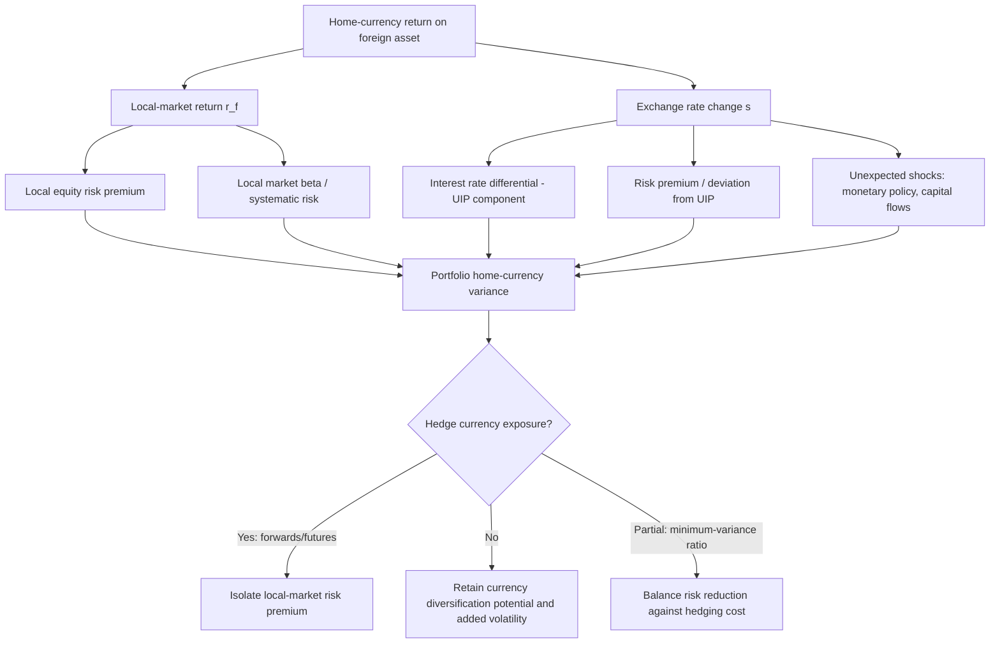

## International Portfolio Diversification

### Overview

International portfolio diversification extends mean-variance and dynamic portfolio theory across national capital markets, exploiting imperfect correlation between country and asset-class returns to improve the risk-return trade-off beyond what is achievable domestically. The theoretical case rests on classical diversification logic — if international returns are not perfectly correlated, combining them reduces portfolio variance for a given expected return — but the practical implementation is substantially complicated by exchange rate risk, differing consumption baskets across investors (breaking a single universal mean-variance frontier), capital controls, home bias, and time-varying cross-market correlations that tend to rise precisely when diversification benefits are most needed (crisis periods). This chapter develops the theoretical foundations, the currency hedging problem, empirical findings on realized diversification benefits, and the puzzle of persistent home bias.

### Theoretical Foundations

#### Domestic Mean-Variance Extended to $N$ Countries

Standard Markowitz mean-variance optimization generalizes directly when the investable universe spans multiple countries. For an investor choosing portfolio weights $w = (w_1, \ldots, w_n)'$ across $n$ international assets/indices with expected return vector $\mu$ and covariance matrix $\Sigma$:

$$\min_w \frac{1}{2}w'\Sigma w \quad \text{s.t.} \quad w'\mu = \mu_p, \quad w'\mathbf{1} = 1$$

The diversification gain from adding international assets is governed by the same variance-reduction identity as domestic diversification: for a two-asset (domestic $d$, foreign $f$) portfolio,

$$\sigma_p^2 = w_d^2\sigma_d^2 + w_f^2\sigma_f^2 + 2w_dw_f\rho_{df}\sigma_d\sigma_f$$

The lower $\rho_{df}$ (the domestic-foreign correlation), the greater the potential variance reduction for a given weight allocation, holding individual volatilities fixed.

**Key Points**

- Historically, international equity correlations were low enough (often 0.3–0.5 among major developed markets in the 1970s–1990s) that meaningful risk reduction was achievable purely from cross-border diversification, independent of expected return forecasting
- The efficient frontier constructed from a globally diversified asset universe first-order dominates (in mean-variance space) any frontier constructed from a purely domestic universe, given identical assumptions about $\mu$ and $\Sigma$ — this is a mechanical consequence of expanding the opportunity set, not an empirical claim
- Realized benefits depend critically on the *stability* of $\Sigma$ out-of-sample, which is a materially weaker assumption than in-sample optimization presumes [Inference — standard critique of mean-variance optimization applied to any multi-asset context, particularly acute internationally given structural market integration trends]

#### Why a Single World Mean-Variance Frontier Does Not Generally Exist

Unlike the classical domestic CAPM setting, international portfolio theory faces a fundamental complication: investors in different countries consume different baskets of goods, so real returns (deflated by each investor's domestic price index) differ across investors even for the *same* nominal foreign asset. This breaks the standard result that all investors share a common tangency portfolio.

$$r_{i}^{real,h} = r_i^{nominal} + s - \pi^h$$

where $r_i^{nominal}$ is the nominal local-currency return on asset $i$, $s$ is the exchange rate change (foreign currency appreciation against the home currency), and $\pi^h$ is home-country inflation. Because $\pi^h$ differs by investor nationality, the same asset offers a different real return distribution to investors of different nationalities — a phenomenon sometimes called the "international CAPM puzzle" in the deviation of real interest rate parity.

### Currency Risk in International Portfolios

#### Decomposing Foreign Asset Return

The return to a domestic investor holding a foreign asset decomposes (approximately, for small returns) as:

$$r^h \approx r^f + s$$

where $r^h$ is the return measured in the home currency, $r^f$ is the local-currency return in the foreign market, and $s$ is the percentage change in the exchange rate (foreign currency value in home currency terms). The variance of the home-currency return is:

$$\text{Var}(r^h) \approx \text{Var}(r^f) + \text{Var}(s) + 2\text{Cov}(r^f, s)$$

Currency risk therefore adds a variance term and a covariance term to the local-market risk. If $\text{Cov}(r^f, s) < 0$ (currency depreciation tends to accompany strong local equity performance, a pattern often observed for commodity-exporting or emerging markets), currency exposure can partially offset local market risk, reducing home-currency variance below what naive addition of variances would suggest.

#### To Hedge or Not to Hedge: The Currency Hedging Decision

**Key Points**

- **Fully hedged**: eliminates currency risk via forwards/futures, isolating the local-market risk premium; appropriate when currency risk is viewed as uncompensated volatility rather than a priced risk factor
- **Fully unhedged**: retains currency exposure; may add diversification benefit if currency returns are lowly correlated with equity returns, but adds volatility if not
- **Partial/optimal hedging**: derived from minimum-variance hedge ratios or full mean-variance optimization treating currency forwards as additional assets in the opportunity set

The minimum-variance hedge ratio for a single foreign asset is:

$$h^* = \frac{\text{Cov}(r^f, s)}{\text{Var}(s)}$$

**Siegel's Paradox** and **Purchasing Power Parity (PPP) considerations**: over long horizons, if real exchange rates mean-revert (weak-form PPP), currency risk may partially "wash out," reducing the case for hedging long-horizon strategic allocations while strengthening the case for hedging shorter-horizon tactical positions. [Inference — the empirical validity and half-life of PPP mean reversion is a long-debated, unsettled question in international finance, so this horizon-dependent hedging logic is a widely cited heuristic rather than an established fact]

**Black's Universal Hedging Formula** (Fischer Black, 1989): under a set of restrictive assumptions (identical relative risk aversion across investors worldwide, log-normal returns), derives a single optimal hedge ratio applicable to all investors regardless of nationality — a theoretically elegant but empirically contested result given its assumption of internationally homogeneous risk aversion.

### The International CAPM (ICAPM)

Solnik (1974) and Sercu (1980) extended the domestic CAPM to a multi-currency setting under PPP deviations. The general form of the ICAPM expected return relationship for asset $i$ from the perspective of a home investor:

$$E[r_i^h] - r_f^h = \beta_{i,w}(E[r_w^h] - r_f^h) + \sum_{k=1}^{K} \gamma_{i,k}\lambda_k$$

where $\beta_{i,w}$ is the asset's beta with respect to the world market portfolio, and the summation captures additional priced risk factors for each currency $k$'s exchange rate risk (with associated risk premia $\lambda_k$), since under PPP deviations exchange rate risk is not fully diversifiable across the world's heterogeneous investor base.

**Key Points**

- Under the strong assumption of PPP holding continuously (identical real consumption baskets worldwide), ICAPM collapses to the standard single-factor world CAPM, and currency risk carries no separate risk premium
- Under realistic PPP deviations, currency risk factors are priced separately from the world market factor, and the model requires estimating each currency's risk premium in addition to the world market premium
- Empirical tests of ICAPM face the same joint-hypothesis problem as domestic CAPM tests (any rejection could reflect an incorrect world market proxy rather than a genuinely misspecified model), compounded by the difficulty of proxying the "world market portfolio" itself

### Diagram: Sources of Return and Risk in International Investing

### Empirical Evidence on Diversification Benefits

#### Rising Cross-Market Correlations

A substantial empirical literature documents that international equity market correlations have risen over recent decades, attributed to trade integration, synchronized monetary policy cycles, common shocks (global financial crisis, COVID-19), and the increasing role of global institutional investors and passive index flows. This trend has been widely characterized as reducing the marginal diversification benefit of simple developed-market equity diversification relative to earlier decades. [Inference — directionally well-supported by a wide body of empirical correlation studies, though the precise magnitude and permanence of the correlation increase, and its variation across sub-periods, remain subjects of ongoing empirical research rather than settled point estimates]

#### Correlation Asymmetry: "Diversification Fails When You Need It Most"

A robust finding across the international finance literature is that cross-market correlations rise disproportionately during market downturns and crisis periods relative to calm periods — sometimes modeled via asymmetric GARCH-DCC (dynamic conditional correlation) frameworks or copula-based dependence structures rather than assuming constant correlation. This "correlation breakdown" or "contagion" phenomenon means diversification benefits estimated from full-sample average correlations can overstate the *tail-risk* protection actually delivered during systemic crises.

#### Emerging Markets and Frontier Markets

Emerging and frontier market equities have historically exhibited lower correlations with developed markets than developed markets exhibit with each other, offering a continuing (if narrower, over time) diversification margin, alongside higher expected returns, higher volatility, and additional risks: capital controls, currency convertibility risk, weaker institutional/legal protections, and lower liquidity.

### The Home Bias Puzzle

Despite the well-documented theoretical case for international diversification, investors worldwide persistently hold domestic equity portfolios that are far more concentrated in home-market assets than a market-capitalization-weighted global portfolio would imply — the "equity home bias puzzle," first systematically documented by French and Poterba (1991) and Cooper and Kaplanis (1994).

**Key Points — Proposed Explanations**

- **Hedging domestic inflation/consumption risk**: domestic assets may better hedge home-country-specific consumption and inflation risk, providing a rational motive absent from naive mean-variance models
- **Information asymmetries**: investors have better information about, and lower monitoring costs for, domestic firms, potentially justifying overweighting on risk-adjusted-information grounds
- **Transaction costs, capital controls, and withholding taxes**: explicit and implicit costs of foreign investment historically reduced net after-cost returns to diversification
- **Behavioral explanations**: familiarity bias, patriotism, and ambiguity aversion toward less-familiar foreign markets are commonly cited behavioral factors [Inference — behavioral explanations for home bias are widely discussed in the literature but are difficult to cleanly separate empirically from the rational-cost explanations above, and the literature has not converged on their relative quantitative importance]
- **Human capital hedging**: domestic labor income is already correlated with domestic market risk, which under some models argues for underweighting (not overweighting) domestic equities as a hedge — a finding that runs counter to observed behavior and deepens rather than resolves the puzzle

The persistence of substantial home bias even as explicit barriers to international investing (capital controls, transaction costs, information access) have fallen dramatically since the 1990s is frequently cited as evidence that behavioral and hedging-motive explanations, not merely frictions, play a meaningful role. [Unverified as a strong causal claim — the relative contribution of remaining frictions versus genuinely behavioral drivers to persistent home bias is not conclusively resolved in the literature]

### Diversification Vehicles and Practical Implementation

**Example**

A U.S. pension fund seeking international equity diversification faces several implementation channels, each with distinct risk/cost/liquidity trade-offs:

| Vehicle | Characteristics |
| --- | --- |
| Direct foreign listed equities | Full control, highest information/monitoring cost, subject to local settlement/custody risk |
| American Depositary Receipts (ADRs) | USD-denominated, traded on U.S. exchanges, simplifies custody but still carries underlying currency exposure |
| International index mutual funds / ETFs | Low cost, broad diversification, standard vehicle for retail and much institutional exposure |
| Currency-hedged share classes of international funds | Isolates local-market return, removes currency volatility, incurs hedging cost (roughly the interest rate differential plus transaction costs) |
| Global Depositary Receipts (GDRs) | Similar to ADRs but for cross-listing outside the U.S., common for emerging-market issuers |

A fund targeting a strategic 30% allocation to unhedged developed international equities, benchmarked to MSCI EAFE, accepts embedded currency risk as a diversification source given the fund's long investment horizon, while a fund with a shorter liability horizon or explicit currency-risk aversion might select the currency-hedged share class of the same underlying index fund, trading the diversification-from-currency argument for reduced short-term volatility.

### Dynamic Considerations in Multi-Period International Allocation

Within the broader dynamic/multi-period portfolio choice framework, international diversification introduces state variables beyond the single-period mean-variance setting:

- **Time-varying correlations and volatilities**: DCC-GARCH and regime-switching models are commonly used to capture the correlation-asymmetry finding above, feeding into dynamic rebalancing rules rather than static weights
- **Exchange rate predictability and carry trades**: deviations from uncovered interest rate parity (UIP) — the empirical finding that high-interest-rate currencies tend to *not* depreciate by the interest differential, contrary to naive UIP — motivate dynamic currency exposure as a distinct return source (the "carry trade" and "forward premium puzzle") rather than a pure risk-diversification instrument
- **Intertemporal hedging demands**: in a Merton-style intertemporal framework, investors may hold currency and international equity positions not only for their static mean-variance properties but to hedge against changes in the investment opportunity set itself (e.g., shifts in global risk premia or exchange rate volatility regimes)

### Common Pitfalls

- Assuming in-sample historical correlations are stable forecasts of future correlations, particularly across crisis versus calm regimes
- Ignoring that real (not nominal) returns differ across investors of different nationalities, undermining the existence of a single global mean-variance frontier
- Treating currency hedging as costless or as unambiguously risk-reducing, when the hedging decision depends on the sign and magnitude of $\text{Cov}(r^f, s)$ and the investor's horizon
- Overstating diversification benefits from full-sample average correlations while ignoring correlation asymmetry (contagion) during systemic crises
- Conflating home bias with irrationality without first accounting for legitimate rational explanations (inflation hedging, information asymmetry, and remaining transaction/tax frictions)

**Related Topics**

- Uncovered interest rate parity (UIP), the forward premium puzzle, and currency carry trades
- DCC-GARCH and copula models for time-varying international correlation structures
- Consumption-based international asset pricing and real exchange rate risk premia
- Emerging market integration and the evolving cost of capital literature
- Intertemporal (Merton-style) portfolio choice and hedging demands
- Global minimum-variance portfolios versus market-cap-weighted international benchmarks
- Sovereign risk, capital controls, and political risk premia in emerging market investing