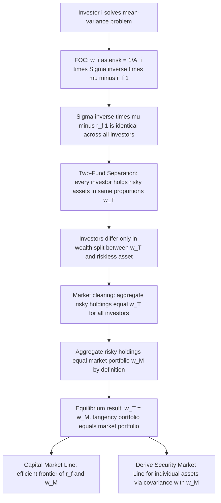

## Derivation of the CAPM

### Overview

The Capital Asset Pricing Model (CAPM), developed independently by Sharpe (1964), Lintner (1965), and Mossin (1966), derives an equilibrium relationship between an asset's expected return and its systematic risk from mean-variance portfolio theory combined with market-clearing conditions. This chapter presents the full derivation: from individual mean-variance optimization, through the separation theorem and the emergence of a single tangency portfolio, to market aggregation yielding the Security Market Line. The derivation clarifies precisely which assumptions are load-bearing and what the resulting risk measure (beta) actually represents.

### Assumptions Underlying the Derivation

The classical CAPM derivation requires the following assumptions, each of which is a genuine restriction whose relaxation generates a distinct branch of the asset pricing literature:

**Key Points**

- All investors are mean-variance optimizers (equivalently: either returns are jointly normally distributed, or all investors have quadratic utility) evaluating portfolios over a single common holding period
- Investors have homogeneous expectations: identical beliefs about the joint distribution (means, variances, covariances) of all asset returns
- A riskless asset exists, and investors can borrow and lend unlimited amounts at the same riskless rate $r_f$
- Markets are frictionless: no transaction costs, no taxes, assets are infinitely divisible, and short selling is unrestricted
- All investors are price takers; markets clear such that supply equals demand for every asset
- All assets are marketable/tradable (no non-traded human capital or other excluded wealth, in the classical version)

### Step 1: Individual Investor Mean-Variance Optimization

Each investor $i$ solves the standard Markowitz problem: choose portfolio weights $w$ across $n$ risky assets (with expected return vector $\mu$ and covariance matrix $\Sigma$) plus the riskless asset, to minimize variance for a target expected return, or equivalently maximize a mean-variance utility function:

$$\max_w \; w'\mu + (1-w'\mathbf{1})r_f - \frac{A_i}{2}w'\Sigma w$$

where $A_i$ is investor $i$'s risk aversion coefficient and $(1 - w'\mathbf{1})$ is the weight held in the riskless asset. The first-order condition with respect to $w$:

$$\mu - r_f\mathbf{1} - A_i\Sigma w = 0 \implies w^* = \frac{1}{A_i}\Sigma^{-1}(\mu - r_f\mathbf{1})$$

**Critical observation**: the vector $\Sigma^{-1}(\mu - r_f\mathbf{1})$ does not depend on the investor index $i$ — it is identical for every investor, since $\Sigma$ and $\mu$ are assumed common (homogeneous expectations) and $r_f$ is the same riskless rate available to all. Only the scalar $1/A_i$ differs across investors.

### Step 2: The Two-Fund Separation Theorem

The result above is precisely the Two-Fund (or Mutual Fund) Separation Theorem: every investor's optimal risky-asset weights are a scalar multiple of the *same* vector $\Sigma^{-1}(\mu - r_f\mathbf{1})$. Normalizing this vector to sum to 1 defines the **tangency portfolio** $w_T$:

$$w_T = \frac{\Sigma^{-1}(\mu - r_f\mathbf{1})}{\mathbf{1}'\Sigma^{-1}(\mu - r_f\mathbf{1})}$$

Every mean-variance investor, regardless of risk aversion $A_i$, holds risky assets *only* in the proportions given by $w_T$; investors differ only in how much of their total wealth they allocate to $w_T$ versus the riskless asset. Geometrically, $w_T$ is the point of tangency between a ray from $(0, r_f)$ in mean-standard-deviation space and the efficient frontier of risky assets — hence "tangency portfolio."

**Key Points**

- This is the pivotal simplification: instead of an infinite-dimensional problem of everyone potentially holding different risky-asset combinations, the entire cross-section of investor demand collapses to "how much of one specific portfolio" plus riskless lending/borrowing
- Separation depends on the availability of unrestricted riskless borrowing/lending at a common rate; when this assumption is relaxed (Black's zero-beta CAPM, below), a weaker two-fund separation among risky assets alone still holds, but the specific tangency portfolio result changes

### Step 3: Market Aggregation and Clearing

Since every investor holds risky assets in the same proportions $w_T$, and asset markets must clear (total demand for each asset equals its supply, i.e., its market value), the aggregate holdings across all investors must also be proportional to $w_T$. But the aggregate risky-asset portfolio, by definition, *is* the market portfolio $M$ — the value-weighted portfolio of all risky assets in the economy. Therefore:

$$w_T = w_M$$

The tangency portfolio derived from each individual's optimization *is* the market portfolio in equilibrium. This is the aggregation step that elevates a statement about individual optimal behavior into a statement about equilibrium asset pricing — no single investor needs to hold the literal market portfolio for this to be true; what matters is that in aggregate, across all investors, the market clears at these proportions.

### Diagram: From Individual Optimization to Market Equilibrium

### Step 4: The Capital Market Line (CML)

With $w_T = w_M$, every efficient portfolio (for any mean-variance investor) is a combination of the riskless asset and the market portfolio, lying on the **Capital Market Line**:

$$E[r_p] = r_f + \frac{E[r_M] - r_f}{\sigma_M}\sigma_p$$

The CML describes only *efficient* portfolios (combinations of $M$ and the riskless asset); it does not directly price individual inefficient assets or arbitrary portfolios, which generally plot below the CML in mean-standard-deviation space. The slope $\frac{E[r_M]-r_f}{\sigma_M}$ is the market price of risk (Sharpe ratio of the market portfolio).

### Step 5: Deriving the Security Market Line (SML)

The core CAPM pricing relationship for *any* individual asset (efficient or not) follows from a covariance argument applied to the market portfolio's optimality.

#### The Covariance Argument

Since $w_M$ is mean-variance efficient (it is the tangency portfolio), it satisfies the first-order condition from Step 1 applied to the market portfolio's implicit risk aversion. Consider perturbing the market portfolio's weight on asset $i$ by a small amount $\epsilon$, funded by reducing the riskless position. The portfolio variance is:

$$\sigma_p^2(\epsilon) = (w_M + \epsilon e_i)'\Sigma(w_M + \epsilon e_i)$$

Because $w_M$ is already optimal (it is the tangency/efficient portfolio for the representative marginal investor), the derivative of the mean-variance objective with respect to $\epsilon$, evaluated at $\epsilon = 0$, must be zero — this is the condition that $w_M$ cannot be improved upon by any further reallocation. Differentiating the mean-variance objective:

$$\frac{\partial}{\partial \epsilon}\left[w_p'\mu + (1-w_p'\mathbf{1})r_f - \frac{A}{2}w_p'\Sigma w_p\right]_{\epsilon=0} = 0$$

yields, after differentiating the quadratic form ($\partial \sigma_p^2/\partial \epsilon|_{\epsilon=0} = 2\,\text{Cov}(r_i, r_M)$):

$$\mu_i - r_f - A\,\text{Cov}(r_i, r_M) = 0 \implies \mu_i - r_f = A\,\text{Cov}(r_i, r_M)$$

#### Pinning Down the Market Risk Aversion Parameter $A$

Applying this same condition to the market portfolio itself (i.e., setting $i = M$, so $\text{Cov}(r_M, r_M) = \sigma_M^2$):

$$E[r_M] - r_f = A\sigma_M^2 \implies A = \frac{E[r_M] - r_f}{\sigma_M^2}$$

Substituting this back into the general relationship:

$$E[r_i] - r_f = \frac{E[r_M]-r_f}{\sigma_M^2}\,\text{Cov}(r_i, r_M)$$

Defining $\beta_i \equiv \dfrac{\text{Cov}(r_i, r_M)}{\sigma_M^2}$, this collapses to the canonical CAPM equation:

$$\boxed{E[r_i] = r_f + \beta_i\left(E[r_M] - r_f\right)}$$

This is the **Security Market Line (SML)**, and unlike the CML, it holds for *every* asset and portfolio in the economy, efficient or not — it is a statement about the *pricing* of individual securities, not merely a description of the efficient frontier.

### Interpreting Beta

**Key Points**

- $\beta_i = \text{Cov}(r_i, r_M)/\text{Var}(r_M)$ measures an asset's *systematic* (non-diversifiable) risk — its sensitivity to market-wide fluctuations, not its total risk (standard deviation)
- Total risk decomposes as $\sigma_i^2 = \beta_i^2\sigma_M^2 + \sigma_{\varepsilon,i}^2$, where the first term is systematic risk and $\sigma_{\varepsilon,i}^2$ is idiosyncratic (firm-specific) risk uncorrelated with the market
- Idiosyncratic risk is diversifiable — an investor holding a well-diversified portfolio can eliminate it at no cost, so the market does not compensate investors for bearing it; only $\beta_i$, the non-diversifiable component, commands a risk premium in equilibrium
- $\beta_i > 1$: asset amplifies market movements ("aggressive"); $\beta_i < 1$: asset dampens market movements ("defensive"); $\beta_i < 0$: asset moves opposite to the market and, per the SML, can carry an expected return *below* the riskless rate, since it provides valuable hedging/insurance against market downturns

### Alternative Derivation Path: Via the Efficient Frontier's Tangency Condition

An equivalent, more geometric derivation starts directly from the mathematics of the mean-variance efficient frontier (without the individual-investor utility-maximization detour above) and shows that *any* portfolio $p$ on the efficient frontier satisfies, for every asset $i$:

$$E[r_i] - r_f = \frac{\text{Cov}(r_i, r_p)}{\sigma_p^2}\left(E[r_p] - r_p\right)$$

Since $w_M$ is shown (via the separation theorem and market clearing) to itself lie on the efficient frontier, substituting $p = M$ yields the identical SML result. This path emphasizes that the SML relationship is fundamentally a *mathematical property of any mean-variance-efficient portfolio*, and the economic content of CAPM lies specifically in the equilibrium argument (Steps 1–3) establishing that the market portfolio, in particular, is the efficient portfolio relevant for all investors. [Inference — this is a standard textbook reformulation emphasizing where the "economics" versus the "linear algebra" of CAPM resides, a pedagogical framing rather than a disputed technical point]

### The Zero-Beta CAPM (Black, 1972)

When unrestricted riskless borrowing and lending is not assumed (a substantive relaxation of the classical assumption set), Fischer Black showed that two-fund separation among *risky* assets still holds, but the relevant benchmark for pricing becomes a combination of the market portfolio and a **zero-beta portfolio** $Z_M$ — the minimum-variance portfolio uncorrelated with the market portfolio ($\text{Cov}(r_{Z_M}, r_M) = 0$):

$$E[r_i] = E[r_{Z_M}] + \beta_i\left(E[r_M] - E[r_{Z_M}]\right)$$

This nests the standard CAPM as the special case $E[r_{Z_M}] = r_f$, and is the standard reference model when testing CAPM without assuming a literal riskless borrowing rate exists for all investors, addressing one of the most-criticized assumptions in the classical derivation.

### Diagram: CML versus SML (svg_diagram)

<svg xmlns="http://www.w3.org/2000/svg" viewBox="0 0 740 420">
<text x="370" y="24" text-anchor="middle" font-size="16" font-weight="bold" fill="#111">Capital Market Line vs Security Market Line (svg_diagram)</text>

<text x="180" y="50" text-anchor="middle" font-size="13" font-weight="bold" fill="`#3b5bdb`">CML: mean vs std dev (efficient portfolios only)</text>

<line x1="60" y1="200" x2="330" y2="200" stroke="#333" stroke-width="1.5" />

<line x1="60" y1="200" x2="60" y2="70" stroke="#333" stroke-width="1.5" />

<text x="335" y="205" font-size="11" fill="#333">sigma_p</text>

<text x="30" y="65" font-size="11" fill="#333">E[r_p]</text>

<circle cx="60" cy="170" r="3" fill="#000" />
<text x="40" y="185" font-size="10" fill="#333">r_f</text>
<path d="M 60 170 Q 150 130 250 90" fill="none" stroke="#495057" stroke-width="1.3" stroke-dasharray="3" />
<text x="120" y="150" font-size="9" fill="#868e96">risky-asset frontier</text>
<line x1="60" y1="170" x2="310" y2="80" stroke="#3b5bdb" stroke-width="2.5" />
<circle cx="230" cy="105" r="4" fill="#e8590c" />
<text x="235" y="100" font-size="10" fill="#e8590c">M (market, tangency)</text>
<text x="230" y="130" font-size="10" fill="#3b5bdb">CML</text>

<text x="560" y="50" text-anchor="middle" font-size="13" font-weight="bold" fill="`#d6336c`">SML: mean vs beta (all assets/portfolios)</text>

<line x1="440" y1="200" x2="710" y2="200" stroke="#333" stroke-width="1.5" />

<line x1="440" y1="200" x2="440" y2="70" stroke="#333" stroke-width="1.5" />

<text x="715" y="205" font-size="11" fill="#333">beta_i</text>

<text x="410" y="65" font-size="11" fill="#333">E[r_i]</text>

<circle cx="440" cy="170" r="3" fill="#000" />
<text x="420" y="185" font-size="10" fill="#333">r_f</text>
<line x1="440" y1="170" x2="690" y2="80" stroke="#d6336c" stroke-width="2.5" />
<circle cx="565" cy="125" r="4" fill="#0ca678" />
<text x="500" y="115" font-size="10" fill="#0ca678">M (beta = 1)</text>
<text x="640" y="105" font-size="10" fill="#d6336c">SML</text>
<circle cx="500" cy="150" r="3" fill="#495057" />
<text x="480" y="165" font-size="9" fill="#495057">low-beta asset</text>
<circle cx="650" cy="95" r="3" fill="#495057" />
<text x="655" y="90" font-size="9" fill="#495057">high-beta asset</text>

<text x="370" y="380" text-anchor="middle" font-size="11" fill="#555">CML prices only efficient combinations of r_f and M.</text>

<text x="370" y="398" text-anchor="middle" font-size="11" fill="#555">SML prices every individual asset via its covariance (beta) with M, efficient or not.</text>

</svg>

### What the Derivation Does and Does Not Establish

**Key Points**

- The derivation establishes an *equilibrium* relationship conditional on the assumption set holding — it is not a purely statistical or empirical result, and its validity as a description of actual expected returns depends entirely on the empirical validity of the underlying assumptions
- The market portfolio in the theoretical derivation includes *all* risky assets in the economy (equities, bonds, real estate, human capital, private business equity), not merely a stock market index — Roll's Critique (1977) shows that empirical CAPM tests, which necessarily proxy the market portfolio with an observable index, cannot definitively test or reject CAPM because the true market portfolio is unobservable, and different proxies can yield different, even contradictory, empirical conclusions [Inference — Roll's Critique is a well-established methodological point in the empirical asset pricing literature, included here as settled theory regarding the *logical structure* of the testing problem, distinct from the separate, ongoing empirical debate about how well CAPM performs given available proxies]
- Homogeneous expectations is an especially strong assumption; relaxing it (heterogeneous beliefs models) generally breaks the clean two-fund separation result and complicates aggregation substantially

### Common Pitfalls

- Confusing the Capital Market Line (efficient portfolios only, in mean-std dev space) with the Security Market Line (all assets, in mean-beta space) — they answer different questions and only coincide for the market portfolio itself
- Treating beta as a measure of *total* risk rather than *systematic* risk; a low-beta asset can still have high total volatility if most of that volatility is idiosyncratic
- Presenting CAPM's derivation as requiring investors to individually hold the literal market portfolio, rather than correctly stating that market clearing in aggregate is what produces $w_T = w_M$
- Overlooking Roll's Critique when evaluating empirical CAPM tests, and treating index-based tests as tests of the theoretical model itself rather than of a proxy for it
- Omitting the riskless-borrowing assumption's role, and thus missing why Black's zero-beta CAPM is a distinct, testable alternative rather than a mere technical footnote

**Related Topics**

- Roll's Critique and the empirical testability of CAPM
- Multi-factor extensions: Arbitrage Pricing Theory (APT) and the Fama-French three/five-factor models
- Consumption-based CAPM (CCAPM) and the stochastic discount factor generalization
- Black's zero-beta CAPM and its empirical implementation
- The Security Characteristic Line, beta estimation, and errors-in-variables problems (Fama-MacBeth methodology)
- Intertemporal CAPM (Merton, 1973) and time-varying investment opportunity sets
- International CAPM and cross-border market integration