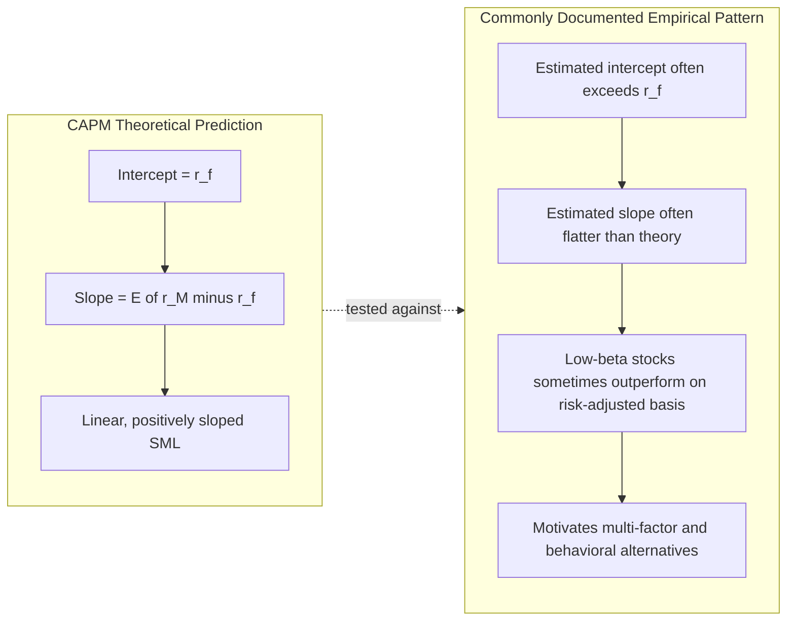

## Security Market Line and Systematic Risk

### Overview

The Security Market Line (SML) is the graphical and algebraic expression of the CAPM's central pricing relationship, plotting expected return against systematic risk (beta) for every asset and portfolio in the economy. Where the Capital Market Line describes only efficient combinations of the riskless asset and the market portfolio, the SML applies universally — to individual securities, inefficient portfolios, and efficient portfolios alike — because it is derived from a covariance-pricing condition rather than a frontier-tangency condition. This chapter develops the SML equation, decomposes total risk into systematic and idiosyncratic components, examines beta estimation in practice, and surveys the empirical evidence on whether the SML holds as CAPM predicts.

### The Security Market Line Equation

$$E[r_i] = r_f + \beta_i\big(E[r_M] - r_f\big)$$

where:

- $E[r_i]$ is the required/expected return on asset $i$
- $r_f$ is the riskless rate
- $E[r_M] - r_f$ is the market risk premium
- $\beta_i = \dfrac{\text{Cov}(r_i, r_M)}{\text{Var}(r_M)}$ is the asset's systematic risk measure

**Key Points**

- The SML is linear in $\beta_i$ by construction — this linearity is a testable implication of CAPM, not an assumption, and its empirical validity (or lack thereof) is one of the model's most scrutinized predictions
- The intercept of the SML is $r_f$ and the slope is the market risk premium $E[r_M] - r_f$; both are economy-wide constants that apply identically to every asset, with only $\beta_i$ varying across assets
- Any asset or portfolio plotting *above* the SML (given its beta) is undervalued relative to CAPM equilibrium (offering excess expected return for its systematic risk); any asset plotting *below* is overvalued — this is the basis for using the SML as a valuation benchmark, distinct from the market-clearing equilibrium interpretation of the theoretical derivation

### Decomposing Total Risk: Systematic versus Idiosyncratic

The single-index/market model regression underlies the empirical decomposition of an asset's total risk:

$$r_i = \alpha_i + \beta_i r_M + \varepsilon_i, \quad \text{Cov}(r_M, \varepsilon_i) = 0$$

Taking variances of both sides:

$$\sigma_i^2 = \beta_i^2 \sigma_M^2 + \sigma_{\varepsilon_i}^2$$

| Component | Term | Nature |
| --- | --- | --- |
| Systematic (market) risk | $\beta_i^2\sigma_M^2$ | Non-diversifiable; driven by common macroeconomic/market-wide factors; the *only* component priced under CAPM |
| Idiosyncratic (firm-specific) risk | $\sigma_{\varepsilon_i}^2$ | Diversifiable; firm-specific events (earnings surprises, litigation, management changes); can be eliminated in a well-diversified portfolio at no cost |

**Why only systematic risk is priced**: in a portfolio context, idiosyncratic shocks across many assets are (by construction, $\text{Cov}(\varepsilon_i, \varepsilon_j) \approx 0$ for well-diversified holdings) largely uncorrelated and average out as the number of holdings grows, following a law-of-large-numbers argument. Since a rational investor can eliminate idiosyncratic risk costlessly through diversification, the market does not compensate investors for bearing risk that could have been diversified away — compensation flows only to the risk that *cannot* be diversified away, i.e., $\beta_i$.

$$R^2 = \frac{\beta_i^2\sigma_M^2}{\sigma_i^2}$$

The $R^2$ from the market-model regression directly measures the proportion of an asset's total variance attributable to systematic risk — typically well under 50% for individual stocks, rising toward 1 for well-diversified portfolios as idiosyncratic components diversify away.

### Diagram: Diversification and the Decline of Idiosyncratic Risk (svg_diagram)

<svg xmlns="http://www.w3.org/2000/svg" viewBox="0 0 700 380">
<text x="350" y="24" text-anchor="middle" font-size="16" font-weight="bold" fill="#111">Portfolio Variance as Number of Assets Grows (svg_diagram)</text>
<line x1="70" y1="330" x2="650" y2="330" stroke="#333" stroke-width="1.5" />
<line x1="70" y1="330" x2="70" y2="50" stroke="#333" stroke-width="1.5" />
<text x="660" y="335" font-size="12" fill="#333">Number of assets (n)</text>
<text x="30" y="45" font-size="12" fill="#333">Portfolio variance</text>
<path d="M 90 70 Q 200 180 350 250 Q 500 290 630 300" fill="none" stroke="#d6336c" stroke-width="2.5" />
<text x="460" y="255" font-size="11" fill="#d6336c">total variance</text>
<line x1="90" y1="300" x2="630" y2="300" stroke="#3b5bdb" stroke-width="2.5" stroke-dasharray="6" />
<text x="500" y="315" font-size="11" fill="#3b5bdb">systematic risk floor (beta^2 * sigma_M^2)</text>
<path d="M 90 70 Q 200 180 350 250 Q 500 290 630 300" fill="none" stroke="none" />
<text x="130" y="130" font-size="11" fill="#495057">idiosyncratic</text>
<text x="130" y="145" font-size="11" fill="#495057">risk diversifies away</text>
<line x1="150" y1="150" x2="150" y2="230" stroke="#868e96" stroke-width="1" stroke-dasharray="2" />
<circle cx="90" cy="70" r="3" fill="#000" />
<circle cx="630" cy="300" r="3" fill="#000" />
</svg>

### Beta Estimation in Practice

#### Market Model Regression (Historical Beta)

The standard empirical estimator regresses an asset's excess returns on the market's excess returns over a historical window (commonly 60 monthly or 250 daily observations):

$$r_{i,t} - r_{f,t} = \alpha_i + \beta_i(r_{M,t} - r_{f,t}) + \varepsilon_{i,t}$$

$$\hat{\beta}_i = \frac{\widehat{\text{Cov}}(r_i, r_M)}{\widehat{\text{Var}}(r_M)}$$

estimated by OLS. The choice of return frequency, window length, and market proxy all materially affect the point estimate. [Inference — this sensitivity is a well-documented practical issue in applied beta estimation rather than a disputed theoretical point]

#### Adjustments to Raw (Historical) Beta

**Blume adjustment**: empirical betas tend to exhibit mean reversion toward 1.0 over time (assets with extreme historical betas tend to have less extreme future betas). Blume's (1975) simple adjustment:

$$\hat{\beta}_{adjusted} = 0.33 + 0.67\,\hat{\beta}_{historical}$$

This specific weighting was estimated from Blume's original sample period; the general *direction* of mean reversion is a broader documented regularity, but the specific coefficients (0.33/0.67) are sample-specific rather than universal constants. [Inference — the mean-reversion phenomenon is well-documented, but the precise Blume coefficients reflect one historical estimation and are commonly treated as a convention rather than a re-derived parameter in most applications]

**Vasicek adjustment**: a Bayesian shrinkage approach, weighting each firm's historical beta toward the cross-sectional average beta in inverse proportion to the estimation error of the individual beta estimate — firms with noisier (higher standard-error) beta estimates are shrunk more heavily toward the market average.

**Fundamental beta**: estimates beta from accounting/fundamental characteristics (financial leverage, operating leverage, earnings variability, firm size, industry) rather than purely from historical return covariances, useful when return history is short or unreliable (e.g., recent IPOs).

#### Levered versus Unlevered (Asset) Beta

Financial leverage amplifies equity beta relative to the underlying business (asset) risk. The standard unlevering formula (Hamada equation, assuming debt beta $\approx 0$ and a given tax rate $\tau$):

$$\beta_{asset} = \frac{\beta_{equity}}{1 + (1-\tau)\frac{D}{E}}$$

This decomposition is essential when comparing beta across firms with different capital structures, or when estimating a project-specific discount rate using "pure-play" comparable-firm betas that must first be unlevered, then relevered to the target firm's own capital structure:

$$\beta_{equity, target} = \beta_{asset} \times \left[1 + (1-\tau)\frac{D}{E}\bigg|_{target}\right]$$

### Portfolio Beta and Aggregation

Beta is a linear operator: the beta of a portfolio is the value-weighted average of the constituent betas:

$$\beta_p = \sum_{i=1}^{n} w_i \beta_i$$

This linearity — a direct consequence of the linearity of covariance — is what makes beta a convenient risk-budgeting tool at the portfolio level, unlike total variance (which involves cross-terms and does not aggregate linearly across weights).

### Empirical Tests of the SML: Does It Hold?

#### Fama-MacBeth (1973) Methodology

The standard two-pass empirical procedure for testing the SML:

1. **First pass (time series)**: for each asset/portfolio $i$, estimate $\hat{\beta}_i$ via time-series regression of returns on market returns
2. **Second pass (cross-section)**: for each period $t$, run a cross-sectional regression of realized returns on the first-pass betas: $r_{i,t} = \gamma_{0,t} + \gamma_{1,t}\hat{\beta}_i + \eta_{i,t}$
3. Average the cross-sectional coefficients $\bar\gamma_0, \bar\gamma_1$ over time and test whether $\bar\gamma_0 \approx r_f$ and $\bar\gamma_1 \approx E[r_M]-r_f$, consistent with the SML

Assets are typically pre-sorted into portfolios (rather than tested individually) to mitigate the errors-in-variables problem that arises because individual-stock betas are noisily estimated and used as a regressor in the second pass.

#### Key Empirical Findings

**Key Points**

- **Black, Jensen, and Scholes (1972)** and **Fama and MacBeth (1973)**: found a roughly linear cross-sectional relationship between average return and beta, broadly supportive of CAPM's qualitative prediction, though the estimated intercept tended to exceed $r_f$ and the estimated slope tended to be flatter than $E[r_M]-r_f$ — a pattern more consistent with a Black zero-beta-type model than the textbook CAPM
- **The "flat SML" / low-beta anomaly**: a large body of subsequent evidence finds the empirical relationship between beta and average return is considerably flatter than CAPM predicts, and in some samples and periods, low-beta stocks have delivered higher risk-adjusted returns than high-beta stocks — the "betting against beta" finding (Frazzini and Pedersen, 2014) — directly contradicting the SML's predicted positive linear slope [Inference — this is a well-established empirical regularity across a substantial body of published research, though its interpretation (mispricing versus a missing risk factor versus leverage-constrained-investor effects) remains actively debated rather than settled]
- **Fama and French (1992, 1993)**: found that beta alone has little power to explain the cross-section of average stock returns once size and book-to-market are controlled for, motivating the three-factor model as a response to perceived CAPM/SML empirical failure
- **Roll's Critique** implication for these tests: since the true market portfolio is unobservable, all such tests are joint tests of CAPM *and* the chosen market proxy; a rejection of the empirical SML does not unambiguously reject the theoretical CAPM

### Diagram: Theoretical SML versus Commonly Documented Empirical Pattern

### Using the SML in Practice

**Example**

A firm has an equity beta of 1.4, the current 10-year Treasury yield (proxy for $r_f$) is 4.2%, and the analyst assumes a market risk premium of 5.5% based on long-run historical equity premium estimates. The CAPM-implied cost of equity via the SML:

$$E[r_i] = 4.2\% + 1.4 \times 5.5\% = 4.2\% + 7.7\% = 11.9\%$$

This required return is then used as the discount rate for equity cash flows in a discounted cash flow valuation, or as the equity component of a WACC calculation for firm valuation. If the analyst instead observes the stock's traded price implies an expected return of 14%, the stock plots above the SML given its beta — flagged as potentially undervalued under CAPM logic, though the analyst should consider whether the gap instead reflects an omitted risk factor, an outdated beta estimate, or transient mispricing before drawing a strong conclusion. [Inference — the interpretation of an SML deviation as mispricing versus a missing risk factor is a judgment call inherent to applying single-factor CAPM, not a mechanical implication of the number itself]

### Common Pitfalls

- Using a stale or single-period beta estimate without considering estimation-window sensitivity, non-synchronous trading effects (particularly relevant for illiquid stocks), or the case for shrinkage/Blume-type adjustment
- Conflating total risk (standard deviation) with systematic risk (beta) — a high-volatility stock can have low beta if most of its volatility is idiosyncratic, and vice versa
- Applying a levered equity beta directly to an all-equity-financed project, without first unlevering comparable betas and relevering to the target capital structure
- Treating a rejection of the empirical SML slope as a definitive rejection of CAPM theory, without acknowledging Roll's Critique and the joint-hypothesis problem
- Assuming portfolio beta captures all relevant risk when idiosyncratic risk remains material due to insufficient diversification (concentrated portfolios)

**Related Topics**

- Derivation of the CAPM and the underlying equilibrium assumptions
- Fama-French three- and five-factor models as empirical responses to SML anomalies
- Betting-against-beta and low-volatility anomaly strategies
- Fama-MacBeth cross-sectional regression methodology and errors-in-variables corrections
- Roll's Critique and the joint-hypothesis problem in asset pricing tests
- Weighted Average Cost of Capital (WACC) and its use of CAPM-derived cost of equity
- Arbitrage Pricing Theory (APT) as a multi-factor generalization of single-index systematic risk