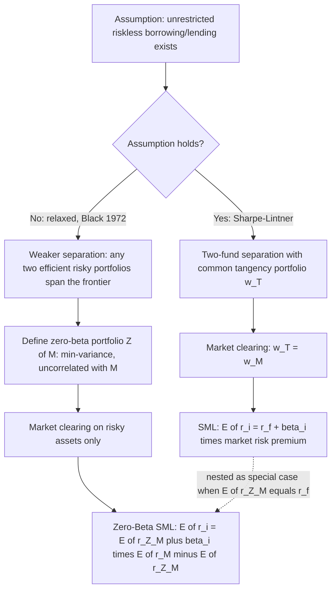

## Zero-Beta CAPM

### Overview

The Zero-Beta CAPM, developed by Fischer Black (1972), generalizes the standard Sharpe-Lintner CAPM by removing the assumption of unrestricted riskless borrowing and lending at a common rate — arguably the single most empirically fragile assumption in the classical derivation, since real-world investors typically borrow at rates well above the rate at which they can lend (e.g., Treasury bills), and some investors (certain institutional mandates, margin-constrained retail investors) face binding leverage constraints altogether. Black showed that two-fund separation among *risky* assets survives this relaxation, but the specific portfolio that replaces the riskless asset in the pricing relationship becomes an endogenously determined **zero-beta portfolio** rather than an exogenously given riskless rate. The result is both a theoretical generalization and, empirically, a substantially better fit to observed average-return/beta relationships than the standard SML.

### The Problem With Unrestricted Riskless Lending and Borrowing

The Sharpe-Lintner derivation critically relies on every investor facing the identical riskless rate $r_f$ for both lending and borrowing, unlimited in size. This assumption is empirically strained on several fronts:

**Key Points**

- **Borrowing/lending rate wedge**: retail and even institutional investors typically face a borrowing rate above the rate earned on riskless lending (a margin loan rate exceeds the T-bill rate), so a single $r_f$ mischaracterizes the true opportunity set for investors who wish to lever their risky-asset holdings
- **No literal riskless asset for some investors**: inflation risk, reinvestment risk over multi-period horizons, and sovereign default risk (for some currencies/investors) mean that even "riskless" government securities are not perfectly riskless in real terms for every investor
- **Borrowing constraints**: institutional mandates or margin regulations may prevent some investors from borrowing to lever risky-asset exposure at all, regardless of rate

Removing the common-rate assumption breaks the clean Two-Fund Separation Theorem result that every investor holds risky assets in *identical* proportions (the tangency portfolio) — different investors facing different effective borrowing/lending constraints will, in general, choose different risky-asset combinations along the efficient frontier.

### Black's Result: Separation Among Risky Assets Alone

Black's key insight is that even without a common riskless asset, a weaker but still powerful separation result holds: **every efficient portfolio of risky assets can be written as a combination of any two efficient (frontier) risky-asset portfolios**. This "two-fund separation without a riskless asset" is a purely mathematical property of the minimum-variance frontier (a consequence of the frontier being spanned by any two of its own points), and does not require homogeneous borrowing/lending assumptions.

#### Defining the Zero-Beta Portfolio

For any efficient portfolio $p$ on the risky-asset minimum-variance frontier, there exists a unique companion portfolio $Z(p)$ — the **zero-beta portfolio associated with $p$** — defined as the minimum-variance portfolio whose returns are *uncorrelated* with portfolio $p$:

$$\text{Cov}\big(r_{Z(p)}, r_p\big) = 0$$

Geometrically, $Z(p)$ is located at the point where a line tangent to the minimum-variance frontier at $p$ intersects the vertical (expected-return) axis in mean-variance space — the expected return of the zero-beta portfolio, $E[r_{Z(p)}]$, generally lies below the expected return of the global minimum-variance portfolio.

### Diagram: Constructing the Zero-Beta Portfolio (svg_diagram)

<svg xmlns="http://www.w3.org/2000/svg" viewBox="0 0 700 420">
<text x="350" y="24" text-anchor="middle" font-size="16" font-weight="bold" fill="#111">Zero-Beta Portfolio Geometrically (svg_diagram)</text>
<line x1="80" y1="370" x2="640" y2="370" stroke="#333" stroke-width="1.5" />
<line x1="80" y1="370" x2="80" y2="50" stroke="#333" stroke-width="1.5" />
<text x="650" y="375" font-size="12" fill="#333">sigma_p (std dev)</text>
<text x="45" y="45" font-size="12" fill="#333">E[r_p]</text>
<path d="M 200 250 Q 280 100 500 80" fill="none" stroke="#3b5bdb" stroke-width="2.5" />
<text x="470" y="70" font-size="11" fill="#3b5bdb">efficient frontier (risky assets)</text>
<path d="M 200 250 Q 250 320 320 340" fill="none" stroke="#3b5bdb" stroke-width="1.5" stroke-dasharray="3" />
<circle cx="360" cy="145" r="4" fill="#e8590c" />
<text x="368" y="140" font-size="11" fill="#e8590c">M (market portfolio)</text>
<line x1="80" y1="230" x2="500" y2="80" stroke="#0ca678" stroke-width="1.5" stroke-dasharray="4" />
<text x="150" y="200" font-size="10" fill="#0ca678">tangent line at M</text>
<circle cx="80" cy="230" r="4" fill="#d6336c" />
<text x="90" y="235" font-size="11" fill="#d6336c">Z(M): zero-beta portfolio</text>
<text x="90" y="250" font-size="10" fill="#555">Cov(r_Z, r_M) = 0</text>
<circle cx="200" cy="250" r="3" fill="#000" />
<text x="150" y="270" font-size="10" fill="#333">global min-variance portfolio</text>

<text x="350" y="400" text-anchor="middle" font-size="11" fill="#555">Z(M) is where the tangent line at M meets the vertical axis; E[r_Z(M)] less than E[r_min-var]</text>

</svg>

### Market Aggregation and the Zero-Beta SML

Applying the same market-clearing logic as the standard CAPM derivation — with the market portfolio $M$ now playing the role of the reference efficient portfolio rather than assuming it coincides with a riskless-asset-anchored tangency portfolio — Black derives the **Zero-Beta Security Market Line**:

$$E[r_i] = E[r_{Z(M)}] + \beta_i\Big(E[r_M] - E[r_{Z(M)}]\Big)$$

where $\beta_i = \text{Cov}(r_i, r_M)/\text{Var}(r_M)$, identical in definition to the standard CAPM beta.

**Key Points**

- This equation has the *same linear, single-factor structure* as the standard SML — the only change is that the intercept $E[r_{Z(M)}]$ replaces $r_f$, and the risk premium becomes $E[r_M] - E[r_{Z(M)}]$ rather than $E[r_M] - r_f$
- The standard Sharpe-Lintner CAPM is nested as the special case where a riskless asset exists and $E[r_{Z(M)}] = r_f$ — i.e., Zero-Beta CAPM is a strict generalization, not a competing model with unrelated structure
- Since $Z(M)$ is a portfolio of risky assets (not a riskless asset), $E[r_{Z(M)}]$ is generally *positive risk-bearing* and typically estimated empirically to exceed $r_f$, which is precisely the pattern Black, Jensen, and Scholes (1972) and subsequent studies found in cross-sectional tests: the empirical SML intercept tends to exceed the riskless rate, and the empirical slope tends to be flatter than $E[r_M]-r_f$ — both consistent with Zero-Beta CAPM rather than the textbook Sharpe-Lintner version

### Derivation Sketch

The derivation parallels the standard CAPM covariance argument (see the "Derivation of the CAPM" material), replacing the riskless-asset perturbation with a perturbation funded from the zero-beta portfolio $Z(M)$ rather than from $r_f$. Because $M$ is mean-variance efficient among risky assets, perturbing $M$'s weight on asset $i$ (funded by adjusting the weight on $Z(M)$, which by construction has zero covariance with $M$) and setting the first-order condition to zero yields:

$$E[r_i] - E[r_{Z(M)}] = \frac{E[r_M] - E[r_{Z(M)}]}{\sigma_M^2}\,\text{Cov}(r_i, r_M)$$

which rearranges directly to the Zero-Beta SML above. The mathematics is essentially identical to the standard derivation; the substantive economic content is entirely in what replaces the riskless asset as the pricing anchor.

### Diagram: Standard CAPM vs Zero-Beta CAPM Derivation Path

### Empirical Implications and Testing

**Key Points**

- Because $E[r_{Z(M)}]$ is not directly observable (it is a theoretical construct, not a traded riskless rate), empirical tests of Zero-Beta CAPM typically estimate the SML intercept and slope freely via Fama-MacBeth-style cross-sectional regressions and interpret the estimated intercept as an implied $\hat{E}[r_{Z(M)}]$, rather than imposing $r_f$ as the intercept a priori
- Black, Jensen, and Scholes (1972) explicitly tested this framework and found the estimated zero-beta rate exceeded the contemporaneous T-bill rate, and the estimated risk-premium slope was flatter than $E[r_M]-r_f$ — both findings consistent with Zero-Beta CAPM's prediction and inconsistent with the textbook Sharpe-Lintner restriction
- The flatter empirical slope directly connects to the modern "betting against beta" and low-volatility anomaly literature (Frazzini and Pedersen, 2014), which formalizes leverage-constrained investors bidding up high-beta assets (seeking implicit leverage they cannot access directly via borrowing) as a structural, ongoing source of SML flattening — offering a theoretically grounded mechanism consistent with Black's original insight rather than treating the flat-SML finding as an unexplained anomaly [Inference — this connection between Black's zero-beta framework and the modern betting-against-beta literature is a widely drawn link in the literature, presented here as an established interpretive connection rather than a raw empirical fact]

### Practical Use and Limitations

**Example**

A researcher testing whether a set of size-sorted portfolios' average returns are consistent with CAPM runs a Fama-MacBeth cross-sectional regression and obtains an estimated intercept $\hat\gamma_0 = 5.8\%$ against a contemporaneous average T-bill rate of $3.5\%$, with an estimated slope $\hat\gamma_1 = 4.2\%$ against a realized market risk premium of $6.5\%$. Under the Sharpe-Lintner null ($\gamma_0 = r_f$, $\gamma_1 = E[r_M]-r_f$), both point estimates deviate substantially from theory. Under the Zero-Beta CAPM interpretation, however, these estimates are directly interpretable as $\hat{E}[r_{Z(M)}] \approx 5.8\%$ and an implied risk premium of $4.2\%$ — a coherent equilibrium description under the weaker assumption set, rather than a rejection of equilibrium asset pricing altogether. [Inference — illustrative stylized numbers for exposition, not drawn from a specific published study]

**Key Points — Limitations**

- Zero-Beta CAPM does not resolve Roll's Critique: the market portfolio $M$ remains theoretically unobservable in the same way as in the standard model, so tests remain joint tests of the model and the chosen market proxy
- The model adds an additional freely estimated parameter ($E[r_{Z(M)}]$) relative to Sharpe-Lintner CAPM, which mechanically improves in-sample fit — this is a standard trade-off between generality and parsimony that should temper how strongly improved fit alone is read as support for the model's specific mechanism
- Like standard CAPM, Zero-Beta CAPM remains a single-factor model; it does not address the broader empirical challenges to single-factor explanations of the cross-section documented by Fama-French and subsequent multi-factor literature

### Common Pitfalls

- Treating Zero-Beta CAPM as an entirely separate model from standard CAPM rather than recognizing it as a strict generalization nesting Sharpe-Lintner as a special case
- Assuming $E[r_{Z(M)}]$ equals the riskless rate or can be directly observed from market data — it is an estimated, model-implied quantity, not a traded rate
- Interpreting improved empirical fit from the extra free intercept parameter as strong confirmation of Black's specific economic mechanism, without considering that additional flexibility mechanically improves fit
- Overlooking that Zero-Beta CAPM still inherits Roll's Critique regarding the unobservability of the true market portfolio
- Conflating the zero-beta portfolio $Z(M)$ with the global minimum-variance portfolio — they are related but generally distinct points on the efficient frontier

**Related Topics**

- Derivation of the CAPM and the standard Sharpe-Lintner assumption set
- Security Market Line and systematic risk, including empirical SML flatness findings
- Betting-against-beta and the low-volatility anomaly (Frazzini and Pedersen, 2014)
- Fama-MacBeth cross-sectional regression methodology
- Roll's Critique and the joint-hypothesis problem in asset pricing tests
- Multi-factor models (Fama-French, APT) as alternative responses to single-factor CAPM anomalies
- Leverage constraints and their asset-pricing implications in constrained-investor models