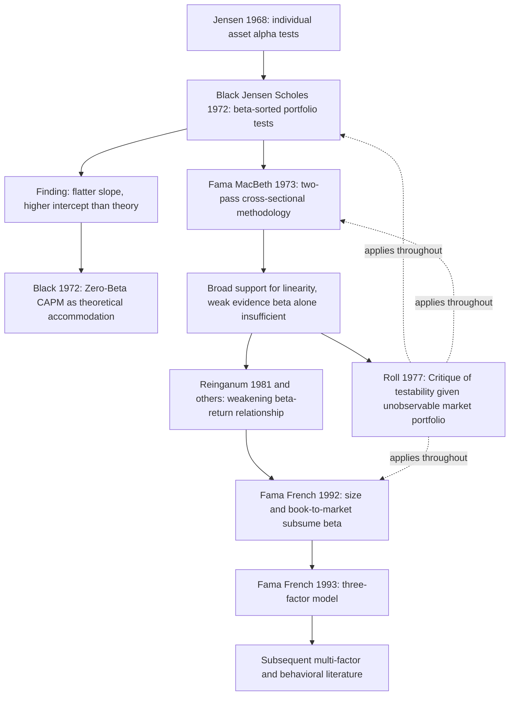

## Empirical Tests of the CAPM

### Overview

Empirical testing of the CAPM spans six decades of asset pricing research, evolving from early single-equation cross-sectional regressions through the Fama-MacBeth methodology, Roll's fundamental methodological critique, and ultimately the multi-factor literature that emerged largely as a response to CAPM's perceived empirical shortcomings. This chapter surveys the major testing methodologies, landmark empirical studies, the persistent anomalies that motivated departures from single-factor CAPM, and the methodological debates (Roll's Critique, the errors-in-variables problem, joint-hypothesis issues) that complicate interpretation of any CAPM test's results.

### What Exactly Is Being Tested

The CAPM generates two distinct testable implications, and conflating them is a common source of confusion in reading the empirical literature:

**Key Points**

- **Mean-variance efficiency of the market portfolio**: the theoretical claim is that the market portfolio $M$ is mean-variance efficient. Testing this directly requires observing (a proxy for) $M$ and testing whether it lies on the efficient frontier constructed from available assets
- **The Security Market Line relationship**: expected returns are linearly related to beta with intercept $r_f$ and slope $E[r_M]-r_f$. This is often tested indirectly via cross-sectional regressions of average returns on estimated betas, which is mathematically equivalent to (though computationally distinct from) testing mean-variance efficiency of the chosen market proxy
- These are two views of the *same underlying hypothesis* — a result formalized by Gibbons, Ross, and Shanken (1989), whose GRS test directly tests mean-variance efficiency of a candidate market proxy using a multivariate regression framework, providing a more statistically rigorous alternative to two-pass cross-sectional regressions

### Early Time-Series Tests: The Market Model and Jensen's Alpha

The earliest CAPM tests examined individual asset "market model" regressions:

$$r_{i,t} - r_{f,t} = \alpha_i + \beta_i(r_{M,t} - r_{f,t}) + \varepsilon_{i,t}$$

Under CAPM, $\alpha_i = 0$ for every asset — the intercept should be zero once the asset's systematic risk (beta) is properly compensated by the market risk premium. **Jensen (1968)** used this framework to evaluate mutual fund performance, interpreting a statistically significant positive (negative) alpha as evidence of manager skill (or lack thereof) after controlling for systematic risk — an application that remains the standard performance-attribution framework in practice today, independent of whether CAPM itself holds precisely.

**Key Points**

- Testing $\alpha_i = 0$ asset-by-asset is statistically weak (low power) given the high idiosyncratic variance of individual stock returns, motivating the shift toward portfolio-level and cross-sectional tests
- Time-series alpha tests and cross-sectional SML tests are related but ask subtly different questions: alpha tests ask whether *this specific* market proxy explains average returns asset-by-asset; cross-sectional tests ask whether the *beta-return relationship* itself is linear with the theoretically predicted slope and intercept

### The Fama-MacBeth (1973) Two-Pass Methodology

The dominant classical testing methodology, still widely used (with modifications) today:

**Pass 1 (time series)**: For each of $n$ test assets/portfolios, estimate $\hat\beta_i$ via time-series regression over a historical estimation window.

**Pass 2 (cross-section)**: For each subsequent period $t$, run a cross-sectional regression of realized returns on the pass-1 betas:

$$r_{i,t} = \gamma_{0,t} + \gamma_{1,t}\hat\beta_i + \eta_{i,t}$$

**Aggregation**: average the period-by-period estimated coefficients $\{\hat\gamma_{0,t}\}$ and $\{\hat\gamma_{1,t}\}$ over the full sample, and test:

$$H_0: \bar{\hat\gamma}_0 = r_f, \quad \bar{\hat\gamma}_1 = E[r_M] - r_f$$

The Fama-MacBeth standard errors are computed from the *time-series* variability of the period-by-period cross-sectional coefficient estimates, which conveniently accounts for cross-sectional correlation in residuals without requiring an explicit covariance matrix estimate — a major practical advantage that explains the methodology's enduring popularity beyond CAPM testing specifically (it remains a standard tool throughout empirical asset pricing, including modern factor-model tests).

#### Why Portfolios, Not Individual Stocks

**Key Points**

- Individual stock betas are estimated with substantial sampling error (an "errors-in-variables" problem), and using a noisy $\hat\beta_i$ as a regressor in the second-pass cross-sectional regression biases the estimated slope coefficient toward zero (attenuation bias)
- **Black, Jensen, and Scholes (1972)** pioneered the standard solution: group individual stocks into portfolios sorted by pre-ranking beta estimates, which averages out much of the individual-stock estimation error and produces cross-sectionally more dispersed, more precisely estimated portfolio betas
- This portfolio-formation approach became standard practice, but introduces its own subtlety: the choice of sorting variable and portfolio-formation procedure can itself influence the resulting inference, particularly when the sorting variable is correlated with the very characteristic (e.g., size) later found to have independent explanatory power

### Landmark Studies and Their Findings

#### Black, Jensen, and Scholes (1972)

Using NYSE stock data (1926–1966) sorted into beta-ranked portfolios, BJS found the empirical SML was approximately linear in beta but with an estimated intercept exceeding $r_f$ and an estimated slope flatter than the theoretical $E[r_M]-r_f$ — the paper that directly motivated Black's (1972) zero-beta CAPM as a theoretical accommodation of this specific empirical pattern.

#### Fama and MacBeth (1973)

Extending the methodology and sample (NYSE, 1935–1968), Fama and MacBeth tested three specific CAPM implications: (1) the risk-return relationship is linear in beta, (2) beta is the *only* priced risk measure (no additional explanatory power from residual/idiosyncratic variance), and (3) higher beta is compensated by higher average return (positive risk premium). They found broad support for linearity and found no reliable additional explanatory power from residual variance, providing some of the most frequently cited early support for CAPM's qualitative structure, albeit again with a flatter-than-theoretical slope consistent with BJS.

#### Reinganum (1981) and Early Anomaly Evidence

Reinganum's tests using more recent data and refined methodology found the beta-return relationship to be considerably weaker and less reliable than earlier studies suggested, an early signal of the broader anomaly literature that would follow.

#### Fama and French (1992)

A pivotal and widely cited result: using NYSE, AMEX, and NASDAQ stocks (1963–1990), Fama and French found that once firm size and book-to-market equity are included in cross-sectional regressions, beta shows *little to no* additional power to explain the cross-section of average returns — and beta *alone*, without these other characteristics, shows a notably weak relationship with average returns over their sample period. This finding, more than any single prior study, catalyzed the shift of mainstream academic asset pricing away from single-factor CAPM toward multi-factor models.

**Key Points**

- Fama-French (1992) does not claim beta is *unrelated* to risk or return in all specifications — they document that in their particular sample and specification, size and book-to-market subsume beta's explanatory power in cross-sectional regressions
- This finding has been extensively debated on multiple grounds: sample-period sensitivity, the choice of test assets, potential data-snooping given that size and value characteristics were partly identified through prior exploratory research on the same or overlapping datasets, and methodological choices in portfolio formation [Inference — these are genuine, actively pursued lines of critique in the subsequent literature rather than settled dismissals; the finding remains influential but not universally accepted as decisive against CAPM]

### Diagram: Evolution of CAPM Empirical Testing

### Roll's Critique (1977): The Fundamental Methodological Problem

Richard Roll's critique is not an empirical finding but a logical/methodological argument about what CAPM tests can and cannot establish:

**Key Points**

- CAPM's central prediction concerns the *true* market portfolio — encompassing all risky assets in the economy, including human capital, real estate, private business equity, and international assets — which is fundamentally unobservable in practice
- Every empirical test necessarily substitutes an observable proxy (typically a broad equity index) for the true market portfolio; Roll shows that whether the proxy is mean-variance efficient and whether the *true* market portfolio is mean-variance efficient are logically distinct questions
- A rejection of the SML using a given proxy does not definitively reject CAPM itself — it may simply indicate the chosen proxy is not mean-variance efficient, which is uninformative about whether the true (unobservable) market portfolio is efficient
- Conversely, failing to reject the SML with a given proxy does not confirm CAPM, since a different, equally defensible proxy might yield a different conclusion
- Roll's implication is stark: CAPM, in its purest theoretical form, may be **untestable** in principle, since the required data (the true market portfolio's composition and returns) can never be fully observed [Inference — this is Roll's own conclusion and is widely accepted as logically valid within the terms of his argument; whether this renders *practical* CAPM applications (using standard equity index proxies) meaningless is a separate, more debated question, since many practitioners and researchers continue to use index-proxy CAPM tests as informative even while acknowledging Roll's point]

This critique reframes how all the empirical findings above should be read: they are tests of "CAPM as implemented with a specific market proxy," not unconditional tests of the theoretical model.

### Stambaugh (1982) and Market Proxy Sensitivity

Stambaugh extended Roll's logical point empirically, testing CAPM using several different market proxies of varying breadth (adding corporate bonds, government bonds, real estate, and other assets beyond a pure equity index) and found the qualitative conclusions of CAPM tests were relatively insensitive to reasonable variations in proxy breadth in his specific tests — a finding sometimes cited as partially mitigating (though not resolving) practical concern over Roll's Critique, since it suggests that within the range of *plausible* proxies actually available to researchers, conclusions may not change dramatically. [Inference — Stambaugh's robustness finding is specific to his sample and proxy choices, and is best read as evidence that Roll's Critique, while logically valid, may not be practically devastating for reasonably constructed equity-heavy proxies — not as a general resolution of the critique]

### The GRS Test (Gibbons, Ross, and Shanken, 1989)

The GRS test provides a rigorous, finite-sample multivariate $F$-test of the joint null hypothesis that all time-series intercepts (alphas) from a set of test-asset market-model regressions are jointly zero — directly testing mean-variance efficiency of the chosen market proxy, rather than relying on the two-pass Fama-MacBeth cross-sectional approach.

$$GRS = \frac{T-N-1}{N}\left[1 + \frac{(\hat\mu_M/\hat\sigma_M)^2}{}\right]^{-1}\hat\alpha'\hat\Sigma^{-1}\hat\alpha \sim F_{N, T-N-1}$$

(schematic form; $N$ is the number of test assets, $T$ the number of time periods, $\hat\alpha$ the vector of estimated intercepts, $\hat\Sigma$ the residual covariance matrix). The GRS test became the standard rigorous benchmark against which both CAPM and subsequent multi-factor models are evaluated, since it directly operationalizes the mean-variance-efficiency hypothesis with known finite-sample distributional properties under normality.

### Anomalies Documented in the Empirical Literature

**Key Points**

- **Size effect** (Banz, 1981): small-capitalization stocks historically earned higher average returns than their CAPM-predicted beta would justify
- **Value effect** (Basu, 1977; Fama-French, 1992): high book-to-market ("value") stocks historically outperformed low book-to-market ("growth") stocks after controlling for beta
- **Momentum** (Jegadeesh and Titman, 1993): past 3–12 month winners tend to continue outperforming past losers over similar subsequent horizons, a pattern with no natural explanation in static single-period CAPM
- **Low-volatility/betting-against-beta anomaly** (Frazzini and Pedersen, 2014, building on Black 1972 and earlier low-beta findings): low-beta stocks have in many samples delivered higher risk-adjusted (though not necessarily higher raw) returns than high-beta stocks, directly at odds with the SML's predicted positive slope
- Each of these anomalies motivated corresponding factor additions in the asset pricing literature (SMB for size, HML for value, momentum factors, BAB for betting-against-beta), collectively pushing mainstream empirical asset pricing decisively toward multi-factor frameworks

### Assessing the Overall Empirical Verdict

**Behavioral note on interpreting the evidence**: the empirical asset pricing literature has not converged on a single verdict regarding CAPM. Positions in the literature range from treating CAPM as empirically superseded by multi-factor models, to viewing CAPM as a still-useful first-order approximation for cost-of-capital and performance-benchmarking purposes despite known anomalies, to emphasizing (via Roll's Critique) that the model's core theoretical claim may never be conclusively testable with available data. [Unverified as a settled conclusion — this spread of views reflects genuine, ongoing disagreement in the field rather than a a resolved consensus, and readers should treat any single strong claim about CAPM being "confirmed" or "rejected" with appropriate skepticism regardless of source]

### Common Pitfalls

- Treating a rejection of a specific cross-sectional test as a definitive rejection of CAPM theory, without engaging with Roll's Critique
- Using individual-stock betas directly in cross-sectional tests without addressing the errors-in-variables/attenuation bias problem that motivated portfolio-based testing
- Citing Fama-French (1992) as showing beta is "meaningless," when the more precise finding is that size and book-to-market subsume beta's explanatory power *in their specific sample and specification*
- Conflating Jensen's alpha performance evaluation (a practically useful application assuming a market benchmark, regardless of whether CAPM holds exactly) with a formal test of CAPM's validity
- Overlooking that anomaly-motivated multi-factor models (Fama-French, momentum, BAB) are themselves subject to their own out-of-sample robustness debates and data-snooping concerns, and are not immune to critiques analogous to those leveled against CAPM

**Related Topics**

- Derivation of the CAPM and the theoretical assumption set being tested
- Security Market Line and systematic risk
- Zero-Beta CAPM as a theoretical response to BJS-type empirical findings
- Fama-French three- and five-factor models
- Momentum and betting-against-beta factor strategies
- The GRS test and modern factor-model evaluation methodology
- Data-snooping and multiple-testing concerns in empirical asset pricing