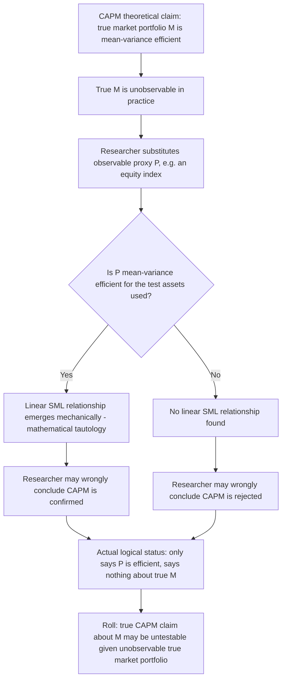

## Roll's Critique of CAPM Tests

### Overview

Richard Roll's 1977 paper, "A Critique of the Asset Pricing Theory's Tests," is not an empirical finding but a methodological and logical argument about the fundamental testability of the CAPM. Roll's core claim is that virtually all empirical tests of CAPM up to that point were not, in a strict sense, tests of the theory at all — they were tests of whether a *chosen proxy* for the market portfolio was mean-variance efficient, a materially weaker and different question. This chapter develops the logical structure of Roll's argument, its mathematical basis in the mean-variance efficiency/beta-linearity equivalence, its implications for interpreting the empirical CAPM literature, and the subsequent responses and partial mitigations the critique generated.

### The Core Logical Argument

Roll's argument proceeds in several connected steps:

**Key Points**

- CAPM's central theoretical claim is a joint statement: *the market portfolio $M$ is mean-variance efficient* AND *the resulting SML relationship holds for all assets given $M$*
- The *true* market portfolio, as required by the theoretical derivation, encompasses every risky asset in the economy — not just publicly traded domestic equities, but bonds, real estate, private business equity, commodities, collectibles, and human capital
- This true market portfolio is **unobservable** in practice: no dataset captures the returns, weights, and composition of literally every risky asset held by every economic agent
- Every empirical test therefore substitutes an observable **proxy** (a broad equity index — S&P 500, NYSE value-weighted index, CRSP index) for the theoretical construct
- Roll shows mathematically that whether a *given proxy* is mean-variance efficient, and whether the *true* market portfolio is mean-variance efficient, are logically independent questions — efficiency of one does not imply or follow from efficiency of the other

The conclusion: a test using any observable proxy is a test of that proxy's efficiency, not a test of CAPM's underlying economic claim about the true (unobservable) market portfolio.

### The Mathematical Basis: Mean-Variance Efficiency Implies the SML Tautologically

Roll's most striking technical point is that the linear beta-return relationship (the SML) is not really an independent, falsifiable economic prediction distinct from mean-variance efficiency — it is a *mathematical tautology* that holds for *any* mean-variance efficient portfolio, by the algebra of the efficient frontier, regardless of whether that portfolio has any particular economic significance as "the market."

**The key mathematical fact**: For *any* portfolio $p$ that lies on the mean-variance efficient frontier (excluding the global minimum-variance portfolio), and for *any* asset or portfolio $i$, the following exact linear relationship holds by construction:

$$E[r_i] = E[r_{Z(p)}] + \beta_{i,p}\big(E[r_p] - E[r_{Z(p)}]\big), \quad \beta_{i,p} = \frac{\text{Cov}(r_i, r_p)}{\text{Var}(r_p)}$$

where $Z(p)$ is the zero-beta portfolio associated with $p$. This is a **geometric property of quadratic optimization on the efficient frontier**, true for literally *any* efficient portfolio $p$ — not a special economic property that emerges only when $p$ happens to be the true market portfolio.

**Key Points**

- This means: if a researcher picks *any* index that happens to be (or is close to) mean-variance efficient with respect to the set of test assets used, a linear beta-return relationship will mechanically emerge in the data — regardless of whether that index bears any meaningful relationship to CAPM's theoretical market portfolio
- Conversely, if the chosen proxy is *not* mean-variance efficient (even if the true, unobservable market portfolio is efficient), no linear SML relationship will be found — and this failure says nothing about whether CAPM's true economic claim is correct
- The practical implication is stark: **finding support for the SML using a given index proves only that the index happens to be near the efficient frontier for the test assets used — not that CAPM's equilibrium argument is correct.** And failing to find SML support proves only that the chosen index is inefficient — not that no efficient market portfolio exists

### Diagram: The Logical Structure of Roll's Critique

### The Joint Hypothesis Problem

Roll's Critique is a specific instance of a broader methodological issue pervasive in empirical finance, sometimes called the **joint hypothesis problem**: any test of an asset pricing model is simultaneously a test of (a) the model itself and (b) the specific empirical implementation choices (proxy selection, sample period, test-asset selection, statistical methodology). A rejection can always be attributed to either component, and standard hypothesis testing cannot, by itself, disentangle which is at fault.

**Key Points**

- This joint hypothesis problem is not unique to CAPM — Eugene Fama emphasized the identical issue in the context of market efficiency tests (any test of the Efficient Market Hypothesis is simultaneously a test of EMH and of the specific equilibrium/pricing model used to generate expected returns) — but Roll's application to CAPM is the most influential specific instance in the asset pricing literature
- Multi-factor models (Fama-French, APT-based models) inherit an analogous version of the problem: tests of these models are joint tests of the model and the specific choice of factors and factor-mimicking portfolios, though the unobservability issue is somewhat less severe since factor portfolios (SMB, HML, momentum) are constructed from observable characteristics rather than requiring the literal universe of all risky assets

### Implications for Interpreting the Empirical Literature

**Key Points**

- Studies finding empirical support for the SML (Black-Jensen-Scholes 1972, Fama-MacBeth 1973) should be read as showing their chosen equity-index proxies were reasonably close to mean-variance efficient for their specific test-asset sets and sample periods — an interesting empirical fact in its own right, but not a confirmation of CAPM's underlying equilibrium argument
- Studies finding SML anomalies or a flat beta-return relationship (Fama-French 1992 and related) should similarly be read as showing the chosen proxy was *not* efficient for the given test assets — which, per Roll, does not definitively refute CAPM's theoretical claim about the true market portfolio
- This reframing does not mean CAPM empirical research is worthless — it means the research is best understood as testing "CAPM as operationalized with a specific proxy," a genuinely useful and widely used practical question (e.g., for cost-of-capital estimation), distinct from testing the pure theoretical claim
- Roll himself did not argue CAPM was false — his argument was narrower and more precise: that the theory, in its strictest form, may be **untestable in principle** given the unobservability of the true market portfolio, which is a different and in some ways more unsettling conclusion than "CAPM is wrong"

### Subsequent Responses and Partial Mitigations

#### Stambaugh (1982): Empirical Sensitivity Testing

Stambaugh directly tested how sensitive CAPM conclusions were to the breadth of the market proxy, expanding beyond pure equity indices to include corporate and government bonds and real estate. He found empirical conclusions were relatively stable across these proxy variations in his tests — offering some practical (though not logical) reassurance that, at least within the range of *plausible, available* proxies, Roll's Critique may not produce wildly different empirical conclusions in practice, even though it remains logically valid as stated. [Inference — this is the standard reading of Stambaugh's contribution in the subsequent literature: a partial, empirical mitigation rather than a resolution of Roll's logical point]

#### Shanken (1987): Statistical Power Considerations

Jay Shanken examined how *correlated* an observable proxy must be with the true (unobservable) market portfolio for tests using the proxy to have reasonable power to detect true inefficiency — formalizing the intuition that if a proxy is very highly correlated with the true market portfolio, tests using the proxy retain meaningful statistical power even though the logical point of Roll's Critique technically still applies. This reframes Roll's Critique from an absolute barrier into a more nuanced, degree-of-severity question dependent on how good available proxies actually are.

#### The GRS Test and Multivariate Efficiency Testing

The Gibbons-Ross-Shanken (1989) test, discussed in the empirical-tests material, provides a rigorous statistical framework for directly testing mean-variance efficiency of a *given* proxy — which is precisely the question Roll's Critique clarifies is actually being tested, rather than the broader (untestable) claim about the true market portfolio. In this sense, GRS can be seen as a methodological response that embraces Roll's reframing rather than attempting to circumvent it: it tests exactly and only what can be tested (proxy efficiency), with known statistical properties.

### Practical Implications for Applied Finance

Despite the logical force of Roll's argument, CAPM-based cost-of-capital estimation, beta estimation, and performance attribution (Jensen's alpha) remain pervasive in applied corporate finance and investment management. This practice is generally defended on pragmatic rather than strictly logical grounds:

**Key Points**

- Broad, diversified equity indices are widely regarded as *reasonable* (if imperfect) proxies for practical purposes, even though Roll's Critique establishes they are not logically equivalent to the theoretical market portfolio
- The alternative — attempting to construct a literally all-encompassing market portfolio including human capital and private assets — is generally viewed as impractical to the point of making the "purer" test infeasible in any real analysis, so applied work proceeds with acknowledged, imperfect proxies as the best available option
- Multi-factor models partially sidestep (though do not eliminate) the critique by relying on multiple observable factor portfolios rather than a single claimed market portfolio, distributing rather than resolving the underlying unobservability problem [Inference — this framing of multi-factor models as partially sidestepping rather than resolving Roll's issue is a reasonable extension of the logic rather than a claim found verbatim in any single canonical source]

### Common Pitfalls

- Treating Roll's Critique as a claim that CAPM is empirically false — Roll's argument is about testability/methodology, not a direct empirical refutation
- Assuming Roll's Critique renders all CAPM-based empirical work meaningless in practice — the critique establishes a logical limitation, not a claim that reasonable proxies produce uninformative results in an absolute sense
- Missing the tautological mathematical point: that *any* mean-variance efficient portfolio (not just "the market") will mechanically generate a linear SML relationship — this is the technical heart of the critique, distinct from the more familiar point about market portfolios simply being "hard to measure"
- Failing to connect Roll's Critique to the broader joint-hypothesis problem that pervades essentially all empirical asset pricing, including multi-factor model tests
- Overlooking that Roll's own stated position was more nuanced (untestability in the strict theoretical sense) than the often-cited shorthand "CAPM can't be tested because you can't observe the market portfolio," which omits the deeper tautology argument about mean-variance efficient portfolios generally

**Related Topics**

- Derivation of the CAPM and the theoretical role of the market portfolio
- Empirical tests of the CAPM and the landmark studies Roll's Critique reframes
- The GRS test and direct mean-variance efficiency testing
- Zero-Beta CAPM as a related theoretical refinement addressing a different assumption
- The joint hypothesis problem in market efficiency and asset pricing tests more broadly
- Multi-factor models (Fama-French, APT) as partial responses to single-proxy limitations
- Stambaugh (1982) and Shanken (1987) as methodological responses to proxy sensitivity