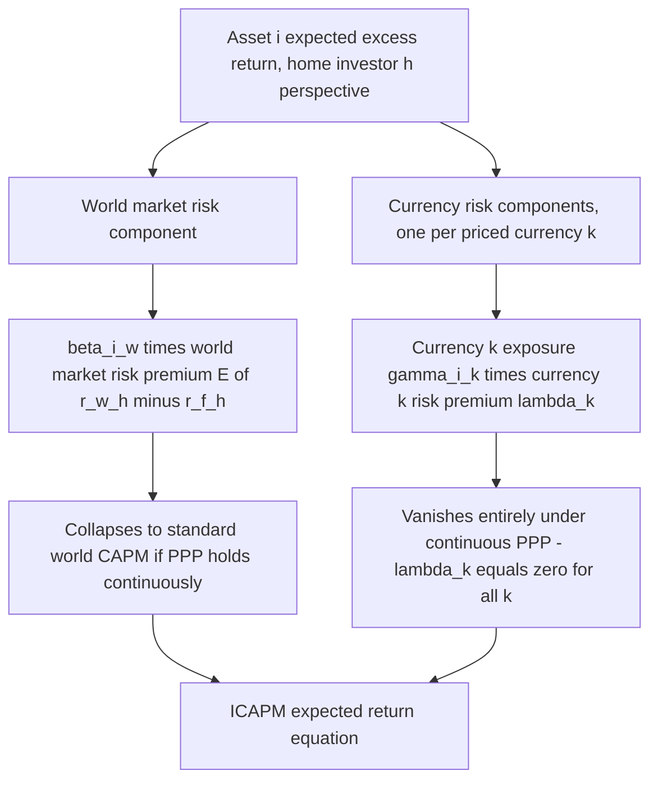

## International Extensions of the CAPM

### Overview

Extending CAPM to a multi-country, multi-currency setting requires confronting an assumption that is essentially invisible in a single-country context but becomes central internationally: purchasing power parity. In the domestic CAPM, all investors share the same consumption basket, so a single nominal risk-free rate and a single real return concept apply uniformly. Once investors from different countries consume different baskets of goods, the same nominal foreign security can generate different *real* return distributions for investors of different nationalities, breaking the domestic CAPM's clean aggregation into a single world tangency portfolio. This chapter develops the International CAPM (ICAPM) framework due to Solnik (1974) and Sercu (1980), the role of purchasing power parity deviations in generating priced currency risk, and the empirical evidence on whether currency risk is separately compensated in international asset pricing.

### Why Domestic CAPM Does Not Extend Trivially

#### The PPP Problem

Purchasing Power Parity (PPP) states that a common basket of goods should cost the same amount across countries once converted to a common currency. If PPP held continuously and exactly, real returns would be identical across investors of any nationality holding the same nominal asset, and the domestic CAPM derivation would extend essentially unchanged to a "world CAPM" with a single global tangency portfolio.

In practice, PPP deviations are large, persistent, and well-documented empirically — nominal exchange rates are far more volatile than relative price-level ratios would justify over any but very long horizons. This means the real return earned by, say, a Japanese investor holding U.S. equities differs systematically from the real return earned by a U.S. investor holding the identical position, because the two investors deflate nominal returns by different domestic price indices and are exposed to different exchange-rate-driven real return components.

$$r_i^{real,h} = r_i^{nominal,f} + s^{f \to h} - \pi^h$$

where $r_i^{nominal,f}$ is the local-currency nominal return, $s^{f\to h}$ is the percentage exchange rate change (foreign currency value in home-currency terms), and $\pi^h$ is home-country inflation. Because $\pi^h$ differs by investor nationality $h$, the same asset $i$ generates a *different real return distribution* to investors of different home countries — undermining the assumption of homogeneous real expectations required for the standard aggregation to a single world tangency portfolio.

**Key Points**

- This is the central theoretical complication distinguishing ICAPM from a naive "just replace domestic returns with home-currency-converted foreign returns" extension of the standard model
- Under continuous PPP, the ICAPM collapses exactly to a single-factor world CAPM with no separately priced currency risk — PPP deviations are the entire source of any additional currency risk premium in the model
- The severity of the departure from a single world CAPM is, in this framework, directly proportional to the empirical magnitude and persistence of PPP deviations, which is itself a long-debated empirical question in international finance [Inference — this direct linkage between PPP validity and ICAPM's departure from single-factor form is a standard theoretical point, though the empirical magnitude of real-world PPP deviations and their implications for actual pricing remain separately debated]

### The Solnik-Sercu ICAPM

#### General Form

The Solnik (1974) / Sercu (1980) International CAPM expresses the expected excess return on any asset, from the perspective of a home-country investor $h$, as a function of the asset's exposure to the world market factor *and* to each relevant currency's exchange rate risk:

$$E[r_i^h] - r_f^h = \beta_{i,w}\big(E[r_w^h] - r_f^h\big) + \sum_{k=1}^{K}\gamma_{i,k}\,\lambda_k$$

where:

- $\beta_{i,w}$ is asset $i$'s beta with respect to the world market portfolio (in home-currency real terms)
- $E[r_w^h] - r_f^h$ is the world market risk premium as perceived by investor $h$
- $\gamma_{i,k}$ is asset $i$'s sensitivity (exposure) to currency $k$'s exchange rate risk
- $\lambda_k$ is the risk premium associated with currency $k$, reflecting the extent to which that currency's risk is priced given PPP deviations

**Key Points**

- The number of separately priced currency factors, $K$, corresponds to the number of major currencies (or currency risk factors) relevant to the investor universe under consideration — unlike domestic CAPM's single risk factor, ICAPM is inherently a multi-factor model even though its underlying economic logic is a direct extension of single-period mean-variance reasoning, not an ad hoc multi-factor addition
- The world market risk premium term is analogous to the domestic CAPM risk premium but requires a global market portfolio proxy — a more severe practical version of the market-portfolio-observability problem raised by Roll's Critique in the domestic context, since a genuinely global proxy spanning all countries' investable assets is even harder to construct than a domestic equivalent
- Different home-country investors ($h$) generally perceive *different* risk premia for the same asset, since $E[r_w^h]$ and the currency exposures are measured relative to each investor's own consumption basket and inflation experience

### Diagram: Structure of the ICAPM Risk Decomposition

### Special Cases and the Role of PPP

#### Case 1: PPP Holds Continuously

If real exchange rates are constant (nominal exchange rate changes exactly offset inflation differentials at every instant), all investors worldwide face identical real return distributions on every asset, and the ICAPM reduces exactly to a single-factor **World CAPM**:

$$E[r_i] - r_f = \beta_{i,w}\big(E[r_w] - r_f\big)$$

with no separately priced currency risk, and — critically — this relationship holds identically for investors of every nationality, restoring the single-world-tangency-portfolio result.

#### Case 2: PPP Deviations Exist but Are Uncorrelated with Asset Returns

If exchange rate risk exists but is statistically independent of each asset's local-market return, currency risk may still not command a *separate* risk premium if it can be fully diversified away by holding a broad enough international portfolio — even though it adds variance to any individual holding. This mirrors the domestic-CAPM logic that idiosyncratic (diversifiable) risk is not priced, applied here to currency risk specifically.

#### Case 3: PPP Deviations Are Systematic and Correlated with the World Market

If currency risk is correlated with the world market factor (or has its own systematic, non-diversifiable component across the international investor universe), it commands a genuinely separate risk premium $\lambda_k \neq 0$, and the full multi-factor ICAPM structure is required. [Inference — the trichotomy presented here (Cases 1–3) is a standard pedagogical decomposition used to build intuition for when currency risk pricing "activates," rather than a formal taxonomy drawn verbatim from a single source]

### Adler and Dumas (1983): A Unified Framework

Adler and Dumas provided an influential synthesis reconciling several competing international asset pricing formulations of the era, expressing the ICAPM in terms of each investor's deviation from PPP and formalizing the intuition that the *number* of priced risk factors in the international setting depends on the number of distinct national inflation/consumption processes that are not spanned by (replicable from) available nominal assets. Their framework is frequently cited as the canonical reference point for the multi-currency risk-premium structure summarized above, and clarified the conditions under which the model reduces to fewer priced factors.

### Empirical Testing of ICAPM

**Key Points**

- Empirical tests of ICAPM face all the standard domestic CAPM testing challenges (Roll's Critique-style unobservability of the true world market portfolio, errors-in-variables in beta estimation) *plus* additional complications specific to the international setting: constructing a defensible world market proxy, choosing which currencies to include as separate risk factors, and handling the fact that different national researchers may reasonably specify the model from different home-currency perspectives
- Early tests (Solnik 1974, Stulz 1981 extensions) generally found some support for a positively priced world market factor, but evidence on separately priced currency risk premia has historically been mixed and sensitive to sample period, currency selection, and estimation methodology [Inference — "mixed and sensitive" is a fair, non-committal characterization consistent with how this literature is generally summarized in textbooks, without asserting a specific consensus verdict that the underlying literature does not clearly support]
- The broader multi-factor turn in domestic asset pricing (Fama-French and related) has parallel international-finance analogues, with some researchers finding that global versions of size and value factors have more explanatory power for international returns than currency-risk-augmented CAPM specifications, echoing the domestic CAPM-versus-multifactor debate in an international context

### Practical Application: Estimating the Cost of Capital for a Multinational

**Example**

A U.S.-based multinational evaluating a project in the Eurozone must decide whether to use a purely domestic CAPM discount rate (ignoring currency risk) or an ICAPM-adjusted rate reflecting EUR exposure. Suppose the project's cash flows have a world market beta of 1.1, the world market risk premium (from a U.S. investor's perspective) is estimated at 5.8%, the U.S. risk-free rate is 4.0%, and the project's estimated EUR currency exposure $\gamma_{i,EUR} = 0.4$ with an estimated EUR currency risk premium $\lambda_{EUR} = 1.2\%$ (reflecting the historical tendency of EUR-denominated systematic risk to be non-trivially priced from a USD investor's perspective in the relevant sample). The ICAPM-implied discount rate:

$$E[r_i] = 4.0\% + 1.1 \times 5.8\% + 0.4 \times 1.2\% = 4.0\% + 6.38\% + 0.48\% = 10.86\%$$

versus a naive single-factor world CAPM estimate that would omit the final term, yielding 10.38% — a modest but potentially material difference for capital budgeting decisions at scale. In practice, many corporate finance applications simplify by ignoring the currency risk premium term entirely (using single-factor domestic or world CAPM and handling currency exposure separately via hedging policy or scenario analysis), reflecting the practical difficulty of reliably estimating $\lambda_k$ terms relative to the comparative simplicity of the single-factor world premium. [Inference — illustrative stylized figures for exposition, not drawn from a specific published estimate, and the described practitioner simplification is a commonly observed practical approach rather than a documented universal norm]

### Relationship to International Portfolio Diversification

The ICAPM provides the equilibrium-pricing counterpart to the portfolio-choice questions addressed in international diversification: while diversification analysis asks *how* an investor should optimally allocate across countries and currencies given return distributions, ICAPM asks what expected returns and currency risk premia should prevail *in equilibrium* once all investors optimize this way and markets clear — the same theoretical relationship domestic CAPM bears to Markowitz portfolio theory, extended to the multi-currency setting.

### Common Pitfalls

- Applying domestic single-factor CAPM directly to international assets without considering that PPP deviations can make currency risk a separately priced factor, not merely additional noise
- Assuming currency risk is always priced — under continuous PPP or under diversifiable/idiosyncratic currency risk, no separate currency risk premium need exist, and the model correctly collapses to a single-factor world CAPM in those cases
- Conflating the number of currencies an investor is exposed to with the number of separately *priced* risk factors — exposure and pricing are distinct concepts, and only systematic, non-diversifiable currency risk commands a premium
- Ignoring that different national investors generally perceive different risk premia for the identical asset under ICAPM, unlike domestic CAPM's single universal SML
- Treating ICAPM as immune to Roll's Critique — the unobservability problem for the market portfolio is, if anything, more severe internationally given the practical difficulty of constructing a genuine world market proxy

**Related Topics**

- International portfolio diversification and currency hedging decisions
- Derivation of the CAPM and the domestic assumption set relaxed by ICAPM
- Purchasing power parity, uncovered interest rate parity, and exchange rate risk premia
- Roll's Critique applied to the international market-portfolio-observability problem
- Consumption-based international asset pricing models
- Global versus domestic multi-factor models (international Fama-French extensions)
- Emerging market integration and segmentation in international asset pricing