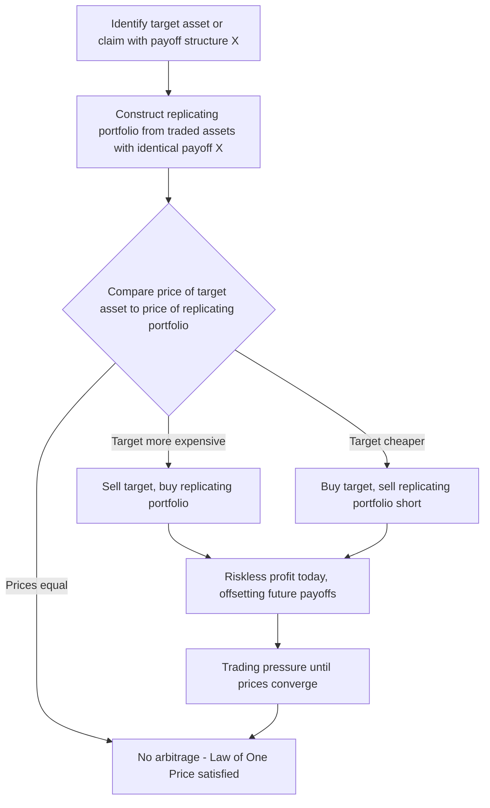

## The No-Arbitrage Principle

### Overview

The no-arbitrage principle is the foundational assumption underlying nearly all of modern asset pricing theory, from Arbitrage Pricing Theory (APT) and derivatives pricing (Black-Scholes, binomial trees) to the Law of One Price and the term structure of interest rates. Unlike equilibrium models such as CAPM, which derive pricing relationships from utility maximization and market clearing across all investors, no-arbitrage arguments require only that *some* investors recognize and exploit riskless profit opportunities — a dramatically weaker behavioral assumption that makes no-arbitrage pricing results far more robust to violations of individual rationality or homogeneous expectations. This chapter develops the formal definition of arbitrage, the Law of One Price, the mathematical machinery connecting no-arbitrage to the existence of pricing kernels and risk-neutral measures, and the role no-arbitrage plays as the foundation for APT specifically.

### Formal Definition of Arbitrage

An arbitrage opportunity is a trading strategy that satisfies all of the following:

1. **Zero net investment**: the strategy requires no initial capital outlay (funded, e.g., by simultaneously shorting one asset and buying another)
2. **No possibility of loss**: in every possible future state of the world, the strategy's payoff is non-negative
3. **Positive probability of gain**: in at least one possible future state, the strategy's payoff is strictly positive

Formally, if $V_0$ denotes the initial cost of a portfolio and $V_T(\omega)$ its payoff in state $\omega$ at a future date $T$, an arbitrage exists if:

$$V_0 = 0, \quad V_T(\omega) \geq 0 \; \forall \omega, \quad \text{and} \; \exists \, \omega^*: V_T(\omega^*) > 0$$

**Key Points**

- An arbitrage is a "free lunch" — a way to construct something for nothing that can never lose money and might make money, without bearing any risk
- This is a materially stronger and cleaner concept than merely "a good investment" or "a mispriced asset" — an arbitrage requires literally zero risk of loss under every possible future outcome, not merely a high expected return
- Some treatments distinguish a **weaker form** (Type A arbitrage: $V_0 < 0$, guaranteed $V_T(\omega) \geq 0$, i.e., getting paid today with no future obligation) from the **stronger form above** (Type B arbitrage: $V_0 = 0$, guaranteed non-negative future payoff with positive probability of a strictly positive payoff) — both are excluded under the no-arbitrage assumption

### The No-Arbitrage Assumption

The **no-arbitrage principle** (or "no free lunch" assumption) posits that in well-functioning, sufficiently liquid financial markets, arbitrage opportunities cannot persist — if one were to appear, well-capitalized traders would immediately exploit it (buying the cheap asset/combination, selling the expensive one) until the price discrepancy is eliminated, typically at speeds far faster than any adjustment process requiring broad investor rationality or consensus beliefs.

**Key Points**

- No-arbitrage is a substantially weaker assumption than full market efficiency or rational-expectations equilibrium: it requires only that a small number of sophisticated, well-capitalized arbitrageurs exist and are unconstrained enough to exploit clear violations — not that *all* investors are rational or that prices fully reflect all available information
- This is precisely why no-arbitrage pricing (APT, derivatives pricing) is often viewed as resting on more robust theoretical foundations than equilibrium-based pricing (CAPM), which requires the much stronger joint assumptions of universal mean-variance optimization, homogeneous expectations, and market clearing across the *entire* investor population
- In practice, "limits to arbitrage" (transaction costs, short-sale constraints, capital constraints on arbitrageurs, noise trader risk) can prevent complete elimination of apparent mispricings even when true riskless arbitrage in the strict sense does not exist — a body of literature (Shleifer and Vishny, 1997, and related) studies why some apparent arbitrage opportunities can persist longer than the pure no-arbitrage principle would suggest, without this necessarily indicating theoretical inconsistency, since real friction and constraints are outside the idealized frictionless-market assumption

### The Law of One Price

A direct and especially intuitive corollary of no-arbitrage is the **Law of One Price**: two assets (or portfolios) that generate *identical* payoffs in every possible future state of the world must have the identical price today.

$$\text{If } V_T^A(\omega) = V_T^B(\omega) \; \forall \omega, \text{ then } V_0^A = V_0^B$$

**Proof sketch**: if $V_0^A > V_0^B$, an arbitrageur can short asset $A$ (receiving $V_0^A$), buy asset $B$ (paying $V_0^B$), pocket the difference $V_0^A - V_0^B > 0$ today, and owe/receive exactly offsetting payoffs at $T$ (since the payoffs are identical) — a riskless profit today with zero net future obligation, violating no-arbitrage. The symmetric argument rules out $V_0^A < V_0^B$.

**Key Points**

- The Law of One Price is the working principle behind put-call parity, covered interest rate parity, replicating-portfolio derivatives pricing, and cash-and-carry arbitrage in futures markets
- It is a *necessary* condition implied by no-arbitrage, but weaker than the full no-arbitrage principle: the Law of One Price concerns only assets with identical payoffs, while no-arbitrage additionally rules out strategies with dominant (weakly better in every state, strictly better in at least one) payoff structures at equal or lower cost

### Diagram: Arbitrage Detection via Replicating Portfolios

### No-Arbitrage and the Fundamental Theorem of Asset Pricing

The mathematical formalization of no-arbitrage connects directly to the existence of a **pricing kernel** (stochastic discount factor) or, equivalently, a **risk-neutral probability measure**.

**Fundamental Theorem of Asset Pricing (informal statement)**: A market is arbitrage-free if and only if there exists a strictly positive stochastic discount factor $m_{t+1}$ (or equivalently, a risk-neutral probability measure $\mathbb{Q}$) such that every asset's price satisfies:

$$P_t = E_t\big[m_{t+1}\,X_{t+1}\big]$$

where $X_{t+1}$ is the asset's future payoff, or equivalently under the risk-neutral measure:

$$P_t = \frac{1}{1+r_f}E_t^{\mathbb{Q}}\big[X_{t+1}\big]$$

**Key Points**

- This theorem is the deep mathematical bridge connecting the intuitive "no free lunch" condition to the entire apparatus of modern asset pricing: every no-arbitrage price can be written as a discounted expectation under *some* appropriately adjusted probability measure, and conversely, the existence of such a measure guarantees no arbitrage exists
- The stochastic discount factor $m_{t+1}$ must be *strictly positive* in every state for the no-arbitrage condition to hold; a negative or zero SDF in any state would permit an arbitrage by exploiting that state's mispriced claims
- This same SDF framework unifies CAPM, APT, and consumption-based asset pricing models — each corresponds to a different specific functional form or set of restrictions on $m_{t+1}$, all consistent with the same underlying no-arbitrage requirement, meaning the models are not competitors at the level of "arbitrage-free or not" but rather differ in their additional economic restrictions on the SDF's functional form

### Application: No-Arbitrage as the Foundation for APT

Arbitrage Pricing Theory (Ross, 1976) is built directly and exclusively on the no-arbitrage principle, in explicit contrast to CAPM's equilibrium derivation. The APT argument proceeds by constructing a well-diversified portfolio with zero net investment, zero systematic factor exposure, and (asymptotically, as the number of assets grows) vanishing idiosyncratic risk — if such a portfolio has non-zero expected return, it constitutes an arbitrage opportunity, forcing a linear relationship between expected returns and factor exposures in any arbitrage-free market. This construction is developed fully in the dedicated APT material; the essential point here is that APT requires *only* the no-arbitrage assumption (plus a factor structure on returns) — it does not require the equilibrium/market-clearing/homogeneous-expectations machinery that CAPM's derivation depends on, which is the primary theoretical advantage frequently cited in APT's favor.

### Diagram: No-Arbitrage as the Common Foundation (svg_diagram)

<svg xmlns="http://www.w3.org/2000/svg" viewBox="0 0 700 380">
<text x="350" y="24" text-anchor="middle" font-size="16" font-weight="bold" fill="#111">No-Arbitrage as Foundational Assumption (svg_diagram)</text>
<rect x="260" y="55" width="180" height="55" rx="8" fill="#f8f0fc" stroke="#9c36b5" stroke-width="1.8" />
<text x="350" y="88" text-anchor="middle" font-size="13" font-weight="bold" fill="#3d0a52">No-Arbitrage Principle</text>
<line x1="350" y1="110" x2="350" y2="150" stroke="#333" stroke-width="1.3" marker-end="url(#a1)" />
<rect x="120" y="150" width="150" height="55" rx="8" fill="#eef4ff" stroke="#3b5bdb" stroke-width="1.5" />
<text x="195" y="182" text-anchor="middle" font-size="12" fill="#1c2b4a">Law of One Price</text>
<rect x="290" y="150" width="150" height="55" rx="8" fill="#e6fcf5" stroke="#0ca678" stroke-width="1.5" />
<text x="365" y="175" text-anchor="middle" font-size="11" fill="#0b4a3c">Fundamental Theorem</text>
<text x="365" y="190" text-anchor="middle" font-size="11" fill="#0b4a3c">of Asset Pricing</text>
<rect x="460" y="150" width="150" height="55" rx="8" fill="#fff4e6" stroke="#e8590c" stroke-width="1.5" />
<text x="535" y="182" text-anchor="middle" font-size="12" fill="#5c2c06">Replicating Portfolios</text>
<line x1="365" y1="205" x2="180" y2="250" stroke="#333" stroke-width="1.2" marker-end="url(#a1)" />
<line x1="365" y1="205" x2="365" y2="250" stroke="#333" stroke-width="1.2" marker-end="url(#a1)" />
<line x1="365" y1="205" x2="550" y2="250" stroke="#333" stroke-width="1.2" marker-end="url(#a1)" />
<rect x="90" y="250" width="150" height="50" rx="6" fill="#fff0f6" stroke="#d6336c" stroke-width="1.3" />
<text x="165" y="280" text-anchor="middle" font-size="11" fill="#5c0a2e">Put-Call Parity</text>
<rect x="290" y="250" width="150" height="50" rx="6" fill="#fff0f6" stroke="#d6336c" stroke-width="1.3" />
<text x="365" y="280" text-anchor="middle" font-size="11" fill="#5c0a2e">Arbitrage Pricing Theory</text>
<rect x="480" y="250" width="150" height="50" rx="6" fill="#fff0f6" stroke="#d6336c" stroke-width="1.3" />
<text x="555" y="280" text-anchor="middle" font-size="11" fill="#5c0a2e">Black-Scholes / Option Pricing</text>
</svg>

### Illustrative Example: Detecting a Simple Arbitrage

**Example**

A stock trades at $100 on Exchange A and $100.50 on Exchange B (identical settlement terms, no dividends before settlement, negligible transaction costs assumed for illustration). An arbitrageur can simultaneously buy on Exchange A ($100 outflow) and short-sell on Exchange B ($100.50 inflow), for a riskless profit of $0.50 per share today, with the long and short positions offsetting exactly at any future settlement — a textbook Law of One Price violation. In real markets, this precise opportunity is typically eliminated within milliseconds by high-frequency trading firms, which is exactly the empirical mechanism the no-arbitrage principle assumes operates continuously; the theoretical assumption is therefore best understood as a statement about the *speed and reliability* of this correction process in liquid markets, not a claim that price discrepancies never momentarily appear. [Inference — the "milliseconds" characterization reflects well-documented behavior in modern electronic markets for highly liquid, identical instruments, included as illustrative context rather than a universal claim across all asset classes and market structures]

### Limits to Arbitrage

**Key Points**

- **Transaction costs and bid-ask spreads**: small apparent mispricings may not be economically exploitable once realistic trading costs are included, meaning "near-arbitrage" opportunities within cost bounds are not true violations of the theoretical principle
- **Capital and funding constraints**: arbitrageurs require capital to fund positions and may face margin calls or withdrawal pressure if apparent mispricings widen before converging (Shleifer and Vishny's "limits to arbitrage" framework), potentially preventing full and immediate correction even when a true arbitrage-like opportunity exists
- **Short-sale constraints**: not all assets can be freely shorted (borrowing costs, availability, regulatory restrictions), which can prevent the short leg of an arbitrage strategy from being executed, allowing some price discrepancies to persist longer than frictionless theory predicts
- **Model risk in "arbitrage" strategies**: many real-world strategies marketed as "arbitrage" (merger arbitrage, convertible bond arbitrage, statistical arbitrage/pairs trading) are not riskless in the strict theoretical sense defined above — they bear residual risk (deal-break risk, model risk, liquidity risk) and are more accurately described as risk arbitrage rather than pure arbitrage

These practical limitations do not invalidate no-arbitrage as a theoretical modeling assumption — they explain why real markets can exhibit *transient* deviations from strict no-arbitrage pricing, which the theory as an idealized frictionless benchmark does not itself claim to rule out at every instant.

### Common Pitfalls

- Conflating "arbitrage" in the loose, colloquial sense (any attractive trading opportunity or apparent mispricing) with the strict, technical definition requiring zero net investment, no possibility of loss, and positive probability of gain
- Treating merger arbitrage, statistical arbitrage, or convertible arbitrage strategies as literal riskless arbitrage in the theoretical sense, when they in fact bear genuine residual risk and are better classified as risk arbitrage
- Assuming no-arbitrage requires all investors to be rational — it requires only that sufficient sophisticated capital exists to exploit clear violations, a much weaker condition than full market efficiency or universal rationality
- Overlooking that the Law of One Price is a *necessary consequence* of no-arbitrage but is not by itself the complete no-arbitrage condition (which also rules out dominant, not merely identical-payoff, strategies)
- Forgetting that "limits to arbitrage" frictions (transaction costs, capital constraints, short-sale restrictions) explain observed persistent mispricings without logically contradicting the no-arbitrage principle as an idealized theoretical assumption

**Related Topics**

- Arbitrage Pricing Theory (APT) and factor structure derivations built directly on no-arbitrage
- The Fundamental Theorem of Asset Pricing and stochastic discount factors
- Put-call parity and no-arbitrage bounds in options pricing
- Limits to arbitrage (Shleifer and Vishny, 1997) and behavioral finance
- Covered interest rate parity as a no-arbitrage condition in currency markets
- Risk-neutral valuation and the binomial/Black-Scholes option pricing frameworks
- Statistical arbitrage and pairs trading as applied (non-riskless) arbitrage strategies