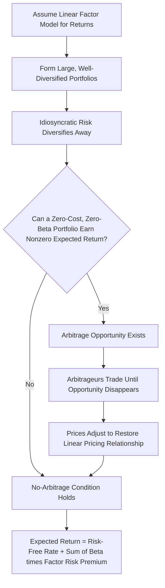

## Ross's Arbitrage Pricing Theory

### Overview

Arbitrage Pricing Theory (APT) is an asset pricing framework developed by Stephen Ross (1976) that explains expected asset returns as a linear function of exposures to multiple systematic risk factors. Unlike the Capital Asset Pricing Model (CAPM), which derives expected returns from mean-variance portfolio optimization and a single market factor, APT is built on a weaker set of assumptions: the absence of arbitrage opportunities in well-diversified portfolios. This makes APT both more general and more flexible, since it does not require identifying the "true" market portfolio, nor does it depend on assumptions about investor utility functions or return distributions.

### Historical Context

Ross introduced APT in his 1976 paper "The Arbitrage Theory of Capital Asset Pricing," published in the *Journal of Economic Theory*. It was developed partly as a response to empirical and theoretical criticisms of CAPM, particularly Roll's Critique, which argued that CAPM is untestable because the true market portfolio (encompassing all risky assets) is unobservable. APT sidesteps this problem by relying on the no-arbitrage condition rather than market equilibrium and by allowing for multiple factors instead of a single market factor.

### Core Assumptions

APT rests on a smaller and less restrictive set of assumptions than CAPM:

- Returns can be described by a factor model (linear relationship between returns and a set of common factors).
- Idiosyncratic (firm-specific) risk can be diversified away in large portfolios.
- No arbitrage opportunities exist in equilibrium; if a riskless arbitrage opportunity arose, rational investors would exploit it until prices adjusted and the opportunity disappeared.
- Markets are frictionless enough (no transaction costs, unlimited short selling, ability to hold well-diversified portfolios) that arbitrage can be executed.

Notably, APT does **not** require:

- Investors to hold the market portfolio
- Returns to be normally distributed
- Quadratic utility functions
- A unique or identifiable "market portfolio"

### The Factor Model Foundation

APT begins with a linear factor model describing how an asset's return is generated:

$$R_i = E(R_i) + \beta_{i1}F_1 + \beta_{i2}F_2 + \dots + \beta_{ik}F_k + \epsilon_i$$

Where:

- $R_i$ = realized return on asset $i$
- $E(R_i)$ = expected return on asset $i$
- $F_k$ = the $k$-th systematic risk factor (unexpected/surprise component, with $E(F_k) = 0$)
- $\beta_{ik}$ = sensitivity (factor loading) of asset $i$ to factor $k$
- $\epsilon_i$ = idiosyncratic error term specific to asset $i$, with $E(\epsilon_i) = 0$

**Key Points**

- Factors represent systematic, economy-wide sources of risk that affect many assets simultaneously (e.g., inflation, interest rates, industrial production).
- $\epsilon_i$ captures firm-specific risk that is uncorrelated across assets and can be diversified away.
- The betas ($\beta_{ik}$) measure how sensitive an asset is to each factor, analogous to the single beta in CAPM but extended to multiple dimensions.

### Deriving the APT Pricing Equation

The central result of APT is that, in the absence of arbitrage, the expected return on any asset must be a linear function of its factor betas:

$$E(R_i) = R_f + \beta_{i1}\lambda_1 + \beta_{i2}\lambda_2 + \dots + \beta_{ik}\lambda_k$$

Where:

- $R_f$ = risk-free rate
- $\lambda_k$ = risk premium associated with factor $k$ (the expected excess return per unit of exposure to factor $k$)
- $\beta_{ik}$ = sensitivity of asset $i$ to factor $k$

**Derivation intuition:**

1. Consider a large number of assets whose returns follow the factor model above.
2. Construct a well-diversified portfolio with zero net investment and zero sensitivity to every factor (a "zero-beta, zero-cost" portfolio).
3. Because idiosyncratic risk diversifies away in a large portfolio, and the portfolio has no factor exposure, its return should have zero variance.
4. If this portfolio's expected return were nonzero, an arbitrage opportunity would exist: investors could take a costless, riskless position that generates positive expected profit. Rational arbitrageurs would trade until this opportunity vanished.
5. Ruling out this arbitrage forces expected returns to be a linear function of the betas, since any deviation from linearity permits at least one portfolio to earn arbitrage profit.

**[Inference]** The exact linear pricing relationship holds precisely only asymptotically (as the number of assets grows), since diversification of idiosyncratic risk is only complete in the limit; with finitely many assets, small deviations may persist without permitting arbitrage.

### Single-Factor APT (Special Case)

If only one factor is considered, APT reduces to a form resembling the Security Market Line of CAPM:

$$E(R_i) = R_f + \beta_i \lambda$$

This illustrates that CAPM can be viewed as a special case of a single-factor APT model, where the single factor is the market portfolio's excess return.

### Multi-Factor APT

In practice, APT is almost always applied with multiple factors. A common macroeconomic factor specification (following Chen, Roll, and Ross, 1986) includes:

- Unanticipated changes in industrial production
- Unanticipated changes in expected inflation
- Unanticipated changes in the risk premium (yield spread between high- and low-grade bonds)
- Unanticipated changes in the term structure (yield spread between long- and short-term government bonds)

The multi-factor pricing equation becomes:

$$E(R_i) - R_f = \beta_{i,IP}\lambda_{IP} + \beta_{i,\pi}\lambda_{\pi} + \beta_{i,RP}\lambda_{RP} + \beta_{i,TS}\lambda_{TS}$$

**Example**

Suppose a stock has the following factor loadings and factor risk premia:

| Factor | Beta ($\beta$) | Risk Premium ($\lambda$) |
| --- | --- | --- |
| Industrial Production | 1.2 | 3% |
| Inflation | -0.5 | 1% |
| Risk Premium (credit spread) | 0.8 | 2% |
| Term Structure | 0.3 | 0.5% |

With a risk-free rate of 4%:

$$E(R_i) = 4\% + (1.2)(3\%) + (-0.5)(1\%) + (0.8)(2\%) + (0.3)(0.5\%)$$

$$E(R_i) = 4\% + 3.6\% - 0.5\% + 1.6\% + 0.15\% = 8.85\%$$

The stock's expected return under this multi-factor APT specification is 8.85%.

### Arbitrage Portfolio Construction

A defining feature of APT is the arbitrage portfolio: a portfolio requiring zero net wealth, with zero net sensitivity to each risk factor, but with nonzero expected return—implying an arbitrage opportunity that should not persist in equilibrium.

Conditions for an arbitrage portfolio with weights $w_i$ across $n$ assets:

$$\sum_{i=1}^{n} w_i = 0 \quad \text{(zero net investment)}$$

$$\sum_{i=1}^{n} w_i \beta_{ik} = 0 \quad \text{for all factors } k \quad \text{(zero factor exposure)}$$

$$\sum_{i=1}^{n} w_i E(R_i) \neq 0 \quad \text{(nonzero expected return — the arbitrage condition)}$$

If such a portfolio can be constructed, the no-arbitrage assumption is violated, and the equilibrium pricing relationship must adjust until no such portfolio exists.

### Diagram: APT Arbitrage Mechanism (svg_diagram)

<svg xmlns="http://www.w3.org/2000/svg" viewBox="0 0 760 420">
<text x="380" y="30" font-size="18" font-weight="bold" text-anchor="middle" fill="#1a1a1a">APT No-Arbitrage Mechanism (svg_diagram)</text>
<rect x="30" y="70" width="200" height="90" rx="8" fill="#eef4ff" stroke="#3b5bdb" stroke-width="1.5" />
<text x="130" y="100" font-size="13" text-anchor="middle" fill="#1a1a1a" font-weight="bold">Mispriced Asset</text>
<text x="130" y="120" font-size="11" text-anchor="middle" fill="#333">Factor exposures known</text>
<text x="130" y="138" font-size="11" text-anchor="middle" fill="#333">Return deviates from</text>
<text x="130" y="153" font-size="11" text-anchor="middle" fill="#333">factor-implied return</text>
<rect x="280" y="70" width="220" height="90" rx="8" fill="#fff4e6" stroke="#e8590c" stroke-width="1.5" />
<text x="390" y="100" font-size="13" text-anchor="middle" fill="#1a1a1a" font-weight="bold">Construct Arbitrage Portfolio</text>
<text x="390" y="120" font-size="11" text-anchor="middle" fill="#333">Zero net investment</text>
<text x="390" y="138" font-size="11" text-anchor="middle" fill="#333">Zero net factor betas</text>
<text x="390" y="153" font-size="11" text-anchor="middle" fill="#333">Nonzero expected return</text>
<rect x="550" y="70" width="180" height="90" rx="8" fill="#eaffea" stroke="#2f9e44" stroke-width="1.5" />
<text x="640" y="100" font-size="13" text-anchor="middle" fill="#1a1a1a" font-weight="bold">Riskless Profit</text>
<text x="640" y="120" font-size="11" text-anchor="middle" fill="#333">Costless position</text>
<text x="640" y="138" font-size="11" text-anchor="middle" fill="#333">Diversified, no factor risk</text>
<text x="640" y="153" font-size="11" text-anchor="middle" fill="#333">Positive expected payoff</text>
<line x1="230" y1="115" x2="278" y2="115" stroke="#555" stroke-width="2" marker-end="url(#arrow)" />
<line x1="500" y1="115" x2="548" y2="115" stroke="#555" stroke-width="2" marker-end="url(#arrow)" />
<rect x="150" y="220" width="460" height="90" rx="8" fill="#f8f0ff" stroke="#9c36b5" stroke-width="1.5" />
<text x="380" y="248" font-size="13" text-anchor="middle" fill="#1a1a1a" font-weight="bold">Arbitrageurs Trade on Opportunity</text>
<text x="380" y="268" font-size="11" text-anchor="middle" fill="#333">Buy underpriced assets / Sell overpriced assets</text>
<text x="380" y="285" font-size="11" text-anchor="middle" fill="#333">Trading pressure moves prices toward equilibrium</text>
<line x1="640" y1="160" x2="640" y2="200" stroke="#555" stroke-width="2" />
<line x1="640" y1="200" x2="390" y2="200" stroke="#555" stroke-width="2" />
<line x1="390" y1="200" x2="390" y2="218" stroke="#555" stroke-width="2" marker-end="url(#arrow)" />
<rect x="230" y="350" width="300" height="55" rx="8" fill="#e7f5ff" stroke="#1971c2" stroke-width="1.5" />
<text x="380" y="373" font-size="13" text-anchor="middle" fill="#1a1a1a" font-weight="bold">Prices Adjust</text>
<text x="380" y="392" font-size="11" text-anchor="middle" fill="#333">Linear factor pricing relationship restored</text>
<line x1="380" y1="310" x2="380" y2="348" stroke="#555" stroke-width="2" marker-end="url(#arrow)" />
</svg>

### APT vs. CAPM: Comparative Analysis

| Dimension | CAPM | APT |
| --- | --- | --- |
| Number of factors | Single (market portfolio) | Multiple (unspecified number) |
| Theoretical basis | Mean-variance optimization, equilibrium | No-arbitrage condition |
| Market portfolio required | Yes (theoretically all assets) | No |
| Investor assumptions | Homogeneous expectations, mean-variance preferences | Minimal; only that some investors exploit arbitrage |
| Distribution assumptions | Often assumes normal returns or quadratic utility | None required |
| Identification of factors | Single, well-defined (market) | Factors not specified by theory; must be identified empirically |
| Testability | Criticized as untestable (Roll's Critique) | More flexible but factor identification is itself a challenge |
| Restrictiveness | More restrictive assumptions | Fewer assumptions, more general |

### Empirical Factor Models Derived from APT

Since APT does not specify what the factors are, several empirical approaches have been developed to identify them:

**Macroeconomic Factor Models**

- Chen, Roll, and Ross (1986) identified factors such as industrial production growth, inflation shocks, term structure shifts, and default risk premia.

**Statistical Factor Models**

- Factors extracted via statistical techniques such as factor analysis or principal component analysis (PCA) applied to historical return covariances, without direct economic interpretation.

**Fundamental (Characteristic-Based) Factor Models**

- Factors constructed from firm characteristics, most notably the Fama-French three-factor model (market, size [SMB], and value [HML]) and its extensions (e.g., profitability and investment factors in the Fama-French five-factor model). While not derived directly from Ross's original APT, these models operationalize the multi-factor pricing logic that APT established.

### Strengths of APT

- Requires fewer and weaker assumptions than CAPM.
- Does not require identifying or observing the true market portfolio.
- Accommodates multiple sources of systematic risk, better matching empirical evidence that a single market factor often fails to fully explain the cross-section of returns.
- Provides a flexible framework adaptable to different empirical factor specifications.

### Limitations and Criticisms

- **Factor Identification Problem**: APT does not specify which factors matter, how many there are, or how to measure them, leaving this as an empirical and somewhat ad hoc exercise.
- **[Inference]** Different studies using different factor sets can produce different implied risk premia and expected returns for the same asset, since the "correct" factor structure is not uniquely pinned down by the theory.
- **Approximate Pricing**: The linear pricing relationship is theoretically exact only in the limit of infinitely many assets; with a finite number of assets, pricing errors may exist without violating no-arbitrage in a strict sense.
- **Static Framework**: The original APT is essentially a single-period, static model, unlike intertemporal asset pricing models that account for changing investment opportunities over time.
- **Empirical Testing Challenges**: Testing APT is complicated because rejecting a specific empirical implementation may simply reflect a poorly chosen set of factors rather than a failure of the underlying theory.

### Applications in Practice

- **Asset Pricing**: Used to estimate required rates of return for capital budgeting and valuation, especially when a single-market-factor model appears insufficient.
- **Portfolio Risk Management**: Multi-factor models built on APT logic help decompose portfolio risk into systematic factor exposures, aiding in hedging strategies.
- **Performance Attribution**: Used to separate a portfolio manager's returns into factor-driven (systematic) and idiosyncratic (stock-selection) components.
- **Cost of Capital Estimation**: Provides an alternative to CAPM for estimating a firm's cost of equity by incorporating multiple risk premia.

### Worked Example: Testing for Arbitrage

Consider three assets with the following expected returns and single-factor betas, with $R_f = 5\%$:

| Asset | $\beta$ | $E(R_i)$ |
| --- | --- | --- |
| A | 1.0 | 15% |
| B | 2.0 | 25% |
| C | 1.5 | 22% |

**Step 1: Determine the factor risk premium implied by assets A and B.**

From the APT equation $E(R_i) = R_f + \beta_i \lambda$:

For Asset A: $15\% = 5\% + 1.0\lambda \Rightarrow \lambda = 10\%$

For Asset B: $25\% = 5\% + 2.0\lambda \Rightarrow \lambda = 10\%$

Assets A and B are consistent with the same factor risk premium.

**Step 2: Check whether Asset C is consistent with this pricing relationship.**

$$E(R_C)_{\text{implied}} = 5\% + (1.5)(10\%) = 20\%$$

Asset C's actual expected return is 22%, which is 2% higher than the APT-implied value of 20%.

**Step 3: Identify the arbitrage opportunity.**

Because Asset C offers a higher return than justified by its factor exposure, an arbitrageur can construct a portfolio: short a combination of A and B with the same beta as C (1.5), and go long C, capturing a riskless profit of approximately 2% with zero net investment and zero net factor exposure.

**[Inference]** In practice, transaction costs, liquidity constraints, and estimation uncertainty around betas and risk premia can prevent full and instantaneous elimination of such discrepancies, even though the theoretical no-arbitrage condition predicts they should not persist.

### Mathematical Summary

$$\text{Factor Model: } R_i = E(R_i) + \sum_{k=1}^{K} \beta_{ik}F_k + \epsilon_i$$

$$\text{APT Pricing Equation: } E(R_i) = R_f + \sum_{k=1}^{K} \beta_{ik}\lambda_k$$

$$\text{Arbitrage Portfolio Constraints: } \sum_i w_i = 0, \quad \sum_i w_i\beta_{ik} = 0 \ \forall k, \quad \sum_i w_i E(R_i) \neq 0$$

### Conceptual Flow of APT Reasoning

### Related Topics

- Capital Asset Pricing Model (CAPM) and the Security Market Line
- Roll's Critique of CAPM testability
- Fama-French Three-Factor and Five-Factor Models
- Chen, Roll, and Ross (1986) macroeconomic factor identification
- Principal Component Analysis in statistical factor extraction
- Multi-factor risk models in portfolio construction
- Law of One Price and no-arbitrage pricing more broadly
- Intertemporal Capital Asset Pricing Model (ICAPM)
- Fundamental factor investing (value, size, momentum, quality)
- Cost of capital estimation using multi-factor models