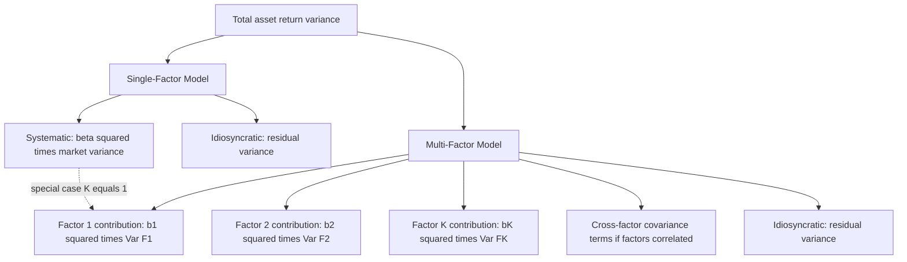
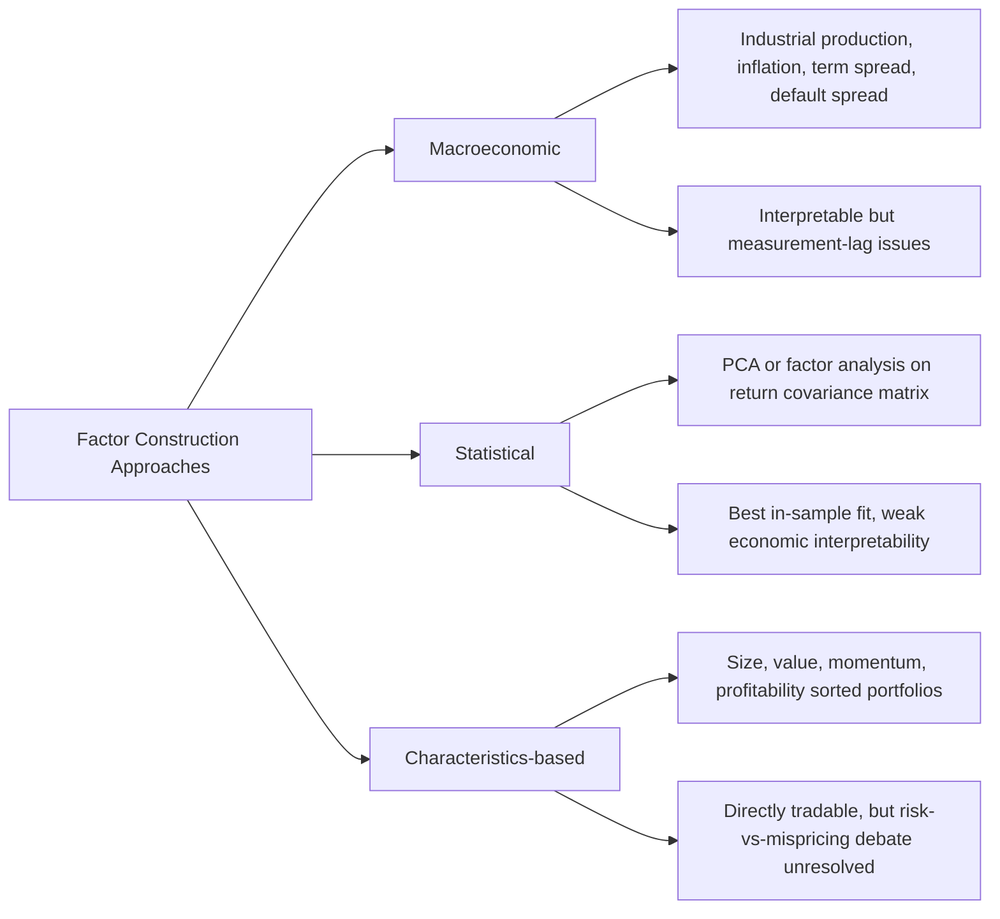

## Single-Factor and Multi-Factor Models

### Overview

Single-factor and multi-factor models describe the statistical structure imposed on asset returns to explain their comovement, decompose risk, and — when combined with equilibrium or no-arbitrage arguments — generate testable pricing relationships. The single-index (single-factor) model, introduced by Sharpe (1963) as a computational simplification of Markowitz portfolio optimization, reduces the estimation burden of full covariance-matrix optimization from $O(n^2)$ parameters to $O(n)$. Multi-factor models generalize this to multiple systematic sources of risk, providing both the statistical foundation for APT and the practical workhorse framework (Fama-French and successors) used throughout empirical asset pricing and risk management. This chapter develops both frameworks, their estimation, their use in portfolio risk decomposition, and the distinction between statistical, macroeconomic, and characteristics-based factor construction.

### The Single-Index (Single-Factor) Model

#### Motivation: The Markowitz Estimation Burden

Full Markowitz mean-variance optimization for $n$ assets requires estimating $n$ expected returns, $n$ variances, and $n(n-1)/2$ covariances — for $n=500$, over 125,000 covariance terms alone. Sharpe's single-index model dramatically reduces this burden by assuming all comovement between assets is mediated through a single common factor (typically the market return):

$$r_i = \alpha_i + \beta_i r_M + \varepsilon_i, \quad \text{Cov}(\varepsilon_i, \varepsilon_j) = 0 \; \forall i \neq j, \quad \text{Cov}(\varepsilon_i, r_M) = 0$$

Under this structure, the covariance between any two assets is fully determined by their market betas and the market variance:

$$\text{Cov}(r_i, r_j) = \beta_i\beta_j\sigma_M^2$$

**Key Points**

- This reduces the parameter-estimation problem to $n$ alphas, $n$ betas, $n$ idiosyncratic variances, and one market variance — roughly $3n+1$ parameters instead of $O(n^2)$, a dramatic simplification that made portfolio optimization computationally tractable in the pre-modern-computing era and remains a useful conceptual simplification
- The single-index model is a *statistical/computational* device distinct from CAPM itself: CAPM is an equilibrium theory that happens to imply a single risk factor (the market portfolio) is priced, whereas the single-index model is simply a covariance-structure assumption that can be used for portfolio construction and risk estimation without any equilibrium claims attached
- The assumption $\text{Cov}(\varepsilon_i, \varepsilon_j) = 0$ is a strong simplification, often violated in practice (e.g., firms within the same industry tend to have correlated idiosyncratic shocks beyond their common market exposure) — motivating both multi-factor extensions and, separately, "approximate factor model" formulations that permit limited residual cross-correlation

#### Systematic and Idiosyncratic Risk Decomposition

$$\sigma_i^2 = \beta_i^2\sigma_M^2 + \sigma_{\varepsilon_i}^2$$

$$\text{Cov}(r_i, r_j) = \beta_i\beta_j\sigma_M^2$$

This decomposition underlies portfolio-level risk aggregation: a portfolio's systematic risk depends only on its weighted-average beta, while its idiosyncratic risk shrinks toward zero as holdings diversify across many (imperfectly correlated idiosyncratic) positions.

### Multi-Factor Models: General Structure

Multi-factor models generalize the single-index framework to $K > 1$ common factors:

$$r_i = \alpha_i + \sum_{k=1}^{K} b_{ik}F_k + \varepsilon_i$$

with the same orthogonality assumptions on $\varepsilon_i$ extended across all $K$ factors. The corresponding risk decomposition:

$$\sigma_i^2 = \sum_{k=1}^{K}\sum_{l=1}^{K} b_{ik}b_{il}\text{Cov}(F_k, F_l) + \sigma_{\varepsilon_i}^2$$

which simplifies considerably if factors are constructed to be mutually orthogonal ($\text{Cov}(F_k,F_l)=0$ for $k\neq l$):

$$\sigma_i^2 = \sum_{k=1}^{K} b_{ik}^2\text{Var}(F_k) + \sigma_{\varepsilon_i}^2$$

**Key Points**

- Orthogonalizing factors is a common practical convenience (simplifying the variance decomposition) but is not required by the underlying theory — many widely used factor sets (Fama-French factors, for instance) are constructed independently and exhibit modest, non-zero correlations with each other in practice
- The number of factors $K$ trades off model complexity against explanatory power: more factors generally improve in-sample fit ($R^2$) but risk overfitting and reduce out-of-sample robustness, parallel to the same complexity trade-off that arises in any statistical model selection problem

### Diagram: Single-Factor versus Multi-Factor Risk Decomposition

### Classifying Factor Construction Approaches

#### Macroeconomic Factor Models

Factors are directly observable macroeconomic variables believed to represent pervasive, systematic risks: industrial production growth, unexpected inflation, term-structure spread changes, default-spread changes, oil price shocks, and similar variables. Chen, Roll, and Ross (1986) is the canonical implementation. **Advantage**: factors have direct, interpretable economic meaning, aiding intuition about *why* an asset carries a given risk premium. **Disadvantage**: macroeconomic variables are often measured with lags, revised after initial release, and only weakly correlated with contemporaneous asset returns in some specifications, complicating precise estimation.

#### Statistical Factor Models

Factors are extracted purely from the covariance structure of returns themselves, typically via principal component analysis (PCA) or maximum-likelihood factor analysis, without pre-specifying any economic interpretation. **Advantage**: factors are constructed to maximize explained return variance by design, generally achieving the best in-sample statistical fit among the three approaches for a given number of factors. **Disadvantage**: extracted statistical factors often lack clean economic interpretation, complicating their use for structural analysis, scenario forecasting, or communicating risk exposures to non-technical stakeholders.

#### Characteristics-Based (Fundamental) Factor Models

Factors are constructed as returns on portfolios formed by sorting stocks on observable firm characteristics: market capitalization (size), book-to-market ratio (value), past returns (momentum), profitability, investment intensity, and similar characteristics. The Fama-French three- and five-factor models are the dominant examples. **Advantage**: factors are directly tradable (implementable as long-short portfolios), facilitating both empirical testing and practical risk-factor-based portfolio construction (factor investing/smart beta strategies). **Disadvantage**: the underlying economic rationale for *why* these particular characteristics proxy for systematic risk (versus reflecting persistent mispricing or data-mining artifacts) remains genuinely debated in the literature, a tension examined in detail in the dedicated Fama-French material.

### Diagram: Three Approaches to Factor Construction

### Estimation and Use in Portfolio Management

**Example**

A risk manager overseeing a $2 billion equity portfolio wants to decompose total portfolio risk into systematic and idiosyncratic sources using a three-factor model (market, size, value). After estimating factor loadings $b_{p,MKT}=0.95$, $b_{p,SMB}=0.15$, $b_{p,HML}=-0.20$ (a modest growth tilt) via time-series regression of the portfolio's historical returns on the three factors, and using estimated factor variances/covariances from the historical factor return series, the manager decomposes total portfolio variance into the contribution from each factor plus a residual idiosyncratic component. If the idiosyncratic component is unexpectedly large relative to the number of positions held, this signals the portfolio is insufficiently diversified relative to what its position count alone would suggest — potentially due to sector concentration or correlated idiosyncratic shocks the three-factor model does not capture, prompting further investigation using additional factors (e.g., an industry/sector factor set) or direct examination of individual position correlations. [Inference — illustrative stylized loadings for exposition, not drawn from an actual portfolio]

**Key Points — Practical Applications**

- **Performance attribution**: decomposing a portfolio's or manager's realized return into factor-driven components (explained by known systematic exposures) versus alpha (residual, unexplained skill or luck), directly generalizing Jensen's alpha to a multi-factor setting
- **Risk budgeting**: allocating a portfolio's total risk budget across factor exposures deliberately, rather than incidentally, often central to institutional and quantitative portfolio construction processes
- **Factor investing / smart beta**: constructing portfolios with deliberate, systematic tilts toward specific factors (value, momentum, quality, low-volatility) believed to offer persistent risk premia, implemented at scale via passive or semi-passive vehicles
- **Hedging**: constructing factor-neutral portfolios (zero net exposure to specified factors) for strategies intended to isolate stock-specific or event-specific returns (e.g., merger arbitrage funds seeking to hedge out market beta exposure)

### Choosing the Number of Factors

**Key Points**

- **Statistical criteria**: information criteria analogous to those used in VAR lag selection (extensions of AIC/BIC to factor models), and formal tests for the number of statistically significant factors (Connor and Korajczyk, 1993, among others) provide data-driven guidance, though different methods can suggest different answers on the same dataset
- **Economic parsimony**: practitioners often favor smaller factor sets (3–5 factors) for interpretability, communication with stakeholders, and reduced estimation/overfitting risk, even when statistical criteria might support additional factors
- **The "factor zoo" problem**: the empirical asset pricing literature has proposed several hundred distinct candidate factors across published studies (Harvey, Liu, and Zhu, 2016, term this the "factor zoo"), raising serious multiple-testing and data-snooping concerns about how many of these factors represent genuine, independent, persistent sources of systematic risk versus statistical artifacts of extensive search across a finite historical dataset [Inference — the "factor zoo" characterization and associated multiple-testing concern is a well-established methodological critique in the literature, presented here as a recognized concern rather than a fully resolved question, since the literature has not converged on which specific factors survive rigorous out-of-sample and multiple-testing-adjusted scrutiny]

### Relationship to APT and CAPM

**Key Points**

- The single-index model, combined with CAPM's equilibrium argument that the market portfolio is the sole relevant priced factor, yields the standard SML — but the single-index model itself is a weaker, purely statistical claim that does not by itself imply any pricing relationship
- Multi-factor statistical models provide the necessary return-generating-process assumption underlying Ross's APT derivation (see the dedicated APT material) — APT adds the no-arbitrage argument on top of the multi-factor statistical structure to derive its pricing equation
- Fama-French-style characteristics-based multi-factor models can be interpreted either as empirical implementations of APT-style risk-factor pricing, or as reduced-form descriptions of return patterns without a fully articulated equilibrium or no-arbitrage foundation — the interpretation debate is addressed in the dedicated Fama-French material

### Common Pitfalls

- Conflating the single-index *statistical* model (a covariance-structure simplification) with CAPM the *equilibrium theory* — the former can be used purely for portfolio construction with no pricing or equilibrium claims attached
- Assuming orthogonal factor construction is required by theory rather than a common practical convenience that simplifies the variance decomposition formula
- Treating in-sample $R^2$ improvement from adding factors as evidence those factors represent genuine priced risk, without considering overfitting and the "factor zoo" multiple-testing problem
- Using macroeconomic factors without accounting for data-release lags and revisions, which can materially bias contemporaneous factor-loading estimates if not handled carefully
- Selecting the number of factors purely on statistical fit criteria without considering interpretability, estimation stability, and the practical needs of the application (attribution, risk budgeting, hedging)

**Related Topics**

- Ross's Arbitrage Pricing Theory and the no-arbitrage pricing equation built on the multi-factor structure
- Fama-French three- and five-factor models as the dominant characteristics-based implementation
- The no-arbitrage principle underlying APT's use of factor models for pricing
- Principal component analysis and statistical factor extraction methodology
- Chen, Roll, and Ross (1986) macroeconomic factor model
- Factor investing, smart beta, and systematic risk-premia harvesting strategies
- The "factor zoo" and multiple-testing concerns in empirical asset pricing