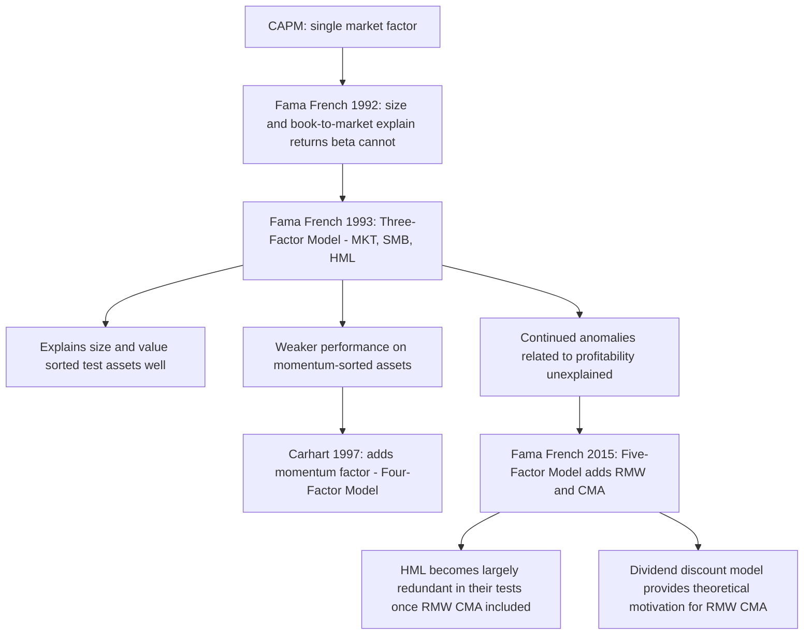

## Fama-French Three-Factor and Five-Factor Models

### Overview

The Fama-French models are the dominant empirical multi-factor asset pricing framework, developed in direct response to documented failures of the single-factor CAPM to explain the cross-section of average stock returns. Fama and French (1993) introduced the three-factor model adding size and value factors to the market factor; Fama and French (2015) extended this to five factors by adding profitability and investment factors, partly motivated by dividend-discount-model logic connecting these characteristics to expected returns and partly in response to continued anomalies (e.g., relating to profitability) that the three-factor model left unexplained. This chapter develops the construction of the Fama-French factors, the three- and five-factor pricing equations, their theoretical interpretation (risk-based versus behavioral/mispricing), and the empirical evidence on their performance.

### Motivation: CAPM's Empirical Shortfall

As documented in the empirical-tests-of-CAPM material, Fama and French (1992) found that firm size and book-to-market equity ratio have substantial power to explain the cross-section of average stock returns, while beta alone shows little explanatory power once these characteristics are controlled for. Rather than treating this as merely diagnostic of CAPM's failure, Fama and French (1993) proposed a constructive response: build tradable factor portfolios directly from these characteristics and test whether a linear multi-factor model using them prices the cross-section of returns better than CAPM.

### Constructing the Size and Value Factors: SMB and HML

#### The 2×3 Sorting Procedure

Fama and French construct factors using independent sorts on size and book-to-market:

1. At the end of each June, all stocks are sorted into two groups by market capitalization: **Small** (below the NYSE median) and **Big** (above the NYSE median)
2. Independently, all stocks are sorted into three groups by book-to-market ratio: **High** (top 30%), **Medium** (middle 40%), and **Low** (bottom 30%), again using NYSE breakpoints
3. The intersection creates six portfolios: Small/Low, Small/Medium, Small/High, Big/Low, Big/Medium, Big/High, each value-weighted

#### SMB (Small Minus Big)

$$SMB = \frac{1}{3}(\text{Small/Low} + \text{Small/Medium} + \text{Small/High}) - \frac{1}{3}(\text{Big/Low} + \text{Big/Medium} + \text{Big/High})$$

A return series capturing the size premium: the average return on small-cap portfolios minus the average return on large-cap portfolios, constructed to be approximately neutral with respect to book-to-market by averaging across all three value tiers within each size group.

#### HML (High Minus Low)

$$HML = \frac{1}{2}(\text{Small/High} + \text{Big/High}) - \frac{1}{2}(\text{Small/Low} + \text{Big/Low})$$

A return series capturing the value premium: high book-to-market (value) portfolios minus low book-to-market (growth) portfolios, constructed to be approximately neutral with respect to size.

**Key Points**

- The 2×3 independent-sort procedure and the specific averaging weights are deliberate design choices intended to isolate each characteristic's associated return pattern while minimizing contamination from the other characteristic — a form of factor "orthogonalization by construction" at the portfolio level, distinct from statistical orthogonalization of the resulting time series
- NYSE breakpoints (rather than breakpoints from the full universe including NASDAQ/AMEX) are used specifically because NASDAQ historically included a disproportionate number of very small, illiquid stocks that would otherwise skew breakpoints; this is a data-construction convention with real empirical consequences for factor definitions
- These factors are portfolio returns — directly tradable and empirically measurable — distinguishing them from the macroeconomic factors of Chen-Roll-Ross, which are observable economic variables rather than realized portfolio returns

### The Three-Factor Model

$$E[r_i] - r_f = \beta_{i,MKT}\big(E[r_M]-r_f\big) + \beta_{i,SMB}\,E[SMB] + \beta_{i,HML}\,E[HML]$$

Estimated via time-series regression for any asset or portfolio $i$:

$$r_{i,t} - r_{f,t} = \alpha_i + \beta_{i,MKT}(r_{M,t}-r_{f,t}) + \beta_{i,SMB}SMB_t + \beta_{i,HML}HML_t + \varepsilon_{i,t}$$

Under the model, a well-specified portfolio's alpha $\alpha_i$ should be statistically indistinguishable from zero once its exposures to the three factors are properly accounted for; a persistent, statistically significant non-zero alpha indicates either genuine skill (in a performance-evaluation context) or an unexplained pricing anomaly the model fails to capture (in an asset-pricing-test context).

**Key Points**

- Fama and French (1993) found the three-factor model substantially improved on CAPM's ability to explain returns on portfolios sorted by size and book-to-market — essentially "explaining" the very anomalies (size and value effects) that motivated the factors' construction, which is an important methodological point: strong in-sample performance on the sorting-characteristic test assets is close to a tautological outcome and provides only limited independent evidence of the model's validity, distinct from testing it on genuinely out-of-sample or differently-constructed test assets
- The model's performance on test assets *not* directly related to the size/value sorting characteristics (e.g., momentum-sorted portfolios) proved considerably weaker, motivating subsequent momentum-factor extensions (Carhart, 1997, four-factor model, adding a momentum factor UMD/WML)

### The Five-Factor Model

Fama and French (2015) extended the framework by adding two additional factors motivated by a dividend-discount-model decomposition connecting expected returns to profitability and investment characteristics:

$$E[r_i]-r_f = \beta_{i,MKT}(E[r_M]-r_f) + \beta_{i,SMB}E[SMB] + \beta_{i,HML}E[HML] + \beta_{i,RMW}E[RMW] + \beta_{i,CMA}E[CMA]$$

#### RMW (Robust Minus Weak)

Constructed analogously to HML but sorting on operating profitability: firms with **Robust** (high) operating profitability minus firms with **Weak** (low) operating profitability, holding size roughly constant via the same 2×3-style sorting logic.

#### CMA (Conservative Minus Aggressive)

Sorting on investment intensity (growth in total assets): firms with **Conservative** (low) investment minus firms with **Aggressive** (high) investment.

#### Theoretical Motivation via the Dividend Discount Model

Fama and French motivate RMW and CMA using a simple accounting identity derived from the dividend discount model: given the current book-to-market ratio, higher expected future profitability implies a higher expected return (holding the discount rate mechanism fixed), and higher expected investment (reinvestment of earnings rather than distribution) implies a lower expected return, all else equal, since a firm reinvesting more of its current earnings is, in this framework's accounting logic, implicitly signaling a lower cost of capital relative to its investment opportunities. This valuation-theoretic motivation is explicitly offered as a partial theoretical grounding for the empirically motivated size and value factors, and as the primary motivation for the two new factors.

**Key Points**

- Unlike SMB and HML (introduced primarily on empirical grounds, with theoretical rationalization developed somewhat after the fact), RMW and CMA were introduced with an explicit theoretical motivation stated at the outset, reflecting an evolution in how Fama and French chose to present and justify the factor-construction methodology
- Fama and French (2015) found that once RMW and CMA are included, HML becomes largely redundant for explaining average returns in their tests — i.e., the value premium's explanatory power is substantially subsumed by the profitability and investment factors in their specific tests — a finding that has itself generated further debate about whether HML should be retained in the model or dropped in favor of the four remaining factors [Inference — the "HML becomes redundant" finding is Fama and French's own reported result in their 2015 paper, but its robustness and the appropriate response (retain vs. drop HML) has been actively contested in subsequent literature rather than settled]

### Diagram: Evolution of the Fama-French Factor Framework

### The Central Interpretive Debate: Risk Factors or Mispricing?

**Key Points**

- **Risk-based interpretation**: SMB, HML, RMW, and CMA proxy for exposures to genuine, priced, systematic risks not captured by market beta alone — small, value, low-profitability, and high-investment firms are argued to be fundamentally riskier along dimensions related to financial distress, cash-flow uncertainty, or macroeconomic sensitivity, consistent with the factors representing legitimate compensation for bearing risk, in the spirit of APT
- **Behavioral/mispricing interpretation**: proponents of behavioral finance (Lakonishok, Shleifer, and Vishny, 1994, among others) argue the size and value premia instead reflect systematic investor mispricing — overextrapolation of past growth for glamour/growth stocks, excessive pessimism about value stocks — with the associated "premia" representing a correction of mispricing rather than compensation for risk
- This debate has not been definitively resolved and may not be resolvable purely from historical average-return data, since risk-based and mispricing-based stories can generate observationally similar return patterns in many empirical tests — direct differentiation typically requires additional evidence (return predictability conditional on investor sentiment, behavior around known correction events, comovement with plausible risk proxies) rather than average returns alone [Unverified as a resolved question — this is a genuinely contested, long-running debate in the literature without a clear consensus resolution, and characterizing it otherwise would misrepresent the state of the field]
- Fama and French themselves have generally favored the risk-based (efficient markets) interpretation in their own writing, while acknowledging the behavioral interpretation as a serious, unresolved alternative explanation

### Practical Application: Performance Attribution

**Example**

An active equity fund manager's portfolio generates a 12% average annual return over a five-year period, versus a market return of 9%, suggesting apparent outperformance (CAPM alpha of roughly 3%, before adjusting for beta). Running a five-factor regression reveals the fund's beta on MKT is 1.0, but it carries a substantial positive SMB loading (0.6) and positive HML loading (0.4), reflecting a persistent small-cap value tilt. Given that SMB and HML themselves earned positive average returns over the same period, a meaningful portion of the fund's apparent "outperformance" is mechanically explained by these systematic factor tilts rather than security-selection skill — the five-factor-adjusted alpha (the portion of return unexplained by any of the five factors) may be much smaller, or even statistically indistinguishable from zero, once these tilts are properly attributed. [Inference — illustrative stylized figures for exposition, not drawn from an actual fund's performance record]

This attribution exercise — separating "smart beta" (systematic factor exposure) from genuine "alpha" (unexplained residual skill) — is one of the most widely used practical applications of the Fama-French framework in institutional investment management, distinct from its role in academic asset-pricing tests.

### Empirical Performance and Ongoing Critiques

**Key Points**

- The Fama-French models (three- and five-factor) have demonstrated substantially higher $R^2$ and lower pricing errors (smaller GRS test statistics) than CAPM across a wide range of test-asset portfolios in numerous published studies, a consistent and widely replicated empirical finding
- Critics note the models remain empirically/statistically motivated (characteristics found through extensive search of historical data to explain returns) rather than derived from a fully specified equilibrium or no-arbitrage theory in the way CAPM or Ross's APT are derived — placing them closer to "empirically successful reduced-form models" than to models with the same theoretical pedigree as CAPM/APT, a distinction some researchers consider methodologically important
- Performance and factor premia have shown some instability and apparent attenuation in more recent (post-original-publication) samples for certain factors, particularly the size premium, prompting ongoing debate about whether original factor premia estimates reflected genuine, persistent phenomena or were partly attributable to the specific historical sample period studied [Inference — this instability/attenuation pattern is documented in various follow-up studies examining out-of-sample and post-publication factor performance, though the precise magnitude and permanence of any attenuation remains an actively studied and not fully settled empirical question]
- The "factor zoo" critique (Harvey, Liu, and Zhu, 2016) applies to the broader multi-factor literature generally and raises multiple-testing concerns relevant to evaluating any specific factor set's claimed statistical significance, Fama-French's included, though the Fama-French factors are among the most extensively out-of-sample-tested and replicated in the literature relative to more recently proposed candidate factors

### Common Pitfalls

- Treating strong in-sample performance on size/value-sorted test assets as strong independent validation of the three-factor model, when those are close to the same characteristics used to construct the factors — a close-to-tautological result requiring out-of-sample or differently-constructed test assets for more meaningful validation
- Presenting the risk-versus-mispricing debate as resolved in either direction — the literature has not converged, and confident claims to the contrary in either direction overstate the state of consensus
- Applying Fama-French factor loadings from a historical estimation window as fixed, permanent characteristics of a portfolio or manager, without considering that factor exposures (and factor premia themselves) can shift over time
- Confusing SMB/HML/RMW/CMA (return series on constructed long-short portfolios) with the underlying firm characteristics (size, book-to-market, profitability, investment) used to construct them — the factors are returns, not the characteristics themselves
- Overlooking that Fama-French's own finding that RMW/CMA subsume much of HML's explanatory power is itself a debated, not universally replicated, specific empirical result

**Related Topics**

- Ross's Arbitrage Pricing Theory as the broader theoretical framework Fama-French factors are often situated within
- Single-factor and multi-factor models generally, including macroeconomic and statistical factor construction alternatives
- Carhart's four-factor model and the momentum anomaly
- Empirical tests of the CAPM and the anomalies that motivated Fama-French's development
- The "factor zoo" and multiple-testing/data-snooping concerns in factor discovery
- Behavioral finance explanations for size, value, and momentum premia
- Factor investing and smart beta portfolio construction in practice