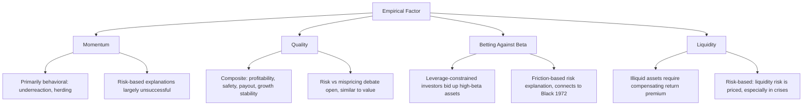

## Momentum, Quality, and Other Empirical Factors

### Overview

Beyond the Fama-French size, value, profitability, and investment factors, a broad set of additional empirical factors has been proposed and tested across the asset pricing literature — most prominently momentum, quality, low-volatility (betting-against-beta), and liquidity. These factors emerged from distinct research traditions and carry different theoretical justifications, ranging from behavioral underreaction/overreaction stories (momentum) to leverage-constraint arguments (betting-against-beta) to composite risk/profitability rationales (quality). This chapter develops the construction and evidence for each major factor, situates them within the broader "factor zoo" methodological debate, and examines how the empirical asset pricing literature has attempted to distinguish genuine risk premia from statistical artifacts of extensive data search.

### Momentum

#### Construction and Original Evidence

Jegadeesh and Titman (1993) documented that stocks with high returns over the past 3–12 months ("winners") tend to continue outperforming stocks with low returns over the same lookback period ("losers") over the subsequent 3–12 months — a pattern directly contradicting both the CAPM's static, single-period risk-return framework and, more fundamentally, weak-form market efficiency, since it implies a purely price-history-based trading rule generates abnormal returns.

The standard momentum factor (often denoted UMD, "Up Minus Down," or WML, "Winners Minus Losers") is constructed similarly to SMB/HML: stocks are ranked by their return over a formation period (commonly months $t-12$ to $t-2$, skipping the most recent month to avoid short-term reversal effects), sorted into deciles or terciles, and the factor is the return on a long-top/short-bottom portfolio, typically rebalanced monthly.

**Key Points**

- The one-month skip between the formation period and the holding period is a deliberate design choice addressing well-documented short-term reversal (stocks that performed very well or very poorly in the immediately preceding month tend to partially reverse over the following month) — a distinct, shorter-horizon phenomenon from momentum itself
- Momentum has been documented across numerous asset classes beyond individual equities — country equity indices, industries, currencies, commodities, and government bonds — a breadth of replication (Asness, Moskowitz, and Pedersen, 2013, "Value and Momentum Everywhere") frequently cited as evidence against a purely equity-market-specific data-mining explanation
- Carhart (1997) incorporated momentum as a fourth factor alongside the Fama-French three, and the resulting four-factor model remains widely used, particularly for mutual fund performance evaluation, where controlling for momentum exposure is considered important given that some funds' apparent skill is partly attributable to systematic momentum tilts

#### Theoretical Interpretation

**Key Points**

- **Behavioral explanations**: underreaction to news (investors incorporate new information into prices too slowly, causing continued drift in the direction of the initial reaction) and/or investor herding/positive-feedback trading are the dominant behavioral explanations (Hong and Stein, 1999; Daniel, Hirshleifer, and Subrahmanyam, 1998, among others)
- **Risk-based explanations**: have proven considerably less successful for momentum than for size or value — momentum strategies are difficult to rationalize with standard risk-based stories, since winner stocks do not obviously bear higher systematic risk than loser stocks in most conventional risk measures, a point widely noted as a distinguishing feature of momentum relative to the other major factors
- **Momentum crashes**: momentum strategies have historically experienced severe, sudden drawdowns during sharp market reversals (notably 2009), when previously beaten-down ("loser") stocks rally sharply — Daniel and Moskowitz (2016) document and analyze this "momentum crash" phenomenon, showing it is associated with periods of high market volatility following market declines, a pattern with some risk-based flavor even though the baseline momentum premium itself remains difficult to explain with standard risk models [Inference — "difficult to explain with standard risk models" reflects a broad literature consensus on the challenge, though this remains an active research area rather than a claim that no risk-based explanation has ever been proposed]

### Quality

#### Defining "Quality"

Unlike size, value, or momentum, "quality" is not a single, universally agreed-upon characteristic but a composite concept typically constructed from multiple sub-characteristics associated with fundamentally healthier, more stable, more profitable firms:

**Key Points — Common Quality Components**

- **Profitability**: high and stable gross profits, return on equity, or margins
- **Earnings stability/low earnings volatility**: consistent rather than erratic earnings streams
- **Low leverage / financial strength**: conservative balance sheets, lower default risk
- **High payout / low investment**: firms returning capital to shareholders rather than aggressively reinvesting or issuing new equity/debt
- **Growth in profitability**: improving rather than merely high-level current profitability

Asness, Frazzini, and Pedersen (2019) formalize a widely cited "Quality Minus Junk" (QMJ) factor combining profitability, growth, safety (low volatility/leverage), and payout sub-scores into a composite quality measure, finding that high-quality stocks have historically earned higher risk-adjusted returns than low-quality ("junk") stocks, a pattern documented across multiple markets and time periods in their study.

**Key Points**

- Quality's relationship to the Fama-French RMW (profitability) factor is close but not identical — RMW uses a single, relatively narrow operating-profitability measure, while composite quality measures typically incorporate several additional dimensions (safety, payout, growth stability), making quality factors and RMW correlated but empirically distinct
- The quality premium's theoretical interpretation faces a similar risk-versus-mispricing tension as size and value: quality could represent compensation for some subtle risk dimension not captured by standard factors, or could reflect persistent investor underappreciation of stable, high-quality businesses (a "quality is underpriced because it is boring" behavioral story) — this remains, like the broader value/size debate, an open interpretive question

### Betting-Against-Beta (Low-Volatility Anomaly)

Frazzini and Pedersen (2014) formalize the long-documented empirical pattern (traceable back to Black, Jensen, and Scholes's 1972 finding of a flatter-than-predicted SML) that low-beta stocks have historically earned higher risk-adjusted returns than high-beta stocks — directly contradicting the CAPM's predicted positive linear beta-return relationship.

#### The Leverage-Constraint Explanation

Frazzini and Pedersen's specific theoretical contribution is a leverage-constrained-investor model: some investors (subject to margin requirements, institutional mandates prohibiting leverage, or behavioral aversion to using leverage) cannot or will not use borrowing to achieve their desired level of portfolio risk/return. Instead, such investors tilt their unlevered portfolios toward inherently high-beta assets to achieve higher expected returns without borrowing — bidding up the price (and thus lowering the expected return) of high-beta assets relative to what CAPM would predict, and correspondingly leaving low-beta assets relatively underpriced (higher risk-adjusted expected return) since fewer investors compete for them via this leverage-substitution channel.

$$BAB = r_L^{levered\;to\;beta=1} - r_H^{levered\;to\;beta=1}$$

The BAB (Betting Against Beta) factor is constructed as a portfolio long low-beta stocks (levered up to a target beta of 1) and short high-beta stocks (delevered down to a target beta of 1), isolating the pure effect of the beta-return relationship's slope being flatter than CAPM predicts.

**Key Points**

- This is a genuinely risk-based (albeit friction-based rather than frictionless-equilibrium) explanation, directly connecting the anomaly to Black's zero-beta CAPM insight and to observable leverage constraints, distinguishing it from the more purely behavioral explanations offered for momentum
- Frazzini and Pedersen document the BAB pattern across numerous asset classes (equities in multiple countries, Treasury bonds, corporate bonds, and other markets), a breadth of evidence cited as support for the leverage-constraint mechanism operating broadly across constrained-investor populations rather than being specific to one market's institutional structure

### Diagram: Empirical Factors and Their Primary Theoretical Rationale

### Liquidity as a Priced Factor

Pastor and Stambaugh (2003) and Amihud (2002) developed influential liquidity-risk measures and found that stocks with greater sensitivity to *aggregate* market liquidity shocks (not merely stocks that are individually illiquid) command a return premium — a systematic-risk-based interpretation of illiquidity distinct from the simpler, older observation that illiquid assets require compensation for transaction costs and holding-period risk.

**Key Points**

- The distinction between *individual* illiquidity (a characteristic, compensated as a transaction-cost premium) and *systematic liquidity risk* (sensitivity to market-wide liquidity shocks, compensated as a genuine risk premium in the APT/CAPM sense) is analytically important and sometimes conflated in less careful treatments
- Liquidity risk premia are particularly emphasized in fixed income and less liquid asset classes (private equity, real estate, certain credit instruments), where the premium can be substantially larger and more clearly economically important than in highly liquid large-cap equity markets

### The Factor Zoo Problem Applied to These Factors

**Key Points**

- Harvey, Liu, and Zhu (2016) catalog several hundred factors proposed across the published finance literature and argue that, given the number of characteristics tested against historical U.S. equity data by multiple independent research teams over several decades, conventional statistical significance thresholds (e.g., $t$-statistic $>2$) are far too lenient — many "discovered" factors are likely to be false positives arising from extensive, largely uncoordinated multiple testing across the academic community
- Momentum, quality, and betting-against-beta are generally regarded as among the more robust factors within the broader zoo — supported by out-of-sample replication across multiple markets, asset classes, and time periods beyond the original discovery sample — a standard the literature increasingly treats as a meaningful bar for distinguishing likely-genuine factors from likely-spurious ones [Inference — the characterization of these three specific factors as "among the more robust" reflects a reasonably common view in review-style literature on the factor zoo, though this is an evaluative judgment rather than an uncontested fact, and reasonable researchers assign somewhat different confidence levels to different factors]
- Proposed remedies include out-of-sample testing on non-overlapping data or different markets/countries, higher statistical significance thresholds adjusted for the effective number of tests conducted across the literature, requiring plausible theoretical (not purely statistical) motivation before considering a factor a serious candidate, and pre-registration of hypotheses — though no single remedy has achieved universal adoption as a field-wide standard

### Practical Application: Multi-Factor Portfolio Construction

**Example**

A quantitative asset manager building a systematic long-short equity strategy might combine value, momentum, and quality signals into a composite score, motivated partly by the empirical observation that value and momentum have historically exhibited low or even negative correlation with each other (value tends to underperform during momentum-favorable regimes and vice versa), potentially providing diversification benefits when combined in a single strategy relative to running either factor in isolation. Adding a quality overlay (avoiding "value traps" — statistically cheap stocks that are cheap because they are genuinely troubled businesses) is a commonly cited practical rationale for combining value and quality signals jointly rather than using value in isolation. [Inference — this specific combination rationale reflects commonly cited practitioner logic in the quantitative/systematic investing literature, presented as an illustrative strategy design consideration rather than a claim about any particular fund's actual methodology or performance]

### Common Pitfalls

- Treating momentum as having a similarly well-established risk-based explanation as value or size — the literature strongly favors behavioral explanations for momentum specifically, unlike the more actively contested (but at least seriously proposed) risk-based cases for value and quality
- Conflating "quality" with the narrower Fama-French RMW factor — composite quality measures typically incorporate additional dimensions beyond operating profitability alone
- Confusing individual-asset illiquidity (a compensated characteristic/transaction-cost premium) with systematic liquidity risk (a distinct, comovement-based risk factor in the Pastor-Stambaugh sense)
- Treating any factor with a historically significant $t$-statistic as established, without considering the factor zoo's multiple-testing implications and the importance of genuine out-of-sample replication
- Assuming betting-against-beta and momentum are mutually exclusive or redundant with the Fama-French five factors — empirically, they have generally been found to add incremental explanatory power beyond the five-factor model, motivating their common inclusion as additional factors in six-, seven-, or more-factor extended models

**Related Topics**

- Fama-French three-factor and five-factor models as the foundational multi-factor framework these factors extend
- Zero-Beta CAPM and Black (1972) as the theoretical antecedent of betting-against-beta
- The "factor zoo" and multiple-testing concerns in empirical asset pricing (Harvey, Liu, and Zhu, 2016)
- Behavioral finance explanations for momentum, value, and related anomalies
- Liquidity risk in fixed income and illiquid asset classes
- Factor investing and smart beta portfolio construction
- Momentum crashes and tail risk in systematic factor strategies