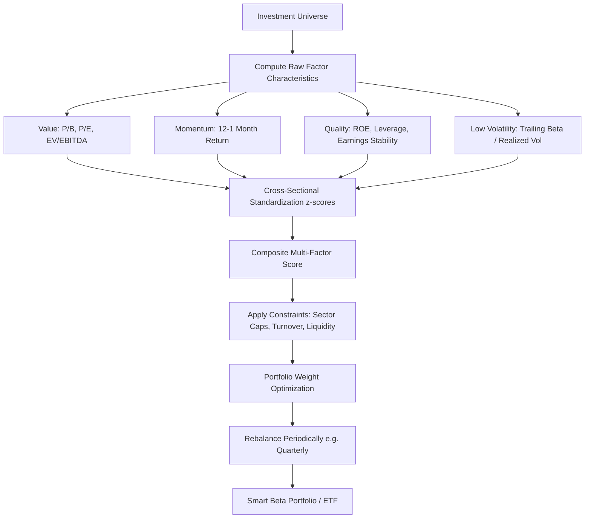

## Factor Investing and Smart Beta Strategies

### Overview and Conceptual Foundations

Factor investing is a portfolio construction approach that targets specific, well-documented drivers of return ("factors") rather than relying purely on traditional market-capitalization weighting or discretionary security selection. It sits directly downstream of Arbitrage Pricing Theory (APT), which posits that an asset's expected return is a linear function of its exposures (betas) to multiple systematic risk factors, rather than the single market factor used in the CAPM.

$$E(R_i) = R_f + \beta_{i,1}\lambda_1 + \beta_{i,2}\lambda_2 + \dots + \beta_{i,k}\lambda_k$$

Where $E(R_i)$ is the expected return of asset $i$, $R_f$ is the risk-free rate, $\beta_{i,k}$ is asset $i$'s sensitivity to factor $k$, and $\lambda_k$ is the risk premium associated with factor $k$.

Smart beta (also called "strategic beta" or "advanced beta") refers to the practical, rules-based implementation of factor investing in index and ETF products. It occupies a middle ground between passive market-cap-weighted indexing ("beta") and fully discretionary active management ("alpha"), using transparent, systematic rules to tilt portfolios toward factors with a documented risk premium or persistent behavioral mispricing.

**Key Points**

- Factor investing is the theoretical/empirical framework; smart beta is its commercialized, rules-based product wrapper (typically ETFs or index funds).
- The approach assumes that a portion of active managers' historical "alpha" is actually compensation for exposure to systematic factors, which can be captured more cheaply through rules-based replication.
- Factors are typically classified as either **macroeconomic** (inflation, GDP growth, interest rates) or **style/characteristic-based** (value, size, momentum), with equity factor investing overwhelmingly focused on the latter.

### From APT to Empirical Factor Models

APT itself is agnostic about which factors matter or how many there are; it only requires that returns follow an approximate linear factor structure and that no-arbitrage holds. Empirical asset pricing research since the 1990s has identified specific, replicable style factors that explain cross-sectional variation in stock returns beyond the single market factor of the CAPM.

The most influential lineage:

1. **CAPM (Sharpe, 1964)**: single factor — market beta.
2. **Fama-French Three-Factor Model (1993)**: adds size (SMB — Small Minus Big) and value (HML — High Minus Low).
3. **Carhart Four-Factor Model (1997)**: adds momentum (UMD — Up Minus Down / WML).
4. **Fama-French Five-Factor Model (2015)**: adds profitability (RMW — Robust Minus Weak) and investment (CMA — Conservative Minus Aggressive).

$$R_i - R_f = \alpha_i + \beta_{MKT}(R_m - R_f) + \beta_{SMB}\cdot SMB + \beta_{HML}\cdot HML + \beta_{RMW}\cdot RMW + \beta_{CMA}\cdot CMA + \epsilon_i$$

Smart beta products are, in effect, an attempt to package the right-hand-side factor exposures of these models into investable, low-cost vehicles.

### The Core Equity Factors

**Key Points**

- **Value**: Stocks with low prices relative to fundamentals (book value, earnings, cash flow, sales) tend to outperform "growth" stocks over long horizons. Common metrics: P/B, P/E, EV/EBITDA, dividend yield.
- **Size**: Smaller-capitalization stocks have historically earned a premium over large-cap stocks, plausibly compensating for lower liquidity and higher distress risk.
- **Momentum**: Securities that have performed well (poorly) over the past 3–12 months tend to continue performing well (poorly) over the subsequent 3–12 months, contradicting weak-form market efficiency.
- **Low Volatility (Minimum Variance / Betting Against Beta)**: Lower-risk stocks have historically delivered risk-adjusted returns exceeding what CAPM predicts — an anomaly often attributed to leverage constraints and lottery-preference behavioral biases.
- **Quality**: Firms with high profitability, stable earnings, low leverage, and strong balance sheets tend to outperform low-quality peers, especially in downturns.
- **Yield/Dividend**: Overlaps with value; targets high and stable dividend-paying stocks, often favored by income-oriented investors.

**Example**

A simple value tilt using price-to-book ratio, in pseudocode/formula form:

$$\text{Value Score}_i = -\left(\frac{P_i}{B_i}\right)$$

Rank all stocks in the universe by this score, go long the top quintile (cheapest 20%) and, in a long-short academic factor construction, short the bottom quintile (most expensive 20%). A long-only smart beta ETF instead simply overweights the top quintile/tercile relative to a cap-weighted benchmark and underweights or excludes the rest.

### Factor Model Estimation: A Worked Example

Suppose you want to estimate a stock's exposure to the Fama-French three factors using time-series regression of monthly excess returns.

**Example**

Given monthly return data for a stock and the three factor portfolios:

| Month | $R_i - R_f$ | $MKT-R_f$ | $SMB$ | $HML$ |
| --- | --- | --- | --- | --- |
| 1 | 2.1% | 1.8% | 0.5% | -0.3% |
| 2 | -1.4% | -1.0% | 0.2% | 0.6% |
| 3 | 3.0% | 2.5% | -0.4% | 1.1% |

Run OLS regression:

$$R_i - R_f = \alpha + \beta_{MKT}(MKT - R_f) + \beta_{SMB} \cdot SMB + \beta_{HML} \cdot HML + \epsilon$$

The resulting coefficients ($\beta_{MKT}$, $\beta_{SMB}$, $\beta_{HML}$) quantify the stock's sensitivity to each factor, and a statistically significant, positive $\alpha$ (Jensen's alpha) would indicate the stock earns return unexplained by these systematic exposures — the quantity active managers claim to generate and that factor investing argues is often just uncaptured factor exposure. [Inference — whether a specific stock's residual alpha reflects genuine skill or an omitted factor is a matter of model specification and cannot be determined from the regression alone.]

In Python, using `statsmodels`:

```python
import pandas as pd
import statsmodels.api as sm

# df has columns: excess_return, mkt_rf, smb, hml
X = df[['mkt_rf', 'smb', 'hml']]
X = sm.add_constant(X)
y = df['excess_return']

model = sm.OLS(y, X).fit()
print(model.summary())

# model.params gives alpha (const) and factor betas
# model.pvalues gives statistical significance of each exposure
```

### Smart Beta Construction Methodologies

Smart beta indices depart from cap-weighting through one or more of the following approaches:

**Key Points**

- **Alternative weighting of the same universe**: Same constituents as a cap-weighted index but reweighted by a fundamental metric (e.g., RAFI Fundamental Index weights by sales, book value, cash flow, and dividends instead of market cap).
- **Equal weighting**: Every constituent receives the same weight, mechanically tilting toward smaller-cap names and requiring periodic rebalancing back to equal weights (a form of embedded value/contrarian rebalancing).
- **Factor screening/tilting**: Stocks are screened or scored on a factor metric (value, quality, momentum, low-vol) and weighted by factor score or rank, subject to sector/liquidity/turnover constraints.
- **Minimum-variance/risk-based weighting**: Portfolio weights are chosen via an optimizer to minimize total portfolio variance subject to constraints (this is a portfolio-construction technique layered on top of low-volatility stock selection).
- **Multi-factor combination**: Blends two or more factors, either via a **composite score** (sum/average of factor z-scores per stock) or a **sleeve/portfolio blend** (separate single-factor sub-portfolios combined at the top level).

**Example**

A simple multi-factor composite score combining value and quality using cross-sectional z-scores:

$$Z_{value,i} = \frac{X_{value,i} - \mu_{value}}{\sigma_{value}}, \quad Z_{quality,i} = \frac{X_{quality,i} - \mu_{quality}}{\sigma_{quality}}$$


$$\text{Composite Score}_i = w_1 Z_{value,i} + w_2 Z_{quality,i}$$

Where $w_1$ and $w_2$ are analyst- or provider-defined weights (often equal-weighted at 0.5/0.5 absent a stronger view). Stocks are then ranked by composite score and the top decile/quintile is selected and weighted, typically capped by sector and single-name constraints to control turnover and concentration.

### Factor Timing and Cyclicality

**Key Points**

- Factors are cyclical, not universally dominant: value has historically underperformed growth for extended periods (e.g., 2007–2020 in U.S. large caps) before mean-reverting.
- Momentum is prone to sharp "momentum crashes," particularly during market rebounds following steep drawdowns, since prior losers (heavily shorted or underweighted in a momentum strategy) can rally violently.
- Low-volatility strategies tend to underperform in strong bull markets (since they systematically avoid high-beta winners) but provide downside protection in bear markets.
- Factor correlations are not stable; value and momentum are often negatively correlated (value tends to buy recent losers, momentum buys recent winners), which is frequently cited as a diversification rationale for multi-factor blends.
- [Inference] Attempts to time factor exposures based on macro regimes or valuation spreads have produced mixed empirical results and are generally considered harder to execute reliably than static, diversified factor exposure — this remains a debated and actively researched area.

### Smart Beta vs. Traditional Passive and Active Management

| Dimension | Cap-Weighted Passive | Smart Beta | Discretionary Active |
| --- | --- | --- | --- |
| Rules-based/transparent | Yes | Yes | No |
| Cost (typical expense ratio) | Very low | Low-to-moderate | High |
| Capacity | Very high | High | Variable |
| Return driver | Market beta | Targeted style factors | Manager skill/judgment + factors |
| Turnover | Low | Low-to-moderate | Variable, often high |
| Tracking error vs. cap-weighted benchmark | ~0 | Moderate | High |

**Key Points**

- Smart beta's central value proposition is capturing a portion of what was historically sold as manager "alpha" at index-like fees, since many factor premia are systematic and replicable rather than the product of unique manager insight.
- Because smart beta strategies are rules-based and index-tracked, they are more susceptible to **factor crowding**: as more capital flows into a well-known factor, historical premia can compress or become more volatile. [Inference] The extent to which crowding has permanently eroded specific factor premia (particularly value and size since ~2010) is disputed among researchers and practitioners.

### Risks and Criticisms

**Key Points**

- **Data mining / p-hacking concerns**: With decades of return data and thousands of possible characteristics, some "factors" identified in academic literature may be statistical artifacts rather than true risk premia — this is sometimes called the "factor zoo" problem.
- **Factor decay post-publication**: Several studies document that published anomalies show weaker out-of-sample and post-publication returns than in the original discovery sample, consistent with either overfitting or crowding-driven arbitrage.
- **Implementation shortfall**: Real-world smart beta ETFs incur transaction costs, market impact, and taxes not present in academic long-short factor portfolios, and long-only real-world implementations only partially capture the long-short premia measured in research.
- **Definitional inconsistency**: Different index providers define the "same" factor (e.g., value) using different metrics and construction rules, producing meaningfully different factor exposures and returns across providers offering ostensibly similar products. [Inference] The magnitude of this dispersion and its practical significance for investor outcomes will vary by factor and time period.
- **Behavioral vs. risk-based explanations**: There is ongoing academic debate over whether factor premia represent compensation for bearing systematic risk (rational, APT-consistent) or persistent mispricing due to investor behavioral biases (which could, in principle, be arbitraged away over time). [Speculation] Which explanation dominates likely varies by factor and is not fully resolved in the literature.

### Multi-Factor Model Architecture (Conceptual Diagram)



### Factor Exposure Visualization

<svg xmlns="http://www.w3.org/2000/svg" viewBox="0 0 700 420" font-family="Arial, sans-serif">
<text x="350" y="28" text-anchor="middle" font-size="18" font-weight="bold" fill="#1a1a1a">Stock Factor Exposure Profile (svg_diagram)</text>

<line x1="90" y1="360" x2="650" y2="360" stroke="#333" stroke-width="2" />
<line x1="90" y1="60" x2="90" y2="360" stroke="#333" stroke-width="2" />


<text x="70" y="365" text-anchor="end" font-size="12" fill="#333">-1.0</text>

<text x="70" y="290" text-anchor="end" font-size="12" fill="#333">-0.5</text>

<text x="70" y="215" text-anchor="end" font-size="12" fill="#333">0.0</text>

<text x="70" y="140" text-anchor="end" font-size="12" fill="#333">0.5</text>

<text x="70" y="65" text-anchor="end" font-size="12" fill="#333">1.0</text>


<line x1="90" y1="215" x2="650" y2="215" stroke="#aaa" stroke-width="1" stroke-dasharray="4,4" />


<rect x="130" y="80" width="60" height="135" fill="#2b6cb0" />
<text x="160" y="235" text-anchor="middle" font-size="12" fill="#1a1a1a">Market</text>
<text x="160" y="72" text-anchor="middle" font-size="12" fill="#1a1a1a">0.90</text>

<rect x="220" y="155" width="60" height="60" fill="#2f855a" />
<text x="250" y="235" text-anchor="middle" font-size="12" fill="#1a1a1a">Size</text>
<text x="250" y="147" text-anchor="middle" font-size="12" fill="#1a1a1a">0.40</text>

<rect x="310" y="125" width="60" height="90" fill="#c05621" />
<text x="340" y="235" text-anchor="middle" font-size="12" fill="#1a1a1a">Value</text>
<text x="340" y="117" text-anchor="middle" font-size="12" fill="#1a1a1a">0.60</text>

<rect x="400" y="215" width="60" height="30" fill="#b83280" />
<text x="430" y="262" text-anchor="middle" font-size="12" fill="#1a1a1a">Momentum</text>
<text x="430" y="258" text-anchor="middle" font-size="12" fill="#1a1a1a">-0.20</text>

<rect x="490" y="170" width="60" height="45" fill="#805ad5" />
<text x="520" y="235" text-anchor="middle" font-size="12" fill="#1a1a1a">Quality</text>
<text x="520" y="162" text-anchor="middle" font-size="12" fill="#1a1a1a">0.30</text>

<rect x="580" y="215" width="60" height="75" fill="#d69e2e" />
<text x="610" y="310" text-anchor="middle" font-size="12" fill="#1a1a1a">Low Vol</text>
<text x="610" y="304" text-anchor="middle" font-size="12" fill="#1a1a1a">-0.50</text>

<text x="350" y="400" text-anchor="middle" font-size="12" fill="#555">Illustrative factor loadings from a hypothetical time-series regression</text>

</svg>

### Practical Implementation Considerations

**Key Points**

- **Rebalancing frequency**: Quarterly rebalancing is common for smart beta indices, balancing factor freshness against turnover-driven transaction costs.
- **Capacity constraints**: Factors like size and momentum have lower capacity than value or quality, since they can require concentrated positions in less-liquid names.
- **Fee structure**: Smart beta ETF expense ratios typically range from ~0.10% to ~0.50%, positioned between plain-vanilla cap-weighted index funds (often <0.10%) and active mutual funds (often >0.75%). [Unverified — exact fee levels vary by provider, fund, and over time; consult current fund prospectuses for precise figures.]
- **Tax efficiency**: ETF-wrapped smart beta strategies generally retain the in-kind creation/redemption tax efficiency of the ETF structure, though higher turnover than cap-weighted passive funds can still generate more taxable events. [Behavior may vary by jurisdiction, fund structure, and market conditions.]
- **Benchmark selection**: Because smart beta departs from standard cap-weighted benchmarks, evaluating performance requires factor-adjusted benchmarks or factor-model attribution rather than naive comparison to a broad market index.

### Empirical Performance Attribution Example

**Example**

Suppose a factor-based portfolio manager wants to attribute portfolio performance versus a cap-weighted benchmark using a factor model. If the portfolio and benchmark differ primarily in value tilt:

$$R_p - R_b = \beta_{HML,p}\cdot HML - \beta_{HML,b}\cdot HML + (\text{residual/security selection})$$

If $\beta_{HML,p} = 0.4$ and $\beta_{HML,b} = 0.05$, and the realized HML factor return over the period was 3%:

$$\text{Attribution from value tilt} = (0.4 - 0.05)\times 3\% = 1.05\%$$

This suggests approximately 1.05 percentage points of the portfolio's outperformance (or underperformance, if HML is negative) versus the benchmark is explained by its differential value factor exposure, with the remainder attributable to stock selection, other factor exposures, or noise.

### Related Topics

- Fama-French and Carhart multi-factor model derivations and statistical testing (GRS test, time-series vs. cross-sectional regressions)
- Behavioral finance explanations for momentum and value anomalies
- Risk parity and minimum-variance portfolio optimization
- ETF mechanics: creation/redemption, tracking error, and index replication methods
- Factor crowding and capacity analysis in quantitative equity strategies
- Fixed income and multi-asset factor investing (carry, term premium, credit risk premium)
- Machine learning approaches to factor discovery and the "factor zoo" critique (Harvey, Liu, Zhu)
- Performance attribution and the Brinson model vs. factor-based attribution