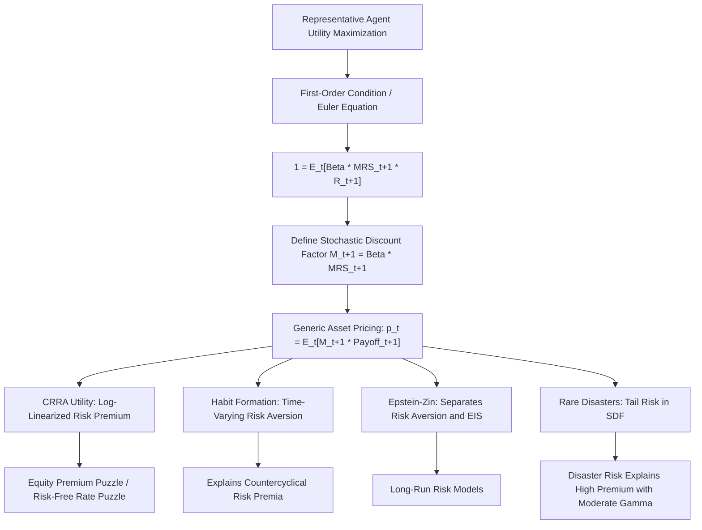

## The Consumption Euler Equation


### Overview and Theoretical Foundation

The consumption Euler equation is the central first-order condition of consumption-based asset pricing (CCAPM), derived from a representative agent's intertemporal utility maximization problem. It formalizes the idea that, at an optimum, an investor must be indifferent between consuming one additional unit today and investing it in an asset to consume the proceeds tomorrow. This single condition underlies nearly all consumption-based asset pricing models and provides the theoretical bridge between macroeconomic consumption dynamics and asset prices.

**Key Points**

- It is a **necessary condition for optimality**, not a full model of asset prices on its own; it must be combined with assumptions about utility functions, consumption dynamics, and the joint distribution of consumption growth and asset returns to generate testable pricing implications.
- It applies to **any** traded asset, making it a unifying pricing relationship across equities, bonds, and derivatives, in contrast to factor models that are typically asset-class-specific.
- It is the microfoundation from which the **Stochastic Discount Factor (SDF)** framework is derived.

### Derivation from the Investor's Optimization Problem

Consider a representative agent choosing a consumption path $\{C_t\}$ and asset holdings to maximize expected lifetime utility:

$$\max_{\{C_t\}} \; E_t\left[\sum_{s=0}^{\infty} \beta^s U(C_{t+s})\right]$$

subject to the budget constraint:

$$C_t + p_t \cdot \xi_t = (p_t + d_t)\cdot \xi_{t-1} + Y_t$$

Where $\beta$ is the subjective discount factor ($0 < \beta < 1$), $U(\cdot)$ is a strictly increasing, concave utility function, $p_t$ is the asset price, $\xi_t$ is the quantity of the asset held, $d_t$ is the dividend/payoff, and $Y_t$ is non-asset income.

**Derivation logic**: consider a small perturbation — reduce consumption today by $p_t$ to buy one more unit of the asset, then sell it (plus dividend) next period to consume the proceeds. At an interior optimum, the marginal utility cost of forgoing consumption today must exactly equal the marginal utility benefit of the resulting consumption tomorrow, discounted back:

$$U'(C_t)\,p_t = E_t\left[\beta \, U'(C_{t+1})(p_{t+1}+d_{t+1})\right]$$

Dividing through by $U'(C_t)p_t$ and defining the gross return $R_{t+1} = \dfrac{p_{t+1}+d_{t+1}}{p_t}$, this rearranges into the canonical **consumption Euler equation**:

$$1 = E_t\left[\beta \, \frac{U'(C_{t+1})}{U'(C_t)}\, R_{t+1}\right]$$

**Key Points**

- The term $\dfrac{U'(C_{t+1})}{U'(C_t)}$ is the **marginal rate of substitution (MRS)** between consumption today and tomorrow.
- Defining $M_{t+1} \equiv \beta \dfrac{U'(C_{t+1})}{U'(C_t)}$, the Euler equation collapses to the compact pricing kernel form:

$$E_t[M_{t+1}R_{t+1}] = 1 \quad \Longleftrightarrow \quad p_t = E_t[M_{t+1}(p_{t+1}+d_{t+1})]$$

- $M_{t+1}$ is the **Stochastic Discount Factor (SDF)**, also called the pricing kernel; it is asset-independent, meaning the same $M_{t+1}$ prices every asset in the economy.

### Intuition: Why the Euler Equation Prices Assets

**Key Points**

- Assets that pay off well when consumption growth is already high (i.e., positively correlated with consumption growth) are **less** valuable to a risk-averse investor, because that extra consumption has low marginal utility ($U'$ is decreasing in $C$ under concavity) — such assets must offer a **higher expected return** to be willingly held.
- Conversely, assets that pay off well precisely when consumption is low (recessions, "bad times") are **more** valuable as a hedge, since that payoff arrives when marginal utility is high — such assets can command a **lower expected return** (or even a negative risk premium).
- This is the deep intuition behind why the market risk premium in CCAPM is driven by the **covariance between asset returns and consumption growth**, not by covariance with the market portfolio (as in CAPM).

### Log-Linearization with CRRA Utility

The most common functional form used with the Euler equation is Constant Relative Risk Aversion (CRRA) utility:

$$U(C_t) = \frac{C_t^{1-\gamma}}{1-\gamma}, \quad \gamma > 0, \gamma \neq 1$$

Where $\gamma$ is the coefficient of relative risk aversion (and also the inverse of the elasticity of intertemporal substitution, EIS, under CRRA). Marginal utility is:

$$U'(C_t) = C_t^{-\gamma}$$

Substituting into the Euler equation:

$$1 = E_t\left[\beta \left(\frac{C_{t+1}}{C_t}\right)^{-\gamma} R_{t+1}\right]$$

**Example**

Assuming joint log-normality of consumption growth and returns (a standard simplifying assumption), taking logs and applying the log-normal expectation formula yields the widely used **log-linearized Euler equation**:

$$E_t[r_{t+1}] + \frac{1}{2}\sigma_r^2 = -\ln\beta + \gamma E_t[\Delta c_{t+1}] - \frac{1}{2}\gamma^2\sigma_c^2 + \gamma\,\sigma_{rc}$$

Where $r_{t+1} = \ln R_{t+1}$, $\Delta c_{t+1} = \ln(C_{t+1}/C_t)$, $\sigma_r^2$ and $\sigma_c^2$ are the variances of returns and consumption growth, and $\sigma_{rc}$ is their covariance. For the risk-free asset (whose return is known at $t$, so $\sigma_{r_f c} = 0$ and $\sigma_{r_f}^2=0$):

$$r_{f,t+1} = -\ln\beta + \gamma E_t[\Delta c_{t+1}] - \frac{1}{2}\gamma^2\sigma_c^2$$

Subtracting this from the risky-asset equation gives the **consumption-based risk premium**:

$$E_t[r_{t+1}] - r_{f,t+1} + \frac{1}{2}\sigma_r^2 = \gamma\,\sigma_{rc}$$

This shows the risk premium on any asset is proportional to $\gamma$ (risk aversion) times its covariance with consumption growth — the core testable prediction of CCAPM.

### The Equity Premium Puzzle

**Key Points**

- Mehra and Prescott (1985) showed that, empirically, U.S. consumption growth is far too smooth (low $\sigma_c$) relative to the observed historical equity risk premium (~6% annually) for any economically plausible value of $\gamma$ (typically estimated well under 10) to reconcile the Euler equation with the data.
- Matching the historical premium via the Euler equation above requires implausibly high risk aversion coefficients (often estimated in the range of 20–50 or higher in calibration exercises), a result termed the **equity premium puzzle**.
- A closely related issue is the **risk-free rate puzzle**: the same high $\gamma$ needed to explain the equity premium, combined with observed low consumption growth volatility, implies an implausibly high risk-free rate unless $\beta$ is pushed above 1 (implying agents prefer future consumption to present consumption, which is difficult to justify economically). [Inference — the precise magnitude of the puzzle is sensitive to the sample period, consumption data measurement, and model specification used.]
- These puzzles motivated extensions such as habit formation (Campbell-Cochrane), long-run risk (Bansal-Yaron), and Epstein-Zin recursive preferences that separate risk aversion from the EIS.

### Numerical Example: Testing the Euler Equation

**Example**

Suppose annual U.S. data shows: mean consumption growth $E[\Delta c] = 1.8\%$, standard deviation of consumption growth $\sigma_c = 1.5\%$, and the observed equity premium (adjusted for Jensen's term) is $6\%$.

Using $E_t[r_{t+1}] - r_{f,t+1} = \gamma\sigma_{rc}$, and approximating $\sigma_{rc} \approx \rho \cdot \sigma_r \cdot \sigma_c$ with correlation $\rho \approx 0.2$ and equity return volatility $\sigma_r \approx 16\%$:

$$\sigma_{rc} \approx 0.2 \times 0.16 \times 0.015 = 0.00048$$


$$\gamma = \frac{0.06}{0.00048} \approx 125$$

This implied risk aversion coefficient of roughly 125 is far outside the range (typically 1–10) considered economically plausible based on microeconomic evidence on individual risk-taking behavior, starkly illustrating the equity premium puzzle numerically. [Inference — this is a stylized calibration using illustrative parameter values, not an estimate from a specific published study; actual published estimates vary by dataset and methodology.]

Python illustration of GMM-style Euler equation estimation setup:

```python
import numpy as np
from scipy.optimize import minimize

# df has columns: cons_growth (C_t+1/C_t), gross_return (R_t+1)
def euler_moment(params, cons_growth, gross_return):
    beta, gamma = params
    m = beta * (cons_growth ** (-gamma))  # SDF realization
    moment = m * gross_return - 1         # Euler equation residual
    return moment

def gmm_objective(params, cons_growth, gross_return):
    g = euler_moment(params, cons_growth, gross_return)
    moments = np.array([np.mean(g), np.mean(g * cons_growth)])
    W = np.eye(len(moments))  # identity weighting matrix (first-stage GMM)
    return moments @ W @ moments

result = minimize(
    gmm_objective, x0=[0.96, 5.0],
    args=(cons_growth_data, gross_return_data),
    method='Nelder-Mead'
)
beta_hat, gamma_hat = result.x
```

### Generalized Method of Moments (GMM) Estimation

**Key Points**

- Hansen and Singleton (1982) pioneered using **GMM** to estimate and test the consumption Euler equation directly from data without assuming a specific distribution for consumption growth and returns.
- The Euler equation $E_t[M_{t+1}R_{t+1} - 1] = 0$ implies an **unconditional** moment condition $E[(M_{t+1}R_{t+1}-1)z_t] = 0$ for any variable $z_t$ in the time-$t$ information set (instruments), which GMM exploits by minimizing a weighted quadratic form of sample moment conditions.
- The **J-statistic** (test of overidentifying restrictions) is used to test whether the model's moment conditions are jointly consistent with the data; rejections of the consumption CAPM Euler equation using this framework are common in the empirical literature, motivating the search for alternative preference specifications and SDFs. [Behavior may vary substantially depending on instrument choice, sample period, and data frequency used.]

### Extensions to the Basic Euler Equation

**Key Points**

- **Habit formation models** (e.g., Campbell and Cochrane, 1999): utility depends on consumption relative to a slow-moving habit/reference level, generating time-varying risk aversion that rises in recessions — helping explain both the level and countercyclical variation of the equity premium.
- **Epstein-Zin recursive preferences**: separate the coefficient of relative risk aversion from the elasticity of intertemporal substitution (which CRRA forces to be reciprocals of each other), allowing more flexible calibration and forming the basis of long-run risk models.
- **Long-run risk models** (Bansal and Yaron, 2004): posit a small, persistent component in consumption growth that agents care about disproportionately under Epstein-Zin preferences with a preference for early resolution of uncertainty.
- **Rare disaster models** (Barro, 2006; Rietz, 1988): incorporate a small probability of a large consumption disaster, which can generate a large equity premium even with moderate risk aversion, since the SDF must price the tail risk of catastrophic consumption drops.

### Euler Equation and the SDF: Conceptual Flow



### Empirical Testing Challenges

**Key Points**

- **Consumption data measurement**: Aggregate consumption data (e.g., from national accounts) is measured at low frequency, is subject to time-aggregation bias, and may not capture the marginal consumer's actual consumption relevant to asset pricing (the "limited participation" problem — most consumption-smoothing agents don't actively trade in equity markets).
- **Durable vs. non-durable consumption**: Some studies find that models using non-durable consumption and services (excluding durables, which are more like an investment good) fit the data better, though results vary. [Unverified — specific fit improvements are sensitive to dataset vintage and model specification.]
- **Joint hypothesis problem**: Rejecting the Euler equation empirically is always a joint test of (a) the specific utility function assumed, (b) rational expectations, and (c) market efficiency/no-arbitrage — a rejection cannot cleanly identify which assumption has failed.

### Related Topics

- Stochastic Discount Factor (SDF) framework and no-arbitrage pricing
- Equity premium puzzle and risk-free rate puzzle (Mehra-Prescott, Weil)
- Habit formation models (Campbell-Cochrane external habit model)
- Epstein-Zin recursive utility and long-run risk models (Bansal-Yaron)
- Rare disaster models (Barro, Rietz, Gabaix)
- Generalized Method of Moments (GMM) estimation in asset pricing (Hansen-Singleton)
- Relationship between CCAPM and traditional CAPM/APT factor models
- Term structure of interest rates under consumption-based pricing