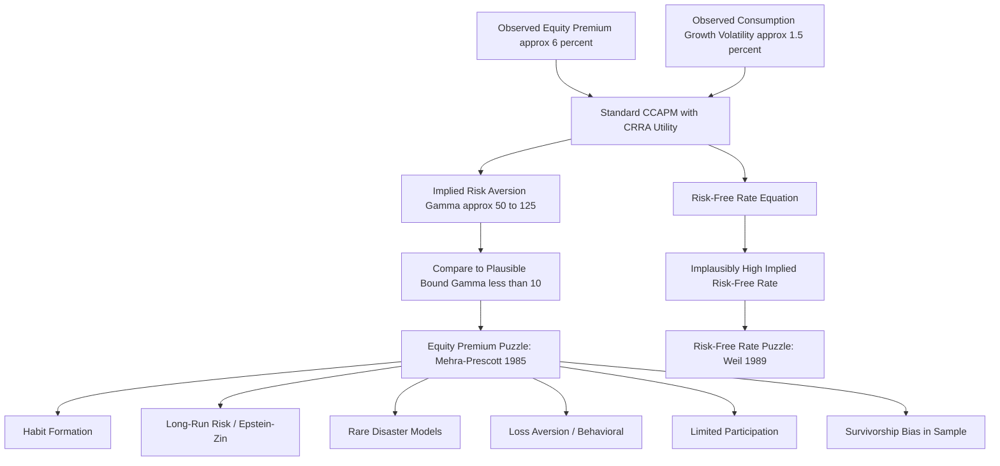

## The Equity Premium Puzzle

### Overview and Statement of the Puzzle

The equity premium puzzle, identified by Rajnish Mehra and Edward Prescott in their 1985 paper "The Equity Premium: A Puzzle," refers to the empirical finding that the historical excess return of equities over risk-free government debt is far too large to be explained by standard consumption-based asset pricing models (CCAPM) under economically plausible levels of risk aversion. It stands as one of the most persistent and influential anomalies in financial economics, motivating three decades of subsequent theoretical development.

**Key Points**

- The puzzle is fundamentally a **quantitative** mismatch, not a qualitative one: the consumption Euler equation correctly predicts that riskier assets should earn a premium, but the CRRA-utility version of the model requires implausibly high risk aversion to match the *magnitude* of the observed premium.
- U.S. historical data shows an average annual equity risk premium of roughly 6–7% (arithmetic average of stock returns over T-bill returns), while aggregate consumption growth is empirically very smooth, with a standard deviation of only around 1–1.5% annually. [Unverified — precise magnitudes vary by sample period, data source, and whether arithmetic or geometric averaging is used; contemporary estimates over different windows can differ meaningfully from Mehra-Prescott's original 1889–1978 sample.]
- The puzzle is best understood as a joint anomaly: matching the equity premium requires very high risk aversion ($\gamma$), but that same high $\gamma$, combined with smooth consumption growth, implies (via the risk-free rate equation) an implausibly high risk-free rate — unless the subjective discount factor $\beta$ is pushed above 1, which is difficult to justify economically (agents would prefer to consume *less* today than tomorrow purely from impatience, i.e., negative time preference).

### Mathematical Derivation of the Puzzle

Starting from the log-linearized consumption Euler equation under CRRA utility (derived in the entry on the Euler equation), the risk premium on any risky asset relative to the risk-free rate is:

$$E_t[r_{t+1}] - r_{f,t+1} + \frac{1}{2}\sigma_r^2 = \gamma\,\sigma_{rc}$$

Where $\gamma$ is the coefficient of relative risk aversion, and $\sigma_{rc} = \text{Cov}(r_{t+1}, \Delta c_{t+1})$ is the covariance between the asset's log return and log consumption growth.

Approximating $\sigma_{rc} \approx \rho_{rc}\,\sigma_r\,\sigma_c$, and rearranging to solve for the implied risk aversion required to match an observed premium:

$$\gamma = \frac{E_t[r_{t+1}] - r_{f,t+1} + \frac{1}{2}\sigma_r^2}{\rho_{rc}\,\sigma_r\,\sigma_c}$$

**Example**

Using stylized long-run U.S. figures: equity premium $\approx 6\%$, $\sigma_r \approx 16\%$ (equity return volatility), $\sigma_c \approx 1.5\%$ (consumption growth volatility), and correlation $\rho_{rc} \approx 0.2$ (a low empirical correlation between stock returns and consumption growth):

$$\sigma_{rc} = 0.2 \times 0.16 \times 0.015 = 0.00048$$


$$\gamma = \frac{0.06}{0.00048} \approx 125$$

Mehra and Prescott's original calibration bounded plausible risk aversion at $\gamma \leq 10$ based on evidence from insurance markets, labor supply behavior, and other microeconomic decisions under uncertainty. An implied $\gamma$ in the range of 50–125 (depending on the exact sample and parameters used) is roughly an order of magnitude beyond what is considered behaviorally plausible — this gap **is** the equity premium puzzle. [Inference — the specific numerical gap depends heavily on the assumed correlation and volatility inputs, which vary across studies; the qualitative conclusion that required $\gamma$ vastly exceeds plausible bounds is robust across most published calibrations.]

### The Companion Risk-Free Rate Puzzle

**Key Points**

- Weil (1989) formalized a closely linked problem: the risk-free rate equation under CRRA utility is

$$r_{f,t+1} = -\ln\beta + \gamma E_t[\Delta c_{t+1}] - \frac{1}{2}\gamma^2\sigma_c^2$$

- With $\gamma \approx 30$–125 (needed to match the equity premium), a positive average consumption growth $E[\Delta c] \approx 1.8\%$, and low $\sigma_c$, the term $\gamma E_t[\Delta c_{t+1}]$ becomes very large, implying a risk-free rate far above the historically observed real risk-free rate (roughly 1% historically for U.S. T-bills).
- To reconcile this, $\beta$ must be set above 1, implying agents place *more* weight on future utility than present utility — a violation of standard impatience assumptions and, in an infinite-horizon model, a potential source of unbounded utility/non-convergence problems.
- Together, the equity premium puzzle and risk-free rate puzzle imply that **no single value of $\gamma$ and $\beta$ within a standard CRRA/time-separable framework can simultaneously match both the level of the risk-free rate and the size of the equity premium** — this joint failure is the core empirical content of the puzzle.

### Numerical Illustration of the Risk-Free Rate Tension

**Example**

```python
import numpy as np

def implied_risk_free_rate(beta, gamma, E_dc, sigma_c):
    """CRRA log-linearized risk-free rate equation."""
    return -np.log(beta) + gamma * E_dc - 0.5 * (gamma**2) * (sigma_c**2)

E_dc = 0.018      # mean consumption growth
sigma_c = 0.015   # consumption growth volatility

for gamma in [2, 10, 30, 60, 125]:
    rf = implied_risk_free_rate(beta=0.99, gamma=gamma, E_dc=E_dc, sigma_c=sigma_c)
    print(f"gamma={gamma:>4}: implied risk-free rate = {rf*100:.2f}%")
```

Running this illustrates that as $\gamma$ rises to the levels needed to explain the equity premium, the implied risk-free rate rises sharply (and can turn strongly negative once the $\gamma^2\sigma_c^2$ term dominates at very high $\gamma$, since it enters with a negative sign) — moving further away from, not toward, the historically observed low real risk-free rate under any single reasonable $\beta$. [Inference — the precise crossover behavior depends on the specific parameter values used; this is intended as illustrative, not a replication of a specific published table.]

### Proposed Resolutions

**Key Points**

- **Habit formation** (Campbell and Cochrane, 1999; Constantinides, 1990): Utility depends on consumption relative to a slowly-adjusting habit stock, not consumption in isolation. Effective local risk aversion becomes time-varying and can spike during recessions (when consumption falls near the habit level), generating a large and countercyclical equity premium without requiring implausibly high *average* risk aversion.
- **Epstein-Zin recursive preferences with long-run risk** (Bansal and Yaron, 2004): By separating the coefficient of relative risk aversion from the elasticity of intertemporal substitution (which are forced to be reciprocals under CRRA), and positing a small persistent "long-run risk" component in consumption growth that agents dislike disproportionately under a preference for early resolution of uncertainty, this framework can generate a sizeable equity premium with more modest risk aversion (though still often higher than the original Mehra-Prescott bound).
- **Rare disaster models** (Rietz, 1988; Barro, 2006): Introduce a small, low-probability chance of a catastrophic consumption decline (economic depression, war, financial collapse). Because the SDF must price this tail risk, even a small disaster probability can generate a large unconditional equity premium with moderate risk aversion, since observed post-WWII U.S. data (a "peace and growth" sample) may simply not contain a realized disaster — a **peso problem** / survivorship-type explanation.
- **Loss aversion and myopic loss aversion** (Benartzi and Thaler, 1995): A behavioral explanation positing that investors are loss-averse (per Kahneman-Tversky prospect theory) and evaluate portfolios frequently ("myopically"), making the volatility of stock returns feel more painful than a purely rational, long-horizon CRRA investor would perceive it, thereby demanding a higher premium to hold equities.
- **Market incompleteness / limited participation**: Since aggregate consumption data reflects all households, but historically only a subset actively participate in equity markets, the *marginal investor's* consumption may be far more volatile and more correlated with stock returns than aggregate consumption data suggests, potentially reconciling the model with more modest risk aversion. [Inference — the quantitative success of this channel in fully resolving the puzzle is debated and sensitive to how participation and idiosyncratic risk are modeled.]
- **Survivorship bias in the U.S. sample**: The U.S. equity market is often cited as an unusually successful outcome among 20th-century economies (some of which suffered market closures, hyperinflation, or expropriation); using only surviving-market data may overstate the "true" ex-ante expected equity premium. [Inference — the magnitude of this bias is contested in the empirical literature, with some cross-country studies finding smaller premia elsewhere but not eliminating the puzzle entirely.]

### Comparison of Resolution Approaches

| Approach | Core Mechanism | Achieves Plausible $\gamma$? | Key Critique |
| --- | --- | --- | --- |
| Habit Formation | Time-varying effective risk aversion via consumption relative to habit | Often yes (low *average* $\gamma$) | Requires specific, sometimes ad hoc, habit-updating dynamics |
| Long-Run Risk (Epstein-Zin) | Small persistent consumption growth component, early resolution preference | Partially (still elevated but more moderate) | Long-run risk component is difficult to detect directly in short samples |
| Rare Disasters | Tail-risk pricing of low-probability catastrophic consumption drops | Yes, with moderate $\gamma$ | Disaster probability/size calibration is inherently hard to pin down empirically |
| Loss Aversion (Behavioral) | Prospect-theory-based aversion to frequent evaluation of losses | Yes, reframes problem outside expected utility | Departs from rational expected-utility framework; evaluation horizon assumption is a free parameter |
| Limited Participation | Marginal investor's consumption more volatile/correlated than aggregate | Partially | Requires modeling heterogeneous agents and market segmentation |

### Conceptual Diagram: Puzzle and Resolutions



### Empirical Robustness and Ongoing Debate

**Key Points**

- The puzzle has proven remarkably robust across different countries, time periods, and consumption data definitions, though its **exact magnitude** varies; some post-2000 recalibrations using lower observed equity premia (reflecting a period of higher valuations and/or lower realized returns) find somewhat less extreme implied risk aversion, without eliminating the puzzle qualitatively. [Unverified — recent-period magnitude estimates are highly sensitive to the specific sample window chosen, given how much realized equity premia vary across sub-periods.]
- No single resolution above has achieved full consensus as *the* explanation; most modern quantitative asset pricing models combine elements from several channels (e.g., long-run risk with a disaster tail, or habit formation with limited participation).
- The puzzle remains a central benchmark test for any new consumption-based or behavioral asset pricing model: a credible model is generally expected to address both the equity premium and risk-free rate jointly, not merely one in isolation.

### Related Topics

- The consumption Euler equation and its log-linearization under CRRA utility
- Habit formation models (Campbell-Cochrane, Constantinides)
- Long-run risk models and Epstein-Zin recursive preferences (Bansal-Yaron)
- Rare disaster risk models (Barro, Rietz, Gabaix, Wachter)
- Prospect theory and myopic loss aversion (Kahneman-Tversky, Benartzi-Thaler)
- Generalized Method of Moments (GMM) tests of the Euler equation (Hansen-Singleton)
- Cross-country evidence on the equity premium and survivorship bias (Jorion-Goetzmann)
- Term structure implications of the risk-free rate puzzle