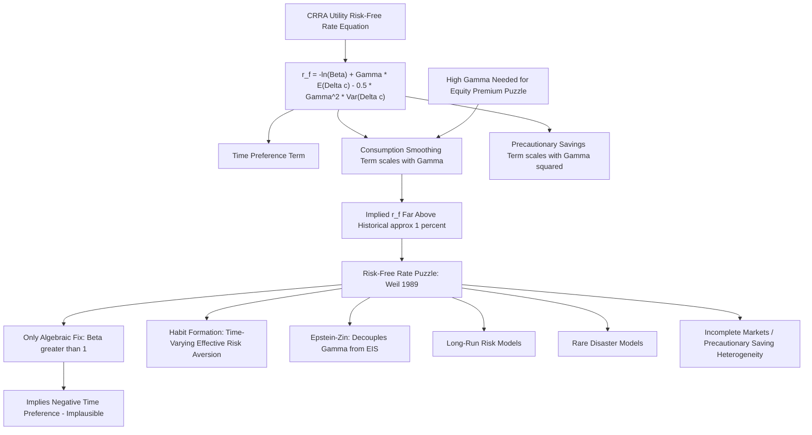

## The Risk-Free Rate Puzzle

### Overview and Statement of the Puzzle

The risk-free rate puzzle, formalized by Philippe Weil (1989), is the companion anomaly to the equity premium puzzle within consumption-based asset pricing (CCAPM). While the equity premium puzzle asks why the *spread* between risky and risk-free returns is so large relative to consumption risk, the risk-free rate puzzle asks a distinct question: why is the observed real risk-free rate itself so *low*, given the levels of risk aversion needed to explain the equity premium and the historically observed growth rate of consumption?

**Key Points**

- The puzzle arises precisely because resolving the equity premium puzzle with high risk aversion ($\gamma$) creates a **new** problem: the same high $\gamma$, combined with smooth but positive average consumption growth, mechanically implies an implausibly high risk-free rate under standard CRRA time-separable utility — the opposite of what is observed.
- U.S. real risk-free rates have historically averaged approximately 1% annually over long samples, while CRRA-CCAPM calibrated to match the equity premium implies a model risk-free rate frequently in the 10%+ range unless the subjective discount factor $\beta$ is pushed implausibly above 1. [Unverified — precise magnitudes are sample-period and dataset dependent.]
- The two puzzles are best understood jointly: **no single pair of parameters $(\gamma, \beta)$ within the standard CRRA framework can simultaneously match both the size of the historical equity premium and the low level of the historical risk-free rate.**

### Derivation of the Risk-Free Rate Equation

Starting from the log-linearized consumption Euler equation under CRRA utility $U(C) = \frac{C^{1-\gamma}}{1-\gamma}$, and applying it to the risk-free asset (whose one-period return is known with certainty at time $t$, so it has zero variance and zero covariance with consumption growth):

$$r_{f,t+1} = -\ln\beta + \gamma\, E_t[\Delta c_{t+1}] - \frac{1}{2}\gamma^2 \sigma_c^2$$

Where $r_{f,t+1} = \ln(1+R_{f,t+1})$ is the log risk-free rate, $\beta$ is the subjective discount factor, $E_t[\Delta c_{t+1}]$ is expected log consumption growth, and $\sigma_c^2$ is the variance of consumption growth.

**Key Points**

- The term $-\ln\beta$ captures pure **time preference**: impatient agents ($\beta < 1$) require compensation to defer consumption, pushing the risk-free rate up.
- The term $\gamma E_t[\Delta c_{t+1}]$ reflects the **consumption smoothing motive**: if consumption is expected to grow (agents will be richer tomorrow), a risk-averse agent wants to borrow against future consumption to smooth it toward today, which — in equilibrium — requires a higher interest rate to deter this borrowing and clear the market. This effect scales directly with $\gamma$.
- The term $-\frac{1}{2}\gamma^2\sigma_c^2$ is a **precautionary savings** effect: consumption growth uncertainty makes risk-averse agents want to save more as a buffer, which — in equilibrium — pushes the risk-free rate *down* (an increase in desired saving lowers the rate needed to clear the market). This effect scales with $\gamma^2$, so it grows disproportionately fast as $\gamma$ rises.

### Why High Risk Aversion Creates the Puzzle

**Example**

Consider illustrative long-run U.S. parameters: $E[\Delta c] \approx 1.8\%$ per year, $\sigma_c \approx 1.5\%$ per year, and $\beta = 0.99$.

$$r_f = -\ln(0.99) + \gamma(0.018) - \frac{1}{2}\gamma^2(0.015)^2$$

```python
import numpy as np

def implied_rf(beta, gamma, E_dc, sigma_c):
    return -np.log(beta) + gamma * E_dc - 0.5 * (gamma**2) * (sigma_c**2)

E_dc, sigma_c, beta = 0.018, 0.015, 0.99

for gamma in [1, 2, 5, 10, 30, 60, 100, 125]:
    rf = implied_rf(beta, gamma, E_dc, sigma_c)
    print(f"gamma = {gamma:>4}: implied r_f = {rf*100:6.2f}%")
```

At low $\gamma$ (e.g., $\gamma=2$), the implied $r_f$ is modest and can be reasonably close to historical levels. But at the $\gamma \approx 50$–$125$ range needed to resolve the equity premium puzzle (see the entry on that topic), the linear term $\gamma E_t[\Delta c]$ dominates for a wide middle range of $\gamma$ and pushes $r_f$ to double-digit or higher levels — far above the historical ~1% real rate — before the quadratic precautionary term eventually overtakes it at very extreme $\gamma$ and can even drive the implied rate sharply negative. **Neither regime matches the historically low and stable real risk-free rate.** [Inference — the exact crossover point and shape depend on the specific parameter values chosen; this illustrates the qualitative mechanism established in Weil (1989), not a specific published numerical table.]

### The Escape Route and Why It Fails

**Key Points**

- Algebraically, the puzzle can be "solved" by lowering $\beta$ far below 1 (increasing $-\ln\beta$ won't help, since that *raises* $r_f$ further) — actually, the only algebraic escape within the equation is to raise $\beta$ **above** 1, since a $\beta > 1$ makes $-\ln\beta$ negative, offsetting the large positive $\gamma E_t[\Delta c]$ term.
- A subjective discount factor $\beta > 1$ implies the agent places *more* weight on future utility than current utility, i.e., **negative time preference** — a direct violation of the standard assumption that agents are impatient, and one considered behaviorally and theoretically difficult to justify.
- In infinite-horizon dynamic models, $\beta > 1$ can additionally create technical problems: without additional bounding assumptions, it can make the present-value objective function fail to converge, since the utility of consumption in the far future is weighted more heavily than the present. [Inference — whether this is a fatal technical problem or merely inconvenient depends on the specific model's other features (e.g., a bounded or growing consumption path can restore convergence in some setups).]
- Because both the "raise $\gamma$" route (resolving the equity premium) and the "keep $\beta$ economically sensible" route are individually reasonable but jointly incompatible with the data, the risk-free rate puzzle is considered at least as damaging to the standard CRRA-CCAPM framework as the equity premium puzzle itself.

### Relationship to the Equity Premium Puzzle

| Aspect | Equity Premium Puzzle | Risk-Free Rate Puzzle |
| --- | --- | --- |
| Core question | Why is the *equity premium* so large? | Why is the *risk-free rate* so low? |
| Driving equation | $E[r]-r_f = \gamma\sigma_{rc}$ | $r_f = -\ln\beta + \gamma E[\Delta c] - \tfrac{1}{2}\gamma^2\sigma_c^2$ |
| Problem parameter | Requires very high $\gamma$ | High $\gamma$ (needed above) implies $r_f$ too high |
| "Fix" that creates tension | — | Requires $\beta > 1$, an implausible assumption |
| Originating paper | Mehra and Prescott (1985) | Weil (1989) |

**Key Points**

- The two puzzles are frequently presented as a **package**: it is not sufficient for a candidate resolution model to explain the equity premium alone; it must simultaneously deliver a low and stable model-implied risk-free rate consistent with the data using an economically sensible $\beta$ (typically required to be less than or, at most, very close to 1).

### Proposed Resolutions

**Key Points**

- **Habit formation** (Campbell and Cochrane, 1999): Because the risk-free rate in habit models depends on the *surplus consumption ratio* (consumption relative to habit) rather than directly on $\gamma \cdot E[\Delta c]$ with a large constant $\gamma$, these models can generate a low and relatively stable risk-free rate alongside a high, countercyclical equity premium, since the model's effective local risk aversion — and its associated precautionary savings motive — varies over the business cycle rather than being permanently high.
- **Epstein-Zin recursive preferences**: By decoupling the coefficient of relative risk aversion ($\gamma$) from the elasticity of intertemporal substitution (EIS, $\psi$) — which CRRA forces to satisfy $\psi = 1/\gamma$ — Epstein-Zin utility allows a high $\gamma$ (to address the equity premium) to coexist with an independently chosen $\psi$ closer to 1, which helps keep the consumption-smoothing term in the risk-free rate equation from exploding to implausible levels.
- **Long-run risk models** (Bansal and Yaron, 2004): Combine Epstein-Zin preferences with a persistent small predictable component and stochastic volatility in consumption growth; the interaction of a moderate-to-high $\gamma$ with an EIS greater than 1 allows the model to jointly match a low risk-free rate, its low volatility, and a sizeable equity premium.
- **Rare disaster models** (Barro, 2006; Rietz, 1988): Because a persistent, small probability of a catastrophic consumption decline can generate a large equity premium via tail-risk pricing without requiring extremely high $\gamma$, these models keep the consumption-smoothing term in the risk-free rate equation more modest, helping produce a low model-implied risk-free rate simultaneously with a realistic equity premium.
- **Incomplete markets / precautionary savings heterogeneity**: Models with uninsurable idiosyncratic income risk (e.g., borrowing-constrained households) can generate additional precautionary saving demand beyond what the representative-agent aggregate consumption process implies, helping push the equilibrium risk-free rate down without requiring extreme $\gamma$. [Inference — the quantitative contribution of this channel varies substantially across calibrated heterogeneous-agent models in the literature.]

### Conceptual Diagram: Mechanism and Resolutions



### Empirical and Modeling Implications

**Key Points**

- The risk-free rate puzzle is a key discipline check on any candidate resolution to the equity premium puzzle: a model that "solves" the equity premium by simply cranking up $\gamma$ within a plain CRRA framework will typically *fail* the risk-free rate test, since it walks directly into this puzzle.
- Empirical tests of consumption-based models (via GMM, as in Hansen-Singleton estimation) routinely report both moment conditions — one tied to the risk-free rate, one tied to risky-asset returns — meaning any full evaluation of a CCAPM-style model must be judged on its ability to fit **both** simultaneously, not just the equity premium in isolation.
- The puzzle also has implications for monetary policy and the natural rate of interest literature, since the same CCAPM logic underlies modern New Keynesian IS-curve derivations relating expected consumption growth to real interest rates; persistently low observed real rates in many developed economies have renewed interest in precautionary-saving and demographic explanations related to this literature. [Speculation — the degree to which risk-free rate puzzle theory directly explains recent low-rate environments versus other macro-financial factors, such as demographics or global savings gluts, remains actively debated among researchers.]

### Related Topics

- The consumption Euler equation and CRRA utility log-linearization
- The equity premium puzzle (Mehra-Prescott, 1985)
- Habit formation models (Campbell-Cochrane, Constantinides)
- Epstein-Zin recursive preferences and the separation of risk aversion from EIS
- Long-run risk models (Bansal-Yaron, 2004)
- Rare disaster risk models (Barro, Rietz, Gabaix)
- GMM estimation and testing of Euler equation moment conditions (Hansen-Singleton)
- Term structure of interest rates and the natural rate of interest debate