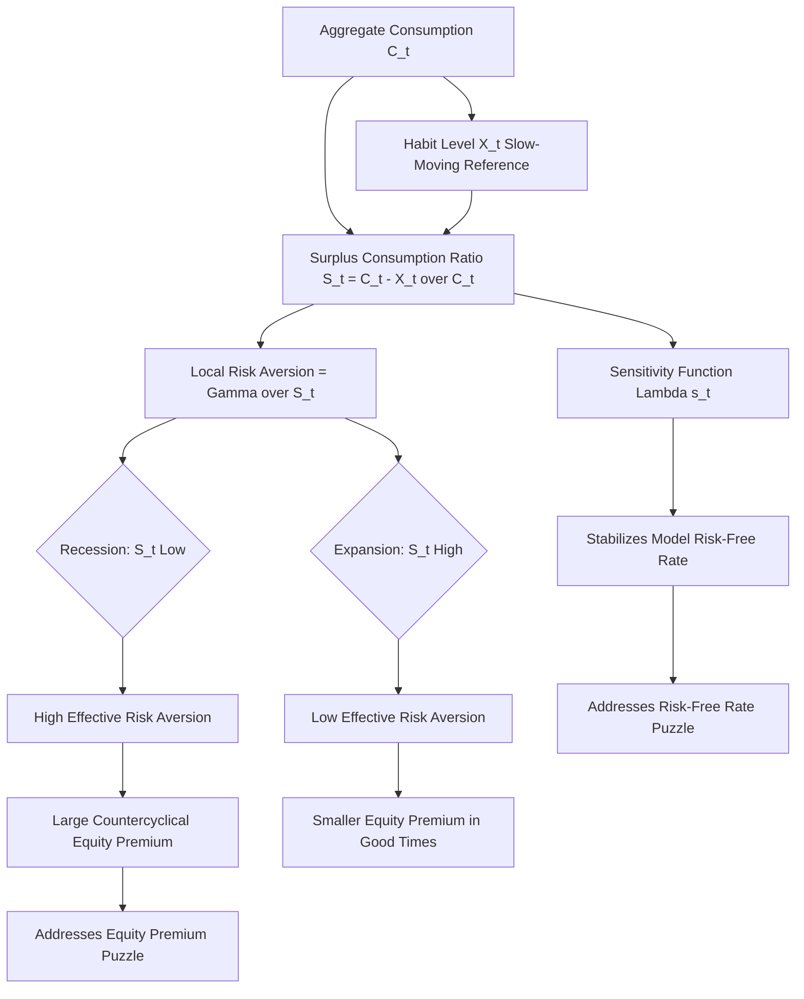

## Habit Formation Models

### Overview and Motivation

Habit formation models are an extension of consumption-based asset pricing (CCAPM) in which an agent's utility depends not on the absolute level of consumption alone, but on consumption *relative to a reference point* — the "habit" — typically derived from the agent's own past consumption. This departure from standard time-separable CRRA utility was developed primarily to address the equity premium puzzle and risk-free rate puzzle by generating time-varying, countercyclical effective risk aversion without requiring implausibly high *average* risk aversion.

**Key Points**

- The core idea traces to earlier work by Duesenberry (1949) on relative income and consumption, and was formalized into modern asset pricing by Sundaresan (1989), Constantinides (1990), and — most influentially for empirical asset pricing — Campbell and Cochrane (1999).
- Habit formation introduces **non-separability** over time in the utility function: utility today depends on the history of consumption, not just current consumption, breaking a key simplifying assumption of standard CCAPM.
- Two broad classes exist: **internal habit** (the reference point is the agent's own past consumption) and **external habit** ("catching up with the Joneses" — the reference point is aggregate/other agents' consumption, over which the individual agent has no control).

### Internal vs. External Habit Formation

**Key Points**

- **Internal habit models** (Constantinides, 1990; Sundaresan, 1989): The habit stock evolves based on the agent's *own* consumption history. Because the agent is forward-looking and internalizes that current consumption raises their *own future* habit (making future consumption relatively less satisfying), the agent has an incentive to reduce current consumption volatility — this generates additional intertemporal smoothing motives beyond standard CRRA.
- **External habit models** (Abel, 1990; Campbell and Cochrane, 1999): The habit stock is tied to *aggregate* consumption (or a peer group's consumption), which the individual agent treats as exogenous and cannot influence through their own choices. This removes the internalization channel but preserves the key asset-pricing implication: utility depends on consumption *relative to* a slow-moving reference level.
- External habit models are more tractable and have become the dominant workhorse in the asset pricing literature, primarily due to the influential Campbell-Cochrane framework described below.

### The Campbell-Cochrane (1999) External Habit Model

This is the most widely used and cited habit formation model in modern asset pricing, explicitly designed to jointly resolve the equity premium puzzle, the risk-free rate puzzle, and generate realistic time-varying and countercyclical stock return volatility and predictability.

**Key structural elements:**

The representative agent has utility over the difference between consumption $C_t$ and an external habit level $X_t$:

$$E_0\left[\sum_{t=0}^{\infty}\beta^t \frac{(C_t - X_t)^{1-\gamma} - 1}{1-\gamma}\right]$$

The central innovation is defining the **surplus consumption ratio**:

$$S_t \equiv \frac{C_t - X_t}{C_t}$$

Where $S_t \in (0,1)$ measures how far current consumption is above the habit level, expressed as a fraction of consumption. $S_t$ close to 0 means consumption is barely above habit (a "bad time," near subsistence relative to habit); $S_t$ close to 1 means consumption is far above habit (a "good time").

**Key Points**

- The surplus consumption ratio $S_t$ is designed to move slowly and countercyclically with the business cycle: it falls sharply during recessions (when consumption drops toward the sluggish habit level) and rises during expansions.
- Local (instantaneous) relative risk aversion in this model is $\gamma/S_t$, which is **time-varying** and **inversely related to $S_t$** — meaning risk aversion spikes precisely during recessions/bad times when $S_t$ is low, and falls during expansions when $S_t$ is high.
- This time-varying risk aversion is the key mechanism: it generates a **large average equity premium** (via periods of very high effective risk aversion) without requiring an implausibly high **constant** $\gamma$, and produces **countercyclical** and time-varying risk premia and volatility consistent with empirical stock market patterns (e.g., higher volatility and higher expected returns following market declines).

### The Sensitivity Function and Habit Dynamics

Campbell and Cochrane specify the log surplus consumption ratio $s_t = \ln S_t$ to follow a heteroskedastic AR(1)-like process:

$$s_{t+1} = (1-\phi)\bar{s} + \phi s_t + \lambda(s_t)(\Delta c_{t+1} - g)$$

Where $\bar{s}$ is the steady-state log surplus ratio, $\phi$ governs persistence, $g$ is the mean consumption growth rate, and $\lambda(s_t)$ is the **sensitivity function**, which controls how strongly consumption growth shocks move the habit-adjusted surplus ratio.

**Key Points**

- The sensitivity function $\lambda(s_t)$ is specifically designed (via a carefully chosen functional form) to ensure the risk-free rate remains **constant** (or nearly so) despite the time-varying risk aversion — directly targeting the risk-free rate puzzle, since a naturally varying precautionary savings motive would otherwise induce unwanted risk-free rate volatility.
- $\lambda(s_t)$ is calibrated to be higher (more sensitive) when $S_t$ is low (bad times), amplifying the response of the surplus ratio — and hence risk aversion — to consumption shocks precisely when the economy is already fragile, which is what produces the strong countercyclical variation in risk premia.
- The model imposes a **habit persistence boundary**: consumption cannot fall below the habit level (which would make $S_t$ negative and utility undefined), enforced by constraining the state space and the functional form of $\lambda(s_t)$.

### Pricing Implications

With external habit utility, the stochastic discount factor becomes:

$$M_{t+1} = \beta\left(\frac{S_{t+1}}{S_t}\right)^{-\gamma}\left(\frac{C_{t+1}}{C_t}\right)^{-\gamma}$$

Compare this to the standard CRRA SDF, $M_{t+1} = \beta(C_{t+1}/C_t)^{-\gamma}$: the habit model's SDF has an **additional multiplicative term** driven by changes in the surplus consumption ratio, which is the source of the model's extra pricing power.

**Example**

The risk premium on any asset in this framework is proportional to its covariance with *both* consumption growth and surplus-ratio innovations:

$$E_t[r_{t+1}] - r_{f,t+1} + \frac{1}{2}\sigma_r^2 \approx \gamma_t \cdot \sigma_{rc}$$

Where $\gamma_t = \gamma/S_t$ is the **time-varying** effective risk aversion. During a recession when $S_t$ might fall to, say, one-third of its steady-state value, effective risk aversion triples relative to expansions — generating a much larger conditional equity premium in bad times without changing the "deep" preference parameter $\gamma$. [Inference — the precise numerical magnitude of the $S_t$ swing depends on the specific calibration of $\phi$, $\lambda(\cdot)$, and $\bar{s}$ chosen; this is illustrative of the mechanism, not a specific published calibration value.]

### Illustrative Simulation

```python
import numpy as np

np.random.seed(42)

# Simplified illustrative Campbell-Cochrane style simulation
T = 500
phi = 0.97          # persistence of surplus ratio
g = 0.018           # mean consumption growth
sigma_c = 0.015      # consumption growth volatility
s_bar = -1.5         # steady-state log surplus ratio (illustrative)
gamma = 2.0          # 'deep' risk aversion parameter

s = np.zeros(T)
s[0] = s_bar
dc = np.random.normal(g, sigma_c, T)

def sensitivity_function(s_t, s_bar):
    # Illustrative simplified sensitivity function (not the exact CC99 form)
    S_t = np.exp(s_t)
    S_bar = np.exp(s_bar)
    return (1 / S_bar) * np.sqrt(max(1 - 2*(s_t - s_bar), 1e-6)) - 1

for t in range(1, T):
    lam = sensitivity_function(s[t-1], s_bar)
    s[t] = (1 - phi) * s_bar + phi * s[t-1] + lam * (dc[t] - g)

effective_gamma = gamma / np.exp(s)
print(f"Effective risk aversion range: {effective_gamma.min():.2f} to {effective_gamma.max():.2f}")
```

This stylized simulation demonstrates the qualitative mechanism — effective risk aversion ($\gamma/S_t$) fluctuating substantially over time as the surplus ratio moves — though it is a simplified illustration and does not reproduce the exact calibrated sensitivity function or parameter values from Campbell and Cochrane (1999). [Speculation — exact reproduction of their published results requires their precise functional form and calibration targets, which should be consulted directly for research use.]

### Empirical Successes

**Key Points**

- **Equity premium**: By generating episodes of very high local risk aversion during recessions, the model can match the historical average equity premium with a much lower and more plausible "deep" risk aversion parameter $\gamma$ than required in the plain CRRA model. [Inference — Campbell-Cochrane's specific published calibration achieves this, but the exact required $\gamma$ depends on the calibration target and dataset; consult the original paper for precise figures.]
- **Risk-free rate**: The sensitivity function is specifically engineered to keep the model-implied risk-free rate nearly constant, directly addressing the risk-free rate puzzle's core problem of excessive interest rate volatility/level under high, constant risk aversion.
- **Return predictability**: The model naturally generates the empirically observed pattern that the price-dividend ratio predicts future returns (high P/D ratios, associated with high $S_t$/good times, forecast lower subsequent returns), consistent with well-documented dividend-yield predictability regressions in empirical finance.
- **Volatility clustering / countercyclical volatility**: Because $\lambda(s_t)$ is larger when $S_t$ is low, the model generates higher return volatility during recessions and bad times, matching stylized facts about volatility clustering around economic downturns.

### Internal Habit Models: Constantinides (1990)

**Key Points**

- In Constantinides' internal habit specification, the agent's utility depends on $C_t - bC_{t-1}$ (or a more general weighted average of past own consumption), and the agent *rationally anticipates* that raising current consumption raises their own future habit.
- This forward-looking internalization creates an additional precautionary/smoothing motive: the agent behaves as if more risk-averse toward consumption *volatility* specifically, since volatile consumption paths interact badly with a rising habit stock — but the *average* level of risk aversion embedded in the utility function need not be as extreme as CRRA alone would require to match observed asset return moments.
- Internal habit models are generally considered less tractable for deriving clean closed-form asset pricing implications than external habit models, and have seen less use in mainstream empirical asset pricing relative to the Campbell-Cochrane external habit approach, though they remain theoretically important, especially in life-cycle and precautionary-saving contexts. [Inference — this is a characterization of relative research emphasis, not a claim that internal habit models are inferior on theoretical grounds.]

### Comparison of Habit Model Variants

| Feature | Internal Habit (Constantinides) | External Habit (Campbell-Cochrane) |
| --- | --- | --- |
| Habit reference | Agent's own past consumption | Aggregate/peer consumption |
| Agent internalizes habit effect? | Yes | No (treated as exogenous) |
| Tractability | Lower; complex forward-looking effects | Higher; widely used workhorse model |
| Primary use case | Precautionary saving, life-cycle models | Aggregate asset pricing, equity premium/risk-free rate puzzles |
| Risk-free rate targeting | Not explicitly engineered | Explicitly targeted via sensitivity function |

### Conceptual Diagram: Habit Formation Mechanism



### Criticisms and Limitations

**Key Points**

- **Calibration complexity**: The Campbell-Cochrane sensitivity function $\lambda(s_t)$ and habit dynamics involve several free functional-form choices and parameters calibrated to match specific target moments, raising concerns about overfitting to the very moments the model is designed to explain. [Inference — the degree to which this constitutes overfitting versus principled calibration is a matter of ongoing methodological debate in the literature.]
- **Consumption non-negativity/habit boundary**: The requirement that $C_t > X_t$ at all times imposes constraints on the model's behavior in extreme states and can create technical complications in general equilibrium extensions with production or heterogeneous agents.
- **External habit's lack of microfoundation for "catching up with the Joneses"**: While intuitively appealing, the assumption that aggregate consumption directly enters an individual's utility function (rather than emerging from an explicit social comparison or status-signaling mechanism) is a modeling shortcut rather than a fully microfounded behavioral primitive. [Speculation — whether this modeling choice materially affects the model's out-of-sample validity versus being a reasonable reduced-form proxy is not fully settled.]
- **Coexistence with other resolutions**: Habit formation is not mutually exclusive with long-run risk or rare disaster explanations of the equity premium; contemporary research sometimes combines habit-like slow-moving state variables with recursive Epstein-Zin preferences or disaster risk to jointly match a broader set of asset pricing moments. [Inference — the relative empirical support for combined versus single-mechanism models varies across studies and evaluation criteria.]

### Related Topics

- The consumption Euler equation and CRRA utility log-linearization
- The equity premium puzzle (Mehra-Prescott, 1985)
- The risk-free rate puzzle (Weil, 1989)
- Epstein-Zin recursive preferences and long-run risk models (Bansal-Yaron, 2004)
- Rare disaster risk models (Barro, Rietz, Gabaix)
- Return predictability and the price-dividend ratio (Campbell-Shiller regressions)
- Stochastic discount factor construction across alternative preference specifications
- Time-varying risk premia and countercyclical volatility in empirical asset pricing