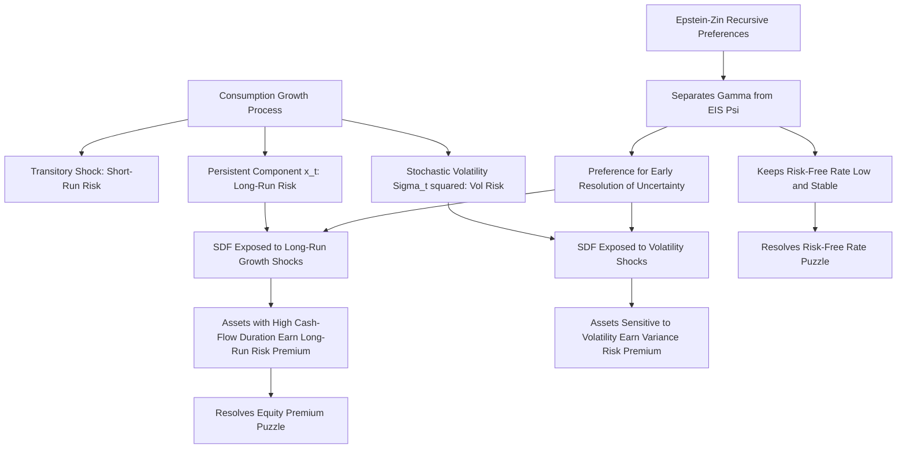

## Long-Run Risk Models

### Overview and Motivation

Long-run risk (LRR) models, introduced by Ravi Bansal and Amir Yaron (2004), are a class of consumption-based asset pricing models that resolve the equity premium puzzle and risk-free rate puzzle by positing a small, highly persistent predictable component in consumption and dividend growth, combined with Epstein-Zin recursive preferences that separate risk aversion from the elasticity of intertemporal substitution (EIS). Unlike habit formation models, which generate time-varying risk aversion around a stable consumption process, long-run risk models instead modify the *consumption growth process itself* to include a small persistent "long-run" component that agents care about disproportionately.

**Key Points**

- The central insight is that investors are not just averse to short-run consumption volatility but are especially averse to uncertainty about the long-run *growth rate* of consumption — even small, persistent changes in expected future growth can have an outsized effect on asset prices when agents have a preference for early resolution of uncertainty.
- The model requires **Epstein-Zin recursive utility** rather than standard CRRA, because CRRA cannot separate risk aversion from the EIS, and it is precisely this separation that allows long-run growth risk to matter independently of pure consumption smoothing motives.
- LRR models can generate a sizeable equity premium, a low and stable risk-free rate, and realistic return volatility and predictability patterns with more economically plausible (though often still non-trivial) preference parameters than plain CRRA-CCAPM. [Inference — "more plausible" is relative to the extreme values required by CRRA alone; published LRR calibrations still frequently use risk aversion coefficients above the very low range considered ideal, and the degree of remaining tension is debated.]

### Epstein-Zin Recursive Preferences

Long-run risk models are built on **Epstein-Zin-Weil (1989, 1990)** recursive utility, which generalizes standard time-separable expected utility by allowing risk aversion and intertemporal substitution to be governed by separate parameters.

$$U_t = \left[(1-\beta)C_t^{1-1/\psi} + \beta\left(E_t[U_{t+1}^{1-\gamma}]\right)^{\frac{1-1/\psi}{1-\gamma}}\right]^{\frac{1}{1-1/\psi}}$$

Where $\gamma$ is the coefficient of relative risk aversion, $\psi$ is the elasticity of intertemporal substitution (EIS), and $\beta$ is the subjective discount factor.

**Key Points**

- Under standard CRRA/time-separable utility, $\gamma = 1/\psi$ is forced by construction; Epstein-Zin utility allows $\gamma$ and $\psi$ to be set independently, which is essential for LRR models to work as intended.
- The parameter combination $\theta = \dfrac{1-\gamma}{1-1/\psi}$ governs the agent's attitude toward the **timing of resolution of uncertainty**: when $\gamma > 1/\psi$ (equivalently $\theta < 1$), the agent prefers **early resolution of uncertainty** — they dislike prolonged uncertainty about future consumption growth, even holding the unconditional distribution of outcomes fixed.
- Bansal and Yaron calibrate their model with $\gamma > 1/\psi$ (typically $\gamma$ around 7.5–10 and $\psi$ around 1.5, so $1/\psi \approx 0.67 < \gamma$), generating a strong preference for early resolution — this preference is the channel through which persistent long-run consumption growth uncertainty becomes priced. [Unverified — exact calibrated values vary across the original Bansal-Yaron (2004) paper and subsequent extensions; consult the specific paper for precise parameter values used in a given calibration.]

### The Long-Run Risk Consumption Process

The defining feature of LRR models is the specification of consumption (and dividend) growth as containing a small, persistent, predictable component plus time-varying volatility:

$$\Delta c_{t+1} = \mu_c + x_t + \sigma_t \eta_{t+1}$$


$$x_{t+1} = \rho x_t + \varphi_e \sigma_t e_{t+1}$$


$$\sigma_{t+1}^2 = \sigma^2 + \nu(\sigma_t^2 - \sigma^2) + \sigma_w w_{t+1}$$

Where $x_t$ is the small, persistent expected growth component (the "long-run risk" component), $\rho$ is close to 1 (high persistence), $\sigma_t^2$ is time-varying consumption volatility ("long-run risk in volatility," sometimes called the "vol-of-vol" channel), and $\eta_{t+1}, e_{t+1}, w_{t+1}$ are independent shocks.

**Key Points**

- The persistent component $x_t$ is calibrated to have very small variance relative to the transitory shock $\eta_{t+1}$, meaning it is nearly undetectable in short samples of aggregate consumption data using standard time-series tests — this is a frequently cited empirical criticism (see Limitations below).
- Because $x_t$ is highly persistent ($\rho$ close to 1, e.g., 0.90–0.98 depending on calibration), a small shock to $x_t$ has a large cumulative effect on the present value of all future expected consumption, since it shifts the growth *rate*, not just the *level*, of consumption for many periods ahead.
- The stochastic volatility process $\sigma_t^2$ introduces an additional priced source of risk — uncertainty about the volatility of consumption growth itself — which the LRR literature has used to help explain time-varying risk premia, variance risk premia, and derivatives-market phenomena.

### The Long-Run Risk Pricing Mechanism

Under Epstein-Zin preferences with the LRR consumption process, the log stochastic discount factor takes the form (Campbell-Shiller log-linearized approximation is typically used to derive a closed-form solution):

$$m_{t+1} = \theta\ln\beta - \frac{\theta}{\psi}\Delta c_{t+1} + (\theta-1)r_{c,t+1}$$

Where $r_{c,t+1}$ is the (unobservable) return on the consumption claim — the asset that pays aggregate consumption as its dividend each period — approximated via a Campbell-Shiller log-linear present-value relation to the price-consumption ratio.

**Key Points**

- Because the wealth/consumption-claim return $r_{c,t+1}$ itself depends on expectations of future consumption growth (via the log-linear present value relation), the SDF ends up being exposed to innovations in the persistent long-run growth component $x_t$ and the volatility process $\sigma_t^2$, not just contemporaneous consumption growth $\Delta c_{t+1}$ as in plain CRRA.
- Assets (like equities) whose cash flows are more exposed to the long-run growth component $x_t$ — i.e., have high "cash-flow duration" or high sensitivity of dividend growth to $x_t$ — earn a **long-run risk premium** in addition to any premium from short-run consumption covariance, because their payoffs are correlated with the persistent, dreaded component of future growth uncertainty.
- Assets exposed to increases in consumption volatility ($\sigma_t^2$ shocks) similarly earn a premium if their payoffs are negatively affected by volatility increases (since higher future volatility is itself unwelcome to an agent who prefers early resolution of uncertainty).

### Illustrative Simulation of the LRR Consumption Process

**Example**

```python
import numpy as np

np.random.seed(1)
T = 1200  # periods (illustrative monthly)

mu_c = 0.0015       # mean consumption growth
rho = 0.95          # persistence of long-run component
phi_e = 0.10        # sensitivity of x_t to shocks
sigma_bar = 0.005   # baseline volatility
nu = 0.90           # persistence of stochastic volatility
sigma_w = 0.0001    # vol-of-vol

x = np.zeros(T)
sigma2 = np.full(T, sigma_bar**2)
dc = np.zeros(T)

eta = np.random.normal(0, 1, T)
e = np.random.normal(0, 1, T)
w = np.random.normal(0, 1, T)

for t in range(1, T):
    sigma2[t] = sigma_bar**2 + nu*(sigma2[t-1] - sigma_bar**2) + sigma_w*w[t]
    sigma2[t] = max(sigma2[t], 1e-8)  # enforce non-negativity
    sigma_t = np.sqrt(sigma2[t-1])
    x[t] = rho * x[t-1] + phi_e * sigma_t * e[t]
    dc[t] = mu_c + x[t-1] + sigma_t * eta[t]

print(f"Std dev of transitory shock component: {np.std(sigma_bar*eta):.5f}")
print(f"Std dev of persistent x_t component:    {np.std(x):.5f}")
print(f"Ratio (x_t vol / total consumption growth vol): "
      f"{np.std(x)/np.std(dc):.3f}")
```

This illustrates the key calibration feature: the persistent component $x_t$ contributes only a small fraction of total consumption growth variance in any given period, yet — due to its persistence — accumulates a large effect on long-horizon expected consumption paths and hence on asset prices via the present-value channel. [Speculation — the specific numerical ratios produced here are illustrative of the qualitative mechanism only and do not reproduce a specific published Bansal-Yaron calibration table.]

### Empirical Successes

**Key Points**

- **Equity premium and risk-free rate**: The original Bansal-Yaron (2004) calibration was able to jointly match the historical U.S. equity premium, its volatility, and a low risk-free rate with more moderate risk aversion than required by plain CRRA-CCAPM, primarily by exploiting the priced long-run growth and volatility channels rather than relying solely on short-run consumption covariance.
- **Return predictability**: The model generates predictability of returns and consumption growth from valuation ratios (e.g., price-dividend ratio), broadly consistent with empirical dividend-yield predictability regressions (Campbell-Shiller, Fama-French).
- **Variance risk premium**: Because the model prices consumption volatility risk directly, it has been used as a foundation for explaining the variance risk premium observed in equity index options markets (the gap between risk-neutral and physical expected variance). [Inference — this application draws on subsequent extensions of the baseline LRR framework rather than the original 2004 paper alone.]
- **Cross-sectional asset pricing**: Extensions of the LRR framework have been applied to explain cross-sectional patterns such as the value premium and momentum, based on differential exposure of value/growth or winner/loser portfolios to the long-run growth and volatility factors. [Inference — the strength and robustness of these cross-sectional applications vary across studies and are less universally accepted than the original time-series equity premium results.]

### Limitations and Criticisms

**Key Points**

- **Statistical detectability of $x_t$**: Because the persistent long-run component is calibrated to be small in variance relative to total consumption growth, it is difficult to detect directly in standard time-series tests on available (relatively short) post-war consumption data, leading some researchers to question whether the predictable component is a genuine feature of the data or primarily an artifact needed to fit asset pricing moments. [Inference — this remains an actively contested point in the literature, with some studies finding weak-to-moderate support and others finding limited statistical evidence for a robustly detectable long-run component.]
- **Sensitivity to calibration and small-sample uncertainty**: Given the low signal-to-noise ratio of the long-run component, model results can be sensitive to the specific sample period and estimation method used, and confidence intervals around key parameters (like $\rho$) tend to be wide.
- **Reliance on Epstein-Zin preferences and unobservable consumption-claim returns**: The pricing framework depends on approximating the return to a hypothetical "consumption claim" that does not directly trade in markets, requiring a Campbell-Shiller log-linear approximation whose accuracy can degrade for large deviations from the linearization point. [Inference — the practical significance of this approximation error is debated and depends on the state-space region being studied.]
- **Overfitting concerns**: As with habit formation models, critics note that LRR models involve several free parameters (persistence, volatility-of-volatility, risk aversion, EIS) calibrated partly to match the very asset pricing moments the model seeks to explain, raising standard concerns about model over-parameterization relative to identification from the data. [Speculation — the degree to which this concern is more or less severe than in competing frameworks like habit formation or rare disasters is a matter of ongoing methodological debate rather than settled consensus.]

### Comparison with Other Resolutions to the Equity Premium Puzzle

| Feature | Long-Run Risk (Bansal-Yaron) | Habit Formation (Campbell-Cochrane) | Rare Disasters (Barro/Rietz) |
| --- | --- | --- | --- |
| Preference structure | Epstein-Zin recursive | Standard CRRA with external habit | Standard CRRA (typically) |
| Source of risk premium | Persistent long-run growth + stochastic volatility | Time-varying local risk aversion via surplus ratio | Small-probability catastrophic consumption drop |
| Risk-free rate mechanism | EIS calibration keeps rate stable | Sensitivity function explicitly stabilizes rate | Disaster probability affects precautionary term |
| Key testability challenge | Small persistent component hard to detect statistically | Free functional form (sensitivity function) calibration | Disaster probability/size hard to pin down (rare events) |
| Preference for early resolution of uncertainty required? | Yes ($\gamma > 1/\psi$) | Not required | Not required |

### Conceptual Diagram: Long-Run Risk Pricing Mechanism



### Related Topics

- The consumption Euler equation and CRRA utility log-linearization
- The equity premium puzzle (Mehra-Prescott, 1985)
- The risk-free rate puzzle (Weil, 1989)
- Habit formation models (Campbell-Cochrane, Constantinides)
- Rare disaster risk models (Barro, Rietz, Gabaix, Wachter)
- Epstein-Zin recursive utility derivation and properties
- Campbell-Shiller log-linear present-value approximation
- Variance risk premium and options-implied volatility research