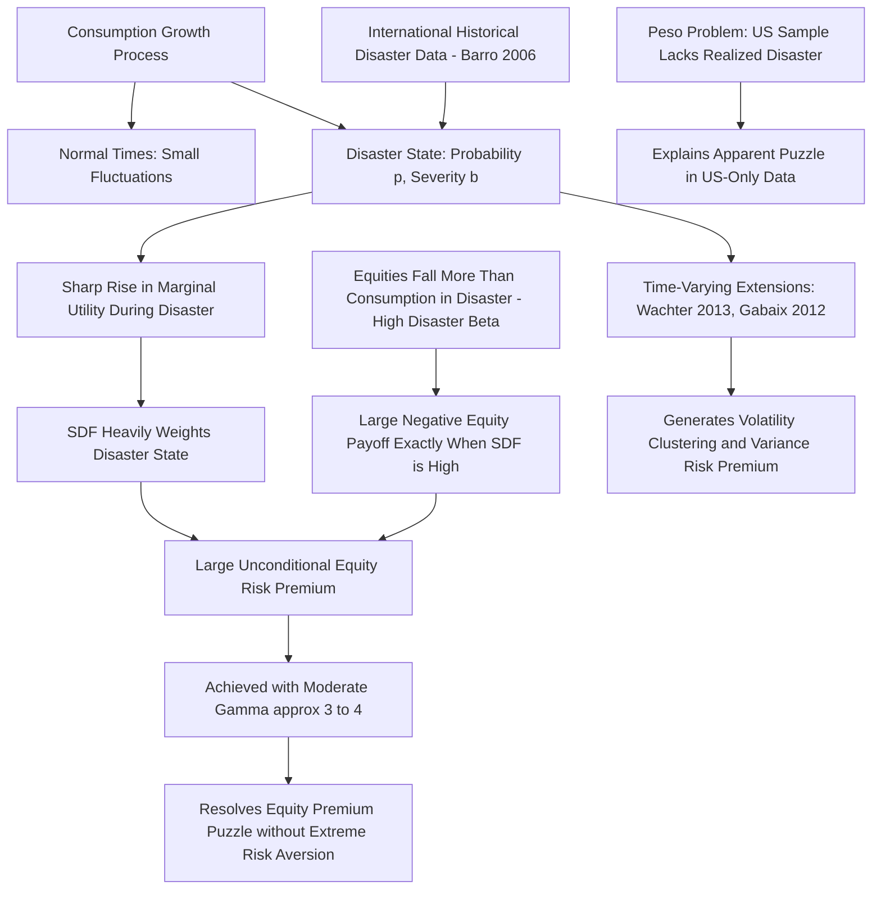

## Rare Disaster and Tail Risk Models

### Overview and Motivation

Rare disaster models are a class of consumption-based asset pricing models that resolve the equity premium puzzle by introducing a small, low-probability chance of a catastrophic decline in consumption (a "disaster"), rather than relying on either extreme risk aversion (as in plain CRRA-CCAPM) or time-varying risk aversion (as in habit formation) or a persistent growth component (as in long-run risk models). The core insight is that the stochastic discount factor must price the *tail* of the consumption distribution, and even a small disaster probability can generate a large unconditional risk premium if the disaster is sufficiently severe.

**Key Points**

- The idea originates with Thomas Rietz (1988), who first proposed that a small probability of a large consumption decline could resolve the equity premium puzzle, but the idea was largely dismissed at the time as requiring an implausibly severe or improbable disaster.
- Robert Barro's influential 2006 paper "Rare Disasters and Asset Markets in the Twentieth Century" revived and substantially strengthened the idea by calibrating disaster probabilities and sizes to **actual historical international data** on large economic contractions (wars, depressions, financial crises) across many countries over the twentieth century, rather than treating the disaster probability as a free parameter chosen only to fit U.S. asset pricing moments.
- The central appeal of rare disaster models is that they can generate a large equity premium with **moderate, economically plausible risk aversion** (often in the range of 3–4, much closer to microeconomically justified levels than the 50+ required by plain CRRA), because the model does not need consumption *volatility* alone to explain the premium — it relies on the *possibility of a catastrophic tail event*, most of which never materializes in the observed (non-disaster) sample.

### The Peso Problem and Sample Selection

**Key Points**

- A **"peso problem"** in economics refers to a situation where a low-probability, high-impact event that agents rationally price into their expectations does not occur (or occurs rarely) within an observed historical sample, making the ex-post realized data look inconsistent with rational, forward-looking pricing when in fact it is fully consistent once the correct (larger) probability space, including the unrealized disaster states, is considered.
- The U.S. equity premium puzzle is potentially, at least in part, a peso problem: the post-WWII U.S. sample used by Mehra and Prescott (1985) may simply not contain a realized economic disaster of the type priced into the equity premium ex ante, even though market participants rationally price in the *possibility* of such an event.
- This reframes the puzzle: rather than asking "why is realized consumption too smooth to justify this premium," rare disaster theory asks "what if agents are pricing a fat left tail that the data sample happens not to have realized" — a subtle but important shift in interpretation with direct implications for how researchers should evaluate model fit using historical time series.

### Formal Setup

Consider a simple discrete-time endowment economy where consumption growth follows a "normal times" process most periods, but with probability $p$ each period, a disaster occurs, causing consumption to drop by a fraction $b$ (so $C_{t+1} = (1-b)C_t$ times the normal growth factor):

$$\Delta c_{t+1} = \begin{cases} \mu + \sigma\varepsilon_{t+1} & \text{with probability } (1-p) \\ \mu + \sigma\varepsilon_{t+1} + \ln(1-b) & \text{with probability } p \end{cases}$$

Where $b \in (0,1)$ is the disaster size (fractional consumption decline) and $p$ is the small per-period disaster probability.

Under CRRA utility, the consumption Euler equation for the risk premium becomes:

$$E[r_{t+1}] - r_{f,t+1} \approx \gamma\sigma_{rc} + p\cdot E\left[\left((1-b)^{-\gamma}-1\right)\left(1-R^{disaster}_{eq}\right)\right]$$

**Key Points**

- The first term, $\gamma\sigma_{rc}$, is the standard "normal times" covariance-based premium familiar from plain CCAPM (and remains too small on its own to explain the observed premium, as in the equity premium puzzle).
- The second term captures the **disaster risk premium**: it depends on the disaster probability $p$, the severity $b$ (entering nonlinearly through $(1-b)^{-\gamma}$, since marginal utility rises sharply as consumption falls toward disaster levels), and $R^{disaster}_{eq}$, the (typically much more negative) equity return realized specifically during a disaster state.
- Because equities are assumed to fall by *more* than consumption during a disaster (equities have "operating leverage" or are a levered claim on the economy), $(1 - R^{disaster}_{eq})$ is large, and this term can generate a substantial risk premium even for small $p$, provided $b$ and the equity disaster beta are large enough.

### Illustrative Calibration Example

**Example**

```python
import numpy as np

def disaster_risk_premium(p, b, gamma, equity_disaster_drop):
    """
    Illustrative calculation of the disaster-risk contribution 
    to the equity premium under CRRA utility.
    p: annual disaster probability
    b: consumption decline fraction in a disaster
    gamma: relative risk aversion
    equity_disaster_drop: fractional equity price decline in a disaster (e.g., 0.5 for -50%)
    """
    marginal_utility_ratio = (1 - b) ** (-gamma)
    premium_contribution = p * (marginal_utility_ratio - 1) * equity_disaster_drop
    return premium_contribution

# Illustrative parameters based on Barro (2006)-style calibration magnitudes
p = 0.017                   # ~1.7% annual probability of disaster onset
b = 0.29                    # ~29% average consumption decline in a disaster
gamma = 4.0                 # moderate, plausible risk aversion
equity_drop = 0.50          # equities fall ~50% more than consumption in a disaster

premium = disaster_risk_premium(p, b, gamma, equity_drop)
print(f"Disaster-driven risk premium contribution: {premium*100:.2f}%")
```

With plausible historically-calibrated inputs, this mechanism can generate a meaningful fraction of the observed equity premium using $\gamma$ around 3–4, dramatically lower than the 50+ needed under plain CRRA without a disaster channel. [Inference — the exact numerical contribution is highly sensitive to the assumed disaster probability, severity, and equity disaster beta, all of which are estimated with considerable uncertainty given the rarity of the underlying events; the specific figures above are illustrative parameterizations in the range Barro (2006) and related studies discuss, not a verbatim reproduction of any single published result.]

### Barro's (2006) Empirical Approach

**Key Points**

- Barro compiled data on large economic contractions (GDP declines of roughly 15% or more) across approximately 35 countries over the twentieth century, including events such as the World Wars, the Great Depression, and various national financial/currency crises, to estimate an empirical disaster probability and size distribution rather than treating them as free-fitting parameters. [Unverified — the exact country count, threshold definition, and specific years included vary slightly across Barro's papers and follow-up work with coauthors such as Ursúa; consult the original papers for precise methodology.]
- This international, long-sample approach directly addresses the "peso problem" critique: even though the U.S. did not experience a disaster-level consumption decline in the post-WWII sample, other countries and other historical periods did, providing an empirical basis for estimating $p$ and the distribution of $b$ that is not purely calibrated to fit the U.S. equity premium.
- Barro's calibrated model was able to generate an equity premium in the range historically observed using a risk aversion coefficient around 3–4, a substantial improvement in plausibility relative to plain CRRA-CCAPM. [Inference — the exact resulting premium and required $\gamma$ depend on the specific disaster distribution assumptions and sample used in a given version of the analysis.]

### Extensions: Time-Varying Disaster Risk and Recovery Dynamics

**Key Points**

- **Gabaix (2012)**: introduces "variable rare disasters," where the *severity* of the potential disaster (not just whether one occurs) varies over time in a way linked to firms' or sectors' "resilience," allowing the model to generate time-varying risk premia, excess volatility, and cross-sectional return patterns (e.g., value and other characteristic-based premia) within a linearized, more tractable disaster framework.
- **Wachter (2013)**: allows the disaster *probability* $p_t$ itself to vary stochastically over time (rather than being constant), which endogenously generates time-varying equity volatility, return predictability, and option-implied volatility patterns consistent with observed variance risk premia, since periods of elevated (but still unrealized) disaster probability raise required returns and lower prices even without an actual disaster occurring.
- **Partial default / partial recovery models**: Some extensions distinguish between disasters that are fully permanent consumption losses versus those with a subsequent partial or full recovery path, which affects the pricing of long-duration versus short-duration assets differently and has implications for the term structure of risk premia. [Inference — the relative empirical support for permanent versus mean-reverting disaster specifications is an active area of ongoing research rather than a settled matter.]

### Comparison with Other Resolutions

| Feature | Rare Disasters (Barro/Rietz) | Long-Run Risk (Bansal-Yaron) | Habit Formation (Campbell-Cochrane) |
| --- | --- | --- | --- |
| Required risk aversion | Moderate (~3–4) | Moderate-to-high (~7.5–10) | Low "deep" $\gamma$; high *effective* $\gamma$ in bad times |
| Preference structure | Standard CRRA (typically) | Epstein-Zin recursive | Standard CRRA with external habit |
| Source of premium | Small-probability catastrophic tail event | Persistent long-run growth uncertainty | Time-varying local risk aversion |
| Key identification challenge | Disaster probability/size estimated from rare historical events | Persistent component hard to detect statistically in short samples | Free functional-form calibration (sensitivity function) |
| Explains variance risk premium/volatility patterns? | Yes, in time-varying extensions (Wachter, Gabaix) | Yes, via stochastic volatility channel | Yes, via countercyclical local risk aversion |

### Conceptual Diagram: Rare Disaster Pricing Mechanism



### Empirical Successes

**Key Points**

- Generates a large equity premium using moderate, microeconomically plausible risk aversion, directly addressing the core numerical tension of the equity premium puzzle.
- Provides a coherent explanation for why the U.S. post-WWII sample alone appears puzzling (a peso problem/survivorship framing) while remaining consistent with a broader international historical dataset that does include disaster realizations.
- Time-varying extensions (Wachter, Gabaix) successfully generate realistic equity return volatility, volatility clustering, and a positive variance risk premium consistent with options market data, extending the framework's reach beyond the simple unconditional equity premium.
- The framework provides an economically intuitive explanation for phenomena such as "flight to quality" during crises and the pricing of deep out-of-the-money put options (crash insurance), since these instruments pay off specifically in the disaster state the model emphasizes. [Inference — the quantitative fit to specific options-market pricing patterns varies across studies and calibrations.]

### Criticisms and Limitations

**Key Points**

- **Estimation uncertainty in rare event probabilities**: By definition, disasters are rare, so estimating $p$ and the distribution of $b$ from historical data involves small effective sample sizes at the country-event level, and results can be sensitive to which historical episodes are classified as "disasters" and the precise severity threshold used. [Inference — reasonable researchers calibrating from similar underlying data can and do arrive at somewhat different $p$ and $b$ estimates depending on methodological choices.]
- **Ex-ante vs. ex-post probability concerns**: Critics note that using realized historical disaster frequencies as a proxy for the *ex-ante* subjective probabilities agents held at the time embeds an implicit assumption of rational, correctly-calibrated expectations that is difficult to independently verify.
- **Selection and definition of "disaster"**: Some events classified as consumption disasters (e.g., wartime GDP data) may reflect measurement issues (wartime production reallocated to non-consumption goods) rather than a decline in a household's true welfare-relevant consumption, potentially overstating the empirical relevance of the disaster channel. [Speculation — the extent to which this measurement concern quantitatively affects Barro-style calibrations is disputed in the literature.]
- **Overlap and complementarity with other explanations**: Rare disaster risk is not necessarily mutually exclusive with habit formation or long-run risk; several papers have proposed models blending disaster risk with recursive preferences or slow-moving state variables, making it sometimes difficult to cleanly attribute empirical success to any single mechanism in combined frameworks. [Inference — the relative marginal contribution of each mechanism in blended models is model- and calibration-specific.]

### Related Topics

- The consumption Euler equation and CRRA utility log-linearization
- The equity premium puzzle (Mehra-Prescott, 1985)
- The risk-free rate puzzle (Weil, 1989)
- Habit formation models (Campbell-Cochrane, Constantinides)
- Long-run risk models (Bansal-Yaron, 2004) and Epstein-Zin preferences
- Variance risk premium and options-implied volatility (Wachter, 2013 extensions)
- Peso problems and rare-event bias in empirical finance
- Cross-country historical data on economic disasters (Barro-Ursúa dataset)