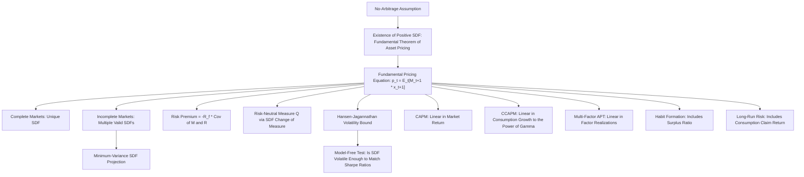

## Definition and Properties of the Stochastic Discount Factor


### Overview and Conceptual Role

The stochastic discount factor (SDF), also known as the pricing kernel or the state-price deflator, is the unifying object at the center of modern asset pricing theory. It is a single random variable that, when used to discount and reweight any asset's future payoffs, correctly prices that asset in the current period — and the same SDF prices every asset in the economy simultaneously. The SDF framework subsumes CAPM, APT, and consumption-based asset pricing models as special cases distinguished only by what economic quantity is assumed to proxy for the SDF.

**Key Points**

- The SDF approach is the most general framework in asset pricing: nearly any arbitrage-free asset pricing model can be written in SDF form, making it the natural "master equation" from which specific models (CAPM, CCAPM, multi-factor models) are derived as special cases with particular functional forms or proxies for $M_{t+1}$.
- Unlike model-specific frameworks that price only certain asset classes, the SDF framework applies uniformly across equities, bonds, options, and virtually any other traded security, since it is derived directly from the absence of arbitrage rather than from assumptions specific to any one asset class.
- The SDF is sometimes denoted $M_{t+1}$, $m_{t+1}$ (in logs), $\Lambda_{t+1}$, or $\xi_{t+1}$ depending on the source; this entry uses $M_{t+1}$ for the level and $m_{t+1} = \ln M_{t+1}$ for the log SDF.

### The Fundamental Pricing Equation

The defining relationship of the SDF framework is:

$$p_t = E_t[M_{t+1} \, x_{t+1}]$$

Where $p_t$ is the time-$t$ price of an asset, $x_{t+1}$ is its payoff at time $t+1$ (which may include dividends, coupons, or the sale price), and $M_{t+1}$ is the stochastic discount factor applicable between $t$ and $t+1$.

**Key Points**

- This single equation, applied with the *same* $M_{t+1}$, must hold for every asset traded in the economy — this is what makes the SDF a powerful unifying pricing device rather than an asset-specific discount rate.
- For a gross return $R_{t+1} = x_{t+1}/p_t$, dividing through gives the equivalent and very commonly used form:

$$1 = E_t[M_{t+1} R_{t+1}]$$

- This is identical in form to the consumption Euler equation derived in consumption-based asset pricing, where $M_{t+1} = \beta \dfrac{U'(C_{t+1})}{U'(C_t)}$ — the consumption-based SDF is one specific *economic model* for what $M_{t+1}$ is, but the fundamental pricing equation itself is more general and does not require assuming any particular utility function.

### Existence and Uniqueness

**Key Points**

- **Existence**: The fundamental theorem of asset pricing establishes that the absence of arbitrage opportunities in a market is (under mild technical conditions) *equivalent* to the existence of a strictly positive SDF $M_{t+1} > 0$ that prices all assets according to the fundamental pricing equation.
- **Positivity** of $M_{t+1}$ is essential: a negative SDF realization in some state of the world would imply that a security paying off *only* in that state would have a negative price, permitting an arbitrage (buy the asset for negative cost, receive a non-negative payoff) — so no-arbitrage requires $M_{t+1} > 0$ in every state.
- **Uniqueness** depends on market completeness: in a **complete market** (where the number of linearly independent traded securities equals the number of possible states of the world), the SDF is *unique*. In an **incomplete market**, there exist infinitely many valid SDFs consistent with the observed prices of traded assets, though they must all agree on the pricing of any payoff that is actually spanned by traded securities.
- In incomplete markets, a common approach is to use the **minimum-variance SDF**, which is the (linear) projection of any valid SDF onto the space of traded asset returns — this is the SDF representation most closely tied to mean-variance efficient portfolios and the Hansen-Jagannathan bound (discussed below).

### The SDF and Risk-Neutral Pricing

The SDF framework nests the risk-neutral valuation approach commonly used in derivatives pricing as a special reformulation.

**Key Points**

- Defining $R_{f,t+1} \equiv 1/E_t[M_{t+1}]$ as the risk-free rate, and the risk-neutral probability measure via $\dfrac{d\mathbb{Q}}{d\mathbb{P}} = \dfrac{M_{t+1}}{E_t[M_{t+1}]}$, the fundamental pricing equation can be rewritten as:

$$p_t = \frac{1}{R_{f,t+1}}E_t^{\mathbb{Q}}[x_{t+1}]$$

- This is exactly the risk-neutral valuation formula used in options pricing (e.g., Black-Scholes and binomial tree methods): discount *expected* payoffs at the risk-free rate, but compute the expectation under the risk-neutral measure $\mathbb{Q}$ rather than the actual (physical) probability measure $\mathbb{P}$.
- The SDF is therefore the object that formally links the "real-world" or physical probability measure used in econometric/empirical asset pricing work to the risk-neutral measure used in derivatives pricing — the change of measure is entirely captured by the (normalized) SDF.

### Decomposition: Price of Risk and Covariance

A key algebraic property of the SDF is that any asset's expected excess return can be expressed purely in terms of its covariance with the SDF.

Starting from $1 = E_t[M_{t+1}R_{t+1}]$ and using the definition of covariance, $E[XY] = E[X]E[Y] + \text{Cov}(X,Y)$:

$$1 = E_t[M_{t+1}]E_t[R_{t+1}] + \text{Cov}_t(M_{t+1}, R_{t+1})$$

Applying this to the risk-free rate (for which $\text{Cov}_t(M_{t+1}, R_{f,t+1}) = 0$ since $R_{f,t+1}$ is known at time $t$) gives $E_t[M_{t+1}] = 1/R_{f,t+1}$. Substituting back and rearranging yields the **SDF risk premium formula**:

$$E_t[R_{t+1}] - R_{f,t+1} = -R_{f,t+1}\,\text{Cov}_t(M_{t+1}, R_{t+1})$$

**Key Points**

- This shows the risk premium on any asset is determined entirely by the **covariance between its return and the SDF**, not by covariance with any particular observable factor (market return, consumption growth, etc.) — those specific covariances only matter to the extent that a particular economic model claims a specific proxy *is* (or is proportional to) the true SDF.
- Assets that are negatively correlated with the SDF (i.e., pay off well exactly when $M_{t+1}$ is low, meaning "good times" when marginal utility is low) require a **positive risk premium** to be willingly held, since $-\text{Cov}(M,R) > 0$ in that case.
- Assets that are positively correlated with the SDF (pay off well exactly when $M_{t+1}$ is high, i.e., "bad times"/high marginal utility) can have expected returns *below* the risk-free rate, or even negative expected excess returns — this is the formal SDF-based statement of why insurance-like or hedging assets can command a return discount, consistent with the intuition underlying consumption-based risk premia.

### Example: SDF Pricing of a Simple Two-State Economy

**Example**

Consider a two-state, one-period economy with states "boom" (probability 0.5) and "recession" (probability 0.5). A risky asset pays 120 in the boom and 90 in the recession; a risk-free bond pays 100 in both states and currently costs 96.15 (implying a gross risk-free rate of $R_f = 100/96.15 \approx 1.04$).

Suppose the SDF takes value $M_{boom} = 0.90$ and $M_{recession} = 1.02$ (higher in the bad state, consistent with SDF theory).

**Verify the risk-free bond pricing:**

$$p_{bond} = 0.5(0.90)(100) + 0.5(1.02)(100) = 45 + 51 = 96$$

This is consistent with the stated bond price (small rounding). Now price the risky asset using the same SDF:

$$p_{risky} = 0.5(0.90)(120) + 0.5(1.02)(90) = 54 + 45.9 = 99.9$$

```python
# Verification in Python
M_boom, M_recession = 0.90, 1.02
prob_boom, prob_recession = 0.5, 0.5

payoff_bond = [100, 100]
payoff_risky = [120, 90]

price_bond = prob_boom*M_boom*payoff_bond[0] + prob_recession*M_recession*payoff_bond[1]
price_risky = prob_boom*M_boom*payoff_risky[0] + prob_recession*M_recession*payoff_risky[1]

print(f"Bond price: {price_bond:.2f}")
print(f"Risky asset price: {price_risky:.2f}")
print(f"Implied expected return, risky asset: {(0.5*120+0.5*90)/price_risky - 1:.4f}")
print(f"Risk-free rate: {payoff_bond[0]/price_bond - 1:.4f}")
```

This demonstrates the core mechanic: the **same** $M_{boom}$ and $M_{recession}$ values price both securities simultaneously — the defining feature of a valid SDF in this (complete, two-state, two-asset) market.

### The Hansen-Jagannathan (1991) Bound

**Key Points**

- Hansen and Jagannathan derived a model-free lower bound on the **volatility** any valid SDF must have, given only the observed mean and covariance matrix of asset returns — without needing to specify a utility function or economic model for $M_{t+1}$.
- The bound is expressed as:

$$\frac{\sigma(M)}{E[M]} \geq \frac{|E[R^e]|}{\sigma(R^e)}$$

Where $R^e$ is any excess return (portfolio return minus the risk-free rate), and the right-hand side is that portfolio's **Sharpe ratio**. The bound must hold for *every* traded excess return, so in practice it is evaluated using the maximum attainable Sharpe ratio across all portfolios.

- This bound provides an important, model-independent empirical discipline: since the historical Sharpe ratio of, e.g., the U.S. equity market is fairly high (contributing directly to the equity premium puzzle), **any** valid SDF — regardless of the underlying economic model generating it — must be highly volatile (have a high coefficient of variation) to be consistent with observed asset returns.
- This reframes the equity premium puzzle in SDF language: the consumption-based SDF $M_{t+1} = \beta(C_{t+1}/C_t)^{-\gamma}$ under low, plausible $\gamma$ is simply **not volatile enough** to satisfy the Hansen-Jagannathan bound implied by observed equity Sharpe ratios — providing a clean, model-free diagnostic of the puzzle without needing to compute the equity premium and risk-free rate separately.

### SDF Representations Across Major Asset Pricing Models

| Model | SDF ($M_{t+1}$) Specification |
| --- | --- |
| CAPM | $M_{t+1} = a - b\, R_{m,t+1}$ (linear in market return) |
| Consumption CAPM (CRRA) | $M_{t+1} = \beta\left(\dfrac{C_{t+1}}{C_t}\right)^{-\gamma}$ |
| Habit Formation (Campbell-Cochrane) | $M_{t+1} = \beta\left(\dfrac{S_{t+1}}{S_t}\right)^{-\gamma}\left(\dfrac{C_{t+1}}{C_t}\right)^{-\gamma}$ |
| Multi-Factor / APT | $M_{t+1} = a - \sum_k b_k F_{k,t+1}$ (linear in factor realizations) |
| Long-Run Risk (Epstein-Zin) | $M_{t+1}$ depends on consumption growth **and** the return on the consumption claim |
| Risk-Neutral (derivatives pricing) | $M_{t+1} = \dfrac{1}{R_{f,t+1}}\cdot \dfrac{d\mathbb{Q}}{d\mathbb{P}}$ |

**Key Points**

- Every row in this table is a *different economic hypothesis about what determines the SDF*, but every one must satisfy the same fundamental pricing equation $1 = E_t[M_{t+1}R_{t+1}]$ for all traded assets — this is why the SDF framework is often described as the common language into which all asset pricing models can be translated for direct comparison and testing.
- The **linear factor SDF** form ($M_{t+1} = a - \sum_k b_k F_{k,t+1}$) is of particular practical importance because it is the form implicitly assumed whenever a multi-factor regression (Fama-French, APT-style) is used for asset pricing tests — the factor risk premia estimated in such regressions can be directly mapped to the $b_k$ coefficients of this SDF representation.

### Conceptual Diagram: The SDF as a Unifying Framework



### Empirical Testing Using the SDF Framework

**Key Points**

- **GMM estimation** (Hansen-Singleton, 1982) is the standard empirical approach: specify a parametric SDF (e.g., CRRA, habit, linear factor), form sample moment conditions from $E[(M_{t+1}R_{t+1}-1)z_t] = 0$ for a set of instruments $z_t$, and estimate parameters by minimizing a weighted quadratic form of these moments — with the associated J-statistic testing overidentifying restrictions.
- **Fama-MacBeth two-pass regressions** can be reinterpreted in SDF language as estimating the linear factor prices $b_k$ that make the implied linear SDF price the cross-section of test asset returns as closely as possible.
- **Model comparison** across competing SDF specifications (e.g., CCAPM vs. Fama-French three-factor vs. a consumption-based habit model) is commonly done by comparing pricing errors (typically via the Hansen-Jagannathan distance metric) across models applied to the same set of test assets, providing an internally consistent basis for evaluating which candidate SDF fits the cross-section of returns best. [Inference — model rankings from such comparisons can be sensitive to the specific set of test assets and time period chosen, a well-documented issue in the empirical asset pricing literature.]

### Related Topics

- The consumption Euler equation and its SDF interpretation
- Arbitrage Pricing Theory (APT) and linear factor SDF representations
- The Hansen-Jagannathan bound and its relationship to the equity premium puzzle
- Risk-neutral valuation and the change of measure in derivatives pricing
- GMM estimation of asset pricing models (Hansen-Singleton)
- Market completeness and the fundamental theorems of asset pricing
- Habit formation, long-run risk, and rare disaster SDF specifications
- Fama-MacBeth cross-sectional regression methodology