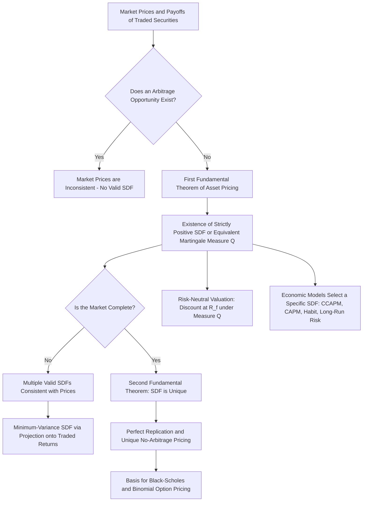

## The Pricing Kernel and No-Arbitrage

### Overview and Conceptual Role

The relationship between the pricing kernel (another name for the stochastic discount factor) and the principle of no-arbitrage is the theoretical bedrock on which the entire SDF framework rests. While the previous entry established the fundamental pricing equation and its properties, this entry focuses specifically on the formal linkage between the *absence of arbitrage opportunities* in a market and the *existence of a valid pricing kernel* — a result known as the **Fundamental Theorem of Asset Pricing (FTAP)**.

**Key Points**

- No-arbitrage is a minimal, almost universally accepted economic restriction: it does not require investors to be rational optimizers, does not require any specific utility function, and does not require markets to be in equilibrium in any deep sense — it merely rules out "free lunches" (riskless profit opportunities with zero net investment).
- The remarkable result of the FTAP is that this seemingly weak restriction is *equivalent* to the existence of a strictly positive pricing kernel that correctly prices all traded securities — turning a purely logical/economic restriction into a constructive object (the SDF) usable for empirical asset pricing.
- This entry distinguishes between the **law of one price** (a weaker condition) and full **no-arbitrage** (a stronger condition), since they correspond to different existence and uniqueness properties of the pricing kernel.

### Arbitrage: Formal Definition

**Key Points**

- An **arbitrage opportunity** is a trading strategy that requires zero net investment today, has no possibility of a loss in any future state of the world, and has a strictly positive probability of a profit in at least one state — informally, "something for nothing" with no downside risk.
- Formally, a portfolio with payoff $x_{t+1}$ and cost $p_t$ constitutes an arbitrage if either: (i) $p_t \le 0$ and $x_{t+1} \geq 0$ in every state with $x_{t+1} > 0$ in at least one state (a free lottery ticket), or (ii) $p_t < 0$ and $x_{t+1} \geq 0$ in every state (getting paid to take on a position with no possible loss).
- The **law of one price** is a related but weaker condition: it requires only that two portfolios with *identical* payoffs in every future state must have the *identical* price today. No-arbitrage implies the law of one price, but the law of one price does not by itself rule out all arbitrage opportunities (e.g., it says nothing about a strategy with a strictly positive payoff and zero cost, since there is no competing "identical payoff" portfolio to compare against).

### The Fundamental Theorem of Asset Pricing

**Key Points**

- **First Fundamental Theorem of Asset Pricing**: A market admits no arbitrage opportunities *if and only if* there exists a strictly positive stochastic discount factor (equivalently, an equivalent risk-neutral martingale measure) such that the price of every traded asset equals the expected discounted value of its payoffs under that SDF/measure.
- **Second Fundamental Theorem of Asset Pricing**: Given no-arbitrage, the market is **complete** (every possible payoff pattern can be replicated by a portfolio of traded securities) *if and only if* the SDF (equivalently, the equivalent martingale measure) is **unique**.
- These two theorems jointly establish the precise mapping between economic no-arbitrage conditions and mathematical properties of the pricing kernel: no-arbitrage ⟺ existence of a valid (positive) SDF; completeness ⟺ uniqueness of that SDF.
- The theorem is typically proven using a **separating hyperplane argument**: the set of achievable arbitrage payoffs and the non-negative orthant (representing "free money" payoff vectors) can be separated by a hyperplane precisely when no arbitrage exists, and the normal vector to that hyperplane (suitably normalized) *is* the SDF.

### Why the SDF Must Be Strictly Positive

**Key Points**

- Suppose, for contradiction, that a valid SDF $M_{t+1}$ could take a negative value in some state $s$ with positive probability. Consider a security ("Arrow-Debreu security") that pays 1 unit if state $s$ occurs and 0 otherwise; under the fundamental pricing equation, its price would be $p = \pi_s M_s$ (probability of state $s$ times the SDF value in that state), which would be **negative** if $M_s < 0$.
- A security with a negative price but a non-negative payoff (it pays either 0 or 1, never negative) is a textbook arbitrage: an investor could buy this security (receiving cash upfront, since the price is negative) and would never have to pay anything back, only possibly *receive* a payoff later — a strategy with negative cost and non-negative payoff, meeting the formal arbitrage definition above.
- This is why the FTAP's SDF must be **strictly positive in every state with positive probability** — positivity of the pricing kernel is not an additional assumption layered onto the theorem, but a direct logical consequence of ruling out arbitrage.

### Complete vs. Incomplete Markets and SDF Uniqueness

**Key Points**

- In a **complete market**, the number of linearly independent payoff patterns spanned by traded securities equals the number of possible states of the world (or, in continuous-state settings, the market is "dynamically complete" via continuous trading, as in the Black-Scholes framework), and the SDF consistent with observed prices is **unique**.
- In an **incomplete market** (the empirically realistic case — the number of traded securities is far smaller than the number of relevant future states), there are infinitely many strictly positive SDFs consistent with the no-arbitrage prices of the traded securities; they necessarily agree on the pricing of any payoff spanned by the traded assets but can disagree arbitrarily on the pricing of non-spanned, hypothetical payoffs.
- A common resource for pinning down a specific SDF in incomplete markets is to impose an economic model (e.g., CRRA utility, habit formation) that selects one particular SDF from the many consistent with no-arbitrage alone — this is precisely what consumption-based and factor-based asset pricing models do: **they are all specific selections of an admissible SDF, not independent alternative theories of pricing itself.**
- The **minimum-variance SDF** (the projection of any valid SDF onto the span of traded asset returns) is a particularly useful incomplete-market construct because it is the SDF with the smallest possible variance among all valid SDFs, and it is directly linked to the mean-variance efficient frontier of traded assets.

### Risk-Neutral Valuation as a Special Case

The FTAP is most commonly applied in derivatives pricing via the **equivalent martingale measure** formulation, which is mathematically equivalent to the SDF formulation but phrased in terms of a probability measure rather than a discount factor.

**Key Points**

- Defining the risk-neutral (or "equivalent martingale") measure $\mathbb{Q}$ via the Radon-Nikodym derivative $\dfrac{d\mathbb{Q}}{d\mathbb{P}} = \dfrac{M_{t+1}}{E_t[M_{t+1}]}$, the fundamental pricing equation $p_t = E_t[M_{t+1}x_{t+1}]$ becomes $p_t = \dfrac{1}{R_f}E_t^{\mathbb{Q}}[x_{t+1}]$ — discount expected payoffs at the risk-free rate, using expectations taken under $\mathbb{Q}$ instead of the physical measure $\mathbb{P}$.
- Under $\mathbb{Q}$, all discounted asset prices are **martingales** (their expected future value, discounted at the risk-free rate, equals their current value) — this is the origin of the term "equivalent martingale measure," and it is the working assumption underlying most derivatives pricing models (Black-Scholes, binomial trees, Monte Carlo pricing under risk-neutral measure).
- The FTAP guarantees that **if and only if** no arbitrage exists, at least one such $\mathbb{Q}$ measure exists; if the market is additionally complete, $\mathbb{Q}$ is unique, which is precisely the setting in which options can be perfectly replicated and priced by a unique, model-independent no-arbitrage value (as in the classic binomial or Black-Scholes derivations under their stated assumptions).

### Worked Example: Deriving the SDF from No-Arbitrage in a Binomial Tree

**Example**

Consider a one-period binomial model: a stock currently priced at $S_0 = 100$ can go up to $S_u = 120$ (probability irrelevant for pricing under no-arbitrage replication) or down to $S_d = 90$. The risk-free gross return is $R_f = 1.05$.

**Step 1 — Solve for the risk-neutral probability $q$** such that the discounted stock price is a martingale:

$$S_0 = \frac{1}{R_f}\left[q\, S_u + (1-q)S_d\right]$$


$$100 = \frac{1}{1.05}[q(120) + (1-q)(90)]$$


$$105 = 120q + 90(1-q) = 90 + 30q \implies q = 0.5$$

**Step 2 — Recover the implied SDF values** in each state, using $M_{state} = \dfrac{q_{state}}{\pi_{state}}\cdot\dfrac{1}{R_f}$, where $\pi_{state}$ is the *physical* (real-world) probability. If the physical probability of the up state is $\pi_u = 0.6$:

```python
R_f = 1.05
S0, Su, Sd = 100, 120, 90

# Step 1: risk-neutral probability from no-arbitrage martingale condition
q = (R_f * S0 - Sd) / (Su - Sd)
print(f"Risk-neutral probability of up-state: {q:.4f}")

# Step 2: recover SDF values given physical probabilities
pi_u, pi_d = 0.6, 0.4  # physical probabilities (assumed)
M_u = (q / pi_u) / R_f
M_d = ((1 - q) / pi_d) / R_f
print(f"SDF in up state:   M_u = {M_u:.4f}")
print(f"SDF in down state: M_d = {M_d:.4f}")

# Verify: price the stock using physical probabilities and recovered SDF
price_check = pi_u * M_u * Su + pi_d * M_d * Sd
print(f"Recovered stock price: {price_check:.2f} (should equal {S0})")
```

This demonstrates concretely how a no-arbitrage restriction (the risk-neutral martingale condition) directly pins down a valid SDF, and that in this **complete** market (two states, two independent securities — stock and bond), the SDF recovered this way is the **unique** admissible pricing kernel; note $M_d = 1.0714 > M_u = 0.7937$, consistent with the SDF being higher in the "bad"/down state, as expected from risk-aversion-consistent economic theory.

### No-Arbitrage Bounds Without a Full Model

**Key Points**

- Even without specifying a complete economic model for the SDF, no-arbitrage alone places **bounds** on derivative prices — e.g., put-call parity is a direct no-arbitrage restriction (not tied to any specific option pricing model) derivable purely from constructing a replicating portfolio and invoking the law of one price.
- The **Hansen-Jagannathan bound** (covered in the SDF definition and properties entry) is itself a no-arbitrage-consistent restriction: it uses only the observed means and covariances of traded asset returns (no utility function needed) to derive a lower bound on the volatility any admissible SDF must have.
- More generally, no-arbitrage restrictions are the basis for a wide class of **model-free** bounds in derivatives markets (e.g., bounds on the price of an option given only the prices of other options at different strikes, via convexity/monotonicity arguments), all of which follow from the same underlying FTAP logic without requiring a fully specified pricing kernel.

### Conceptual Diagram: No-Arbitrage to Pricing Kernel



### Relationship to Economic Asset Pricing Models

**Key Points**

- It is important to distinguish the **existence** of a pricing kernel (a pure no-arbitrage/mathematical result, requiring no economic assumptions about preferences or beliefs) from the **specific functional form** of the pricing kernel proposed by an economic model (CRRA utility, habit formation, linear factor models) — the FTAP guarantees *some* valid SDF exists whenever markets are arbitrage-free, but says nothing about *which* SDF is the "correct" or empirically relevant one.
- Every economic asset pricing model covered elsewhere in this course (CAPM, APT, CCAPM, habit formation, long-run risk, rare disasters) can be understood as proposing a *specific candidate* for the admissible SDF guaranteed to exist by the FTAP — and empirical tests of these models (GMM, Hansen-Jagannathan distance, Fama-MacBeth) are, at their core, tests of whether a *specific* proposed SDF is consistent with observed asset prices, not tests of whether *some* SDF exists (which the no-arbitrage assumption already guarantees, given no observed arbitrage).
- This distinction clarifies why asset pricing research is largely about identifying *which* economic model correctly characterizes the SDF, rather than about establishing that a pricing kernel exists at all — existence is essentially guaranteed by the weak, near-universally-accepted assumption of no arbitrage in liquid, well-functioning markets.

### Related Topics

- Definition and properties of the stochastic discount factor
- The Hansen-Jagannathan volatility bound
- Risk-neutral valuation and equivalent martingale measures
- Complete vs. incomplete markets and portfolio replication
- Put-call parity and other model-free no-arbitrage restrictions
- Binomial option pricing and the Black-Scholes model derivation
- Arbitrage Pricing Theory (APT) as a linear factor SDF specification
- GMM and Hansen-Jagannathan distance tests of candidate SDF models