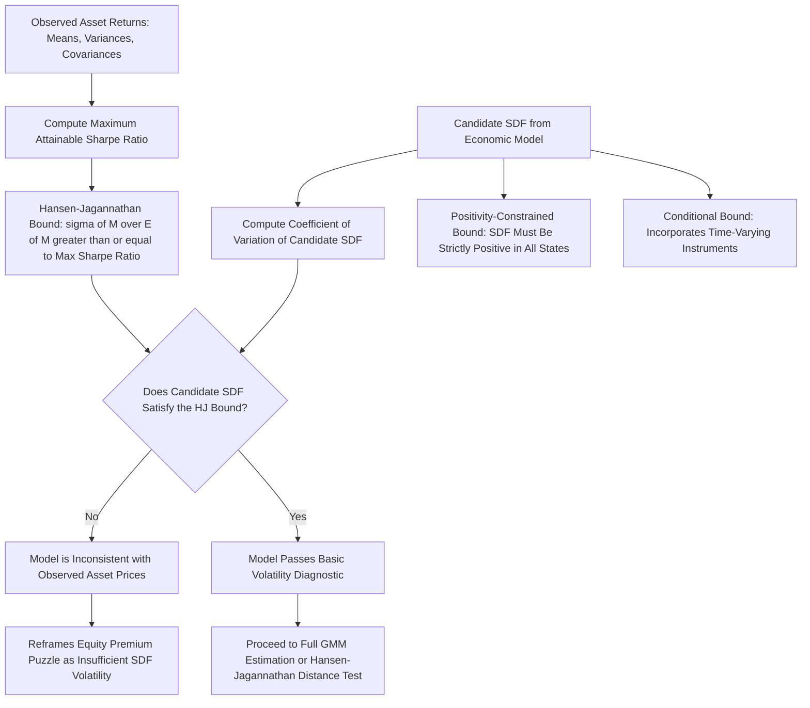

## Hansen-Jagannathan Bounds

### Overview and Purpose

The Hansen-Jagannathan (HJ) bound, developed by Lars Peter Hansen and Ravi Jagannathan (1991), is a model-free diagnostic tool that derives a lower bound on the volatility (or, more precisely, the coefficient of variation) that **any** valid stochastic discount factor must satisfy, given only the observed means, variances, and covariances of a set of traded asset returns. It provides a way to evaluate whether a *proposed* SDF (from any economic model — CCAPM, CAPM, habit formation, etc.) is even *capable* of explaining observed asset return data, without needing to fully solve or estimate the entire underlying economic model.

**Key Points**

- The HJ bound is derived purely from the fundamental pricing equation and no-arbitrage; it requires **no assumption about utility functions, preferences, or the specific economic mechanism generating the SDF** — this is what makes it a genuinely model-free test.
- It reframes many "puzzles" in asset pricing (most notably the equity premium puzzle) as a statement about *insufficient SDF volatility* relative to what is needed to match observed Sharpe ratios, providing a clean and unifying diagnostic across different candidate models.
- The bound is commonly visualized as a region in mean-standard deviation space (analogous to the mean-variance efficient frontier for portfolios, but here defined over the space of admissible SDFs) — hence it is sometimes referred to as the "HJ frontier."

### Derivation of the Bound

Starting from the fundamental pricing equation applied to any excess return $R^e_{t+1}$ (the return on a zero-cost, self-financing portfolio, such as a long-short portfolio or the market return minus the risk-free rate):

$$E[M_{t+1}R^e_{t+1}] = 0$$

Using the decomposition $E[XY] = E[X]E[Y] + \text{Cov}(X,Y)$:

$$0 = E[M]E[R^e] + \text{Cov}(M, R^e)$$


$$-E[M]E[R^e] = \text{Cov}(M,R^e) = \rho_{M,R^e}\,\sigma(M)\,\sigma(R^e)$$

Since the correlation $\rho_{M,R^e} \in [-1,1]$, we have $|\text{Cov}(M,R^e)| \leq \sigma(M)\sigma(R^e)$, which gives:

$$|E[M]|\,|E[R^e]| \leq \sigma(M)\,\sigma(R^e)$$

Dividing both sides by $E[M]\cdot\sigma(R^e)$ (with $E[M] > 0$ by no-arbitrage):

$$\frac{\sigma(M)}{E[M]} \geq \frac{|E[R^e]|}{\sigma(R^e)}$$

**Key Points**

- The right-hand side, $\dfrac{|E[R^e]|}{\sigma(R^e)}$, is precisely the **Sharpe ratio** of the excess return portfolio $R^e$.
- The left-hand side, $\dfrac{\sigma(M)}{E[M]}$, is the SDF's **coefficient of variation** — its standard deviation scaled by its mean.
- Because this inequality must hold for **every** possible excess return (every zero-cost portfolio constructible from traded assets), the tightest version of the bound uses the **maximum Sharpe ratio** attainable across all portfolios of the available assets, giving the sharpest possible restriction on $\sigma(M)/E(M)$.

### The Maximum Sharpe Ratio and the Bound's Tightness

**Key Points**

- The maximum attainable Sharpe ratio across all portfolios formed from a given set of $N$ risky assets (plus a risk-free asset) is a well-defined quantity from mean-variance portfolio theory, computable as $\sqrt{\mu_e' \Sigma^{-1} \mu_e}$, where $\mu_e$ is the vector of expected excess returns and $\Sigma$ is the covariance matrix of those returns.
- Using the *maximum* Sharpe ratio (rather than a single asset's Sharpe ratio, e.g., just the market portfolio) produces the **tightest** possible HJ bound obtainable from that particular set of test assets — using more assets (and their full covariance structure, allowing for diversification and combination) generally tightens the bound further, since more information about the joint payoff structure is exploited.
- Since the historical U.S. equity market Sharpe ratio is itself already fairly high (contributing to the equity premium puzzle), and combining equities with other assets (bonds, and especially option-based or higher-order-moment strategies) can produce portfolios with even higher Sharpe ratios, the effective HJ bound implied by rich test-asset sets can be considerably higher than the bound implied by the equity market portfolio alone. [Inference — the specific magnitude of the maximum Sharpe ratio, and hence the tightness of the bound, depends heavily on the specific set of test assets and time period used; estimates vary meaningfully across studies.]

### Application to the Equity Premium Puzzle

**Example**

Consider the U.S. equity market with an approximate historical annual Sharpe ratio of $0.35$–$0.40$ (using illustrative long-run figures for the excess equity return divided by its standard deviation). The HJ bound then requires:

$$\frac{\sigma(M)}{E[M]} \geq 0.35 \text{ to } 0.40$$

For the CRRA consumption-based SDF, $M_{t+1} = \beta(C_{t+1}/C_t)^{-\gamma}$, and under (approximate) log-normality, the coefficient of variation is approximately:

$$\frac{\sigma(M)}{E[M]} \approx \gamma\,\sigma_{\Delta c}$$

Where $\sigma_{\Delta c}$ is the standard deviation of consumption growth.

**Example — numerical illustration:**

```python
import numpy as np

sigma_dc = 0.015          # consumption growth volatility (illustrative)
target_sharpe = 0.37       # illustrative equity market Sharpe ratio

required_gamma = target_sharpe / sigma_dc
print(f"Risk aversion required to satisfy HJ bound: gamma = {required_gamma:.1f}")
```

Given $\sigma_{\Delta c} \approx 1.5\%$ and a target Sharpe ratio of roughly $0.37$, satisfying the HJ bound with the CRRA SDF requires $\gamma \approx 25$ — again, far above the range (typically under 10) considered economically plausible from microeconomic evidence. [Inference — the exact numerical required $\gamma$ depends on the specific consumption volatility and target Sharpe ratio inputs used; the qualitative conclusion — that plausible CRRA risk aversion falls well short of the HJ-implied requirement — is a robust and widely cited finding across similar calibrations in the literature.]

**Key Points**

- This calculation reframes the equity premium puzzle in a *model-free* way: rather than separately checking whether the model matches the mean equity premium *and* the mean risk-free rate, the HJ bound collapses the diagnostic into a single, cleanly interpretable statement — "is the candidate SDF volatile enough, relative to its mean, to be consistent with the observed maximum Sharpe ratio in the data?"
- Because the HJ bound derivation makes no reference to any specific utility function, this same diagnostic can be applied uniformly to compare **any** candidate SDF (CRRA, habit formation, long-run risk, rare disaster, linear factor models) on a common, apples-to-apples basis.

### The Hansen-Jagannathan Distance (HJD)

**Key Points**

- Beyond checking whether a candidate SDF *satisfies* the bound, Hansen and Jagannathan (1997) proposed a related and now widely used **model comparison metric**: the Hansen-Jagannathan distance, which measures the (least-squares) distance between a candidate (possibly misspecified) SDF and the nearest SDF that would correctly price a given set of test assets.
- The HJD is computed using a specific weighting matrix in the GMM objective function (the inverse of the second-moment matrix of the test asset returns) rather than the standard optimal GMM weighting matrix — a design choice that makes the resulting distance metric **invariant to the specific set of test assets' portfolio combinations** used, an important practical advantage for model comparison across different studies using different test asset sets.
- A larger HJD indicates a larger specification error for a given proposed SDF — HJD-based comparisons have been widely used to rank competing asset pricing models (e.g., CAPM vs. Fama-French three-factor vs. consumption-based models) by how close their implied SDF comes to correctly pricing a common set of test assets.

### Extensions: Bounds Incorporating Additional Restrictions

**Key Points**

- **Positivity-constrained HJ bounds** (Snow, 1991; Hansen-Heaton-Luttmer, 1995): impose the additional no-arbitrage restriction that the SDF must be strictly *positive* in every state (not merely satisfy the volatility bound), which in practice tightens the required region for an admissible SDF further, especially relevant for evaluating candidate SDFs' consistency with derivatives and other securities with highly skewed or non-linear payoffs.
- **Conditional HJ bounds**: extend the unconditional bound to account for time-varying conditioning information (e.g., using instruments known at time $t$ to scale returns), generally producing tighter bounds than the unconditional version, since conditioning information can reveal additional predictable structure in returns not captured by unconditional moments alone.
- **Bounds using higher-order moments / option-implied information**: some extensions incorporate information from options markets (which embed information about the entire risk-neutral distribution, not just means and variances) to construct sharper bounds on SDF behavior, particularly in the tails — directly relevant to evaluating rare-disaster-style SDF specifications. [Inference — the specific tightening achieved by these more sophisticated bound extensions varies by study and dataset; this is an active area of continued methodological development rather than a single settled result.]

### Conceptual Diagram: The HJ Bound Diagnostic



### Practical Uses in Empirical Asset Pricing

**Key Points**

- **Quick model screening**: Before undertaking full GMM estimation of a candidate SDF model, researchers often first check whether the model's implied SDF volatility, under reasonable parameter ranges, can plausibly satisfy the HJ bound — a model that categorically fails this diagnostic (like plain CRRA-CCAPM with low, "reasonable" $\gamma$) can be immediately identified as inadequate without further estimation.
- **Motivating alternative models**: The clean, model-free nature of the HJ bound is frequently cited as direct motivation for the alternative resolutions to the equity premium puzzle (habit formation, long-run risk, rare disasters) — each of these models is explicitly designed to generate a sufficiently volatile SDF (via time-varying local risk aversion, persistent growth risk, or disaster tail risk, respectively) to satisfy the bound with more plausible underlying preference parameters.
- **Model ranking via HJ distance**: Comparative studies frequently report HJ distance statistics across competing models (CAPM, Fama-French, momentum-augmented models, consumption-based models) applied to a common set of test portfolios, providing a standardized way to assess relative (rather than merely absolute) model performance in the cross-section of expected returns. [Inference — as with any empirical asset pricing test, HJD-based rankings can be sensitive to the specific test asset portfolios chosen (e.g., size/value-sorted portfolios vs. industry portfolios), a well-documented sensitivity in this literature.]

### Related Topics

- Definition and properties of the stochastic discount factor
- The pricing kernel and no-arbitrage (Fundamental Theorem of Asset Pricing)
- The equity premium puzzle (Mehra-Prescott, 1985)
- GMM estimation of asset pricing models (Hansen-Singleton, 1982)
- Habit formation, long-run risk, and rare disaster models as SDF specifications designed to satisfy HJ-type bounds
- Mean-variance portfolio theory and the maximum Sharpe ratio
- Model comparison in empirical asset pricing (Hansen-Jagannathan distance)
- Option-implied information and higher-moment extensions to SDF bounds