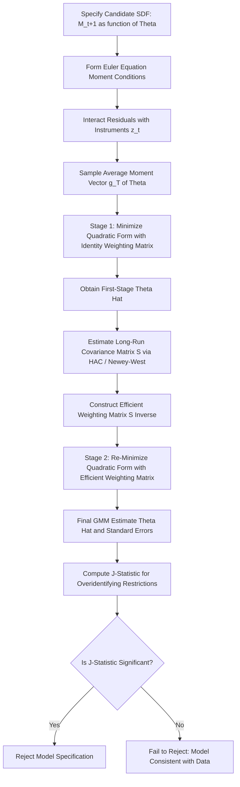

## GMM Estimation of Asset Pricing Models

### Overview and Purpose

The Generalized Method of Moments (GMM), introduced by Lars Peter Hansen (1982), is the dominant econometric technique for estimating and testing asset pricing models expressed in stochastic discount factor form. GMM is particularly well-suited to asset pricing because the fundamental pricing equation $E[M_{t+1}R_{t+1} - 1] = 0$ is itself a **moment condition** derived directly from economic theory (the Euler equation/no-arbitrage), without requiring the researcher to specify a full likelihood function or the complete joint distribution of returns and state variables.

**Key Points**

- GMM's central advantage over maximum likelihood estimation (MLE) in this context is that it requires only the moment conditions implied by the model's Euler equation — it does not require specifying the full distribution of consumption growth, returns, or other state variables, making it robust to distributional misspecification.
- Hansen and Singleton (1982) were the first to apply GMM specifically to estimate and test the parameters of the CRRA consumption-based Euler equation, and the technique was rapidly adopted as the standard tool for empirical asset pricing tests across virtually all SDF specifications.
- GMM is a **method of moments** generalization: classical method of moments requires the number of moment conditions to equal the number of parameters; GMM allows for **more** moment conditions than parameters (over-identification), using a weighting matrix to combine them optimally, and provides a formal test (the J-statistic) of whether the over-identifying restrictions are satisfied by the data.

### The Moment Conditions from the Euler Equation

The fundamental pricing equation, applied to any candidate SDF $M_{t+1}(\theta)$ (parameterized by a vector $\theta$, e.g., $\theta = (\beta, \gamma)$ for CRRA), implies:

$$E_t\left[M_{t+1}(\theta) R_{t+1} - 1\right] = 0$$

**Key Points**

- Because this equation holds *conditionally* on time-$t$ information, it implies an entire family of **unconditional** moment conditions: for any variable $z_t$ that is known at time $t$ (an "instrument"), the law of iterated expectations gives:

$$E\left[\left(M_{t+1}(\theta)R_{t+1} - 1\right)z_t\right] = 0$$

- Common instrument choices include a constant (giving the basic unconditional Euler equation), lagged consumption growth, lagged returns, lagged dividend yields, or other business-cycle indicators — each valid instrument contributes additional moment conditions to be exploited by GMM.
- If there are $K$ test assets (returns) and $L$ instruments, this generates $K \times L$ moment conditions in total, which can vastly exceed the number of structural parameters ($\theta$) being estimated — this over-identification is what enables the powerful specification test (J-statistic) described below.

### The GMM Estimator

Define the sample moment vector:

$$g_T(\theta) = \frac{1}{T}\sum_{t=1}^{T}\left(M_{t+1}(\theta)R_{t+1} - 1\right)\otimes z_t$$

The GMM estimator $\hat\theta$ is chosen to minimize a quadratic form in these sample moments:

$$\hat\theta = \arg\min_{\theta}\; g_T(\theta)' W_T\, g_T(\theta)$$

Where $W_T$ is a positive semi-definite **weighting matrix**.

**Key Points**

- When the number of moment conditions exactly equals the number of parameters (exact identification), the choice of $W_T$ is irrelevant — there exists a $\hat\theta$ that sets $g_T(\hat\theta) = 0$ exactly, and GMM collapses to standard method of moments.
- When the model is **over-identified** (more moments than parameters), the choice of $W_T$ matters for the efficiency of the estimator. Hansen (1982) showed that the **efficient GMM weighting matrix** is the inverse of the long-run covariance matrix of the moment conditions, $W_T^* = S^{-1}$, where $S = \sum_{j=-\infty}^{\infty} E[g_t g_{t-j}']$ accounts for potential serial correlation and heteroskedasticity in the moment conditions.
- In practice, estimation proceeds in **two stages**: (1) a first-stage estimate $\hat\theta_1$ is obtained using an arbitrary (often identity) weighting matrix, (2) this is used to estimate $S$ (commonly via a Newey-West or similar HAC estimator to account for autocorrelation), and (3) the efficient weighting matrix $\hat{S}^{-1}$ is used to obtain the final, asymptotically efficient estimate $\hat\theta_2$.

### Worked Example: GMM Estimation of the CRRA Euler Equation

**Example**

```python
import numpy as np
from scipy.optimize import minimize

def sdf_crra(beta, gamma, cons_growth):
    """CRRA stochastic discount factor realizations."""
    return beta * (cons_growth ** (-gamma))

def moment_conditions(params, cons_growth, gross_return, instruments):
    """
    Constructs g_t(theta) = (M(theta)*R - 1) interacted with instruments.
    instruments: array of shape (T, L), each column a valid time-t instrument
    """
    beta, gamma = params
    M = sdf_crra(beta, gamma, cons_growth)
    euler_residual = M * gross_return - 1          # shape (T,)
    g_t = euler_residual[:, None] * instruments     # shape (T, L)
    return g_t

def gmm_objective(params, cons_growth, gross_return, instruments, W):
    g_t = moment_conditions(params, cons_growth, gross_return, instruments)
    g_bar = g_t.mean(axis=0)                        # sample average moment vector
    return g_bar @ W @ g_bar

# --- Illustrative simulated data (T periods) ---
np.random.seed(0)
T = 300
cons_growth = np.random.normal(1.018, 0.015, T)
gross_return = 1.06 + 0.16*np.random.normal(0, 1, T)
instruments = np.column_stack([np.ones(T), np.roll(cons_growth, 1)])
instruments[0, 1] = 1.0  # fix wraparound from np.roll

# Stage 1: identity weighting matrix
W_identity = np.eye(instruments.shape[1])
result_stage1 = minimize(
    gmm_objective, x0=[0.96, 5.0],
    args=(cons_growth, gross_return, instruments, W_identity),
    method='Nelder-Mead'
)
beta_hat1, gamma_hat1 = result_stage1.x
print(f"Stage 1 estimates: beta = {beta_hat1:.4f}, gamma = {gamma_hat1:.4f}")

# Stage 2: (simplified) re-weight using sample covariance of moments as S estimate
g_t_stage1 = moment_conditions(result_stage1.x, cons_growth, gross_return, instruments)
S_hat = np.cov(g_t_stage1.T)
W_efficient = np.linalg.pinv(S_hat)

result_stage2 = minimize(
    gmm_objective, x0=result_stage1.x,
    args=(cons_growth, gross_return, instruments, W_efficient),
    method='Nelder-Mead'
)
beta_hat2, gamma_hat2 = result_stage2.x
print(f"Stage 2 (efficient) estimates: beta = {beta_hat2:.4f}, gamma = {gamma_hat2:.4f}")
```

This illustrates the standard two-stage GMM workflow: form moment conditions from the Euler equation and instruments, minimize the quadratic form under an initial weighting matrix, re-estimate the efficient weighting matrix from the residuals, and re-optimize. [Speculation — this is a simplified illustrative implementation for pedagogical purposes; production-grade GMM estimation typically uses a proper HAC/Newey-West long-run covariance estimator rather than a simple sample covariance, and iterates the two-stage procedure to convergence.]

### The J-Statistic and Overidentifying Restrictions Test

**Key Points**

- When the model is over-identified, the minimized GMM objective function value, scaled appropriately, forms **Hansen's J-statistic**:

$$J = T\cdot g_T(\hat\theta)' \hat{S}^{-1} g_T(\hat\theta) \;\sim\; \chi^2_{(L\cdot K - p)}$$

Where $L\cdot K$ is the total number of moment conditions and $p$ is the number of estimated parameters, so the degrees of freedom equal the number of *over-identifying* restrictions.

- A large, statistically significant J-statistic indicates that the sample moment conditions are **not** jointly consistent with $g(\theta) = 0$ for any parameter value — i.e., the model is **rejected** by the overidentification test, suggesting the specified SDF (and its instrument set) is misspecified in some dimension.
- Empirically, GMM tests of the plain CRRA consumption Euler equation frequently reject the model at conventional significance levels across many datasets and instrument sets, providing a formal statistical counterpart to the more intuitive equity premium and risk-free rate puzzles, and motivating the alternative SDF specifications (habit formation, long-run risk, rare disasters) discussed elsewhere. [Behavior may vary substantially by dataset, sample period, instrument choice, and asset universe — some studies find weaker rejections than others, and the strength of rejection is sensitive to these specification choices.]

### Asymptotic Properties and Standard Errors

**Key Points**

- Under standard regularity conditions, the efficient GMM estimator $\hat\theta$ is **consistent** and **asymptotically normal**, with asymptotic variance $(D'S^{-1}D)^{-1}/T$, where $D$ is the matrix of derivatives (Jacobian) of the population moment conditions with respect to $\theta$.
- This asymptotic normality result allows standard hypothesis testing on individual parameters (e.g., testing whether $\gamma$ is significantly different from a specific plausible value like 2 or 5) using conventional t-statistics constructed from the estimated asymptotic standard errors.
- Because financial returns typically exhibit serial correlation, heteroskedasticity, and fat tails, the long-run covariance matrix $S$ is almost always estimated using a **heteroskedasticity- and autocorrelation-consistent (HAC)** estimator (e.g., Newey-West), which explicitly accounts for these features rather than assuming i.i.d. moment conditions.

### GMM Across Different SDF Specifications

| Model | Parameters Estimated ($\theta$) | Typical Instruments Used |
| --- | --- | --- |
| CRRA-CCAPM | $\beta, \gamma$ | Lagged consumption growth, lagged returns, constant |
| Habit Formation (Campbell-Cochrane style) | $\beta, \gamma$, habit persistence parameters | Lagged surplus consumption ratio proxies, lagged consumption growth |
| Epstein-Zin / Long-Run Risk | $\beta, \gamma, \psi$ (EIS) | Lagged consumption growth, lagged market return, price-dividend ratio |
| Linear Factor Models (CAPM, Fama-French) | Factor risk prices $b_k$ | Often estimated via two-pass Fama-MacBeth rather than full GMM, though GMM formulations exist |

**Key Points**

- The **same GMM machinery** applies across all these specifications; what changes is the functional form of $M_{t+1}(\theta)$ plugged into the moment conditions, underscoring the SDF framework's role as a common estimation and testing language across otherwise very different economic models.
- For linear factor SDF specifications ($M_{t+1} = a - \sum_k b_k F_{k,t+1}$), GMM estimation of the factor risk prices $b_k$ is directly comparable (and, under certain conditions, numerically equivalent) to the factor risk premia estimated via traditional two-pass Fama-MacBeth cross-sectional regressions, though GMM additionally delivers correct standard errors that account for the fact that the factor betas themselves are estimated (avoiding the classic "errors-in-variables" problem inherent in naive two-pass procedures).

### Conceptual Diagram: The GMM Estimation Workflow



### Practical Challenges and Criticisms

**Key Points**

- **Weak instruments**: If chosen instruments are only weakly correlated with the relevant conditioning information, GMM estimates can be imprecise and asymptotic approximations can be poor in finite samples, a well-documented concern across many applications of GMM in macro-finance.
- **Sensitivity to instrument and moment choice**: Because researchers have latitude in choosing which instruments and how many lags to include, results (parameter estimates and J-statistic rejection/non-rejection) can vary meaningfully across seemingly reasonable specification choices, raising concerns about specification search and robustness. [Inference — the degree to which this sensitivity reflects genuine model misspecification versus estimation noise is difficult to disentangle in any single study.]
- **Finite-sample bias**: The two-stage efficient GMM estimator can exhibit non-trivial finite-sample bias, particularly with many moment conditions relative to the sample size (a well-known "many moments" problem); continuously updated GMM (CU-GMM) and other small-sample corrections have been proposed as partial remedies. [Unverified — the practical significance of finite-sample bias in any specific application depends on the sample size and number of moments used, and should be checked via simulation/bootstrap methods where feasible.]
- **Choice of test assets**: As with Hansen-Jagannathan distance comparisons, GMM-based model tests and rejections can be sensitive to the specific set of test asset returns included in the estimation, and results are not always robust across different portfolio sorts (e.g., size/value portfolios vs. industry portfolios vs. individual stocks). [Inference — this sensitivity is a recognized and actively discussed limitation across the empirical asset pricing literature rather than specific to GMM alone.]

### Related Topics

- Definition and properties of the stochastic discount factor
- The pricing kernel and no-arbitrage (Fundamental Theorem of Asset Pricing)
- Hansen-Jagannathan bounds and the Hansen-Jagannathan distance
- The consumption Euler equation and CRRA utility log-linearization
- Habit formation, long-run risk, and rare disaster SDF specifications
- Fama-MacBeth two-pass cross-sectional regression methodology
- HAC/Newey-West standard error estimation in time-series econometrics
- Weak instrument problems in GMM and IV estimation