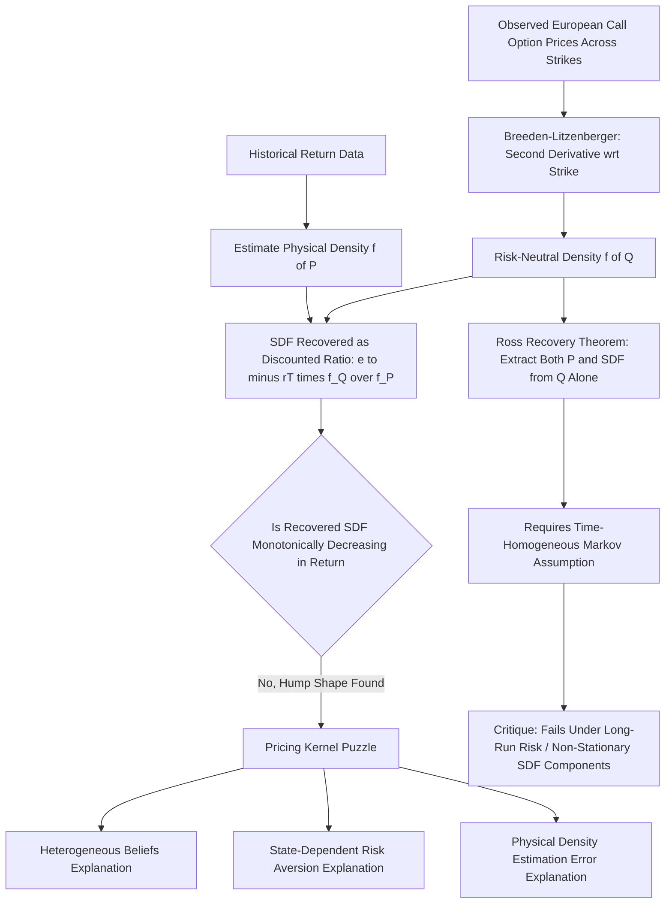

## Recovering the Discount Factor from Derivative Prices

### Overview and Purpose

Recovering the stochastic discount factor from derivative prices refers to a family of techniques that exploit the rich cross-section of traded options (and other derivatives) to extract information about the SDF — or, more commonly, about the closely related **risk-neutral density** — without relying on a fully specified consumption-based or factor economic model. Because option prices span a continuum of strikes and reflect market participants' pricing of payoffs across the entire distribution of future asset values, they provide uniquely granular, market-implied information about how the SDF varies across states of the world, particularly in the tails.

**Key Points**

- The foundational insight, due to Breeden and Litzenberger (1978), is that the **second derivative of the European call option price with respect to strike price** recovers the risk-neutral probability density function (RND) of the underlying asset's price at expiration — a direct, model-free link between observable option prices and the risk-neutral measure $\mathbb{Q}$.
- Since $\dfrac{d\mathbb{Q}}{d\mathbb{P}}$ is (up to normalization) exactly the stochastic discount factor, combining the option-implied risk-neutral density with a separately estimated **physical (real-world) density** $\mathbb{P}$ of the underlying's future value allows the SDF to be recovered directly as the ratio of the two densities — an approach broadly known as **SDF recovery** or **pricing kernel recovery**.
- This approach is distinct from the "SDF Recovery Theorem" of Ross (2015), which attempts an even more ambitious task: recovering *both* the physical measure $\mathbb{P}$ and the SDF from risk-neutral (option) prices **alone**, without needing an independently estimated physical density — a claim that has generated substantial subsequent debate (covered below).

### The Breeden-Litzenberger Result

For a European call option with strike $K$ and maturity $T$, written on an underlying asset with price $S_T$ at expiration, the time-$t$ price is:

$$C_t(K,T) = e^{-r(T-t)}\int_K^{\infty}(S_T - K)f^{\mathbb{Q}}(S_T)\,dS_T$$

Where $f^{\mathbb{Q}}(S_T)$ is the risk-neutral probability density of $S_T$. Differentiating twice with respect to $K$:

$$\frac{\partial^2 C_t(K,T)}{\partial K^2} = e^{-r(T-t)} f^{\mathbb{Q}}(K)$$

**Key Points**

- This result is entirely **model-free**: it does not require assuming Black-Scholes, stochastic volatility, jump-diffusion, or any other specific option pricing model — it follows directly from the definition of a European call payoff and basic calculus, making it one of the most robust "model-free" tools in derivatives-based empirical finance.
- In practice, since only a discrete set of strikes trade in any real market, the second derivative must be **approximated numerically** (e.g., via finite differences on a smoothed implied volatility curve, or by fitting a flexible functional form — such as a spline or a mixture of log-normals — to the observed implied volatility smile before differentiating).
- The resulting risk-neutral density $f^{\mathbb{Q}}(K)$ typically exhibits **negative skewness and excess kurtosis** relative to a log-normal benchmark for equity index options — the well-known "volatility smile/skew" pattern — reflecting market participants' pricing of crash risk and fat tails beyond what standard diffusion-based models would imply.

### Worked Example: Extracting an Implied Risk-Neutral Density

**Example**

```python
import numpy as np
from scipy.interpolate import CubicSpline

# Illustrative: observed call prices across a grid of strikes (single maturity)
strikes = np.array([80, 90, 95, 100, 105, 110, 120])
call_prices = np.array([21.5, 12.8, 8.9, 5.6, 3.1, 1.6, 0.4])  # illustrative synthetic data
r, T = 0.03, 0.5  # risk-free rate, time to maturity

# Fit a smooth cubic spline to observed call prices as a function of strike
spline = CubicSpline(strikes, call_prices)

# Evaluate second derivative on a fine grid to approximate the risk-neutral density
K_grid = np.linspace(82, 118, 200)
d2C_dK2 = spline(K_grid, 2)  # second derivative from the spline object

rn_density = np.exp(r * T) * d2C_dK2
rn_density = np.clip(rn_density, 0, None)  # enforce non-negativity (numerical safeguard)

print(f"Approximate risk-neutral density peak near strike: "
      f"{K_grid[np.argmax(rn_density)]:.1f}")
```

This demonstrates the essential Breeden-Litzenberger workflow: smooth the observed option price (or equivalently, implied volatility) curve across strikes, then differentiate twice to recover an approximation to $f^{\mathbb{Q}}(K)$. [Speculation — real-world implementations typically work with the implied volatility smile rather than raw prices, and use more sophisticated smoothing/arbitrage-free interpolation methods (e.g., SVI parameterization) to avoid the negative-density and non-monotonicity artifacts that simple spline fits on sparse strike grids can produce.]

### From Risk-Neutral Density to the SDF

Once $f^{\mathbb{Q}}(S_T)$ is recovered from option prices, and given (or separately estimated) the physical density $f^{\mathbb{P}}(S_T)$ of the same underlying's future value, the (normalized) SDF over the horizon $T-t$ is recovered as:

$$M_{t,T}(S_T) = e^{-r(T-t)}\,\frac{f^{\mathbb{Q}}(S_T)}{f^{\mathbb{P}}(S_T)}$$

**Key Points**

- This ratio is exactly the Radon-Nikodym derivative relating the risk-neutral and physical measures (up to the discounting term), and it directly generalizes the abstract SDF/measure-change relationship covered in the SDF definition and no-arbitrage entries to a setting where both densities are estimated empirically from market and historical data respectively.
- A key practical and conceptual difficulty is that $f^{\mathbb{Q}}$ is observed with reasonable precision from **liquid, forward-looking** option prices, while $f^{\mathbb{P}}$ must be estimated from **historical, backward-looking** realized return data (e.g., via kernel density estimation, GARCH-based simulation, or historical bootstrapping) — these are fundamentally different data sources and estimation philosophies, introducing potential inconsistency between the two.
- Empirical studies recovering the SDF this way for equity index options have frequently found the resulting **pricing kernel is non-monotonic** in the underlying return — it can appear to *increase* over some middle range of positive returns before decreasing again — a puzzling pattern dubbed the **"pricing kernel puzzle"** (Jackwerth, 2000; Aït-Sahalia and Lo, 2000), since standard risk-averse utility theory predicts a monotonically *decreasing* SDF in wealth/consumption/market return.

### The Pricing Kernel Puzzle

**Key Points**

- Standard economic theory (regardless of the specific utility function, so long as marginal utility is decreasing in consumption/wealth) implies the SDF should be a **monotonically decreasing function** of aggregate wealth or the market return — worse market outcomes should always correspond to higher marginal utility and hence a higher SDF value.
- Empirically recovered pricing kernels using the Breeden-Litzenberger approach on index options have repeatedly shown a "hump" or locally increasing region, typically for moderate positive market returns, directly contradicting this monotonicity prediction. [Unverified — the robustness of this finding across different sample periods, option markets, and physical density estimation methods has been debated, with some subsequent studies attributing it partly to physical density estimation error or time-varying risk aversion/heterogeneous beliefs rather than a genuine economic anomaly.]
- Proposed explanations include: heterogeneous investor beliefs (rather than a single representative agent, aggregating diverse subjective probability beliefs can produce an apparently non-monotonic pricing kernel even if each individual investor's kernel is monotonic), state-dependent risk aversion (as in habit formation models), or purely **estimation error** in the separately estimated physical density, especially since physical density estimation over the same short horizons as traded options is statistically challenging given limited historical data. [Inference — no single explanation has achieved full consensus as the primary driver of the puzzle; the literature treats several of these as plausible contributing factors.]

### The Ross Recovery Theorem

**Key Points**

- Stephen Ross (2015) proposed a striking theoretical result: under specific assumptions — most critically that the underlying state process follows a **time-homogeneous, finite-state (or discretized) Markov process**, and that the SDF takes a particular "transition-independent" (multiplicatively separable) form — it is possible to recover **both** the physical transition probabilities $\mathbb{P}$ **and** the SDF using **only** a single cross-section of current risk-neutral (option-implied) state prices, without needing any historical return data at all.
- The intuition rests on the fact that observed risk-neutral **Arrow-Debreu state prices** encode information about both the transition probabilities and the pricing kernel jointly; under Ross's restrictive assumptions (particularly the transition-independence of the SDF, meaning the pricing kernel between any two states depends only on those states, not on time or the specific path taken), this joint information can be uniquely decomposed into its two components via a matrix eigenvector decomposition (specifically, using the Perron-Frobenius eigenvector of the recovered state-price transition matrix).
- The Ross Recovery Theorem generated substantial excitement upon publication because it promised to extract *forward-looking, market-implied* physical probabilities — of significant practical interest for risk management and market-implied forecasting — purely from current option prices, bypassing the need for a long and possibly non-stationary historical sample.

### Critiques of Ross Recovery

**Key Points**

- Subsequent research (notably Borovička, Hansen, and Scheinkman, 2016) demonstrated that Ross's recovery result is **not robust** to the presence of certain permanent/non-stationary components in the SDF (specifically, when the SDF has a non-trivial "martingale component" associated with long-run risk, as in Bansal-Yaron-style models) — under such conditions, the transition-independence assumption central to Ross's proof is violated, and the theorem's conclusions can fail even though its stated technical assumptions might appear superficially satisfied in a finite-state approximation.
- This critique is significant because long-run risk and related recursive-preference models (which are widely used and well-supported as resolutions to the equity premium and risk-free rate puzzles) are precisely the type of model in which this non-stationary SDF component is expected to be economically important — creating tension between the empirical plausibility of long-run risk models and the technical conditions required for Ross recovery to be valid.
- Empirical tests of Ross recovery on index option data have produced **mixed results**: some studies report physical probability estimates from Ross recovery that appear economically implausible (e.g., recovered expected returns that are strongly counter-cyclical or inconsistent with basic risk-return tradeoff intuition) under naive implementation, while various modified or extended recovery approaches have been proposed to address specific technical shortcomings. [Inference — the overall practical reliability of Ross-style recovery techniques for real-world forecasting or SDF estimation remains an actively debated and unsettled question in the asset pricing and financial econometrics literature.]

### Comparison of SDF Recovery Approaches

| Approach | Data Required | Key Assumption | Main Output |
| --- | --- | --- | --- |
| Breeden-Litzenberger | Current option prices only | None (model-free) | Risk-neutral density $f^{\mathbb{Q}}$ |
| SDF via $\mathbb{Q}/\mathbb{P}$ ratio | Current option prices + historical return data | Consistent, comparable $\mathbb{Q}$ and $\mathbb{P}$ estimation | Empirical pricing kernel $M(S_T)$ |
| Ross Recovery | Current option prices only (cross-section, no history) | Time-homogeneous Markov state process; transition-independent SDF | Both $\mathbb{P}$ and SDF, jointly |

### Conceptual Diagram: Recovering the SDF from Options



### Practical Applications

**Key Points**

- **Crash risk and tail-risk measurement**: The shape of the option-implied risk-neutral density (particularly its left-tail skewness) is widely used by practitioners and researchers as a market-implied gauge of perceived crash risk, directly relevant to calibrating and testing rare-disaster-style asset pricing models.
- **Variance risk premium estimation**: The difference between risk-neutral expected variance (extractable from a portfolio of options, as in the VIX methodology) and physical expected variance (estimated from historical realized volatility or GARCH-type models) is itself a direct, tradable manifestation of SDF-related risk pricing, closely connected to the stochastic volatility channel in long-run risk models.
- **Model-free option pricing bounds**: Even without fully recovering the SDF, the Breeden-Litzenberger relationship underlies a range of model-free tests of option market efficiency and no-arbitrage consistency (e.g., checking that implied risk-neutral densities integrate to one and remain non-negative across the strike range, which can fail in practice due to stale quotes or illiquidity, flagging potential data or arbitrage issues).

### Related Topics

- Definition and properties of the stochastic discount factor
- The pricing kernel and no-arbitrage (Fundamental Theorem of Asset Pricing)
- Risk-neutral valuation and equivalent martingale measures
- Hansen-Jagannathan bounds and higher-moment extensions using option-implied information
- The pricing kernel puzzle (Jackwerth, 2000; Aït-Sahalia and Lo, 2000)
- Ross Recovery Theorem and its critiques (Borovička, Hansen, Scheinkman, 2016)
- Variance risk premium and the VIX methodology
- Long-run risk models and non-stationary SDF components