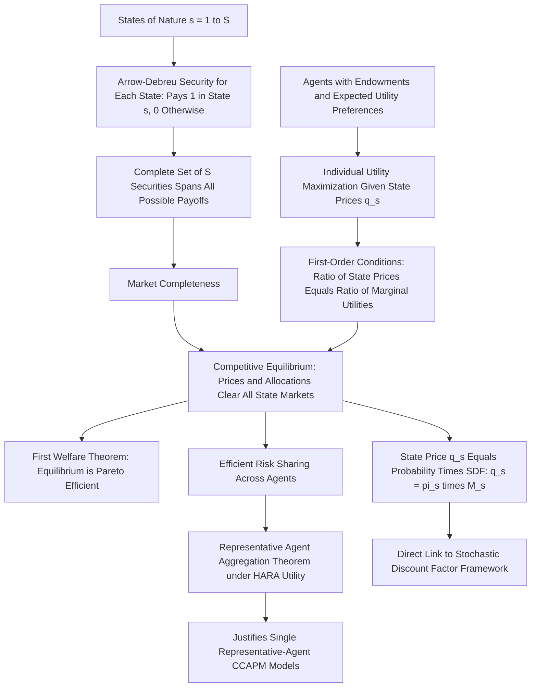

## Arrow-Debreu Equilibrium


### Overview and Historical Context

The Arrow-Debreu model, developed by Kenneth Arrow and Gérard Debreu (1954), provides the foundational general equilibrium framework for modern financial economics under uncertainty. It establishes conditions under which a competitive equilibrium exists in an economy with a complete set of contingent claims markets, and it introduces the concept of state-contingent securities ("Arrow-Debreu securities") that underlies virtually all subsequent asset pricing theory, including the SDF framework, option pricing, and general equilibrium finance.

**Key Points**

- The model extends standard Walrasian general equilibrium theory (originally developed for certainty, multi-good economies) to a setting with **uncertainty about future states of the world**, by reinterpreting a "good" as not just a physical commodity but a commodity **contingent on a particular state of nature occurring**.
- This reinterpretation is the crucial conceptual move: once goods are indexed by both their physical characteristics *and* the state of the world in which they are delivered, all the standard tools of general equilibrium theory (existence, welfare theorems, efficiency) carry over directly to economies with uncertainty.
- Arrow (1964) specifically introduced the idea of **elementary state-contingent securities** (Arrow securities) as the minimal building blocks needed to complete markets under uncertainty, while Debreu's contributions focused on the rigorous general equilibrium existence proof; the combined framework is now universally referred to as "Arrow-Debreu."

### The Arrow-Debreu Security

**Key Points**

- An **Arrow-Debreu security** (also called a "pure state security" or "elementary claim") for state $s$ is a hypothetical security that pays exactly 1 unit of the numeraire good if state $s$ occurs at a specified future date, and 0 in every other state.
- If there are $S$ possible future states of the world, a complete set of $S$ Arrow-Debreu securities (one per state) allows any conceivable state-contingent payoff pattern to be **replicated** by an appropriate portfolio of these securities — this is the formal definition of **market completeness**.
- The price of the Arrow-Debreu security for state $s$, denoted $q_s$, is called the **state price**, and it plays a role directly analogous to (and in fact identical to, once combined with probabilities) the stochastic discount factor: $q_s = \pi_s \, M_s$, where $\pi_s$ is the (physical) probability of state $s$ and $M_s$ is the SDF value in that state.

### The Arrow-Debreu Economy: Formal Setup

Consider an economy with $I$ agents, $S$ states of nature, and a single consumption good per state (generalizable to multiple goods per state). Each agent $i$ has:

- An endowment $e^i_s$ in each state $s$
- A utility function over state-contingent consumption, typically expected utility: $U^i(c^i) = \sum_s \pi_s\, u^i(c^i_s)$

Given a complete set of Arrow-Debreu securities with prices $\{q_s\}_{s=1}^{S}$, each agent solves:

$$\max_{\{c^i_s\}} \sum_s \pi_s\, u^i(c^i_s) \quad \text{subject to} \quad \sum_s q_s\, c^i_s \leq \sum_s q_s\, e^i_s$$

**Key Points**

- This is a standard constrained utility maximization problem, structurally identical to a static consumer choice problem, except "goods" are now state-contingent consumption claims and the "prices" are the state prices $q_s$.
- The first-order condition for each agent, for each state $s$, sets the ratio of state prices equal to the ratio of (probability-weighted) marginal utilities:

$$\frac{q_s}{q_{s'}} = \frac{\pi_s\, u^{i\prime}(c^i_s)}{\pi_{s'}\, u^{i\prime}(c^i_{s'})}$$

- A **competitive (Arrow-Debreu) equilibrium** is a set of state prices $\{q_s\}$ and an allocation $\{c^i_s\}$ for every agent such that (i) each agent's allocation solves their individual maximization problem given those prices, and (ii) markets clear in every state: $\sum_i c^i_s = \sum_i e^i_s$ for all $s$.

### Existence and the Welfare Theorems

**Key Points**

- **Existence**: Under standard convexity and continuity assumptions on preferences and endowments (the same conditions used in standard Walrasian general equilibrium theory), Debreu's existence proof (using a fixed-point argument, typically via the Kakutani or Brouwer fixed-point theorem) guarantees that a competitive Arrow-Debreu equilibrium exists.
- **First Welfare Theorem**: Any competitive Arrow-Debreu equilibrium allocation is **Pareto efficient** — since markets are complete (there is a price for every conceivable state-contingent claim), the standard first welfare theorem logic applies directly to the extended state-contingent commodity space.
- **Second Welfare Theorem**: Any Pareto efficient allocation can be achieved as a competitive equilibrium for some redistribution of initial endowments — implying that, in a complete-markets Arrow-Debreu economy, efficiency and distributional (equity) considerations are, in principle, fully separable.
- These welfare results depend critically on **market completeness**: if the full set of $S$ Arrow-Debreu securities is not actually available for trade (or cannot be synthesized via dynamic trading, as in some multi-period settings), the resulting equilibrium in the incomplete market may **not** be Pareto efficient — a central motivating fact for the study of incomplete markets covered in a separate entry.

### Efficient Risk Sharing and Consumption Comovement

**Key Points**

- A key economic implication of the Arrow-Debreu equilibrium first-order conditions is **efficient risk sharing**: in equilibrium, the ratio of marginal utilities across any two agents is **equalized across states** relative to their state-price-weighted probabilities, meaning idiosyncratic risk affecting only one agent's endowment gets efficiently shared/diversified away across all agents via trading in the complete asset markets.
- This produces the strong (and empirically much-debated) implication that individual agents' consumption growth should be **perfectly correlated** across agents in an efficient, complete-markets equilibrium (up to a scaling determined by each agent's relative risk tolerance) — a result sometimes framed as the "full risk-sharing" or "complete consumption insurance" hypothesis.
- Empirical tests of this full risk-sharing prediction using household-level consumption data have generally **rejected** perfect risk sharing (individual household consumption growth is found to be far more volatile and less correlated across households than the theory predicts), which is widely interpreted as evidence of real-world market incompleteness — households face borrowing constraints, uninsurable idiosyncratic income risk, and limited access to the full set of contingent claims assumed in the idealized Arrow-Debreu model. [Inference — the magnitude and interpretation of these rejections vary across studies, datasets, and countries, and some researchers attribute part of the finding to measurement error in household consumption data rather than pure market incompleteness.]

### The Representative Agent and Aggregation

**Key Points**

- A remarkable and widely used result is that, under certain conditions (notably when individual utility functions belong to the **HARA — Hyperbolic Absolute Risk Aversion — class**, which includes CRRA as a special case, and markets are complete), the equilibrium allocation and pricing in a multi-agent Arrow-Debreu economy can be **exactly represented** by a single "representative agent" whose utility function is a specific aggregation of the individual agents' utilities, weighted by their Pareto weights (determined by relative wealth/endowments in equilibrium).
- This **aggregation theorem** is the formal justification for the ubiquitous use of a single representative-agent CRRA utility function in consumption-based asset pricing models (CCAPM, habit formation, long-run risk) — even though real economies obviously consist of many heterogeneous agents, the representative agent construct is not merely a simplifying assumption but can be derived rigorously from an underlying complete-markets Arrow-Debreu economy under the stated conditions.
- However, this aggregation result **breaks down** when markets are incomplete, when agents have heterogeneous (non-HARA-compatible) preferences, or when there are borrowing constraints or other market frictions — in these cases, the wealth distribution across agents can matter independently for aggregate asset prices, motivating the heterogeneous-agent asset pricing models studied in the incomplete markets literature. [Inference — the practical quantitative importance of heterogeneous-agent effects for matching specific asset pricing moments (like the equity premium) is an active area of ongoing research with mixed findings across different modeling approaches.]

### Numerical Example: Two-Agent, Two-State Economy

**Example**

Consider two agents with identical log utility ($u(c) = \ln c$) and equal probability states ($\pi_1 = \pi_2 = 0.5$). Agent 1's endowment is $(e^1_1, e^1_2) = (10, 6)$ and Agent 2's endowment is $(e^2_1, e^2_2) = (6, 10)$ — their risks are perfectly negatively correlated (aggregate endowment is constant at 16 in both states).

```python
import numpy as np
from scipy.optimize import fsolve

pi = [0.5, 0.5]
e1 = np.array([10, 6])
e2 = np.array([6, 10])
aggregate = e1 + e2  # constant aggregate endowment: [16, 16]

# With log utility and complete markets, efficient risk sharing implies
# each agent consumes a CONSTANT SHARE of aggregate consumption in every state
# (a classic result for identical HARA/log utility agents)

# Agent 1's equilibrium consumption share (determined by relative "wealth"
# via the state-price-weighted budget constraint)
def find_share(alpha, e1, e2, pi):
    # Under log utility, state prices q_s are proportional to pi_s / aggregate_s
    q = np.array(pi) / aggregate
    # Agent 1 budget: q . c1 = q . e1, with c1 = alpha * aggregate
    return np.dot(q, alpha * aggregate) - np.dot(q, e1)

alpha1 = fsolve(find_share, 0.5, args=(e1, e2, pi))[0]
print(f"Agent 1's equilibrium consumption share of aggregate: {alpha1:.4f}")
print(f"Agent 1 consumption across states: {alpha1 * aggregate}")
print(f"Agent 2 consumption across states: {(1-alpha1) * aggregate}")
```

Because aggregate consumption is constant (16 in both states) and both agents have log utility, the efficient equilibrium allocation has **each agent consuming a constant fraction of the (constant) aggregate endowment in every state** — perfectly smoothing away their individually risky, offsetting endowment fluctuations entirely through trade, exactly as the full risk-sharing prediction implies. Each agent ends up holding a claim on a fixed share of aggregate consumption rather than their own volatile individual endowment.

### Conceptual Diagram: The Arrow-Debreu Framework



### Connection to Modern Asset Pricing

**Key Points**

- The Arrow-Debreu state price $q_s$ is the discrete-state analog of the SDF: in a finite-state economy, the entire SDF framework (fundamental pricing equation, no-arbitrage, risk-neutral valuation) can be derived directly and rigorously from the Arrow-Debreu equilibrium state prices, making Arrow-Debreu theory the deepest general-equilibrium foundation underlying the more reduced-form SDF approach used in most empirical asset pricing.
- The Breeden-Litzenberger result (recovering risk-neutral densities from option prices, covered in a separate entry) can be interpreted as a continuous-state analog of directly observing Arrow-Debreu state prices from a rich enough set of traded option strikes — options with adjacent strikes effectively synthesize approximate Arrow-Debreu securities for narrow ranges of the underlying's terminal price.
- The failure of real-world markets to be truly "complete" in the Arrow-Debreu sense (most real-world states of nature do not have a directly traded pure contingent claim) is the central motivation for the study of **incomplete markets** models, general equilibrium asset pricing with borrowing constraints, and heterogeneous-agent models — all of which relax one or more of the strong completeness/aggregation assumptions of the baseline Arrow-Debreu framework while retaining much of its conceptual machinery.

### Related Topics

- Definition and properties of the stochastic discount factor
- The pricing kernel and no-arbitrage (Fundamental Theorem of Asset Pricing)
- Market completeness and incomplete markets asset pricing
- Representative agent aggregation and the limits of aggregation theorems
- Recovering the discount factor from derivative prices (Breeden-Litzenberger)
- Efficient risk sharing and empirical tests of full consumption insurance
- Heterogeneous-agent asset pricing models
- General equilibrium existence proofs (Kakutani/Brouwer fixed-point theorems)