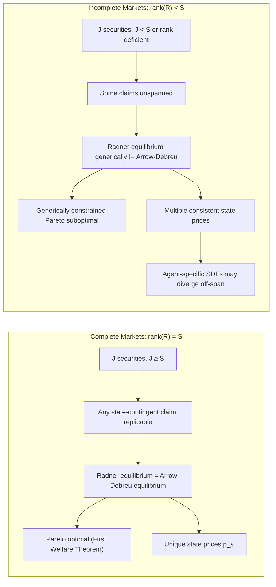

## Radner equilibrium under uncertainty

### Overview and Motivation

Radner equilibrium, introduced by Roy Radner (1972), extends the Arrow-Debreu general equilibrium framework to settings where agents trade sequentially over time under uncertainty, using a limited set of financial securities rather than a complete set of contingent commodity claims. It is the foundational equilibrium concept for the study of incomplete markets in financial economics.

The central departure from Arrow-Debreu is informational and structural realism: instead of assuming a full array of Arrow securities (one for every possible state of nature at every date), Radner equilibrium assumes agents trade a finite number of securities at each date, form rational expectations about future prices, and re-optimize their portfolios as information unfolds. When the number of independent securities equals the number of states of nature, a Radner equilibrium replicates the Arrow-Debreu allocation exactly (spanning). When securities are fewer than states, markets are **incomplete**, and the equilibrium allocation is generically Pareto suboptimal.

### The Formal Environment

**Time and Uncertainty Structure**

Consider a two-period model, $t = 0, 1$, with uncertainty resolved at $t=1$. Let $S = \{1, 2, \dots, s, \dots, S\}$ denote the finite set of possible states of nature at $t=1$, one of which is realized. Agents share common knowledge of the state space and (in most formulations) common priors over state probabilities $\pi_s$.

**Agents and Preferences**

There are $I$ agents indexed $i = 1, \dots, I$. Agent $i$ has:

- An endowment stream $(e_0^i, e_1^i(s))$ — consumption at $t=0$ and state-contingent consumption endowment at $t=1$.
- A von Neumann-Morgenstern expected utility function:

$$U^i(c_0^i, c_1^i) = u^i(c_0^i) + \delta^i \sum_{s \in S} \pi_s\, u^i(c_1^i(s))$$

where $\delta^i$ is the subjective discount factor and $u^i$ is a strictly increasing, strictly concave Bernoulli utility function.

**Securities Structure**

There are $J$ financial securities traded at $t=0$, indexed $j = 1, \dots, J$. Security $j$ has price $q_j$ at $t=0$ and pays off $r_j(s)$ units of the consumption good in state $s$ at $t=1$. The **payoff matrix** $R$ is $S \times J$:

$$R = \begin{pmatrix} r_1(1) & r_2(1) & \cdots & r_J(1) \\ r_1(2) & r_2(2) & \cdots & r_J(2) \\ \vdots & \vdots & \ddots & \vdots \\ r_1(S) & r_2(S) & \cdots & r_J(S) \end{pmatrix}$$

Agent $i$ chooses a portfolio $\theta^i \in \mathbb{R}^J$ (holdings of each security, unrestricted sign unless short-sale constraints are imposed).

### Agent's Optimization Problem

Each agent $i$ solves:

$$\max_{c_0^i,\, c_1^i(\cdot),\, \theta^i} \; u^i(c_0^i) + \delta^i \sum_{s} \pi_s\, u^i(c_1^i(s))$$

subject to the **budget constraint at $t=0$**:

$$c_0^i + \sum_{j=1}^J q_j \theta_j^i \le e_0^i$$

and the **state-by-state budget constraint at $t=1$**:

$$c_1^i(s) \le e_1^i(s) + \sum_{j=1}^J r_j(s)\, \theta_j^i \quad \forall s \in S$$

**Key Points**

- The $t=1$ constraint must hold in *every* state, not just in expectation — this is what distinguishes sequential trading under a security structure from a single Arrow-Debreu budget constraint evaluated at present-value prices.
- The portfolio $\theta^i$ is chosen once, at $t=0$, before the state is known — there is no re-trading in the pure two-period model (multi-period extensions relax this; see below).
- $\theta_j^i < 0$ represents a short position (issuing/selling the security), typically feasible unless explicitly restricted.

### Definition of Radner Equilibrium

A **Radner equilibrium** is a collection of prices and allocations $\left( q^*, \{c_0^{i*}, c_1^{i*}(\cdot), \theta^{i*}\}_{i=1}^I \right)$ such that:

1. **Individual optimality**: For each agent $i$, $(c_0^{i*}, c_1^{i*}, \theta^{i*})$ solves agent $i$'s optimization problem given prices $q^*$.
2. **Market clearing in securities**: $\sum_{i=1}^I \theta_j^{i*} = 0$ for all $j = 1, \dots, J$ (securities are in zero net supply, or in fixed net supply for equity-type claims).
3. **Market clearing in goods**:
   - $t=0$: $\sum_i c_0^{i*} = \sum_i e_0^i$
   - $t=1$, each state $s$: $\sum_i c_1^{i*}(s) = \sum_i e_1^i(s)$

By Walras' Law, goods market clearing at $t=1$ in every state is implied by security market clearing plus each agent's budget constraint holding with equality, so condition 3 is often redundant given 1 and 2 with equality constraints — but it is stated explicitly for clarity and for economies where budget constraints may not bind with equality (e.g., under nonsatiation this does not occur, so equality is standard).

### Market Completeness and Spanning

**Definition**: Markets are **complete** if $\text{rank}(R) = S$, i.e., the payoff matrix has full row rank. This requires $J \ge S$ (at least as many linearly independent securities as states).

**Complete markets case**: When $\text{rank}(R) = S$, any state-contingent claim can be replicated by some portfolio $\theta$, i.e., for any target payoff vector $x \in \mathbb{R}^S$, there exists $\theta$ such that $R\theta = x$. In this case:

- The Radner equilibrium allocation coincides with the Arrow-Debreu equilibrium allocation.
- The **First Welfare Theorem** holds: the equilibrium allocation is Pareto optimal.
- Equilibrium (state) prices are unique and can be recovered from security prices via the pricing kernel: $q = R^\top p$ isn't quite right notationally — more precisely, if $p_s$ denotes the implicit Arrow-Debreu price of state $s$, no-arbitrage requires $q_j = \sum_s p_s\, r_j(s)$ for all $j$, and with $J \ge S$ and full rank, $p$ is uniquely pinned down by $q = R^\top p$ solved as a linear system (with $q \in \mathbb{R}^J$, $R^\top \in \mathbb{R}^{J\times S}$).

**Incomplete markets case**: When $\text{rank}(R) < S$, the economy is said to have **incomplete markets**. Key consequences:

- Not every state-contingent claim is spanned; agents cannot fully insure against all risks.
- The **First Welfare Theorem generically fails**: Radner equilibria are generically Pareto suboptimal (Hart 1975; Geanakoplos and Polemarchakis 1986 formalize the generic constrained-suboptimality result).
- Equilibrium allocations depend on the *specific* securities available, not just on the span of what could theoretically be traded — because incomplete markets create endogenous, state-dependent shadow prices that interact with which margins are tradeable.
- Multiple, non-payoff-equivalent security structures spanning the same subspace can still yield *different* equilibria if agents face nonlinear constraints (short-sale limits), though under linear budget sets alone, equilibria depend on the span, not the specific basis.

### No-Arbitrage and State Prices

A necessary condition for equilibrium is the **absence of arbitrage** in the security market: there is no portfolio $\theta$ with $\sum_j q_j \theta_j \le 0$ (costs nothing or generates income) that yields $\sum_j r_j(s)\theta_j \ge 0$ for all $s$ with strict inequality somewhere (or negative cost with non-negative payoff in every state).

**Fundamental Theorem of Asset Pricing (finite-state version)**: No-arbitrage holds if and only if there exists a strictly positive vector of **state prices** $p = (p_1, \dots, p_S) \gg 0$ (equivalently, **risk-neutral probabilities** after normalization) such that:

$$q_j = \sum_{s=1}^S p_s\, r_j(s) \quad \text{for all } j$$

- If markets are complete, $p$ is **unique**.
- If markets are incomplete, $p$ is generally **not unique** — there exists a whole affine subspace (or polytope, under short-sale constraints) of state prices consistent with observed security prices, all of which correctly price the traded securities but may disagree on the value of untraded, unspanned claims.

This non-uniqueness of state prices under incomplete markets is a central technical and economic feature: it means that unhedgeable risk cannot be uniquely priced by arbitrage alone, and agent-specific marginal utility must complete the pricing.

**Equilibrium Asset Pricing (Euler equation form)**: In equilibrium, each agent's first-order conditions imply the **stochastic discount factor** representation. For agent $i$ with interior solution:

$$q_j = \sum_{s} \pi_s\, \delta^i \frac{u^{i\prime}(c_1^{i*}(s))}{u^{i\prime}(c_0^{i*})}\, r_j(s) = E\left[ m^i_1\, r_j \right]$$

where $m_1^i \equiv \delta^i \dfrac{u^{i\prime}(c_1^{i*})}{u^{i\prime}(c_0^{i*})}$ is agent $i$'s stochastic discount factor (SDF) / marginal rate of substitution. In complete markets, all agents' SDFs agree state-by-state (since $p_s = \pi_s m_1^i$ is the same for all $i$); in incomplete markets, SDFs can differ across agents on unspanned states, though they must agree on the projection onto the span of $R$.

### Diagram: Sequential Trading Structure (svg_diagram)

<svg xmlns="http://www.w3.org/2000/svg" viewBox="0 0 760 340">
<text x="380" y="24" text-anchor="middle" font-size="16" font-weight="bold" fill="#1a1a2e">Radner Equilibrium Timeline (svg_diagram)</text>
<line x1="80" y1="170" x2="680" y2="170" stroke="#333" stroke-width="2" />
<circle cx="80" cy="170" r="6" fill="#2b6cb0" />
<circle cx="680" cy="170" r="6" fill="#2b6cb0" />

<text x="80" y="200" text-anchor="middle" font-size="14" font-weight="bold" fill="`#2b6cb0`">t = 0</text>

<text x="680" y="200" text-anchor="middle" font-size="14" font-weight="bold" fill="`#2b6cb0`">t = 1</text>

<rect x="20" y="60" width="150" height="70" rx="6" fill="#ebf8ff" stroke="#2b6cb0" />
<text x="95" y="85" text-anchor="middle" font-size="12">Endowment e₀ᵢ</text>
<text x="95" y="102" text-anchor="middle" font-size="12">Trade securities</text>
<text x="95" y="119" text-anchor="middle" font-size="12">θⱼⁱ at prices qⱼ</text>
<line x1="180" y1="170" x2="360" y2="90" stroke="#a0aec0" stroke-width="1.5" marker-end="url(#arrow)" />
<line x1="180" y1="170" x2="360" y2="150" stroke="#a0aec0" stroke-width="1.5" marker-end="url(#arrow)" />
<line x1="180" y1="170" x2="360" y2="210" stroke="#a0aec0" stroke-width="1.5" marker-end="url(#arrow)" />
<line x1="180" y1="170" x2="360" y2="270" stroke="#a0aec0" stroke-width="1.5" marker-end="url(#arrow)" />
<rect x="370" y="65" width="300" height="45" rx="6" fill="#fefcbf" stroke="#b7791f" />
<text x="520" y="92" text-anchor="middle" font-size="12">State s=1: payoff rⱼ(1)θⱼⁱ, endow e₁ⁱ(1)</text>
<rect x="370" y="125" width="300" height="45" rx="6" fill="#fefcbf" stroke="#b7791f" />
<text x="520" y="152" text-anchor="middle" font-size="12">State s=2: payoff rⱼ(2)θⱼⁱ, endow e₁ⁱ(2)</text>
<rect x="370" y="185" width="300" height="45" rx="6" fill="#fefcbf" stroke="#b7791f" />
<text x="520" y="212" text-anchor="middle" font-size="12">State s=3: payoff rⱼ(3)θⱼⁱ, endow e₁ⁱ(3)</text>
<rect x="370" y="245" width="300" height="45" rx="6" fill="#fefcbf" stroke="#b7791f" />
<text x="520" y="272" text-anchor="middle" font-size="12">State s=S: payoff rⱼ(S)θⱼⁱ, endow e₁ⁱ(S)</text>

<text x="380" y="325" font-size="12" fill="`#4a5568`">Portfolio θᵢ chosen once at t=0, under uncertainty about which state s ∈ S will realize.</text>

</svg>

### Relation to Arrow-Debreu: Equivalence under Complete Markets

The equivalence result (sometimes called the **Arrow-Debreu / Radner equivalence theorem**) states:

If $J \ge S$ and $\text{rank}(R) = S$ (complete markets), then any Arrow-Debreu equilibrium allocation can be implemented as a Radner equilibrium with appropriately chosen security prices, and vice versa: any Radner equilibrium allocation under complete markets is an Arrow-Debreu equilibrium allocation for the implied state prices $p_s$.

**Proof Sketch**:

1. Given an Arrow-Debreu equilibrium with state prices $p_s^{AD}$, set security prices $q_j = \sum_s p_s^{AD} r_j(s)$.
2. Since $R$ has full rank, each agent's $t=1$ budget set $\{ c_1(s) = e_1^i(s) + \sum_j r_j(s)\theta_j : \theta \in \mathbb{R}^J \}$ spans all of $\mathbb{R}^S$, i.e., the agent can achieve any state-contingent consumption profile satisfying the single present-value budget constraint $\sum_s p_s^{AD} c_1^i(s) \le \sum_s p_s^{AD} e_1^i(s)$.
3. Hence the agent's Radner problem collapses to the Arrow-Debreu problem, and optimal consumption choices coincide.
4. Market clearing carries over directly.

This equivalence is why, in complete-markets settings (e.g., standard consumption-based asset pricing, Lucas trees with a full set of Arrow securities), Radner equilibrium and Arrow-Debreu equilibrium are used interchangeably.

### Incomplete Markets: Constrained Suboptimality

When $J < S$ (or $\text{rank}(R) < S$), a much richer set of results applies:

**Geanakoplos–Polemarchakis (1986)**: Radner equilibria with incomplete markets are generically **constrained suboptimal** — a planner restricted to using only the same set of securities (but who can control the resulting equilibrium *prices*, thereby exploiting pecuniary externalities operating through the incomplete asset markets) can generically achieve a Pareto improvement over the competitive equilibrium. This differs from ordinary (Arrow-Debreu) Pareto suboptimality: it says even a planner facing the *same* asset-span constraint as the market can do better, because individual agents fail to internalize how their trades move equilibrium prices in ways that affect *other* agents' effective risk-sharing.

**Sources of inefficiency**:

- **Missing risk-sharing**: idiosyncratic or aggregate risks that no traded security spans cannot be diversified away, even though agents might have offsetting exposures in principle.
- **Pecuniary externality channel**: an individual's trade changes equilibrium security prices, affecting the value of others' endowment-linked collateral or portfolios, in a way no single agent internalizes.
- **Real indeterminacy**: with nominal assets (fixed nominal payoffs, e.g., bonds promising fixed money amounts) and incomplete markets, the equilibrium is generically indeterminate — there is a continuum of equilibria differing in real allocations, driven purely by price-level indeterminacy (Cass 1985; Balasko and Cass 1989; Geanakoplos and Mas-Colell 1989). This does *not* occur with real assets (payoffs denominated in the consumption good) generically, where the equilibrium set is generically finite.

### Numerical Example

**Setup**: Two states $S = \{1, 2\}$ with $\pi_1 = \pi_2 = 0.5$. Two agents, log utility, $\delta = 1$. Endowments:

- Agent 1: $e_0^1 = 10$; $e_1^1(1) = 20$, $e_1^1(2) = 5$
- Agent 2: $e_0^2 = 10$; $e_1^2(1) = 5$, $e_1^2(2) = 20$

Suppose only **one security** is traded: a risk-free bond paying $r(1) = r(2) = 1$ in both states, priced $q$. This is an **incomplete markets** case ($J=1 < S=2$).

**Agent's problem** (Agent 1): maximize $\ln c_0 + 0.5\ln c_1(1) + 0.5\ln c_1(2)$ subject to $c_0 + q\theta \le 10$, $c_1(1) \le 20+\theta$, $c_1(2) \le 5+\theta$.

Because the bond pays the same in both states, it can only shift *aggregate* wealth between $t=0$ and $t=1$ uniformly — it cannot help Agent 1 transfer resources specifically *from* state 1 (where he's rich) *to* state 2 (where he's poor). Agent 1 remains exposed to the relative-state risk $e_1^1(1) - e_1^1(2) = 15$; full insurance (equal consumption across states, which is optimal under log utility with i.i.d. aggregate endowment $25$ in both states) is **unattainable** with only the bond.

**Contrast** with the complete-markets case: adding a second security — e.g., a state-1 Arrow security paying $(1,0)$ — allows both agents to fully insure, driving $c_1^i(1) = c_1^i(2) = 12.5$ for both agents (since aggregate consumption is state-independent at $25$, log utility implies each agent's equilibrium consumption share is constant across states, equal to their share of aggregate wealth). This starkly illustrates how the *specific* payoff span, not merely the number of securities, governs attainable risk-sharing.

### Multi-Period Extension: Sequential Markets and Dynamic Spanning

In a multi-period, multi-state (event-tree) extension, the Radner framework generalizes to **sequential trading with re-contracting** at every node of the event tree:

- At each date $t$ and history $s^t$, agents observe the realized state and trade a (possibly small) set of securities again, with new prices $q_j(s^t)$.
- **Dynamic spanning / dynamically complete markets**: even with fewer securities than terminal states, markets can be **dynamically complete** if the number of linearly independent security payoffs at each node, combined with the ability to retrade at every node, allows replication of any terminal payoff via a dynamic trading strategy (this is the logic behind the Black–Scholes–Merton continuous-trading replication argument, and behind binomial/multinomial option pricing trees).
- Formally, dynamic completeness requires that at each node, the number of traded securities (net of redundancies) is at least the number of immediate successor nodes ("branching number"), for every node in the tree.
- When dynamic completeness holds, the Radner equilibrium again coincides with the (full) Arrow-Debreu equilibrium despite very few securities being traded at each date — this is a major result linking asset pricing theory (continuous-time no-arbitrage pricing) to general equilibrium theory.

### Diagram: Complete vs Incomplete Spanning

### Formal First-Order Conditions (Lagrangian Derivation)

For agent $i$, form the Lagrangian:

$$\mathcal{L} = u^i(c_0^i) + \delta^i \sum_s \pi_s u^i(c_1^i(s)) + \lambda_0^i\left(e_0^i - c_0^i - \sum_j q_j\theta_j^i\right) + \sum_s \lambda_s^i\left(e_1^i(s) + \sum_j r_j(s)\theta_j^i - c_1^i(s)\right)$$

First-order conditions:

$$\frac{\partial \mathcal{L}}{\partial c_0^i} = u^{i\prime}(c_0^i) - \lambda_0^i = 0 \;\Rightarrow\; \lambda_0^i = u^{i\prime}(c_0^i)$$

$$\frac{\partial \mathcal{L}}{\partial c_1^i(s)} = \delta^i \pi_s\, u^{i\prime}(c_1^i(s)) - \lambda_s^i = 0 \;\Rightarrow\; \lambda_s^i = \delta^i \pi_s\, u^{i\prime}(c_1^i(s))$$

$$\frac{\partial \mathcal{L}}{\partial \theta_j^i} = -\lambda_0^i q_j + \sum_s \lambda_s^i r_j(s) = 0 \;\Rightarrow\; q_j = \sum_s \frac{\lambda_s^i}{\lambda_0^i} r_j(s)$$

Substituting yields the SDF pricing equation shown earlier: $q_j = \sum_s \pi_s\, \delta^i \dfrac{u^{i\prime}(c_1^i(s))}{u^{i\prime}(c_0^i)} r_j(s)$.

**Key Points**

- $\lambda_s^i / \lambda_0^i$ is agent $i$'s **personal (shadow) state price** for state $s$ — it equals the true market state price $p_s$ only if the agent's Euler equation for a *traded* claim replicating state $s$ pins it down uniquely, which requires spanning.
- In incomplete markets, only $J$ linear combinations of the $\lambda_s^i/\lambda_0^i$ across states are pinned down by first-order conditions (one per traded security); the remaining degrees of freedom reflect the agent's own marginal utility ratios, which can differ from other agents' off the span.

### Rational Expectations and Information

Radner's original (1972) formulation emphasized a further generalization: agents may have **differential (private) information** about the true state, observe **prices** in addition to their private signals, and must form conjectures about how equilibrium prices reveal information held by others. A **Radner equilibrium with rational expectations** (a "REE") requires:

- Each agent's demand is a function of their private information *and* the (possibly informative) equilibrium price.
- In equilibrium, price functions correctly reflect the mapping from underlying states/signals to market-clearing prices, so agents' conjectures about the informativeness of prices are self-fulfilling (rational expectations, in the sense of Muth/Radner).
- This branch connects to the literature on **information aggregation**, **fully revealing vs. partially revealing REE**, and the **Grossman–Stiglitz paradox** (if prices fully reveal private information, no one has an incentive to acquire costly information, undermining the very informativeness of prices — implying pure fully-revealing REE with costly information is generally inconsistent).

[Inference] The information-based branch of Radner's framework is technically distinct from the finance-oriented incomplete-markets branch described above, though both originate from the same 1972 paper and share the sequential-trading-under-uncertainty structure; most modern financial economics courses on "Radner equilibrium" emphasize the incomplete-markets/asset-pricing branch, while the information-aggregation branch is typically covered under market microstructure or information economics.

### Existence of Radner Equilibrium

Existence of Radner equilibrium (for a given security structure with real payoffs, standard convexity, and monotonicity assumptions on preferences) follows from an appropriately adapted Arrow-Debreu / Debreu-style fixed-point argument (Radner 1972; see also Duffie–Shafer 1985 for generic existence with real assets, including cases where a naive application of the Arrow-Debreu argument fails due to closedness issues in agents' budget sets when $R$ has less than full rank at some price vectors).

**Key Points**

- With **real assets** (payoffs fixed in units of the consumption good), Duffie and Shafer (1985) show that a Radner equilibrium exists for *generic* endowments, even when this requires overcoming discontinuities in the rank of $R$ across price vectors (the "Duffie–Shafer" existence theorem for incomplete markets).
- With **nominal assets** (payoffs fixed in units of account/money), existence is more delicate and interacts with the real-indeterminacy results mentioned above (Cass 1985; Werner 1985).
- Short-sale constraints or other portfolio restrictions can also affect existence and typically require additional boundary conditions to rule out unbounded arbitrage-seeking behavior.

### Comparison Table: Arrow-Debreu vs Radner

| Feature | Arrow-Debreu Equilibrium | Radner Equilibrium |
| --- | --- | --- |
| Trading structure | Single round of trade at $t=0$ in contingent commodities | Trade in financial securities at $t=0$ (and possibly later dates) |
| Markets needed | Complete set of state-contingent claims for every good/state | Finite set of $J$ securities; may be incomplete |
| Budget constraint | Single present-value constraint | Sequence of budget constraints, one per date/state |
| Efficiency | Always Pareto optimal (First Welfare Theorem) | Pareto optimal only if markets complete; else generically constrained suboptimal |
| State prices | Unique $p_s$ | Unique iff complete; a continuum if incomplete |
| Realism | Requires markets that rarely exist in practice | Matches observed asset markets (stocks, bonds, limited derivatives) |

### Applications in Financial Economics

- **Asset pricing**: The Radner framework with incomplete markets underlies models of **incomplete risk-sharing**, explaining phenomena like the **equity premium puzzle** partially via limited risk-sharing across heterogeneous agents (Constantinides–Duffie 1996 use incomplete markets and idiosyncratic income risk to generate high, volatile SDFs).
- **Collateral and default**: Extensions with collateral constraints and possible default (Geanakoplos' collateral equilibrium models) build directly on the Radner structure, replacing full commitment with limited enforcement and margin requirements.
- **Sunspot equilibria**: In incomplete markets, extraneous, payoff-irrelevant randomization ("sunspots") can affect real allocations in equilibrium — impossible under complete markets/Arrow-Debreu — because incomplete markets fail to fully hedge against arbitrary belief-driven price volatility (Cass and Shell 1983).
- **Continuous-time finance**: The dynamic-spanning extension of Radner equilibrium is the discrete-time precursor to the Harrison–Kreps / Harrison–Pliska martingale approach to continuous-time asset pricing and to the replication arguments underlying Black–Scholes option pricing.

**Related Topics**

- Arrow-Debreu equilibrium and contingent claims
- Arrow securities and the fundamental theorem of asset pricing
- Constrained Pareto optimality and the Geanakoplos–Polemarchakis critique
- Stochastic discount factors and the consumption-based CAPM
- Real vs. nominal assets and equilibrium indeterminacy (Cass indeterminacy)
- Dynamic spanning and the Harrison–Kreps martingale pricing framework
- Sunspot equilibria under incomplete markets
- Collateral equilibrium and endogenous default (Geanakoplos)
- Grossman–Stiglitz paradox and rational expectations equilibrium
- Generic existence theorems for economies with incomplete real asset markets (Duffie–Shafer)