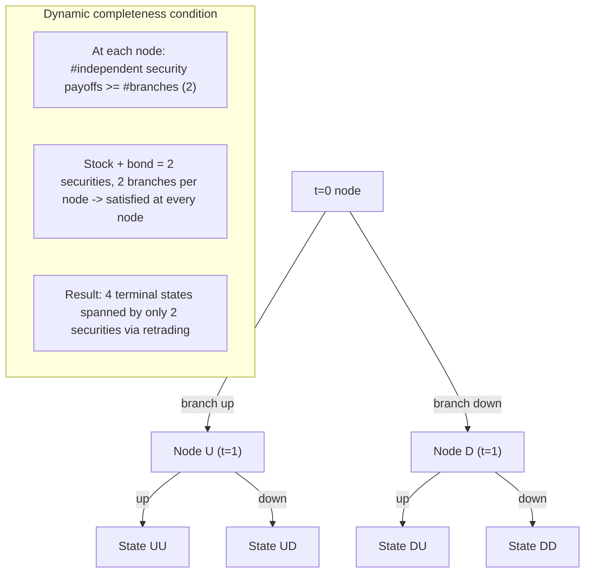

## Market completeness and asset span

### Definition and Formal Setup

Consider a two-period economy with uncertainty resolved at $t=1$, with finite state space $S = \{1, \dots, S\}$. There are $J$ traded financial securities, each characterized by a payoff vector across states. Security $j$ pays $r_j(s)$ units of the consumption good in state $s$. Collect these into the $S \times J$ **payoff matrix**:

$$R = \begin{pmatrix} r_1(1) & r_2(1) & \cdots & r_J(1) \\ r_1(2) & r_2(2) & \cdots & r_J(2) \\ \vdots & \vdots & \ddots & \vdots \\ r_1(S) & r_2(S) & \cdots & r_J(S) \end{pmatrix}$$

The **asset span** is the set of all state-contingent payoff vectors that can be constructed as portfolios of the traded securities:

$$\langle R \rangle \equiv \{ x \in \mathbb{R}^S : x = R\theta \text{ for some } \theta \in \mathbb{R}^J \}$$

This is the column space (image) of $R$, a linear subspace of $\mathbb{R}^S$ of dimension $\text{rank}(R) \le \min(J,S)$.

**Definition (Market Completeness)**: Markets are **complete** if $\langle R \rangle = \mathbb{R}^S$, i.e., $\text{rank}(R) = S$. Equivalently, every possible state-contingent claim is attainable by some portfolio of traded securities. Markets are **incomplete** if $\text{rank}(R) < S$.

**Key Points**

- Completeness is a property of the *span* of $R$, not of the raw count $J$ of securities. Having $J \ge S$ securities is *necessary* but not *sufficient* for completeness — if two securities are redundant (linearly dependent payoffs), effective spanning dimension is reduced.
- Completeness depends only on $\text{rank}(R)$, not on which specific basis of securities generates that span — any two security structures with the same column space support identical attainable consumption sets (though not necessarily identical prices for the same nominal security, since prices depend on which specific payoff is being priced).

### Rank Condition and the Spanning Test

A practical test for completeness: compute $\text{rank}(R)$ via Gaussian elimination or by checking $\det(R^\top R) \neq 0$ when $J \ge S$ (equivalently, checking that no non-trivial linear combination of columns produces the zero vector). If $J = S$ and $\det(R) \neq 0$, the square payoff matrix is invertible and markets are trivially complete, with the unique replicating portfolio for any target payoff $x$ given by:

$$\theta = R^{-1} x$$

If $J > S$, redundant securities exist whenever $\text{rank}(R) < J$; the excess $J - \text{rank}(R)$ represents redundant assets whose payoffs are linear combinations of others already spanning the same subspace.

If $J < S$, completeness is mechanically impossible regardless of the specific payoffs chosen, since $\text{rank}(R) \le J < S$.

**Example**: Two states $S=\{1,2\}$, two securities:

- Security 1 (risk-free bond): $r_1 = (1,1)^\top$
- Security 2 (risky stock): $r_2 = (2,1)^\top$

$$R = \begin{pmatrix} 1 & 2 \\ 1 & 1 \end{pmatrix}, \quad \det(R) = 1(1) - 2(1) = -1 \neq 0$$

Markets are complete. To replicate an Arrow security paying $(1,0)^\top$ (pays 1 in state 1, 0 in state 2):

$$\theta = R^{-1}\begin{pmatrix}1\\0\end{pmatrix} = \frac{1}{-1}\begin{pmatrix}1 & -2\\-1 & 1\end{pmatrix}\begin{pmatrix}1\\0\end{pmatrix} = \frac{1}{-1}\begin{pmatrix}1\\-1\end{pmatrix} = \begin{pmatrix}-1\\1\end{pmatrix}$$

Check: $-1 \cdot (1,1) + 1 \cdot (2,1) = (-1+2, -1+1) = (1,0)$. ✓ Short one bond, long one stock replicates the pure Arrow-1 security.

### Redundant Securities and Linear Dependence

A security $j$ is **redundant** if its payoff column $r_j$ lies in the span of the other columns, i.e., $r_j = \sum_{k \neq j} \alpha_k r_k$ for some scalars $\alpha_k$. Redundant securities:

- Do not expand the asset span or improve risk-sharing.
- Must be priced by **no-arbitrage** as the same linear combination of the other securities' prices: $q_j = \sum_{k\neq j} \alpha_k q_k$, otherwise an arbitrage opportunity exists (buy the cheap combination, sell the expensive one).
- Are common in practice: e.g., a portfolio of a call and a put at the same strike, combined with a bond, redundantly replicates the underlying stock (put-call parity), so among {stock, call, put, bond} at most 3 are independent.

**Key Points**

- Identifying redundancy is equivalent to finding the null space of $R^\top$ (left null space) or checking rank deficiency directly.
- In real markets, redundant securities (e.g., options replicable by dynamic trading in the underlying) are priced via **relative pricing** / no-arbitrage arguments (this is the logic underlying Black-Scholes: the option's price is pinned down by the replicating portfolio, not by separate preference-based reasoning).

### Degrees of Market Incompleteness

The **degree of incompleteness** can be measured as $S - \text{rank}(R)$, the codimension of the asset span within $\mathbb{R}^S$. This has direct economic content:

- $S - \text{rank}(R) = 0$: complete markets, full risk-sharing attainable.
- $S - \text{rank}(R) = k > 0$: there exist $k$ linearly independent directions of risk that cannot be hedged by any portfolio — equivalently, the **orthogonal complement** of $\langle R \rangle$ in $\mathbb{R}^S$ (with respect to some inner product, often weighted by state probabilities) represents the "unspannable" or **idiosyncratic residual risk** relative to the traded securities.

**Formal characterization of unspanned risk**: A state-contingent payoff (or endowment risk) $y \in \mathbb{R}^S$ is **spanned** (hedgeable) if and only if $y \in \langle R \rangle$; equivalently, if and only if $y$ is orthogonal to every vector in the left null space of $R$ (i.e., every vector $\lambda$ such that $\lambda^\top R = 0$ also satisfies $\lambda^\top y = 0$). This is a direct application of the Fredholm alternative from linear algebra: $y \in \text{range}(R) \iff y \perp \ker(R^\top)$.

### Diagram: Asset Span as a Subspace (svg_diagram)

<svg xmlns="http://www.w3.org/2000/svg" viewBox="0 0 700 380">
<text x="350" y="26" text-anchor="middle" font-size="16" font-weight="bold" fill="#1a1a2e">Asset Span in State Space (svg_diagram)</text>

<text x="350" y="50" text-anchor="middle" font-size="12" fill="`#4a5568`">Case: S = 3 states, J = 2 independent securities (incomplete markets)</text>

<rect x="60" y="80" width="580" height="260" fill="#f7fafc" stroke="#cbd5e0" stroke-dasharray="4,3" />
<text x="80" y="100" font-size="12" fill="#4a5568">R³ (full state-contingent claim space)</text>
<polygon points="150,320 550,320 480,140 220,140" fill="#bee3f8" stroke="#2b6cb0" stroke-width="2" opacity="0.7" />
<text x="350" y="235" text-anchor="middle" font-size="13" font-weight="bold" fill="#1a365d">Asset Span &lt;R&gt;</text>
<text x="350" y="255" text-anchor="middle" font-size="11" fill="#1a365d">(2-dimensional plane)</text>
<text x="350" y="272" text-anchor="middle" font-size="11" fill="#1a365d">rank(R) = 2</text>
<line x1="350" y1="230" x2="440" y2="100" stroke="#c53030" stroke-width="2" marker-end="url(#arrow2)" />
<text x="460" y="100" font-size="12" fill="#c53030">Unspanned direction</text>
<text x="460" y="116" font-size="12" fill="#c53030">(unhedgeable risk)</text>
<circle cx="300" cy="200" r="4" fill="#1a1a2e" />
<text x="290" y="195" font-size="10" text-anchor="end">attainable payoff x = Rθ</text>

<text x="80" y="360" font-size="11" fill="`#4a5568`">Any endowment/claim vector off the shaded plane cannot be replicated by any portfolio θ.</text>

</svg>

### Nominal vs. Real Assets and Span Interaction with Prices

- **Real assets**: payoffs fixed in units of the consumption good (e.g., a bond promising 1 unit of wheat). The span $\langle R \rangle$ is fixed independent of the price level.
- **Nominal assets**: payoffs fixed in units of account (money) (e.g., a bond promising $1). The *real* payoff is $r_j(s)/p(s)$ where $p(s)$ is the state-$s$ price level, so the real asset span **depends on equilibrium prices** $p(s)$ themselves. This creates a fixed-point/circularity: whether markets are "really" complete depends on the endogenous price level, which is itself an equilibrium object.

**Key Points**

- With nominal assets and incomplete markets, this circularity is the root of the **Cass indeterminacy** result: the real equilibrium allocation can be indeterminate (a continuum of equilibria), because different price-level realizations across states change the effective real span without changing anything "real" about preferences or endowments.
- With real assets, no such indeterminacy arises generically — the Duffie-Shafer existence and generic-determinacy results apply.

### Span Completion via Derivative Securities

In practice, markets are often completed (or made "more complete") by introducing derivative securities whose payoffs are nonlinear functions of a small number of underlying factors. Classic result (Ross 1976; Breeden–Litzenberger 1978): a sufficiently rich set of **European options** at a continuum of strikes on a single underlying can, in the limit, span *any* payoff that is a function of the underlying's terminal value — effectively completing markets with respect to that single source of risk.

Formally, if the underlying can take $S$ distinct values at $t=1$, then $S-1$ options at distinct strikes (plus the underlying and a bond) generically suffice to span all payoffs that are functions of the underlying, because the **discrete second difference of option prices with respect to strike** recovers the (risk-neutral) state-price density:

$$p_s \propto \frac{C(K_{s-1}) - 2C(K_s) + C(K_{s+1})}{(\Delta K)^2}$$

where $C(K)$ is the price of a call option struck at $K$. This is the discrete analog of the **Breeden-Litzenberger formula** $\dfrac{\partial^2 C}{\partial K^2}\Big|_{K=s} \propto p(s)$, central to extracting risk-neutral densities from option prices.

**Key Points**

- This spanning result is *local* to risk driven by the single underlying; it does not span risks orthogonal to that underlying (e.g., idiosyncratic labor income risk uncorrelated with the traded asset).
- It underlies why real-world derivative markets (options, swaps, structured products) are viewed as *span-expanding* innovations relative to a base set of primitive securities (stocks and bonds).

### Dynamic Completeness: Spanning via Trading Strategies

In multi-period settings, markets can be **dynamically complete** even with very few securities traded at each date, provided agents can retrade at every node of the event tree.

**Definition**: Markets are dynamically complete if, for every terminal payoff $x(\omega)$ measurable with respect to the terminal information partition, there exists a **self-financing trading strategy** $\{\theta_t\}$ using only the $J$ available securities at each date such that the strategy's terminal value equals $x(\omega)$ almost surely.

**Necessary condition (event-tree branching)**: At every non-terminal node with $b$ immediate successor branches, the number of securities with linearly independent payoffs across those $b$ branches must be at least $b$. If this holds at every node, the tree is dynamically complete, even though the *total* number of terminal states $S$ may vastly exceed $J$.

**Canonical Example — Binomial Model**: At each node, the stock can go up or down (2 branches), and 2 securities (stock + risk-free bond) are traded. Since $2 \ge 2$ at every node, the binomial tree is dynamically complete for *any* number of periods, even though the number of terminal nodes grows as $2^n$. This is the discrete-time foundation of the **Cox-Ross-Rubinstein** option pricing model and, in the continuous-time limit, the **Black-Scholes-Merton** replication argument (where continuous trading in the stock and a risk-free bond dynamically spans the entire (uncountable) space of terminal payoffs consistent with the diffusion, provided volatility is non-degenerate).

### Span, Redundancy, and No-Arbitrage Pricing Interaction

When $R$ has redundant columns ($J > \text{rank}(R)$), the **no-arbitrage price** of any redundant security is uniquely determined by the prices of a spanning subset, via the linear pricing rule:

$$q = \Pi\, r$$

for some linear pricing functional $\Pi$ consistent with the primitive securities' prices. This is distinct from completeness: redundancy concerns *pricing determinacy for traded securities*, while completeness concerns *attainability of untraded claims*. A market can have redundant securities and still be incomplete (if $\text{rank}(R) < S$ even after removing redundant columns), or have no redundancy and still be incomplete (if $J = \text{rank}(R) < S$).

**Comparison Table: Completeness vs. Redundancy**

| Concept | Condition | Economic Meaning |
| --- | --- | --- |
| Complete markets | $\text{rank}(R) = S$ | Every state-contingent claim is attainable |
| Incomplete markets | $\text{rank}(R) < S$ | Some claims/risks cannot be hedged |
| Redundant security | $r_j \in \text{span}(\{r_k\}_{k\neq j})$ | Security $j$ adds no new span; priced by no-arbitrage from others |
| Non-redundant, still incomplete | $J = \text{rank}(R) < S$ | All securities independent, but too few relative to states |
| Dynamically complete | Branching condition holds at every tree node | Full terminal spanning via retrading, despite few securities per period |

### Economic Implications of Incompleteness for the Asset Span

- **Risk-sharing limits**: Agents cannot fully diversify away risk components orthogonal to $\langle R \rangle$; equilibrium consumption will co-move with these unspanned risks even for agents who would prefer full insurance (see the numerical example under Radner equilibrium, where a single risk-free bond cannot hedge relative-state endowment risk).
- **Non-uniqueness of state prices**: As shown in the no-arbitrage / Radner equilibrium discussion, when $\text{rank}(R) < S$, the set of state-price vectors $p \gg 0$ consistent with $q = R^\top p$ (no-arbitrage) is generically an affine space of dimension $S - \text{rank}(R)$, intersected with the positive orthant. This directly reflects span incompleteness: the pricing of any payoff not in $\langle R \rangle$ is not pinned down by no-arbitrage alone.
- **Welfare consequences**: As established by Geanakoplos-Polemarchakis, incomplete span generically implies constrained Pareto suboptimality of the competitive equilibrium relative to what a planner facing the *same* span (but not the same price-taking behavior) could achieve, due to pecuniary externalities.

**Related Topics**

- Radner equilibrium and sequential asset trading under uncertainty
- Arrow securities and the fundamental theorem of asset pricing
- No-arbitrage pricing and the stochastic discount factor
- Breeden-Litzenberger formula and risk-neutral density extraction from options
- Dynamic completeness and the Cox-Ross-Rubinstein binomial model
- Black-Scholes-Merton replication and continuous-time spanning
- Constrained Pareto suboptimality under incomplete markets (Geanakoplos-Polemarchakis)
- Cass indeterminacy with nominal assets
- Put-call parity and redundant security pricing
- Idiosyncratic risk and limits to diversification in incomplete-markets asset pricing