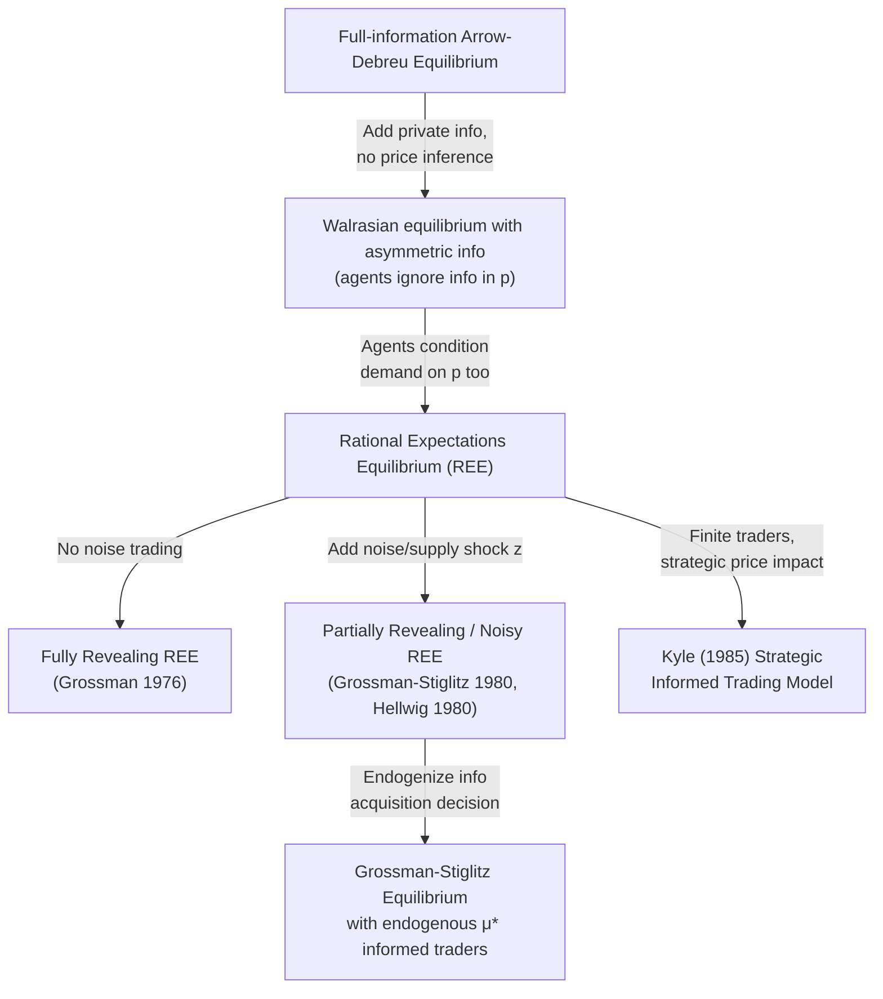

## Rational expectations equilibrium

### Overview and Motivation

Rational Expectations Equilibrium (REE) extends the Radner sequential-markets framework to environments in which agents possess **heterogeneous private information** about the true state of the world, and in which market-clearing **prices themselves may transmit information**. The central idea, formalized by Radner (1979) building on Muth's (1961) rational expectations hypothesis, is that agents condition their demand not only on their own private signal but also on what they can infer from observing equilibrium prices — and equilibrium requires that these inferences be *correct on average*, i.e., agents' conjectures about the price-generating mechanism must be consistent with the actual mapping from states to prices.

REE theory sits at the intersection of general equilibrium, information economics, and financial market microstructure, and is foundational for understanding **price informativeness**, **the value of information**, and paradoxes such as the **Grossman-Stiglitz impossibility of informationally efficient markets**.

### Formal Environment

**States and Signals**

Let $\omega \in \Omega$ denote the true (payoff-relevant) state of nature, drawn from a common prior distribution. There are $I$ agents, each receiving a private signal $s_i$ correlated with $\omega$ (e.g., $s_i = \omega + \varepsilon_i$ with idiosyncratic noise $\varepsilon_i$). Signals may also include a genuinely uninformative variable ("noise trading" or "supply shock") $z$ that prevents prices from being fully revealing.

**Demand Functions**

Each agent chooses demand $x_i(s_i, p)$ as a function of *both* their private signal $s_i$ and the observed equilibrium price $p$, maximizing conditional expected utility:

$$x_i(s_i, p) = \arg\max_{x} \; E\left[ u_i(\omega, x) \mid s_i, p \right]$$

Note the key structural feature: the conditioning set includes $p$ itself, so the agent's optimization requires a belief about how $p$ is generated as a function of the underlying state and other agents' signals — the **price-conjecture**.

**Definition (Rational Expectations Equilibrium)**: A REE is a price function $P: \Omega \times Z \to \mathbb{R}$ (mapping states and any noise/supply shocks to prices) and a collection of demand functions $\{x_i(\cdot,\cdot)\}$ such that:

1. **Individual optimality**: given the *conjectured* price function $P(\cdot)$, each $x_i(s_i, p)$ solves agent $i$'s conditional expected-utility maximization using the correct conditional distribution of $\omega$ given $(s_i, p)$ — where this conditional distribution is derived via Bayes' rule *using the true price function* $P$.
2. **Market clearing**: $\sum_i x_i(s_i, P(\omega, z)) = \bar{x}(z)$ (aggregate supply, possibly random) for every realization of $(\omega, z)$.
3. **Consistency (rational expectations)**: The conjectured price function used by agents in their Bayesian updating coincides with the actual equilibrium price function generated by market clearing — beliefs about the price-information mapping are self-fulfilling.

**Key Points**

- Condition 3 is what distinguishes REE from an ordinary competitive equilibrium with asymmetric information: in a naive Walrasian equilibrium, agents would condition demand *only* on their own signal $s_i$, ignoring any information content of $p$.
- The fixed-point nature of the definition (price function determines beliefs, beliefs determine demand, demand determines the price function) is the central technical and conceptual challenge in constructing REE.

### Types of REE: Fully Revealing vs. Partially Revealing

**Fully Revealing REE**: The equilibrium price function $P(\omega)$ is **invertible** in $\omega$ (holding other exogenous noise fixed, or in the absence of noise), so that observing $p$ allows every agent to perfectly infer $\omega$ (or the pooled information of all agents), regardless of their own private signal. In this case:

$$E[\omega \mid s_i, p] = E[\omega \mid p] = \omega \text{ (if fully revealing and } \omega \text{ is the object of interest)}$$

**Grossman (1976)** showed that in a broad class of models with a continuum of traders and no aggregate uncertainty, prices are generically fully revealing: the price aggregates the dispersed private information of *all* traders into a single sufficient statistic, exactly as if information were centralized (**Hayek's "price as a sufficient statistic" hypothesis**, formalized).

**Partially Revealing REE**: When there is a source of **noise** — commonly modeled as random aggregate supply/demand ("noise traders" or a random endowment shock $z$) — the equilibrium price is a *noisy* signal of the pooled information, since price movements confound genuine information shocks with supply/noise shocks. Formally, if $P(\omega, z)$ is not invertible with respect to $\omega$ alone (because $z$ also moves $p$), then observing $p$ yields a **garbled** signal of $\omega$, and $E[\omega \mid s_i, p] \neq \omega$ in general.

**Key Points**

- Noise trading is not merely a technical device — it plays the essential economic role of preventing full revelation, which is necessary to sustain any incentive to acquire costly private information (see Grossman-Stiglitz below).
- The degree of revelation (how close the equilibrium is to fully revealing) depends on the relative variance of the noise/supply shock versus the information shock — more noise-trading variance implies less revelation, higher risk premia for informed traders, and greater private incentives to acquire information.

### Canonical Model: Grossman-Stiglitz (1980) / Hellwig (1980) CARA-Normal Framework

The workhorse model uses **Constant Absolute Risk Aversion (CARA)** utility and **jointly normal** random variables, exploiting the tractability of Gaussian conditioning.

**Setup**:

- Risky asset with random payoff $\tilde{v} \sim N(\bar{v}, \sigma_v^2)$.
- Risk-free asset with return normalized to $0$ (or $r$).
- Fraction $\mu$ of traders are **informed**: each observes a private signal $s_i = \tilde{v} + \varepsilon_i$, $\varepsilon_i \sim N(0, \sigma_\varepsilon^2)$ i.i.d. across informed traders.
- Fraction $1-\mu$ are **uninformed**: observe only the price $p$.
- Random aggregate supply (noise): $\tilde{z} \sim N(\bar{z}, \sigma_z^2)$, independent of $\tilde{v}$ and all $\varepsilon_i$.
- All agents have CARA utility $u(W) = -e^{-\rho W}$ with common risk-aversion coefficient $\rho$.

**Informed trader's demand** (via CARA-normal certainty-equivalent formula):

$$x_I(s_i, p) = \frac{E[\tilde v \mid s_i, p] - p}{\rho\, \text{Var}[\tilde v \mid s_i, p]}$$

**Uninformed trader's demand**:

$$x_U(p) = \frac{E[\tilde v \mid p] - p}{\rho\, \text{Var}[\tilde v \mid p]}$$

**Conjectured linear price function**: Given the Gaussian-linear structure, one conjectures (and then verifies in equilibrium) that the price is an affine function of the average informed signal and the noise supply:

$$p = a + b\,\bar{s} + c\,\tilde z, \qquad \bar s \equiv \frac{1}{\mu}\int_0^\mu s_i \, di = \tilde v + \bar\varepsilon$$

By the Law of Large Numbers across the continuum of informed traders, idiosyncratic noise $\bar\varepsilon \to 0$, so effectively $\bar s = \tilde v$ and the price becomes a linear combination of the (unobserved) true value and the noise supply:

$$p = a + b\, \tilde v + c\, \tilde z$$

Since $p$ is an affine transformation of $(\tilde v, \tilde z)$, and $(\tilde v, \tilde z)$ are jointly normal with the uninformed agent's prior, standard normal-updating (projection) formulas give $E[\tilde v \mid p]$ and $\text{Var}[\tilde v \mid p]$ in closed form. Substituting the conjectured demand functions into market clearing and matching coefficients on $\tilde v$ and $\tilde z$ pins down $(a, b, c)$ — this coefficient-matching step is the standard solution technique for linear-Gaussian REE models.

**Key Points**

- The equilibrium price is generically **partially revealing**: it reveals a *garbled* version of $\tilde v$, with the garbling determined by the noise-to-signal ratio $\sigma_z/\sigma_\varepsilon$ (loosely — precise expressions involve the full variance-covariance structure).
- As $\sigma_z^2 \to 0$ (no noise trading), the price becomes fully revealing in the limit, and the model degenerates into the Grossman (1976) fully-revealing case.
- As $\mu \to 0$ (no informed traders) or $\sigma_\varepsilon^2 \to \infty$ (uninformative private signals), the price carries no information, and uninformed agents' beliefs equal the unconditional prior.

### The Grossman-Stiglitz Paradox

**Grossman and Stiglitz (1980), "On the Impossibility of Informationally Efficient Markets"**, formalizes a fundamental tension:

1. If information acquisition is costly (paying $c > 0$ to observe a private signal), and
2. If the equilibrium price were **fully revealing**, then
3. Uninformed traders could infer the same information as informed traders **for free** by observing $p$, so
4. No trader would pay the cost $c$ to become informed, so
5. In equilibrium, no one is informed, so
6. The price *cannot* be fully revealing (there is no information to reveal), which **contradicts** the premise in step (2).

**Resolution**: A **noisy rational expectations equilibrium** with an **endogenous fraction $\mu^*$ of informed traders** resolves the paradox. In equilibrium:

- The price is partially (not fully) revealing, due to noise trading, so informed traders retain an informational edge worth more than the cost of the edge itself, given the residual uncertainty they still bear.
- The equilibrium fraction $\mu^*$ of informed traders is determined by an **indifference condition**: the expected utility gain from being informed (net of the information cost $c$) equals the expected utility of remaining uninformed:

$$E[U_I(\mu^*)] - c = E[U_U(\mu^*)]$$

- This indifference condition is a fixed point in $\mu$: more informed traders → price is more informative → smaller informational advantage to being informed → but also fewer uninformed free-riders bidding away the returns to information. The equilibrium $\mu^*$ balances these forces.

**Key Points**

- The Grossman-Stiglitz paradox is often summarized as: **markets cannot be perfectly informationally efficient**, because if they were, no one would have an incentive to make them so (informed trading is what makes prices informative in the first place, and information gathering must be privately profitable to be undertaken).
- This result underlies the modern view of financial markets as *noisily* rather than *perfectly* efficient, providing the theoretical foundation for active-management/information-acquisition industries persisting in equilibrium.

### Diagram: Information Flow in Noisy REE (svg_diagram)

<svg xmlns="http://www.w3.org/2000/svg" viewBox="0 0 760 400">
<text x="380" y="26" text-anchor="middle" font-size="16" font-weight="bold" fill="#1a1a2e">Noisy Rational Expectations Equilibrium (svg_diagram)</text>
<rect x="30" y="60" width="180" height="70" rx="6" fill="#c6f6d5" stroke="#2f855a" />
<text x="120" y="90" text-anchor="middle" font-size="12" font-weight="bold">True value ṽ</text>
<text x="120" y="108" text-anchor="middle" font-size="11">(payoff-relevant state)</text>
<rect x="30" y="170" width="180" height="70" rx="6" fill="#fed7d7" stroke="#c53030" />
<text x="120" y="200" text-anchor="middle" font-size="12" font-weight="bold">Noise supply z̃</text>
<text x="120" y="218" text-anchor="middle" font-size="11">(random, uninformative)</text>
<rect x="30" y="280" width="180" height="70" rx="6" fill="#bee3f8" stroke="#2b6cb0" />
<text x="120" y="305" text-anchor="middle" font-size="12" font-weight="bold">Informed traders</text>
<text x="120" y="322" text-anchor="middle" font-size="11">observe sᵢ = ṽ + εᵢ</text>
<text x="120" y="338" text-anchor="middle" font-size="11">fraction μ, pay cost c</text>
<line x1="210" y1="95" x2="330" y2="180" stroke="#2f855a" stroke-width="2" marker-end="url(#a3)" />
<line x1="210" y1="205" x2="330" y2="195" stroke="#c53030" stroke-width="2" marker-end="url(#a3)" />
<line x1="210" y1="315" x2="330" y2="220" stroke="#2b6cb0" stroke-width="2" marker-end="url(#a3)" />
<rect x="340" y="150" width="200" height="100" rx="8" fill="#fefcbf" stroke="#b7791f" stroke-width="2" />
<text x="440" y="185" text-anchor="middle" font-size="13" font-weight="bold">Equilibrium price</text>
<text x="440" y="203" text-anchor="middle" font-size="12">p = a + bṽ + cz̃</text>
<text x="440" y="221" text-anchor="middle" font-size="11">Garbled signal of ṽ</text>
<text x="440" y="237" text-anchor="middle" font-size="11">(partially revealing)</text>
<line x1="540" y1="200" x2="620" y2="200" stroke="#4a5568" stroke-width="2" marker-end="url(#a3)" />
<rect x="620" y="160" width="120" height="80" rx="6" fill="#e9d8fd" stroke="#6b46c1" />
<text x="680" y="190" text-anchor="middle" font-size="12" font-weight="bold">Uninformed</text>
<text x="680" y="207" text-anchor="middle" font-size="11">traders</text>
<text x="680" y="224" text-anchor="middle" font-size="11">observe only p</text>

<text x="60" y="380" font-size="11" fill="`#4a5568`">If z̃ variance → 0: price fully reveals ṽ → Grossman-Stiglitz paradox binds.</text>

</svg>

### Value of Information and Comparative Statics

The **ex-ante value of private information** to an informed trader in the noisy REE is generally:

$$V(\mu) = E[U_I(\mu)] - E[U_U(\mu)]$$

which is **decreasing in $\mu$** (more informed competitors erode the informational rents of each individual informed trader, since the price becomes more revealing) — this negative feedback is what generates the interior equilibrium fraction $\mu^*$ solving $V(\mu^*) = c$.

**Comparative statics** [Inference — signs are standard results in this literature but specific magnitudes are model-parameter-dependent]:

- Higher noise variance $\sigma_z^2$ → less revealing prices → higher value of private information → higher equilibrium $\mu^*$ for a given cost $c$.
- Higher private signal precision ($1/\sigma_\varepsilon^2$) → more valuable information conditional on being informed → higher $\mu^*$.
- Higher information cost $c$ → lower $\mu^*$.
- Higher risk aversion $\rho$ → ambiguous effect in general, as it affects both the risk-bearing benefit of information and the equilibrium price-informativeness relationship.

### REE and the Efficient Markets Hypothesis

REE theory provides the rigorous microfoundation for the **Efficient Markets Hypothesis (EMH)** as originally articulated by Fama (1970), while simultaneously revealing its limits:

- **Weak-form efficiency** (prices reflect past prices) and **semi-strong efficiency** (prices reflect public information) are relatively unproblematic in REE — they do not require costly information acquisition to be consistent with equilibrium.
- **Strong-form efficiency** (prices reflect *all* information, including private) is exactly the case ruled out (in its literal, costless-arbitrage sense) by Grossman-Stiglitz: strong-form efficiency in a world with costly information is internally inconsistent as an equilibrium concept, unless information costs are zero.
- Modern empirical and theoretical finance treats markets as **efficient "up to the cost of information acquisition"** — prices are as informative as is consistent with informed traders earning normal (risk-adjusted, cost-adjusted) expected returns.

### Existence, Uniqueness, and Technical Issues

**Existence**: In the CARA-Normal linear framework, REE typically exists and is unique **within the class of linear (affine) price functions** conjectured — this is a standard "guess and verify" approach (posit a linear price function, derive implied demands and beliefs, verify market clearing pins down coefficients consistently). Existence of *nonlinear* REE, or non-existence in some parameter regions, is a subtler question addressed in the broader REE existence literature (e.g., Radner 1979 provides general existence results under more abstract informational structures, though often at the cost of a continuum of traders' negligible informational impact).

**Non-existence / non-implementability issues**:

- With a **finite number of traders**, each individual trader may (correctly) perceive that their own trade affects the price, undermining the price-taking assumption that underlies the simplest REE constructions — this motivates hybrid models blending REE with imperfect competition (e.g., **Kyle (1985)** models informed monopolistic trading against noise traders and a competitive market maker, which is a strategic alternative to the competitive-REE paradigm).
- **Non-existence of REE** can arise in some discrete-state, discrete-signal environments where no price function simultaneously satisfies market clearing and the consistency (rational expectations) requirement — existence is not guaranteed in full generality outside smooth parametric (typically Gaussian) settings.

### Diagram: REE vs Related Equilibrium Concepts

### Comparison Table: Key REE Variants

| Model / Concept | Information Structure | Price Revelation | Key Result |
| --- | --- | --- | --- |
| Radner (1979) general REE | Abstract private signals | Model-dependent | General existence under regularity conditions |
| Grossman (1976) | Private signals, no noise | Fully revealing | Price = sufficient statistic (Hayek hypothesis) |
| Grossman-Stiglitz (1980) | Private signals + noise trading | Partially revealing | Impossibility of costless full efficiency; endogenous $\mu^*$ |
| Hellwig (1980) | Finite informed traders, CARA-normal | Partially revealing | Extends GS to explicit finite-trader signal aggregation |
| Kyle (1985) | Single informed monopolist + noise + market maker | Partially revealing, strategic | Price impact and optimal trade-size smoothing (not competitive REE) |

### Applications in Financial Economics

- **Market microstructure**: REE models underlie the theoretical treatment of bid-ask spreads, price impact, and the informational role of trading volume.
- **Insider trading regulation**: The Kyle and Grossman-Stiglitz frameworks provide welfare analysis of insider information — informed trading improves price informativeness (a positive externality) but also imposes losses on uninformed/noise traders (a distributional cost), producing an ambiguous overall welfare ranking of insider trading restrictions. [Inference] The precise welfare ranking depends on modeling choices (identity and objective of noise traders, whether noise trading is itself welfare-relevant), and is actively debated rather than settled.
- **Analyst coverage and information intermediaries**: The endogenous-information-acquisition logic of Grossman-Stiglitz motivates models of financial analysts, credit rating agencies, and other information intermediaries as responses to the private returns to costly information production.
- **Central bank communication and macro-finance**: REE tools are used to study how asset prices respond to and reveal information about monetary policy and macroeconomic fundamentals, including "learning from prices" by policymakers themselves.

**Related Topics**

- Radner equilibrium and sequential trading under uncertainty
- Market completeness and asset span
- Grossman-Stiglitz paradox and endogenous information acquisition
- Kyle (1985) model of strategic informed trading
- CARA-Normal framework and Gaussian belief updating
- Efficient Markets Hypothesis: weak, semi-strong, and strong forms
- Noise trader models and market microstructure
- Breeden-Litzenberger and information in derivative prices
- Herding, cascades, and social learning in financial markets
- Hayek's price-as-information hypothesis and decentralized knowledge aggregation