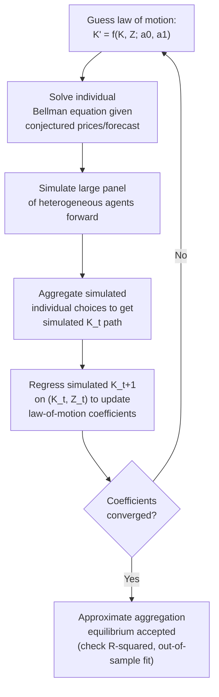

## Heterogeneous-agent asset pricing models

### Overview and Motivation

Heterogeneous-agent asset pricing models depart from the representative-agent paradigm by explicitly modeling a population of agents who differ in **endowments, income risk, preferences, beliefs, or market access**, and who trade with each other under (typically) incomplete markets. The central motivation is empirical: representative-agent consumption-based asset pricing (the standard CCAPM) badly fails to match observed asset-price moments — most famously the **equity premium puzzle** (Mehra-Prescott 1985) and the **risk-free rate puzzle** (Weil 1989) — because it requires implausibly high risk aversion to rationalize the historically observed equity premium given the low volatility of aggregate consumption growth.

Heterogeneous-agent models restore realism by allowing **idiosyncratic risk that cannot be fully insured away** (due to incomplete markets, as established in the Radner/market-completeness framework), generating amplified effective risk aversion, time-varying risk premia, and richer cross-sectional implications that a representative agent mechanically cannot produce, since aggregation (à la Gorman/Rubinstein) generally fails once markets are incomplete or preferences/beliefs are heterogeneous.

### Why Aggregation Fails: The Representative Agent Benchmark

**Gorman aggregation / Rubinstein (1974) conditions**: A representative agent exists (individual heterogeneity is irrelevant for aggregate asset prices) if and only if either:

1. Markets are **complete**, and all agents have preferences displaying **Hyperbolic Absolute Risk Aversion (HARA)** with the *same cautiousness parameter* (e.g., all CRRA with identical risk-aversion coefficient, or all agents have quadratic/CARA utility with matching parameters), **or**
2. A representative consumer can be constructed as a wealth-weighted aggregate under more restrictive joint conditions.

**Key Points**

- If markets are incomplete, individual consumption paths do not move in lockstep with aggregate consumption (agents bear un-hedged idiosyncratic risk), so the cross-sectional consumption distribution becomes a genuine state variable for pricing — this alone breaks representative-agent pricing even with identical CRRA preferences.
- If preferences differ (heterogeneous risk aversion, heterogeneous time preference, heterogeneous beliefs) even under complete markets, aggregation generally fails except in the HARA knife-edge case, because the wealth distribution across agents with different curvature becomes a state variable affecting the *aggregate* pricing kernel.
- This is why heterogeneous-agent models are intrinsically tied to the general equilibrium / incomplete markets material: incompleteness (limited asset span, per market-completeness analysis) is often the *specific mechanism* generating both the heterogeneity that matters and its persistence.

### Core Analytical Framework

**Environment**: $I$ agents, incomplete markets (typically only a risk-free bond and/or a limited set of assets), idiosyncratic labor income shocks $y_i(s^t)$ that are *not* fully insurable, aggregate endowment $Y(s^t) = \sum_i y_i(s^t)$ following an exogenous stochastic process.

**Agent's problem** (typical formulation, e.g., Bewley-Aiyagari-Huggett-style incomplete-markets consumption/savings with asset pricing overlay):

$$\max_{\{c_{i,t}, a_{i,t+1}\}} E_0 \sum_{t=0}^\infty \beta^t u(c_{i,t})$$

subject to

$$c_{i,t} + \sum_j q_{j,t} a_{i,t+1}^j \le y_{i,t} + \sum_j (q_{j,t} + d_{j,t})\, a_{i,t}^j$$

and a **borrowing/short-sale constraint** $a_{i,t+1}^j \ge \underline{a}^j$ (often a natural or ad-hoc borrowing limit), which is the standard device (Bewley 1986; Huggett 1993; Aiyagari 1994) preventing agents from using debt to fully self-insure against idiosyncratic risk — this constraint interacting with market incompleteness is precisely what sustains a nondegenerate wealth/consumption distribution in the stationary equilibrium.

**Key Points**

- Without a borrowing constraint (and with a complete set of Arrow securities), agents could achieve full risk-sharing via state-contingent trade even with idiosyncratic income risk — it is the *combination* of incomplete markets (missing insurance against idiosyncratic shocks) and borrowing limits (preventing self-insurance substitutes) that generates persistent heterogeneity.
- The stationary cross-sectional distribution of wealth/consumption $\Phi(a, y)$ becomes an equilibrium object and, in models with aggregate risk, an aggregate state variable affecting prices (this is the "distribution as a state variable" problem central to the Krusell-Smith literature).

### Pricing Kernel Under Incomplete Risk-Sharing

With incomplete markets, each agent's Euler equation for the risk-free bond (or any traded asset) holds **individually**, but agents' marginal utility growth rates need not be equalized across agents (unlike under complete markets, where $u'(c_i)/u'(c_j)$ is constant across states):

$$q_{f,t} = \beta\, E_t\!\left[\frac{u'(c_{i,t+1})}{u'(c_{i,t})}\right] \quad \text{for every agent } i \text{ (interior solution)}$$

The equilibrium **stochastic discount factor (SDF)** for pricing any traded asset can be represented using *any* individual agent's marginal rate of substitution (for agents with interior, unconstrained positions), but critically, this SDF now depends on **individual, not aggregate**, consumption growth:

$$q_{j,t} = E_t\left[\beta \frac{u'(c_{i,t+1})}{u'(c_{i,t})}\, r_{j,t+1}\right]$$

Since $c_{i,t+1}/c_{i,t}$ (individual consumption growth) is more volatile than $C_{t+1}/C_t$ (aggregate consumption growth) whenever idiosyncratic risk is imperfectly shared, the SDF constructed from individual consumption growth can be substantially more volatile than the representative-agent SDF built from aggregate consumption — directly attacking the **Hansen-Jagannathan bound** shortfall that underlies the equity premium puzzle.

**Key Points**

- This mechanism is the essence of the **Constantinides-Duffie (1996)** result: they construct an exactly-matching (by design) heterogeneous-agent economy where idiosyncratic income shocks are permanent, uninsurable, and countercyclically volatile (idiosyncratic risk rises in recessions), which *can generate any observed equity premium* for a given, arbitrarily low, level of individual risk aversion — a pure existence/possibility result illustrating the mechanism's power, not necessarily a claim that this exact process is empirically the one operating.
- The *conditional cross-sectional volatility and skewness of idiosyncratic consumption growth*, especially its cyclicality (countercyclical idiosyncratic risk — worse idiosyncratic shocks correlate with aggregate downturns), is the key sufficient statistic connecting heterogeneity to the risk premium in these models.

### Diagram: Mechanism Linking Idiosyncratic Risk to Asset Prices (svg_diagram)

<svg xmlns="http://www.w3.org/2000/svg" viewBox="0 0 760 340">
<text x="380" y="24" text-anchor="middle" font-size="16" font-weight="bold" fill="#1a1a2e">Idiosyncratic Risk to Risk Premium (svg_diagram)</text>
<rect x="20" y="60" width="180" height="70" rx="6" fill="#c6f6d5" stroke="#2f855a" />
<text x="110" y="88" text-anchor="middle" font-size="12" font-weight="bold">Incomplete markets</text>
<text x="110" y="106" text-anchor="middle" font-size="11">+ borrowing limits</text>
<text x="110" y="122" text-anchor="middle" font-size="11">(market-span deficiency)</text>
<line x1="200" y1="95" x2="290" y2="95" stroke="#4a5568" stroke-width="2" marker-end="url(#a4)" />
<rect x="300" y="60" width="180" height="70" rx="6" fill="#bee3f8" stroke="#2b6cb0" />
<text x="390" y="88" text-anchor="middle" font-size="12" font-weight="bold">Uninsured idiosyncratic</text>
<text x="390" y="106" text-anchor="middle" font-size="11">income/consumption risk</text>
<text x="390" y="122" text-anchor="middle" font-size="11">(countercyclical variance)</text>
<line x1="480" y1="95" x2="570" y2="95" stroke="#4a5568" stroke-width="2" marker-end="url(#a4)" />
<rect x="580" y="60" width="160" height="70" rx="6" fill="#fed7d7" stroke="#c53030" />
<text x="660" y="88" text-anchor="middle" font-size="12" font-weight="bold">Volatile individual</text>
<text x="660" y="106" text-anchor="middle" font-size="11">SDF (m_i)</text>
<text x="660" y="122" text-anchor="middle" font-size="11">exceeds aggregate SDF</text>
<line x1="660" y1="130" x2="660" y2="180" stroke="#4a5568" stroke-width="2" marker-end="url(#a4)" />
<rect x="500" y="190" width="240" height="90" rx="6" fill="#fefcbf" stroke="#b7791f" />
<text x="620" y="215" text-anchor="middle" font-size="12" font-weight="bold">Higher equity premium</text>
<text x="620" y="233" text-anchor="middle" font-size="11">rationalized at LOW individual</text>
<text x="620" y="249" text-anchor="middle" font-size="11">risk aversion coefficients</text>
<text x="620" y="265" text-anchor="middle" font-size="11">(Constantinides-Duffie 1996)</text>

<text x="60" y="300" font-size="11" fill="`#4a5568`">Contrast: representative-agent CCAPM needs implausibly high risk aversion (Mehra-Prescott puzzle)</text>

</svg>

### Key Model Families

**1. Bewley-Aiyagari-Huggett Incomplete-Markets Models**

- Focus: stationary wealth/consumption distributions under idiosyncratic income risk with a single risk-free bond, borrowing constraints, and no aggregate risk (or later extended to include it).
- **Huggett (1993)**: endogenizes the risk-free rate in a pure-exchange economy with idiosyncratic endowment risk and a borrowing constraint, showing the equilibrium risk-free rate is *lower* than in a representative-agent economy — precautionary savings against uninsurable risk depresses the rate (the "risk-free rate puzzle" resolution mechanism).
- **Aiyagari (1994)**: production-economy extension with capital accumulation, showing incomplete markets and precautionary saving raise the aggregate capital stock relative to the complete-markets benchmark.

**2. Krusell-Smith (1998) Framework**

- Adds **aggregate risk** on top of idiosyncratic risk and incomplete markets — the central technical challenge being that the *entire cross-sectional wealth distribution* is, in principle, a state variable for individual decision rules and for prices.
- **Key finding (approximate aggregation)**: despite substantial wealth heterogeneity, aggregate quantities (and to a good approximation, prices) can often be well-forecast using only a *few moments* of the wealth distribution (typically just the mean), because individual savings rates are close to linear in wealth for the bulk of the distribution — this "approximate aggregation" result is itself somewhat surprising and has generated a large subsequent literature probing its robustness (see below).
- Solution method: agents forecast future prices/aggregate capital using a low-dimensional "law of motion" for the aggregate state (e.g., $\log K' = a_0 + a_1 \log K$ during expansions/recessions), solve individual dynamic programming problems given this forecast, simulate the resulting economy, and iterate on the forecasting rule until it is consistent with simulated aggregate dynamics (fixed-point/iterative algorithm).

**3. Constantinides-Duffie (1996) Permanent Income Shocks Model**

- Idiosyncratic income shocks are **permanent** (not transitory) and **uninsurable**, with countercyclical cross-sectional variance.
- Delivers a stark **impossibility/possibility theorem**: for *any* target equity premium and risk-free rate path, there exists a specification of idiosyncratic income shock volatility that exactly replicates it, for arbitrarily low CRRA risk aversion — demonstrating the theoretical power of the mechanism, though the model is not disciplined by directly matching income-process moments to micro data in its baseline form. [Inference] Because the model is constructed to match asset prices by choice of the (unobserved, latent) idiosyncratic shock process, its scientific content lies primarily in the *qualitative mechanism* it isolates rather than in a fully independently-disciplined quantitative test.

**4. Heterogeneous Beliefs Models**

- Agents share the same information but hold **different priors or use different models** ("agree to disagree"), generating trade, speculative bubbles, and excess volatility even absent any informational asymmetry.
- **Harrison-Kreps (1978)**: with short-sale constraints and heterogeneous beliefs, asset prices can exceed *every* individual agent's own valuation (a **resale option value** / speculative premium), because each agent is willing to pay more than their own fundamental valuation, anticipating reselling to a more optimistic buyer later — an early, rigorous "bubble" mechanism distinct from irrationality.
- **Scheinkman-Xiong (2003)**: extends this to a continuous-time overconfidence model, generating bubbles, excess trading volume, and volatility clustering as equilibrium outcomes of heterogeneous, overconfident beliefs about a common signal.

**5. Heterogeneous Risk Aversion / Preferences Models**

- Agents differ in CRRA coefficients or time preference; even under complete markets, this breaks Gorman aggregation and generates **time-varying effective risk aversion of the "stand-in" pricing kernel**, since the consumption-share-weighted average risk tolerance shifts with the wealth distribution across states (wealthier-in-good-times low-risk-aversion agents dominate booms; more risk-averse agents' consumption share rises in busts) — this is sometimes framed as an equilibrium **"habit"-like or countercyclical risk-aversion effect** emerging endogenously from heterogeneity rather than assumed directly (cf. Campbell-Cochrane 1999 habit models, which assume time-varying risk aversion directly rather than deriving it from heterogeneity).

**6. Limited Participation Models**

- A subset of agents (**"stockholders"**) participate in equity markets while others (**"non-stockholders"**) do not, due to fixed participation costs or institutional frictions.
- **Mankiw-Zeldes (1991), Vissing-Jørgensen (2002)**: shows stockholders' consumption growth is more volatile and more correlated with stock returns than aggregate consumption growth, so using *stockholder-only* consumption data in the standard Euler equation substantially improves the CCAPM's ability to match the equity premium without requiring implausible risk aversion — the representative-agent puzzle is partly an artifact of using aggregate (all-household) consumption data when the marginal, pricing-relevant investor is a stockholder with different (and more volatile) consumption dynamics.

### Comparison Table: Heterogeneous-Agent Model Families

| Model Family | Source of Heterogeneity | Market Structure | Primary Puzzle Addressed |
| --- | --- | --- | --- |
| Bewley/Aiyagari/Huggett | Idiosyncratic income risk | Incomplete (bond only), borrowing limit | Risk-free rate puzzle; wealth distribution |
| Krusell-Smith (1998) | Idiosyncratic + aggregate risk | Incomplete, borrowing limit | Business cycle dynamics with heterogeneity |
| Constantinides-Duffie (1996) | Permanent, countercyclical idiosyncratic shocks | Incomplete (by construction) | Equity premium puzzle (possibility result) |
| Harrison-Kreps / Scheinkman-Xiong | Heterogeneous beliefs | Short-sale constrained | Bubbles, excess volume/volatility |
| Heterogeneous risk aversion | Preference (curvature) heterogeneity | Complete or incomplete | Time-varying risk premia, countercyclical risk aversion |
| Limited participation | Fixed participation cost | Segmented markets | Equity premium via stockholder consumption |

### Solution Methods and Computational Considerations

**Stationary (no aggregate risk) models**: Solved via standard **incomplete-markets steady-state algorithms**:

1. Guess an interest rate $r$.
2. Solve each agent's dynamic programming problem (value function iteration or policy function iteration) given $r$.
3. Simulate or compute the stationary distribution $\Phi(a,y)$ via the implied policy functions (e.g., via the non-stochastic simulation / histogram method, or Monte Carlo simulation of a large panel).
4. Check the asset (bond) market-clearing condition $\int a\, d\Phi = 0$ (or $= K$ in a production economy); update $r$ and iterate to convergence (bisection or similar root-finding on excess asset demand).

**Models with aggregate risk (Krusell-Smith style)**:

1. Specify a finite-dimensional approximate "law of motion" for the aggregate state (e.g., mean capital $K$, aggregate productivity $Z$).
2. Solve individual dynamic programs treating this law of motion as the relevant forecast of future prices.
3. Simulate a large cross-section of agents forward using the individual policy functions to generate a time series for aggregate capital.
4. Re-estimate the law-of-motion coefficients by regressing simulated $K_{t+1}$ on $(K_t, Z_t)$.
5. Iterate steps 2-4 until the law-of-motion coefficients converge (fixed point) — convergence is typically fast, and the resulting forecasting rule (given the "approximate aggregation" result) usually has very high $R^2$ despite ignoring higher moments of the wealth distribution.

**Key Points**

- **Krueger-Kubler and den Haan (2010)** and related computational-comparison papers document that different numerical methods for solving Krusell-Smith-type models can produce meaningfully different results if not implemented carefully, especially regarding accuracy of the approximate law of motion far from the ergodic set — a recognized methodological concern in this literature. [Unverified] Specific quantitative discrepancies across methods are paper- and calibration-specific and are not summarized generically here.
- Modern extensions use global/projection methods, perturbation around the approximate-aggregation solution, or machine-learning-based function approximation (e.g., deep neural network policy function approximators) to handle the full distributional state more accurately when approximate aggregation is suspected to fail (e.g., models with occasionally binding constraints, large redistributive shocks, or heterogeneous-agent New Keynesian ("HANK") models used in macro-finance).

### Diagram: Solution Algorithm for Aggregate-Risk Heterogeneous-Agent Models

### Empirical Successes and Open Challenges

**Successes**:

- Substantially improves the model-implied Sharpe ratio / satisfies the Hansen-Jagannathan bound at lower, more plausible risk-aversion coefficients than representative-agent models.
- Matches cross-sectional facts on wealth/consumption inequality, precautionary saving, and the marginal propensity to consume (MPC) heterogeneity that representative-agent models cannot address by construction.
- Provides microfoundations connecting labor-income risk, unemployment risk, and asset markets — relevant for HANK models used in modern monetary macro-finance.

**Open challenges** [Inference/Speculation for the forward-looking framing, though the underlying critiques are well-documented in the literature]:

- Quantitatively matching the *level* and *time-series volatility* of the equity premium simultaneously with realistic (survey- or panel-data-estimated) idiosyncratic income risk processes remains demanding; models often require specific assumptions (e.g., countercyclical idiosyncratic risk, particular tail behavior) not always independently verified in the income-process literature used for calibration.
- The tension between "approximate aggregation" (simplifying computation) and the economically important cases where distributional details matter most (financial crises, large redistributive fiscal/monetary shocks) is an active research area, particularly in HANK models.
- Robustly identifying whether heterogeneous beliefs, heterogeneous risk-sharing frictions, or limited participation is the *quantitatively dominant* mechanism (versus a combination) for any given puzzle remains a live empirical question, since several mechanisms can generate qualitatively similar comparative statics.

**Related Topics**

- Radner equilibrium and sequential trading under uncertainty
- Market completeness and asset span
- Equity premium puzzle and risk-free rate puzzle (Mehra-Prescott, Weil)
- Bewley-Aiyagari-Huggett incomplete-markets models
- Krusell-Smith method and approximate aggregation
- Constantinides-Duffie uninsurable idiosyncratic risk model
- Harrison-Kreps and Scheinkman-Xiong belief-heterogeneity bubble models
- Limited stock market participation (Mankiw-Zeldes, Vissing-Jørgensen)
- Heterogeneous-Agent New Keynesian (HANK) models
- Gorman aggregation and representative-agent existence conditions