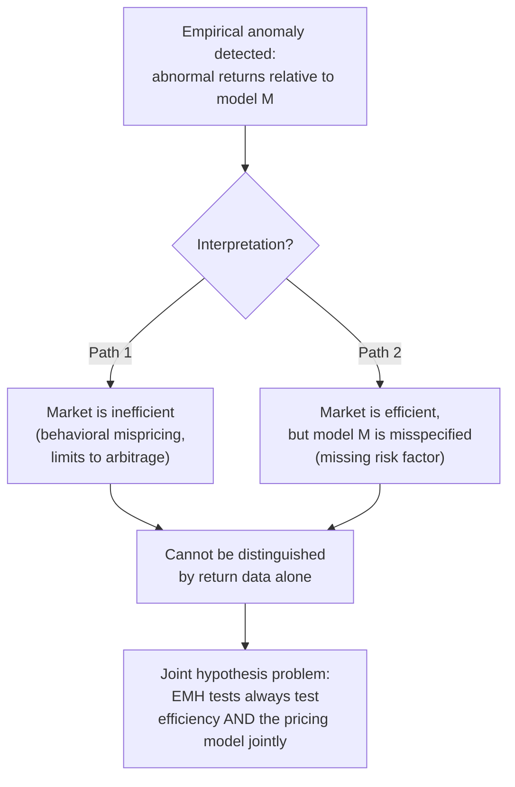

## Weak, semi-strong, and strong form efficiency

### Overview and Definitions

Fama (1970) formalized the **Efficient Markets Hypothesis (EMH)** by proposing a taxonomy of three nested informational efficiency levels, distinguished by the **information set** that asset prices are hypothesized to "fully reflect." A market is efficient with respect to an information set $\Phi_t$ if it is impossible to earn risk-adjusted excess (abnormal) returns by trading on the basis of $\Phi_t$ — equivalently, prices already incorporate all information in $\Phi_t$, so that information provides no exploitable trading edge net of appropriate risk adjustment and transaction costs.

The three forms are defined by successively larger information sets:

| Form | Information Set $\Phi_t$ | Claim |
| --- | --- | --- |
| Weak-form | Past prices and trading volume (historical market data) | Technical analysis cannot generate abnormal returns |
| Semi-strong-form | All *publicly available* information (weak-form set + public news, financial statements, announcements) | Fundamental analysis of public information cannot generate abnormal returns |
| Strong-form | *All* information, including private/insider information | No information, public or private, allows abnormal returns |

**Key Points**

- Each form is **nested**: strong-form efficiency implies semi-strong-form efficiency, which implies weak-form efficiency (since each larger information set contains the previous one, if prices reflect the larger set they automatically reflect the smaller subset).
- "Abnormal return" is always defined **relative to a specific asset-pricing model** (e.g., CAPM, Fama-French three/five-factor) that specifies the required/expected return given risk — EMH tests are therefore inescapably **joint tests** of market efficiency *and* the assumed pricing model (the **joint hypothesis problem**, discussed below).

### Weak-Form Efficiency

**Definition**: Current prices fully reflect all information contained in the historical sequence of prices (and volume). Consequently, **technical analysis** — trading strategies based on patterns in past price/volume data (moving averages, chart patterns, momentum indicators derived purely from price history) — cannot generate risk-adjusted abnormal returns.

**Formal characterization**: Weak-form efficiency is closely associated with (though not strictly identical to) the hypothesis that prices follow a **random walk** or, more generally, a **martingale** with respect to the price-history information set:

$$E[p_{t+1} \mid \Phi_t^{\text{prices}}] = p_t \quad \text{(martingale, in the absence of a risk premium)}$$

or, allowing for a risk-adjusted expected return $\mu$:

$$E[r_{t+1} \mid \Phi_t^{\text{prices}}] = \mu \quad \text{(constant or risk-model-implied expected return)}$$

**Distinction between random walk and martingale**: A random walk requires that price *changes* be independently and identically distributed (a strong assumption ruling out any time-varying volatility or serial dependence beyond the mean). A martingale only requires the *conditional mean* of future prices/returns to be unpredictable from past prices — it is entirely consistent with time-varying volatility (e.g., GARCH-type volatility clustering) as long as the conditional *mean* return is unpredictable. Since volatility clustering is a well-documented empirical regularity in most asset return series, the **martingale** formulation is the theoretically appropriate and generally used benchmark for weak-form efficiency, not the stricter i.i.d. random walk.

**Empirical Testing Approaches**:

- **Serial correlation tests**: testing whether $\text{Corr}(r_t, r_{t-k}) = 0$ for various lags $k$; statistically significant autocorrelation (positive = momentum, negative = mean-reversion) would violate weak-form efficiency if economically exploitable net of transaction costs.
- **Runs tests**: testing whether the sequence of positive/negative return signs shows more or fewer "runs" (consecutive same-sign returns) than expected under randomness.
- **Variance ratio tests** (Lo-MacKinlay 1988): testing whether the variance of $k$-period returns grows linearly in $k$ (as required under a pure random walk); deviations indicate predictable transitory or persistent components.
- **Technical trading rule backtests**: directly testing whether rules like moving-average crossovers generate returns exceeding a buy-and-hold benchmark after transaction costs and risk adjustment (Brock-Lakonishok-LeBaron 1992).

**Documented anomalies challenging strict weak-form efficiency**:

- **Momentum** (Jegadeesh-Titman 1993): stocks with high returns over the past 3-12 months tend to continue outperforming over the subsequent 3-12 months — a pattern based purely on past price data, in apparent tension with weak-form efficiency (though it may instead reflect a missing risk factor or behavioral underreaction, per the joint-hypothesis caveat).
- **Long-horizon reversal** (De Bondt-Thaler 1985): stocks with poor returns over 3-5 years tend to subsequently outperform ("winner-loser" reversal), suggestive of overreaction.
- [Inference] Whether these patterns represent genuine violations of weak-form market efficiency, compensation for an omitted risk factor, or artifacts of data-snooping/multiple testing is actively and unsettledly debated in the empirical asset pricing literature; this remains a canonical illustration of the joint-hypothesis problem in practice.

### Semi-Strong-Form Efficiency

**Definition**: Prices fully and rapidly reflect all **publicly available** information, including historical prices (weak-form set) *plus* published financial statements, earnings announcements, macroeconomic data releases, analyst reports, merger announcements, dividend/split announcements, and any other public news. Consequently, **fundamental analysis** based on publicly available information cannot generate abnormal returns, and any new public information should be incorporated into price essentially **instantaneously** upon release.

**Primary Empirical Methodology: Event Studies**

The **event study** methodology (Fama-Fisher-Jensen-Roll 1969; Ball-Brown 1968; MacKinlay 1997 survey) is the workhorse empirical tool for testing semi-strong efficiency:

1. Identify an event date $\tau=0$ (e.g., earnings announcement, stock split, merger announcement) across a large sample of firms.
2. Estimate an expected ("normal") return model for each firm using a pre-event estimation window (e.g., market model: $r_{i,t} = \alpha_i + \beta_i r_{m,t} + \varepsilon_{i,t}$, estimated over $t \in [-250, -30]$ relative to the event).
3. Compute **abnormal returns** in the event window: $AR_{i,t} = r_{i,t} - (\hat\alpha_i + \hat\beta_i r_{m,t})$.
4. Aggregate across firms and time into **Cumulative Abnormal Returns (CAR)**: $CAR_i(t_1, t_2) = \sum_{t=t_1}^{t_2} AR_{i,t}$, and average across the sample: $\overline{CAR}(t_1,t_2) = \frac{1}{N}\sum_i CAR_i(t_1,t_2)$.
5. Test statistical significance of $\overline{CAR}$ around the event date, and — critically for the efficiency question — examine whether $CAR$ **stabilizes immediately** after the event (consistent with instantaneous incorporation) or exhibits **post-event drift** (a violation).

**Formula for standard event-study test statistic** (simplified, cross-sectional):

$$t\text{-stat} = \frac{\overline{CAR}(t_1,t_2)}{\hat\sigma(\overline{CAR})/\sqrt{N}}$$

**Documented anomalies challenging strict semi-strong efficiency**:

- **Post-Earnings-Announcement Drift (PEAD)** (Ball-Brown 1968; Bernard-Thomas 1989): stocks with positive earnings surprises continue to earn abnormal positive returns for several months *after* the announcement (and vice versa for negative surprises) — a slow, gradual price adjustment to *already-public* information, in direct tension with the "instantaneous incorporation" requirement of semi-strong efficiency.
- **Value/growth (book-to-market) effect** (Fama-French 1992): high book-to-market ("value") stocks earn higher average returns than low book-to-market ("growth") stocks, based purely on publicly available accounting data — debated as either a risk-based anomaly (proxying for distress risk, rationalized within the Fama-French three-factor model) or a genuine mispricing (behavioral overextrapolation, per Lakonishok-Shleifer-Vishny 1994).
- **Size effect** (Banz 1981): small-capitalization stocks have historically earned higher average returns than predicted by CAPM beta alone.
- **Accruals anomaly** (Sloan 1996): firms with high accruals (relative to cash flow) subsequently underperform, suggesting the market does not fully unpack publicly disclosed accounting information.

### Strong-Form Efficiency

**Definition**: Prices fully reflect **all** information, public *and* private (including material non-public/insider information). Under strong-form efficiency, even corporate insiders with access to confidential material information could not earn abnormal risk-adjusted returns trading on it.

**Empirical evidence**: Strong-form efficiency is generally regarded as **empirically rejected** — the most direct evidence comes from studies of legally-reported **insider trading**:

- **Jaffe (1974), Seyhun (1986)**: studies of SEC-reported insider transactions find that corporate insiders (officers, directors, large shareholders) earn statistically and economically significant abnormal returns on their own-company trades, particularly for purchases, even using publicly reported (lagged, since insider trades must be disclosed) transaction data — implying insiders trade on genuine informational advantages not yet reflected in price.
- Studies of professional money managers, specialists (market makers with order-flow information), and analysts with superior access similarly find pockets of abnormal performance consistent with private-information advantages, though the *persistence* and *magnitude* of such advantages (especially after fees, for public mutual funds) is a separate and more contested empirical question (see Jensen 1968; Carhart 1997 on mutual fund performance persistence, generally finding limited persistence net of fees for the *average* fund).

**Key Points**

- Strong-form efficiency's empirical rejection is precisely what motivates **insider trading laws**: if markets were strong-form efficient, insider trading regulation would be pointless (no exploitable advantage would exist to regulate). The very existence and enforcement of such laws is implicit evidence that regulators (and the legislative process) do not believe strong-form efficiency holds.
- This connects directly to the **rational expectations equilibrium / Grossman-Stiglitz** framework: strong-form efficiency in the presence of *costly* information acquisition is theoretically impossible in equilibrium (per the Grossman-Stiglitz paradox) — if strong-form efficiency held perfectly and costlessly, no one would have incentive to gather the private information whose absorption into price is what strong-form efficiency presupposes.

### Diagram: Nested Information Sets and Efficiency Forms (svg_diagram)

<svg xmlns="http://www.w3.org/2000/svg" viewBox="0 0 700 380">
<text x="350" y="26" text-anchor="middle" font-size="16" font-weight="bold" fill="#1a1a2e">Nested EMH Information Sets (svg_diagram)</text>
<ellipse cx="350" cy="220" rx="320" ry="140" fill="#fed7d7" stroke="#c53030" stroke-width="2" opacity="0.5" />
<text x="350" y="90" text-anchor="middle" font-size="13" font-weight="bold" fill="#822727">Strong-form</text>
<text x="350" y="106" text-anchor="middle" font-size="11" fill="#822727">(public + private/insider info)</text>
<ellipse cx="350" cy="240" rx="230" ry="105" fill="#bee3f8" stroke="#2b6cb0" stroke-width="2" opacity="0.6" />
<text x="350" y="150" text-anchor="middle" font-size="13" font-weight="bold" fill="#1a365d">Semi-strong-form</text>
<text x="350" y="166" text-anchor="middle" font-size="11" fill="#1a365d">(all public information)</text>
<ellipse cx="350" cy="260" rx="140" ry="70" fill="#c6f6d5" stroke="#2f855a" stroke-width="2" opacity="0.7" />
<text x="350" y="255" text-anchor="middle" font-size="13" font-weight="bold" fill="#22543d">Weak-form</text>
<text x="350" y="271" text-anchor="middle" font-size="11" fill="#22543d">(past prices, volume)</text>

<text x="350" y="360" text-anchor="middle" font-size="11" fill="`#4a5568`">Each outer form nests and implies the inner forms if it holds</text>

</svg>

### The Joint Hypothesis Problem

**Fama (1991)** himself emphasized that market efficiency is **never directly testable in isolation** — every empirical test of the EMH is jointly a test of:

1. Market efficiency (prices reflect information as hypothesized), **and**
2. The specific asset-pricing (equilibrium expected-return) model used to define "abnormal" returns (e.g., CAPM, Fama-French three-factor, five-factor, or a behavioral alternative).

Consequently, when an empirical anomaly is documented (e.g., momentum, PEAD), there are always at least two logically available interpretations:

- **(a) Market inefficiency**: prices genuinely fail to reflect available information rationally (a behavioral/limits-to-arbitrage explanation).
- **(b) Model misspecification**: the market is efficient, but the reference asset-pricing model used to compute "abnormal" returns is wrong or omits a priced risk factor that happens to correlate with the anomaly variable (a risk-based explanation).

No purely statistical test of realized returns can, by itself, definitively distinguish (a) from (b) — this is the irreducible **joint hypothesis problem**, and it is why apparently "settled" anomalies (value, momentum, size, accruals) remain subjects of ongoing methodological and theoretical dispute across the risk-based versus behavioral camps in empirical asset pricing.

**Key Points**

- This problem does *not* mean efficiency is untestable in any useful sense — strong and consistent evidence (e.g., insider trading profits, robust and pervasive post-event drift across many event types and time periods) shifts the balance of evidence, even without a single decisive test.
- The joint-hypothesis problem is the primary reason the EMH debate has evolved from "is the market efficient? yes/no" toward more nuanced questions about the **magnitude, persistence, and economic exploitability (net of costs and risk) of specific predictable patterns**, and toward developing better asset-pricing models (multi-factor models, behavioral models) as the relevant frontier of debate.

### Diagram: Joint Hypothesis Problem Logic

### Limits to Arbitrage and Reconciliation

The behavioral-finance literature (Shleifer-Vishny 1997, "The Limits of Arbitrage") offers a reconciling framework: even if mispricings (violations of semi-strong efficiency) exist and are known to sophisticated arbitrageurs, several frictions can prevent their rapid elimination:

- **Fundamental risk**: arbitrage positions are rarely riskless; mispricing can widen before it narrows (noise trader risk, De Long-Shleifer-Summers-Waldmann 1990).
- **Implementation costs**: short-sale constraints, transaction costs, and margin requirements limit arbitrageurs' capacity to trade against mispricing at scale.
- **Agency problems**: arbitrageurs (e.g., hedge fund managers) often manage other people's capital; if a position moves against them, they may face redemptions/withdrawals before the mispricing corrects ("arbitrageurs may be forced to unwind precisely when the opportunity looks best on paper" — a key mechanism in that literature), which can itself amplify rather than correct mispricing in the short run.

**Key Points**

- Limits-to-arbitrage theory does not claim markets are *inefficient* by assumption; rather, it identifies *why*, even in a world with rational, well-informed arbitrageurs, prices might persistently deviate from a naive full-information benchmark — providing a middle ground between pure EMH and pure behavioral mispricing narratives.

### Comparison Table: Summary of the Three Forms

| Feature | Weak-form | Semi-strong-form | Strong-form |
| --- | --- | --- | --- |
| Information set | Past prices/volume | + All public information | + Private/insider information |
| Who is "beaten" | Technical analysts | Fundamental analysts | Insiders |
| Primary test method | Serial correlation, variance ratios, runs tests | Event studies | Insider trading return studies |
| Key documented anomalies | Momentum, long-horizon reversal | PEAD, value effect, size effect, accruals anomaly | Documented insider trading profitability |
| General empirical verdict | Contested; some predictability exists but economic significance debated | Contested; robust anomalies exist, interpretation disputed (joint hypothesis) | Generally rejected — insiders earn abnormal returns |

### Applications and Practical Implications

- **Passive vs. active management debate**: semi-strong efficiency (if it approximately holds net of costs) underlies the case for low-cost index investing over actively-managed fundamental stock-picking, since the latter's costs are argued to exceed its (on average, across managers) ability to generate net-of-fee abnormal returns.
- **Regulatory design**: strong-form inefficiency (the empirical rejection) is the direct justification for insider trading laws, mandatory disclosure requirements (10-K/10-Q filings, Regulation Fair Disclosure), and disclosure-timing rules designed to accelerate the transition of private information into the public information set (moving information from the strong-form-only set into the semi-strong-accessible set).
- **Investment strategy design**: the anomaly literature underlies systematic "factor investing" (value, momentum, size, quality factors), which straddles the risk-based/behavioral divide — factor premia are marketed as compensation for risk by some providers and as behavioral mispricing capture by others, again reflecting the unresolved joint-hypothesis debate at the practitioner level.

**Related Topics**

- Rational expectations equilibrium and the Grossman-Stiglitz paradox
- Event study methodology and abnormal return estimation
- Post-earnings-announcement drift and underreaction models
- Fama-French three-factor and five-factor models
- Limits to arbitrage and noise trader risk (Shleifer-Vishny, De Long et al.)
- Behavioral finance: overreaction, underreaction, and investor sentiment
- Insider trading regulation and Regulation Fair Disclosure
- Momentum and long-term reversal anomalies
- Variance ratio tests and random walk hypothesis testing
- Factor investing and the risk-versus-mispricing debate