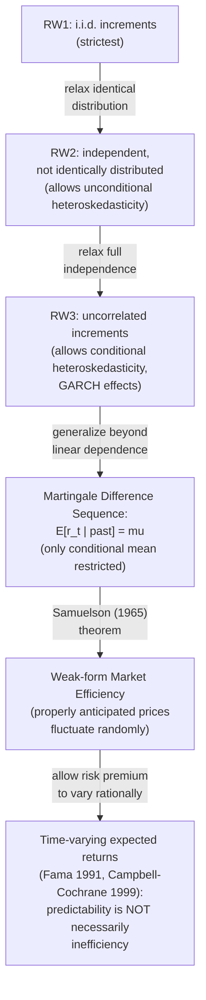

## The random walk hypothesis

### Definition and Historical Origins

The random walk hypothesis (RWH) posits that successive changes in asset prices are **independent and identically distributed (i.i.d.)**, such that past price movements contain no information useful for predicting future price movements. The concept traces to **Bachelier (1900)**, who modeled French government bond prices as Brownian motion in his doctoral thesis (predating and paralleling Einstein's independent 1905 physical derivation of Brownian motion), and was popularized in financial economics by **Kendall (1953)**, who empirically found stock and commodity price changes resembled a random series, and later formalized and connected to market efficiency by **Samuelson (1965)** and **Fama (1965, 1970)**.

**Formal definition**: A price series $p_t$ follows a random walk if:

$$p_t = p_{t-1} + \varepsilon_t, \qquad \varepsilon_t \overset{\text{i.i.d.}}{\sim} (0, \sigma^2)$$

where $\varepsilon_t$ is a mean-zero, i.i.d. innovation independent of all past information. Equivalently, in terms of returns $r_t = p_t - p_{t-1}$ (or log-returns $r_t = \ln p_t - \ln p_{t-1}$):

$$r_t \overset{\text{i.i.d.}}{\sim} (\mu, \sigma^2)$$

**Random Walk with Drift**: A more empirically relevant version allows a constant expected return $\mu \neq 0$:

$$p_t = \mu + p_{t-1} + \varepsilon_t$$

reflecting the fact that risky assets are expected to earn a positive risk premium on average, even while being unpredictable period-to-period around that average.

### The Three Forms of the Random Walk (Campbell-Lo-MacKinlay Taxonomy)

Campbell, Lo, and MacKinlay (1997, *The Econometrics of Financial Markets*) distinguish three progressively weaker/more general versions of the random walk hypothesis, which is important because the *strict* i.i.d. version is empirically far too restrictive to be a useful maintained hypothesis:

**RW1 — Independent and Identically Distributed Increments**:

$$r_t \overset{\text{i.i.d.}}{\sim} F(\mu, \sigma^2)$$

The strictest version: increments are drawn independently from the *same* distribution at every date. This rules out not just mean predictability but also **any** form of dependence, including time-varying volatility (heteroskedasticity), since i.i.d. requires identical distributions, not merely uncorrelated draws.

**RW2 — Independent, but not Identically Distributed Increments**:

$$r_t \text{ independent, but } \sigma_t^2 \text{ may vary over time}$$

Relaxes the identical-distribution requirement, permitting **unconditional heteroskedasticity** (e.g., a structural break or deterministic time-trend in volatility) while retaining full independence (no serial dependence in any moment, including higher moments and volatility clustering driven by past information).

**RW3 — Uncorrelated Increments (Weakest Form)**:

$$\text{Cov}(r_t, r_{t-k}) = 0 \text{ for all } k \neq 0, \quad \text{but } r_t \text{ may be dependent (not independent)}$$

The weakest and empirically most defensible version: only the **linear** (covariance) dependence is ruled out. This is fully consistent with dependence in higher conditional moments — most importantly, **conditional heteroskedasticity** (ARCH/GARCH-type volatility clustering, where large price changes tend to be followed by large price changes of unpredictable sign) — a well-documented empirical regularity in virtually all financial return series.

**Key Points**

- RW3 is the version most consistent with observed asset-return data and is essentially equivalent to the **martingale difference sequence (MDS)** property for returns: $E[r_t \mid \Phi_{t-1}] = \mu$ (constant conditional mean), which does *not* restrict $E[r_t^2 \mid \Phi_{t-1}]$ (conditional variance) to be constant.
- This distinction is precisely why the "random walk hypothesis" and "weak-form market efficiency" are related but **not identical** concepts: weak-form efficiency (unpredictability of the conditional mean return from past prices) is consistent with RW3 and does not require the strict i.i.d. RW1 version, which most empirical return series clearly violate (via volatility clustering) without necessarily implying market inefficiency.

### Random Walk vs. Martingale: A Critical Distinction

**Martingale property**: $E[p_{t+1} \mid \Phi_t] = p_t$ (or, for returns, $E[r_{t+1} \mid \Phi_t] = \mu$), where $\Phi_t$ is the full information set at time $t$ (not merely past prices).

$$\begin{array}{ll} \textbf{Random Walk (RW1)} & \textbf{Martingale} \\ \varepsilon_t \text{ i.i.d.} & E[\varepsilon_t \mid \Phi_{t-1}] = 0 \text{ only} \\ \text{Restricts all moments} & \text{Restricts only the conditional mean} \\ \text{Implies martingale} & \text{Does NOT imply random walk} \end{array}$$

A random walk is a special case of a martingale, but the converse does not hold — a martingale places no restriction on conditional variance, skewness, or any higher moment, only on the conditional first moment. Because volatility clustering is pervasive and well-documented (ARCH effects, per Engle 1982), the **martingale** formulation — not the strict random walk — is the theoretically appropriate and standard formalization underlying modern weak-form efficiency, as elaborated in the market-efficiency literature (Fama 1970; LeRoy 1989).

### Empirical Testing Methodologies

**1. Serial Correlation / Autocorrelation Tests**

Directly test whether $\rho_k = \text{Corr}(r_t, r_{t-k}) = 0$ for lags $k=1,2,\dots$. The sample autocorrelation estimator:

$$\hat\rho_k = \frac{\sum_{t=k+1}^T (r_t - \bar r)(r_{t-k} - \bar r)}{\sum_{t=1}^T (r_t - \bar r)^2}$$

is tested against the null $\rho_k=0$ using the Box-Pierce or Ljung-Box $Q$-statistic for joint significance across multiple lags:

$$Q_{LB} = T(T+2)\sum_{k=1}^m \frac{\hat\rho_k^2}{T-k} \sim \chi^2_m \text{ under the null}$$

**2. Variance Ratio Tests (Lo-MacKinlay 1988)**

A particularly influential test exploits the fact that, under RW1 (or RW3, with the appropriate correction), the variance of $q$-period returns should grow **linearly** in the holding period $q$:

$$\text{Var}(r_t(q)) = q \cdot \text{Var}(r_t)$$

where $r_t(q) = p_t - p_{t-q}$ is the $q$-period return. Define the **variance ratio**:

$$VR(q) = \frac{\text{Var}(r_t(q))/q}{\text{Var}(r_t(1))}$$

Under the random walk null, $VR(q) = 1$ for all $q$. Lo-MacKinlay derive the asymptotic distribution of $\widehat{VR}(q)$ under both homoskedastic (RW1) and heteroskedastic (RW3) null hypotheses, enabling a formal test statistic:

$$z(q) = \frac{\widehat{VR}(q) - 1}{\sqrt{\widehat{\phi}(q)}} \overset{d}{\to} N(0,1) \text{ under the null}$$

where $\hat\phi(q)$ is a (heteroskedasticity-robust, in the RW3 version) consistent estimator of the asymptotic variance of $\widehat{VR}(q)-1$.

**Interpretation**: $VR(q) > 1$ indicates **positive serial correlation / momentum** (return variance grows faster than linearly — trending behavior); $VR(q) < 1$ indicates **negative serial correlation / mean-reversion** (variance grows slower than linearly).

**Lo-MacKinlay's original (1988) finding**: using weekly U.S. stock index and portfolio returns, they **rejected** the random walk hypothesis, finding $VR(q) > 1$ (variance ratios significantly exceeding one at short-to-intermediate horizons), driven substantially by cross-autocorrelation patterns and portfolio-level positive serial correlation, particularly pronounced in small-cap portfolios — a widely cited early formal rejection of the strict RWH using U.S. equity data.

**3. Runs Tests**

A nonparametric test counting the number of "runs" (consecutive sequences of same-signed returns) in the data, compared against the number expected under randomness (a random walk implies a specific, computable expected number of runs and its variance, given the total counts of positive and negative returns); a runs count significantly different from this expectation rejects randomness. Less powerful than variance-ratio or autocorrelation tests against many realistic alternatives, but robust to distributional assumptions (fully nonparametric).

**4. Filter Rule / Technical Trading Rule Tests**

Directly test economically whether mechanical trading rules based purely on past prices (e.g., "buy when price rises $x\%$ above its recent trough, sell when it falls $x\%$ below its recent peak" — Alexander's filter rule; or moving-average crossover rules) generate returns exceeding a buy-and-hold benchmark **after transaction costs**. Fama-Blume (1966) and subsequent studies generally find that while filter rules occasionally show gross outperformance, this typically vanishes or reverses once **realistic transaction costs** (bid-ask spreads, commissions) are deducted — supporting weak-form efficiency in an economically (not just statistically) meaningful sense.

### Diagram: Variance Ratio Test Logic (svg_diagram)

<svg xmlns="http://www.w3.org/2000/svg" viewBox="0 0 720 360">
<text x="360" y="24" text-anchor="middle" font-size="16" font-weight="bold" fill="#1a1a2e">Variance Ratio Test (svg_diagram)</text>
<line x1="70" y1="300" x2="650" y2="300" stroke="#333" stroke-width="1.5" />
<line x1="70" y1="300" x2="70" y2="50" stroke="#333" stroke-width="1.5" />
<text x="360" y="330" text-anchor="middle" font-size="12">Holding period q</text>
<text x="30" y="175" text-anchor="middle" font-size="12" transform="rotate(-90 30 175)">Var(r(q))/q</text>
<line x1="70" y1="260" x2="600" y2="260" stroke="#2f855a" stroke-width="2" stroke-dasharray="6,3" />
<text x="610" y="264" font-size="11" fill="#2f855a">VR=1 (random walk)</text>
<path d="M 70 260 Q 200 180, 350 130 T 600 90" fill="none" stroke="#c53030" stroke-width="2.5" />
<text x="610" y="94" font-size="11" fill="#c53030">VR&gt;1 (momentum)</text>
<path d="M 70 260 Q 200 280, 350 292 T 600 296" fill="none" stroke="#2b6cb0" stroke-width="2.5" />
<text x="610" y="300" font-size="11" fill="#2b6cb0">VR&lt;1 (mean-reversion)</text>

<text x="80" y="60" font-size="11" fill="`#4a5568`">Lo-MacKinlay (1988): weekly US equity</text>

<text x="80" y="76" font-size="11" fill="`#4a5568`">portfolios show VR &gt; 1 at short horizons</text>

</svg>

### Theoretical Foundations Linking RWH to Market Efficiency

**Samuelson (1965), "Proof That Properly Anticipated Prices Fluctuate Randomly"**: provides the classical theoretical justification connecting rational expectations and efficient markets to the martingale (not necessarily strict random walk) property. The intuition: if the market correctly and fully incorporates all available information into the current price (so the price already equals the risk-adjusted expected discounted value of future payoffs), then any *further* change in price must be due to the arrival of **genuinely new information** — which, by definition of "new," cannot itself be predicted from currently available information. Hence, price changes conditional on the current information set must be unpredictable in mean — precisely the martingale property.

**Key Points**

- Samuelson's proof is a **general equilibrium/no-arbitrage argument**, not an empirical claim — it shows that *properly anticipated* prices (i.e., prices that are, in fact, rational expectations of appropriately discounted future value) must exhibit the martingale property; it does not independently establish that real-world prices *are* properly anticipated in this sense.
- This theorem is the direct conceptual bridge between the RWH/martingale literature and the market-efficiency/rational-expectations-equilibrium literature: unpredictability of returns is not an assumption but a *derived implication* of a market that is efficiently and rationally pricing assets given a correctly specified expected-return model — again surfacing the **joint hypothesis problem**, since the martingale property is jointly implied by efficiency *and* the assumed risk-adjustment/discounting model.

### Distinguishing Predictability from Inefficiency: The Time-Varying Expected Returns Critique

A major refinement to the RWH debate, associated with **Fama (1991)** and the broader rational asset-pricing literature (e.g., Campbell-Shiller 1988, Fama-French 1988 on long-horizon return predictability from dividend yields), is the recognition that **predictable returns do not necessarily imply market inefficiency**, because expected returns can rationally **vary over time** with changing risk or risk aversion (e.g., time-varying risk premia in a consumption-based or habit-formation asset pricing model, per Campbell-Cochrane 1999).

$$E[r_{t+1} \mid \Phi_t] = \mu_t \quad \text{(time-varying, but rationally so)}$$

Under this view, statistically detecting that $\hat\mu_t$ correlates with lagged variables like the dividend yield, term spread, or default spread is **not by itself** evidence against market efficiency — it may simply reflect that the equilibrium required return varies rationally with macroeconomic/risk conditions over the business cycle. This reframes much of the "return predictability" literature (dividend-yield predictability regressions, momentum, reversal) as evidence requiring **structural interpretation** (rational time-varying risk premia vs. behavioral mispricing) rather than a simple mechanical rejection of "the random walk" as evidence of inefficiency.

**Key Points**

- This is precisely why the strict RWH (RW1) is now regarded by most researchers as a **useful null hypothesis / theoretical benchmark for statistical testing**, rather than a literal claim believed to hold exactly — real-world returns exhibit volatility clustering (violating RW1/RW2) and some degree of predictability from macro-financial variables and past prices (violating strict versions), and the live scientific question is whether this predictability reflects rational risk-based dynamics or behavioral/inefficiency-based dynamics.

### Diagram: Random Walk Taxonomy and Relation to Market Efficiency

### Comparison Table: RW1 vs RW2 vs RW3 vs Martingale

| Property | RW1 (i.i.d.) | RW2 (independent) | RW3 (uncorrelated) | Martingale |
| --- | --- | --- | --- | --- |
| Conditional mean restriction | Constant | Constant | Constant | Constant |
| Conditional variance restriction | Constant (identical dist.) | May vary unconditionally | May vary conditionally (GARCH-consistent) | Unrestricted |
| Higher-moment dependence allowed | None | None (independence) | Yes (only linear/covariance dependence ruled out) | Yes |
| Consistent with volatility clustering | No | No (independence still ruled out) | Yes | Yes |
| Empirical realism for asset returns | Low | Low-moderate | Moderate-high | High (standard modern benchmark) |

### Empirical Verdict and Contemporary Status

**Broad empirical consensus** [Inference — synthesizing widely-cited but individually contestable findings]:

- The **strict i.i.d. random walk (RW1)** is essentially universally rejected for asset returns once volatility clustering is accounted for — this is not seriously disputed in the literature.
- Short-horizon **linear predictability** (violations of RW3/martingale) is statistically detectable in some samples/assets (e.g., short-horizon momentum, some variance-ratio rejections) but is often **economically small** relative to transaction costs and difficult to exploit reliably out-of-sample.
- Longer-horizon return predictability (from valuation ratios like dividend yield or book-to-market at the aggregate index level) remains a live and contested empirical topic, with results sensitive to sample period, econometric specification (overlapping-return small-sample bias), and whether one interprets the predictability as risk-based or behavioral.
- The RWH is now most usefully understood not as a literal empirical claim about return distributions but as a **theoretical benchmark/null hypothesis** against which more economically-motivated (rational time-varying risk premia, or behavioral) alternative models of return dynamics are compared and tested.

### Applications in Financial Economics

- **Foundational assumption in derivatives pricing**: Geometric Brownian motion (the continuous-time analog of a random walk in log-prices) is the foundational stochastic process assumption underlying the **Black-Scholes-Merton** option pricing framework — though the model's empirically documented shortcomings (volatility smile/skew, fat tails, jumps) are direct manifestations of real asset returns deviating from the strict random walk (log-normal, i.i.d. increments) assumption.
- **Risk management**: Value-at-Risk (VaR) and other risk models must account for the failure of RW1 (specifically, volatility clustering / conditional heteroskedasticity) via GARCH-family models, rather than assuming i.i.d. normal returns, to avoid systematically mis-forecasting tail risk.
- **Active management justification/critique**: the RWH debate is directly tied to the passive-vs-active management debate discussed under market efficiency — the degree to which prices deviate from a pure random walk (in economically exploitable ways) is central evidence cited on both sides.

**Related Topics**

- Weak, semi-strong, and strong-form market efficiency
- Martingale difference sequences and conditional heteroskedasticity (ARCH/GARCH)
- Variance ratio tests (Lo-MacKinlay 1988)
- Samuelson's theorem on properly anticipated prices
- Time-varying risk premia and rational return predictability (Fama 1991, Campbell-Cochrane 1999)
- Momentum and long-horizon reversal anomalies
- Geometric Brownian motion and the Black-Scholes-Merton framework
- Filter rules and technical trading strategy backtesting
- Bachelier's theory of speculation and the origins of quantitative finance
- Joint hypothesis problem in empirical asset pricing