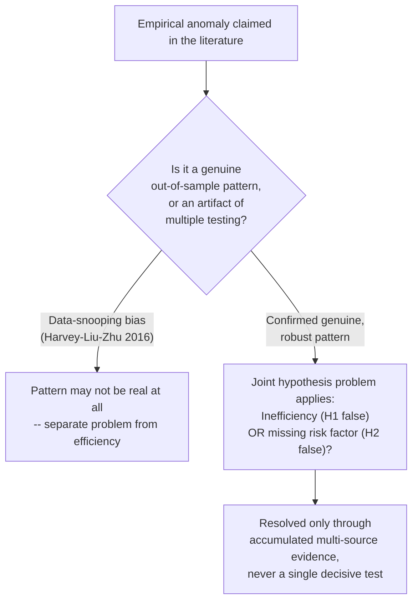

## The joint hypothesis problem

### Definition and Core Statement

The joint hypothesis problem, articulated most explicitly by **Fama (1970, 1991)**, is the methodological observation that **market efficiency can never be tested in isolation** — every empirical test of the Efficient Markets Hypothesis (EMH) is unavoidably a **joint test** of two distinct hypotheses:

1. **$H_1$ (Efficiency)**: Prices fully and correctly reflect the specified information set $\Phi_t$.
2. **$H_2$ (Equilibrium/Asset-Pricing Model)**: A particular model of expected (required) returns correctly describes how the market compensates investors for risk (e.g., CAPM, a multifactor model, or some other equilibrium pricing relationship).

Formally, "abnormal return" — the object every efficiency test actually measures — is *defined relative to* a model of expected return:

$$AR_{i,t} \equiv r_{i,t} - E[r_{i,t} \mid \Phi_{t-1}; H_2]$$

An empirical finding that $AR_{i,t}$ is systematically nonzero and predictable is logically consistent with **either**:

- $H_1$ is false (the market is inefficient — prices fail to reflect $\Phi_t$ correctly), **or**
- $H_2$ is false (the market is efficient, but the assumed equilibrium expected-return model is misspecified or omits a priced risk factor correlated with the observed pattern), **or** some combination of both.

No test of realized returns can, by construction, cleanly separate these two possibilities, because the researcher can only observe $r_{i,t} - E[r_{i,t}\mid \Phi_{t-1}; H_2]$, never the "true" abnormal return net of the correct (unknown) equilibrium model.

**Key Points**

- This is a *logical/epistemological* problem, not merely a practical data limitation — even with infinite data and perfect statistical power, the joint nature of the test cannot be resolved by more data alone, since the ambiguity is about which of two hypotheses to blame for a rejection, not about estimation precision.
- Fama's own later view (1991, 1998) was that this problem does not render efficiency tests meaningless, but it does mean results must always be interpreted as "reject $H_1$ and $H_2$ jointly" rather than "reject market efficiency," and that progress in the field consists partly of *improving* $H_2$ (better factor models) to sharpen what can be inferred about $H_1$.

### Formal Illustration

Consider testing whether an anomaly variable $Z_{i,t-1}$ (known at $t-1$) predicts returns:

$$r_{i,t} = \alpha + \gamma\, Z_{i,t-1} + \beta' F_t + \varepsilon_{i,t}$$

where $F_t$ is a vector of risk factors from the assumed model $H_2$ (e.g., market excess return under CAPM, or Fama-French factors). The efficiency test is $H_0: \gamma = 0$.

- If we **reject** $H_0$ ($\hat\gamma \neq 0$, statistically significant), there are two consistent stories:
  - **Inefficiency story**: $Z_{i,t-1}$ genuinely predicts *mispricing* that the market has not yet corrected.
  - **Missing-factor story**: $Z_{i,t-1}$ is correlated with exposure to a **priced risk factor omitted from $F_t$**; once the correct, complete factor model is used, $\gamma$ would be statistically zero, and the market was efficient all along relative to the (unobserved) true model.
- The data $(\hat\gamma \neq 0)$ **cannot distinguish** these two stories without additional, non-return-based information or theory (e.g., a structural argument for *why* $Z$ should proxy for risk, or evidence from a wholly different domain such as trading-cost/limits-to-arbitrage evidence, insider behavior, or experimental/survey evidence on investor beliefs).

### Canonical Historical Illustrations

**1. The Value/Size/Momentum Anomalies and the Evolution of Factor Models**

The history of the CAPM-to-multifactor-model transition is, in large part, a live demonstration of the joint hypothesis problem in action:

- **Banz (1981)**: documents the **size effect** (small-cap stocks earn higher average returns than CAPM-beta predicts) — at the time, ambiguous between "CAPM is the wrong model" (size proxies for an omitted risk factor) and "market inefficiently underprices small stocks."
- **Fama-French (1992, 1993)**: propose adding **size (SMB)** and **value (HML)** factors to the CAPM, explicitly interpreting the original size and value anomalies as evidence that the **single-factor CAPM ($H_2$) was misspecified**, not that markets were inefficient — i.e., they resolve part of the earlier joint-hypothesis ambiguity by revising $H_2$ rather than concluding $H_1$ (efficiency) was false.
- **Lakonishok-Shleifer-Vishny (1994)**: reinterpret the *same* value effect as evidence of **investor extrapolation/mispricing** ($H_1$ false), arguing the value premium reflects systematic overextrapolation of past growth rather than compensation for a genuine risk factor — using the *same underlying return data* as Fama-French but reaching the opposite conclusion about which hypothesis to reject.
- This is a textbook case: **identical empirical facts, two irreconcilable interpretations**, precisely because the joint hypothesis problem permits both readings, and no purely statistical resample of the same return data resolves which is "true."

**2. Momentum (Jegadeesh-Titman 1993)**

- **Risk-based interpretation**: momentum profits compensate for exposure to a priced but omitted risk factor (candidates proposed in the literature include a "momentum factor" itself, added ad hoc to factor models — e.g., Carhart's (1997) four-factor model — which is itself sometimes criticized as a purely statistical patch rather than a theoretically motivated risk factor).
- **Behavioral interpretation**: momentum reflects investor **underreaction** to information (Hong-Stein 1999 gradual information diffusion models) that is only slowly corrected, a direct violation of semi-strong efficiency.
- [Inference] The persistence of momentum profits across many international markets and asset classes, combined with the difficulty of finding a fully convincing risk-based rationale with the "right" cyclical properties, is often cited as tilting professional opinion somewhat toward a behavioral interpretation for momentum specifically — but this remains a matter of ongoing debate rather than a settled consensus, and reasonable researchers continue to disagree.

### Diagram: The Joint Hypothesis Logical Structure (svg_diagram)

<svg xmlns="http://www.w3.org/2000/svg" viewBox="0 0 720 380">
<text x="360" y="26" text-anchor="middle" font-size="16" font-weight="bold" fill="#1a1a2e">Joint Hypothesis Problem (svg_diagram)</text>
<rect x="260" y="55" width="200" height="60" rx="8" fill="#fefcbf" stroke="#b7791f" stroke-width="2" />
<text x="360" y="80" text-anchor="middle" font-size="13" font-weight="bold">Observed data:</text>
<text x="360" y="98" text-anchor="middle" font-size="12">Abnormal return ≠ 0</text>
<line x1="360" y1="115" x2="360" y2="150" stroke="#4a5568" stroke-width="2" />
<line x1="360" y1="150" x2="180" y2="200" stroke="#4a5568" stroke-width="2" marker-end="url(#a5)" />
<line x1="360" y1="150" x2="540" y2="200" stroke="#4a5568" stroke-width="2" marker-end="url(#a5)" />

<rect x="60" y="210" width="240" height="90" rx="8" fill="#fed7d7" stroke="#c53030" stroke-width="2" />
<text x="180" y="235" text-anchor="middle" font-size="13" font-weight="bold">H1 false</text>
<text x="180" y="253" text-anchor="middle" font-size="11">Market is inefficient</text>
<text x="180" y="269" text-anchor="middle" font-size="11">(mispricing exists,</text>
<text x="180" y="285" text-anchor="middle" font-size="11">H2 model correct)</text>
<rect x="420" y="210" width="240" height="90" rx="8" fill="#bee3f8" stroke="#2b6cb0" stroke-width="2" />
<text x="540" y="235" text-anchor="middle" font-size="13" font-weight="bold">H2 false</text>
<text x="540" y="253" text-anchor="middle" font-size="11">Model is misspecified</text>
<text x="540" y="269" text-anchor="middle" font-size="11">(omitted risk factor,</text>
<text x="540" y="285" text-anchor="middle" font-size="11">market H1 is efficient)</text>

<text x="360" y="340" text-anchor="middle" font-size="12" font-weight="bold" fill="`#822727`">Return data ALONE cannot distinguish these two branches</text>

<text x="360" y="358" text-anchor="middle" font-size="11" fill="`#4a5568`">(requires additional theory, out-of-sample tests, or non-return evidence)</text>

</svg>

### Attempts to Mitigate (Not Fully Resolve) the Problem

While the joint hypothesis problem is logically irreducible, researchers use several strategies to make empirical evidence more or less *suggestive* of one branch over the other, without ever achieving a fully clean separation:

**1. Out-of-sample and Out-of-population Testing**

- Testing whether an anomaly discovered in one sample/market persists in a genuinely new, independent sample (different time period, different country) provides evidence against pure **data-snooping/overfitting** (a distinct but related problem — see below) and against sample-specific risk-factor mismeasurement, lending some support to either a "real" risk factor or a "real" behavioral effect, though it still does not distinguish between the two.
- **McLean-Pontiff (2016)**: document that many published anomalies show **significantly attenuated returns out-of-sample and post-publication**, consistent with either **statistical overfitting/data-snooping** in the original discovery or **market learning/arbitrage correction** once the anomaly becomes publicly known (itself an interesting joint-hypothesis-adjacent ambiguity: does post-publication decay indicate the original finding was spurious, or that informed arbitrage capital rationally responded to newly disseminated information?).

**2. Direct (Non-Return-Based) Evidence**

- Using data *other than realized asset returns* to probe which hypothesis is more plausible — e.g., survey evidence on investor expectations (Greenwood-Shleifer 2014 show survey-based expected returns are often *positively* correlated with recent past returns, the opposite sign predicted by most rational risk-based models where risk premia should be countercyclical, suggestive of extrapolative, non-rational belief formation), insider trading behavior around anomalies, or trading-volume/order-flow patterns not reducible to the return-generating process itself.
- **Limits-to-arbitrage evidence** (Shleifer-Vishny 1997): documenting *why* a genuine mispricing could persist despite sophisticated traders' awareness of it (short-sale constraints, funding constraints, agency frictions) provides indirect support for a mispricing interpretation *if* such frictions are shown to bind specifically where the anomaly is strongest.

**3. Theoretical Discipline on Candidate Risk Factors**

- Requiring that a proposed risk factor (used to "explain away" an anomaly within $H_2$) have an independent **theoretical justification** connecting it to a plausible source of undiversifiable risk (e.g., consumption risk, investment risk, intermediary balance-sheet risk) rather than being a purely statistically-constructed "factor" mined to fit the anomaly — this is the central methodological critique leveled by **Fama-French (1993)** against ad hoc factor additions, and more broadly the concern motivating the **"factor zoo" critique** (Cochrane 2011; Harvey-Liu-Zhu 2016 propose higher statistical significance thresholds for new factors precisely because of rampant multiple-testing/data-snooping risk in a field that has proposed hundreds of candidate "factors").

**Key Points**

- None of these mitigation strategies *resolves* the joint hypothesis problem in the strict logical sense — they shift the balance of *plausibility* and *cumulative weight of evidence*, which is how empirical asset pricing actually makes progress: not through decisive single tests, but through accumulation of multiple, partially-independent lines of evidence that collectively favor one interpretation.

### Related but Distinct Problem: Data-Snooping / Multiple Testing Bias

The joint hypothesis problem should be distinguished from (though it interacts with) the **data-snooping bias** problem:

- **Data-snooping**: with enough researchers testing enough candidate anomaly variables against historical data, some will appear statistically significant purely by chance (multiple-comparisons / look-ahead bias), regardless of whether markets are efficient or not, and regardless of the correctness of any particular $H_2$.
- **Harvey-Liu-Zhu (2016)**: given the cumulative number of factors proposed in the finance literature (several hundred by their count), propose that the conventional $t$-statistic threshold of 2.0 is far too lenient, and argue for thresholds closer to 3.0 (or explicit multiple-testing corrections) before treating a new factor as a genuine discovery.
- This is a **separate** methodological problem from the joint hypothesis issue: even a "genuine," non-data-snooped, out-of-sample-robust anomaly *still* leaves open the joint-hypothesis ambiguity between "market inefficiency" and "missing risk factor" — data-snooping concerns whether the pattern is real at all; the joint hypothesis problem concerns how to *interpret* a pattern known to be real.

### Diagram: Joint Hypothesis Problem vs. Data-Snooping Bias

### Implications for the Interpretation of Market Efficiency Research

**Fama's (1991) reframing**: rather than asking "is the market efficient, yes or no," Fama argued the productive research question becomes "how well does asset pricing model $X$ describe returns, and how quickly and completely is information of type $Y$ incorporated into prices" — efficiency becomes a matter of *degree, information type, and time horizon* rather than a binary property, with the joint hypothesis problem as the reason a binary verdict was never actually available in the first place.

**Key Points**

- This reframing is why modern empirical asset pricing is largely organized around **improving equilibrium pricing models** (multifactor models, intermediary-asset-pricing models, behavioral asset pricing models with belief distortions) — progress on $H_2$ is, in an important methodological sense, the only lever researchers actually have for sharpening what can be inferred about $H_1$.
- The joint hypothesis problem also underlies why professional and academic opinion on "is market X efficient" varies by sub-field and often reduces to disagreement about which asset-pricing model is the appropriate benchmark, rather than disagreement about the underlying return data, which is typically not in dispute.

### Applications in Financial Economics

- **Regulatory and legal contexts**: securities fraud litigation (e.g., "fraud-on-the-market" doctrine under U.S. securities law, following *Basic Inc. v. Levinson*) relies on a *practical, legally operationalized* version of semi-strong efficiency for a given security to establish that market price reflects public information — court proceedings implicitly must take a position on the joint hypothesis problem (typically sidestepping the model-selection ambiguity in favor of a more direct market-based test of price reaction to disclosures, e.g., through event-study evidence).
- **Investment management**: the joint hypothesis problem underlies the ongoing debate over whether "smart beta" / factor-investing products are harvesting a legitimate risk premium (compensation for bearing systematic risk, consistent with efficient markets and a correctly specified $H_2$) or exploiting a persistent behavioral mispricing (inconsistent with strict efficiency) — a distinction with direct implications for whether the associated premium should be expected to persist or to be arbitraged away as capital flows in.
- **Model selection and validation in quantitative finance**: practitioners building factor models must continually confront that any backtested "alpha" is only alpha relative to the specific benchmark/risk model chosen — the same return stream can appear as skill (alpha) under one model and as pure risk-factor exposure (beta) under another, a direct practical manifestation of the joint hypothesis problem in an applied setting.

**Related Topics**

- Weak, semi-strong, and strong-form market efficiency
- The random walk hypothesis and martingale difference sequences
- Event study methodology and abnormal return estimation
- Fama-French multifactor models and the evolution from CAPM
- Momentum, value, and size anomalies
- Limits to arbitrage and noise trader risk
- Data-snooping bias and the "factor zoo" critique (Harvey-Liu-Zhu)
- Behavioral finance and investor extrapolation models
- Rational expectations equilibrium and the Grossman-Stiglitz paradox
- Fraud-on-the-market doctrine and legal applications of market efficiency